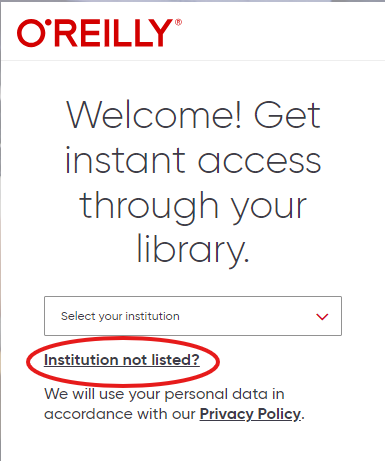
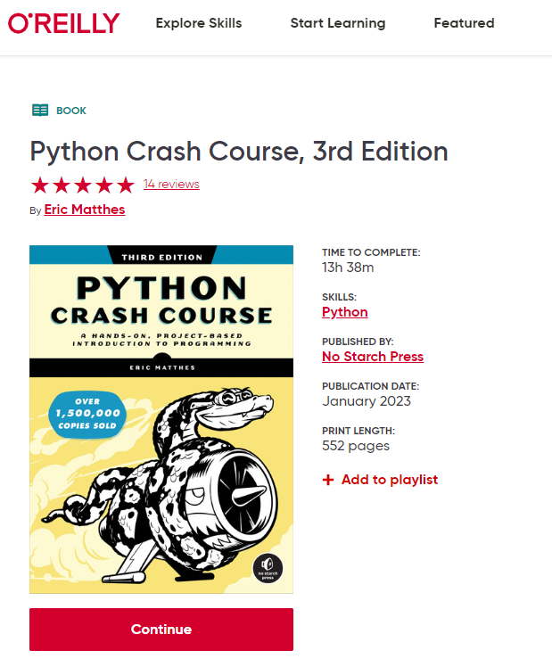

# How to access Course Book

To access the text book, go to the following link: [Python Crash Course, 3rd Edition - O'Reilly](https://lib.byu.edu/remoteauth/?url=https://www.lib.byu.edu/cgi-bin/remoteauth.pl?url=https://learning.oreilly.com/library/view/~/9781098156664/?ar&orpq&email=^u){target="_blank"}

You will be redirected to a page that looks something like this. Click on "Institution not listed?

 

Now enter your BYU email. This will be your netID followed by "@byu.edu"

Click "Got It"

The page will reload, and now you will have access to the book. Click either "Start" or "Continue" to start reading and gain access to the book.

