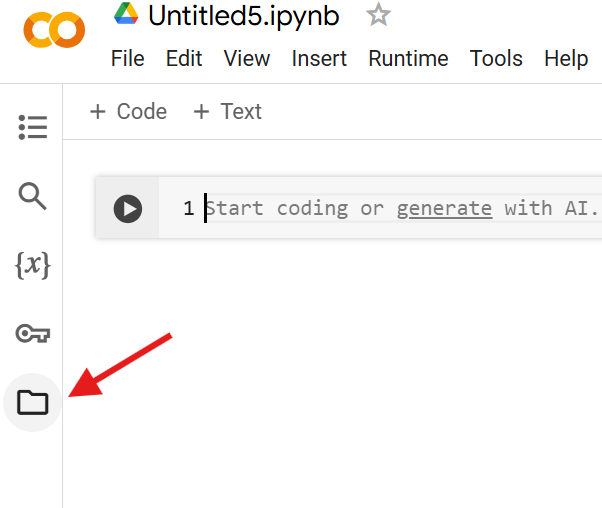
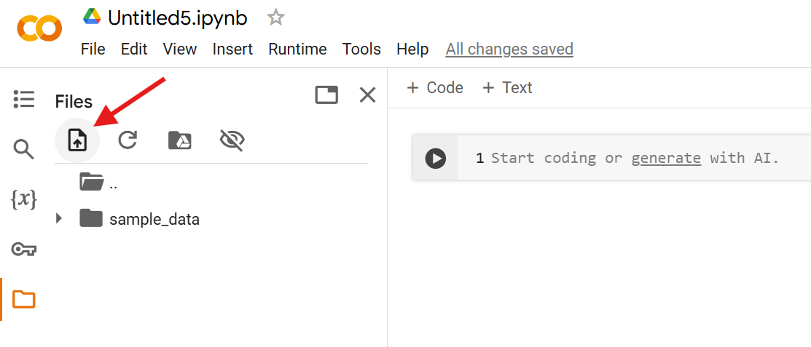
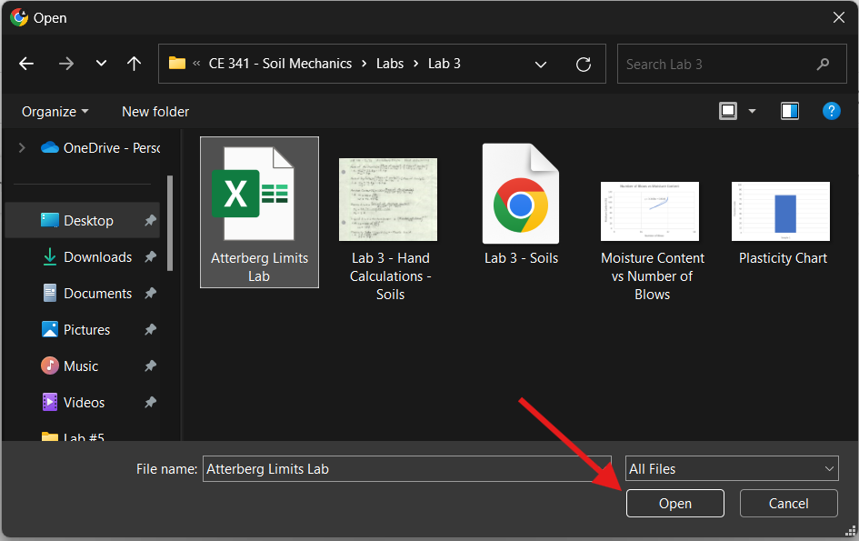
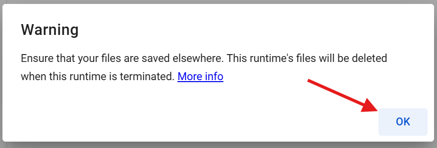
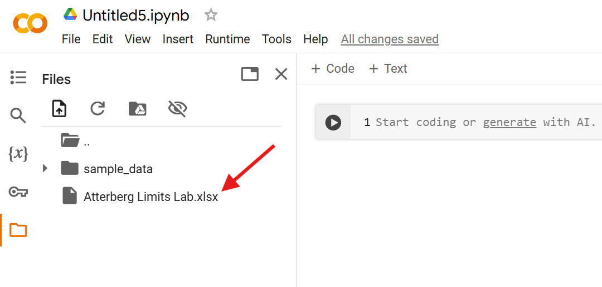
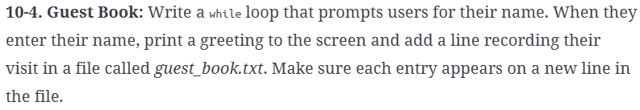

#  Reading: Reading and Writing Files

---

# Pre Class Reading Assignment

On the O'Reilly's website read chapter 10 in _Python Crash Course, 2nd Edition_. 
 Here is a direct link to the readings: [PCC Chapter 10: File and Exceptions](https://learning.oreilly.com/library/view/python-crash-course/9781492071266/xhtml/ch10.xhtml){:target="_blank"}.
Only read up until the heading "Exceptions".

Remember that you will have to sign in to you free account that you created earlier.

## Thing to Look Out For
 - How to read a file.
 - How to use the contents of a file.
 - How to write in a file.

## How to Add a File Into Your Colab Session
1. Open you colab notebook and click on the folder icon on the left side of your screen

{width=400px}

2. This should open a menu for interacting with files in your session. Next click on the icon that looks like a paper with an arrow on it.

{width=700px}

This is the upload icon and will open your files on your computer.

3. Navigate your files to find the file you want to add to your colab session. Click on that file so that its name appears in the box labeled file name and click open.

{width=700px}

4. You should get a warning about making sure your file is saved elsewhere. This should already be done since you are using a file from your computer files so click OK.

{width=600px}

Each time you open a colab notebook it starts a new session. This is why you must rerun your code blocks everytime. It will also require you to reupload your files everytime as well.

5. If everything was done correctly, you should see your file appear in that menu opened in step one.

{width=700px}

Your file can now be referenced in your code blocks.

---

# Pre-Class Quiz Challenge
In a Colab notebook, complete Problem 10-4 found in chapter 10 of the 2nd Edition of the textbook. Submit a link to the completed problem in your Pre-Class Quiz.

