# Cells and Formulas Review

---

The most basic feature of Excel is the ability to enter data and then write formulas based on the data. As the data are edited, the formulas are automatically updated. In this chapter, we review some of the procedures for entering and using formulas.

## Excel Terminology

The following terms will be used throughout the Excel portion of this course:

| Term | Meaning |
|:-----|:--------|
| **Workbook** | An Excel file, such as `assignment.xlsx`. A workbook can contain multiple worksheets. |
| **Worksheet** | One tab within a workbook. A worksheet is also commonly called a **sheet**. |
| **Row** | A horizontal group of cells identified by a number. |
| **Column** | A vertical group of cells identified by a letter. |
| **Cell** | The box where a row and column intersect. A cell can contain text, a number, a date, or a formula. |
| **Cell address** | The column letter and row number that identify a cell, such as `B4`. |
| **Range** | A group of cells. A colon separates the first and last cell addresses, as in `B3:F10`. |
| **Data range** | A range containing related data, usually organized into rows and columns with headers. |
| **Excel Table** | A data range formally converted using **Format as Table**. An Excel Table has built-in filtering, formatting, and other data-management features. |
| **Formula** | An expression beginning with `=` that calculates a result, such as `=A1+B1`. |
| **Function** | A predefined calculation used in a formula, such as `=SUM(A1:A10)`. |
| **Named reference** | A descriptive name assigned to a cell or range, such as `con_fac`. The name can be used in formulas instead of its cell address. |

## Reading Excel References and Instructions

| Example | Meaning |
|:--------|:--------|
| `B4` | The cell in column B and row 4 on the current worksheet. |
| `B4:D10` | Every cell from the upper-left cell B4 through the lower-right cell D10. The colon means **through**. |
| `Data!A1:P1001` | Cells A1 through P1001 on the **Data** worksheet. The exclamation point separates the worksheet name from the range. |
| `'Reservoir Flow'!A1:J31` | A range on a worksheet whose name contains spaces. Excel adds apostrophes around the worksheet name. |
| `$A$1:$P$1001` | An absolute range. The dollar signs keep its rows and columns fixed when a formula is copied. |
| `con_fac` | A named reference. Its descriptive name can make a formula easier to read and troubleshoot. |
| **Data > Filter** | Select the **Data** tab on the ribbon, and then select **Filter**. |

You usually do not need to type a worksheet-and-range reference. While entering a formula or completing a dialog box, select the worksheet and cells. Excel will construct the reference and may add dollar signs automatically.

## Essential Excel Shortcuts

The following shortcuts are immediately useful when working in Excel:

| Action | Windows | Mac |
|:-------|:--------|:----|
| Save | `Ctrl + S` | `Command + S` |
| Undo | `Ctrl + Z` | `Command + Z` |
| Cut, copy, and paste | `Ctrl + X`, `Ctrl + C`, `Ctrl + V` | `Command + X`, `Command + C`, `Command + V` |
| Find | `Ctrl + F` | `Command + F` |
| Move right or down | `Tab` or `Enter` | `Tab` or `Return` |
| Jump to the edge of a data range | `Ctrl + Arrow` | `Command + Arrow` |
| Select to the edge of a data range | `Ctrl + Shift + Arrow` | `Command + Shift + Arrow` |
| Fill a formula down | `Ctrl + D` | `Command + D` |
| Open Format Cells | `Ctrl + 1` | `Command + 1` |
| Add or remove filters | `Ctrl + Shift + L` | `Command + Shift + F` or `Ctrl + Shift + L` |

You do not need to memorize every Excel shortcut at once. Each Excel lecture will introduce a short table containing only a few shortcuts that are useful for that lecture. Practice using those shortcuts as you complete the exercises.

For a comprehensive list, see [Keyboard shortcuts in Excel](https://support.microsoft.com/en-us/accessibility/excel/keyboard-shortcuts-in-excel){:target="_blank"}.

---

## Cell Addresses
An Excel workbook contains a collection of worksheets. Each worksheet contains cells organized into rows and columns. Rows are identified with numbers (1, 2, 3...) and columns are identified with letters (A, B, C...). Each cell can be uniquely identified by its cell address, which combines the column letter and row number.

- A5	<- Row 5, Column 1
- D3	<- Row 3, Column 4
- AJ234	<- Row 234, Column 36

!!! note
    After column Z, the column labels continue as AA, AB, AC... To reference a group of cells with a single range address, combine the upper-left and lower-right cell addresses with a colon. For example, consider the following range:

    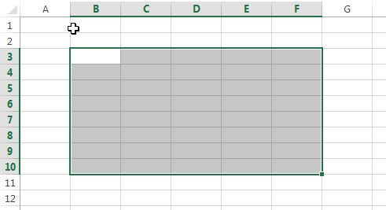

    we would use the address **B3:F10**.

---

## Cell Inputs
There are four primary types of information that can be entered in cells:

1. Text ("Hello world", etc.)
2. Numbers (4, 2382.23, 1e-14, etc.)
3. Dates (Jun-5, 2014, 12/29/2015, etc.)
4. Formulas ("=A4+C5", "=Sum(D4:D14)", etc.)

For the first three types (text, numbers, dates), Excel determines the type of data based on the content as you enter it, and formats it appropriately. You can also customize the formatting if you wish. Entering a formula is described in the next section.

Sometimes it is useful to enter a sequence of data in a cell. Excel provides a simple trick for doing this. For example, suppose you want to create a list of numbers 1, 2, 3, ... to fill in a column in a data range. Rather than typing the entire list, you can enter the first three numbers and then select the three numbers. Once you do so, a green rectangle will appear at the lower right corner of the selection as follows:

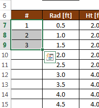

You can then click on the rectangle handle and drag it all the way down to the bottom of the list, or you can simply double-click on the handle. In either case, the list will automatically be extended as follows:

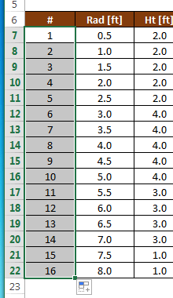

This process works for other types of data also. For example, you can enter "Mon", "Tues", "Wed" or "Jan", "Feb", "Mar" and when you extend the list, the sequences will be automatically extended.

---

## Entering a Formula
An Excel formula typically references cells in your worksheet and performs some type of calculation. To enter a formula, you start by typing an equal sign ("=") and then you reference cells using their addresses ("A4", "C27", "D4:E15", etc.). The values of the cells references are then used in the formula and a value is returned and displayed in the cell. As you change the values of the input cells, all of the dependent formulas are automatically updated. Formulas can reference other cells that contain formulas.

When composing a formula, you can also reference a cell by clicking on the cell rather than typing out the cell address. This is particularly useful for multicell ranges ("D4:G23" for example).

---

## Editing a Formula
Once you have entered a formula and you want to edit it, there are two options: You can select the cell containing the formula and then click in the Formula Bar at the top of the worksheet as follows:

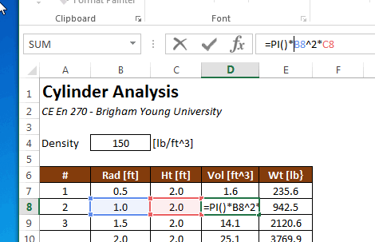

or you can double click on the cell containing the formula and edit it directly in the cell:

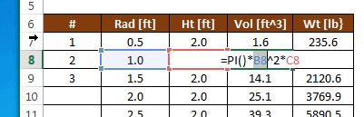

---

## Functions
One of the most powerful features of Excel is built-in functions. A function typically takes one or more arguments as input and returns a value. Functions are extremenly useful in formulas. For example, you can use trig functions:

- sin(a)
- cos(a)
- tan(a)
- etc.

where a = an angle in radians. There are also many functions that operate on a range as input:

- Sum(r)
- Average(r)
- Min(r)
- Max(r)
- etc.

where r = a range of cells. For example, this formula computes the sum of a list of values:

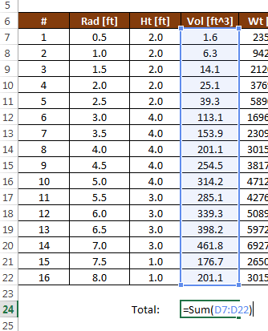

A complete set of the available functions can be found in the Excel Help.

---

## Copying Formulas
After entering a formula, it is often necessary to copy that formula to other cells. For example, the following spreadsheet is designed to compute the volume and weight of a set of cylinders defined by a radius and a height. The volume can be computed from the radius and height using the following formula:

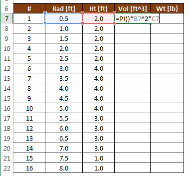

After entering the formula in cell D7, we wish to copy the formula to cells D8:D22. This can be accomplished by selecting cell D7 after the formula has been entered and copying (Ctrl-C) and pasting (Ctrl-V) the formula to D8:D22 using the clipboard. Another method is to select the cell as follows:

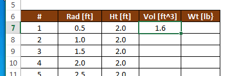

and then drag the green square in the lower right corner of the cell down to the end of the list, or simply double-click on the green square. After doing so, the formula is automatically copied to the end of the list:

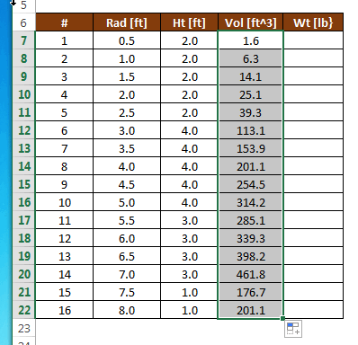

---

## Relative vs. Absolute References
When copying formulas, we need to be careful how we reference other cells in our formulas. For example, to calculate the weight of our cylinders, we take the volume of the cylinder and multiply by the unit wt of the cylinder material as follows:

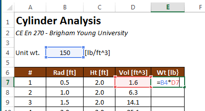

After copying the formula to the bottom of the table in column E, we notice that the weights are not properly computed:

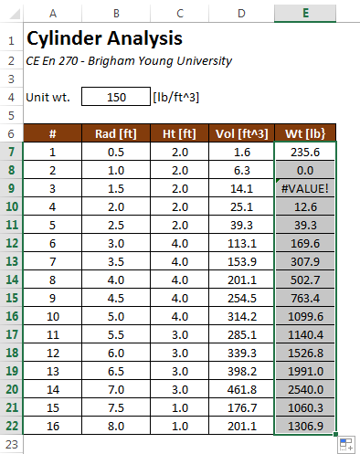

The reason for this error can be seen by revealing the formulas. This is accomplished by pressing Ctrl-~ on the keyboard (the "~" symbol is called the "tilde" and is in the upper left corner of your keyboard).

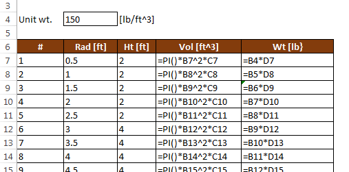

!!!Note 
    When you copy a formula, the cell references are updated with each subsequent cell the formula is copied to. Note that "=B4*D7" is changed to "=B5*D8" in the next cell down. This happens because whenever you reference a cell in a formula, that reference is interpreted to be **relative** to the cell containing the formula. In other words, when we type "D7" in a formula in cell E7, what we are really referencing is "stay on the same row, but go one column to the left". Therefore, when the formula is copied, it correctly references the proper volume value one cell to the left. However, our error occurs because of a relative reference to the unit wt. value. A reference to B4 from cell E7 literally means "three rows up and three columns to the left". But in this case, we don't want a relative reference. When we copy the formula, we want to ALWAYS reference cell B4. We can accomplish this by changing the B4 reference to make it **absolute** as follows:

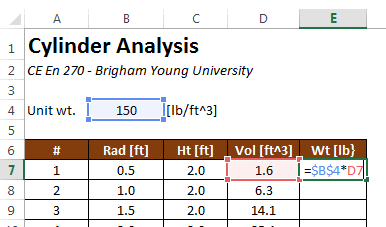

!!!Note
    The `\$` symbols make a reference absolute. You can type them directly or select the reference while editing the formula and press **F4** on Windows. On a Mac, use **Command+T** or **F4**, depending on the keyboard settings. After copying the corrected formula down, the results are correct:

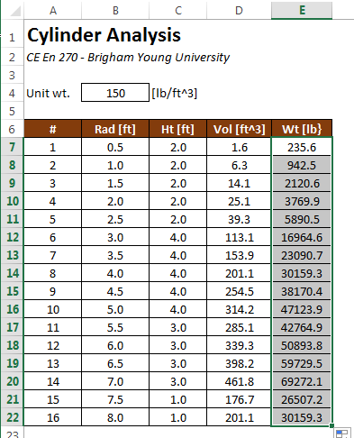

And the formulas look like this:

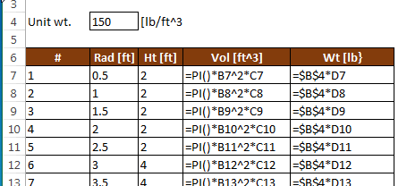

Sometimes it is useful to use a mixed reference. Here is a summary of the ways in which you can reference another cell.

- D4	Row and column are both relative
- \$D4	Row is relative and column is absolute
- D\$4	Row is absolute and column is relative
- \$D\$4	Row and column are both absolute

For the example shown above, we could have gotten away with a mixed reference ("B\$4") because we copied the formulas within a single column, but it works fine with a complete absolute reference ("\$B\$4"). To do a mixed reference, you can either directly type the "\$" symbols or you can repeatedly press the F4 key to get the combination you are seeking.

## Named References

A named reference replaces a cell or range address with a descriptive name. Select the cell or range, click the **Name Box** to the left of the formula bar, type a name without spaces, and press **Enter**.

For example, if cell `C20` contains a conversion factor and is named `con_fac`, the formula `=C4*con_fac` is easier to interpret than `=C4*$C$20`. Both formulas can calculate the same result, but the named version makes the purpose of the fixed value visible. This can make formulas easier to check and errors easier to locate. Named references remain fixed when a formula is copied unless the name itself refers to a changing formula.
