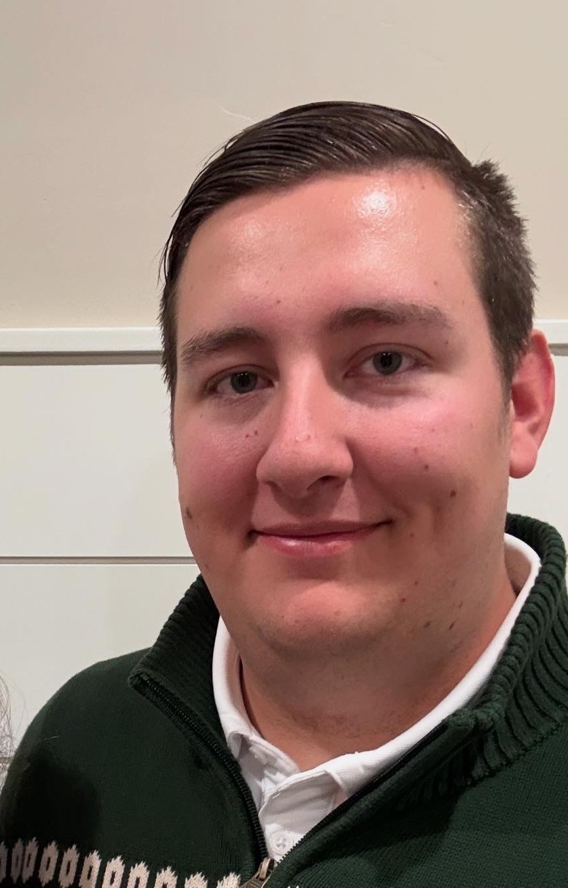
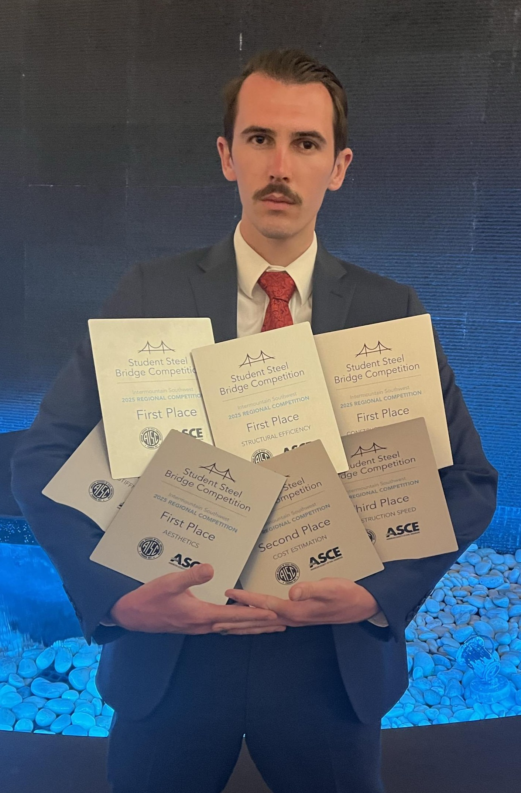
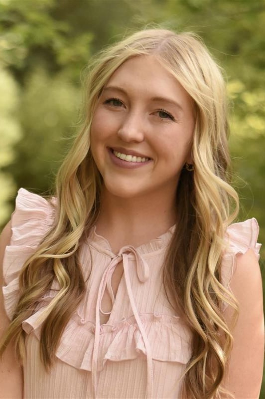
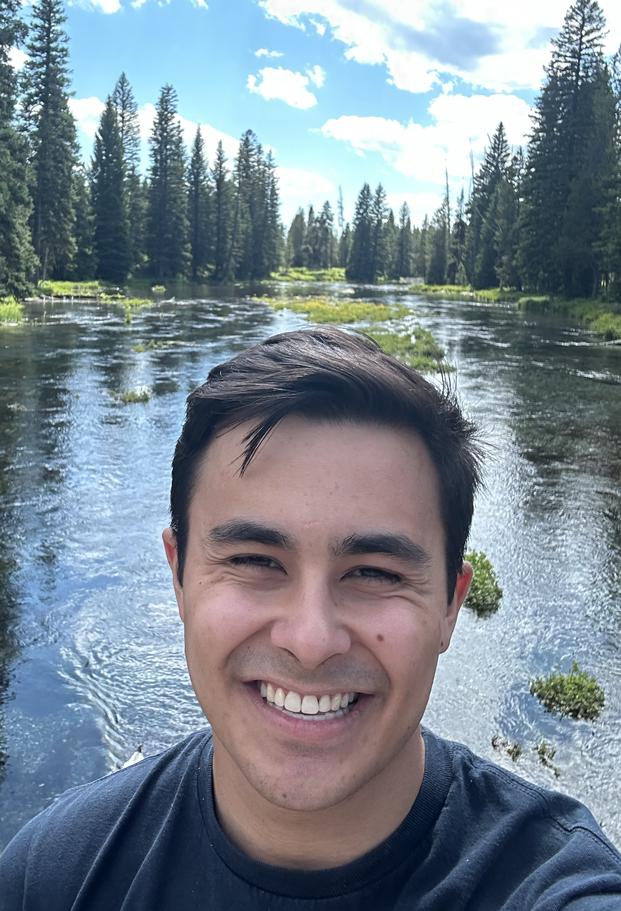
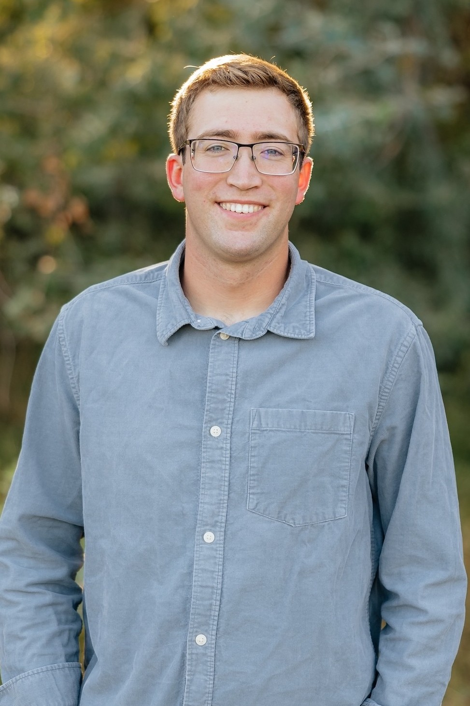
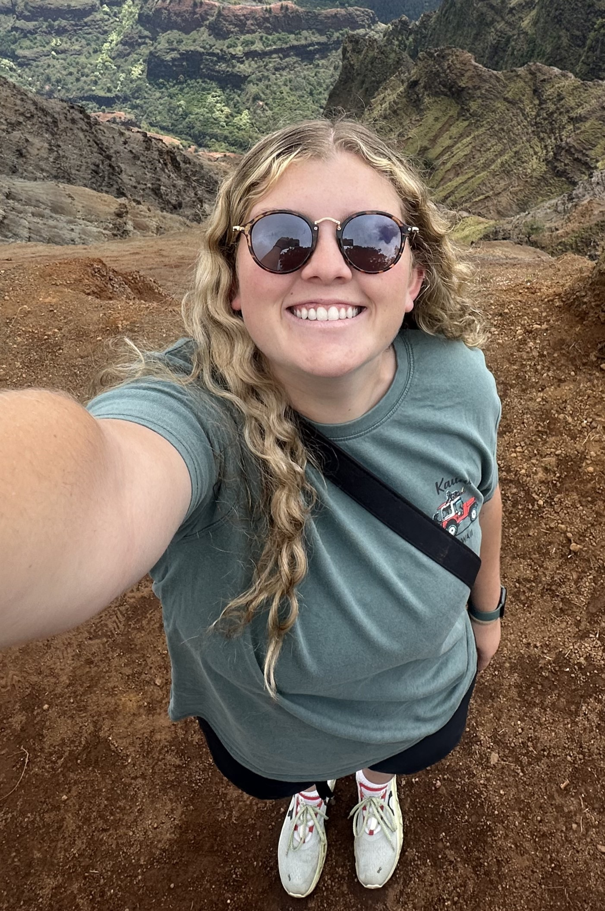
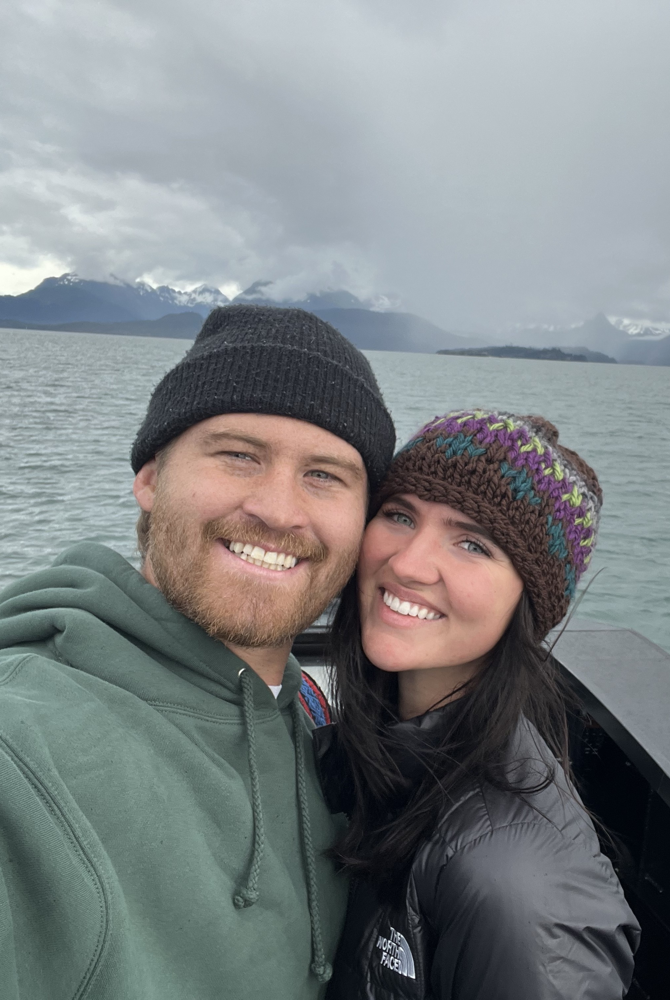
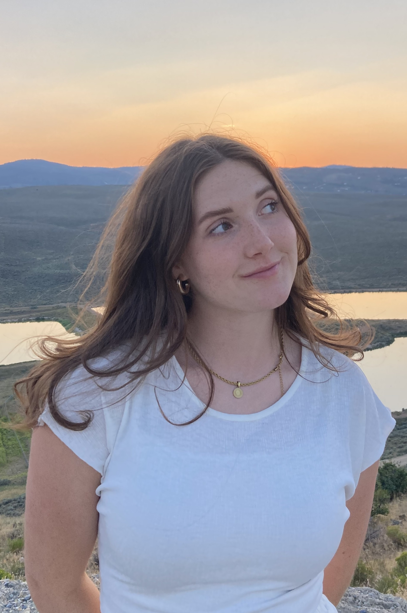
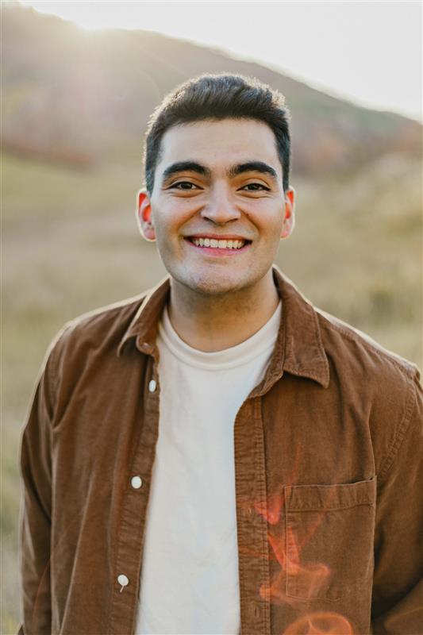

# Teaching Assistants (TAs)

We have a large team of TAs for this course who are here to support you. 10 TAs in total! They can help with course material, assignments, and any other class-related questions you may have. TAs are also responsible for grading your assignments.

If you’re stuck on something for more than 30 minutes, please reach out to a TA—that’s what we're here for! You can get help either in person during office hours or online via Teams.

Please make sure you're set up on the class Team, as TAs will occasionally share important updates and assignment hints there.

Most TAs are available to meet in the evenings. You can message them via Teams to schedule an appointment.

If you have a question about a grade, please contact the TA responsible for grading that assignment. You can find this information at the bottom of the page.

If you submit an assignment late, be sure to let the grading TA know so they’re aware they need to grade it.

---

## About the TAs

{width=100px}
 **Brandan Williamson** - I'm the head TA for the class. I'm from Ripon, California. I'm a Senior here at BYU studying Civil Engineering and Computer Science. I also got married earlier this year. This is my third year as a TA. I've helped redo some of the coursework each semester. I'll be helping answer questions and grading assignments, and writing the free response for the exams. Feel free to message me during the evenings for help too.

{width=100px}
 **Tyler Johnson (TJ)** - I'm from Rancho Santa Margarita, California, and I'm a senior in the civil engineering program. This will be my fifth semester as a TA. I like to snowboard, golf, play pickleball, and play video games.
							
{width=100px}
 **Paige Logan** - I am from Kaysville, Utah and am a junior studying Civil Engineering! This is my second year as a TA for this class! I like to go skiing in the winter and boating in the summer! I'm excited to get to know all of you!

{width=100px}
 **Griffin Izu** - I'm from Irvine, California, and I am a junior in the Civil Engineering program. This will be my third semester as a TA in this class! I love playing the trombone and bass guitar, listening to music, and playing video games. I'm very excited to meet you all!

{width=100px}
 **Tyler Piercy** - I am from Royal City, Washington and am currently a senior in Civil Engineering. I grew up farming and doing construction for work and love hiking, baseball, skiing, and board games. This is my third semester as a TA for this class and Surveying (CE 122).

{width=100px}
 **Mauricio Fernandez Celestino** - I am from Provo, UT, and I am a Junior in the Civil Engineering program. This is my first semester as a TA, and I am so excited! I love playing sports especially rugby, soccer and rugby. And my favorite thing is spending time with my wife! I am excited to get to know most of you, but hopefully all!

{width=100px}
 **Reagan Bodnar** - I'm from Las Vegas, Nevada and this is my fourth year at BYU. I'm studying construction management and this will be my first semester as a TA for this class!!! I am so excited! I love playing volleyball and reading :) I can't wait to meet you all!

{width=100px}
 **Preston Cobabe** - Hi, I’m Preston. I love lifting weights, cooking especially smoking meat on my Traeger, and shooting film photography. I’ve been married for a year now to my wife Kate, and when I’m not working or studying, I enjoy traveling, exploring new food spots, and spending time outdoors.

{width=100px}
 **Samantha Farnsworth** - I'm from Orem, Utah, and currently a junior in the Civil Engineering program! I’m also minoring in Art History (feel free to ask me about the crossover sometime lol). In my free time, I love drawing, playing tennis, and listening to music. This is my first semester as a TA, and I'm so excited to meet you all!!

{width=100px}
 **Luke Gonzalez** - Hello! I'm in my sophomore/junior year of Civil Engineering. First time as a TA, so I ask for your patience, but I’m more than willing to help as much as I can! I love music! And sports! And all sorts of stuff I guess idk. Excited to be here!

---

## Grading Responsibilities

- **HW 1.1**: The TA you signed up and met with.

- **Brandan**: Exams and Projects

- **Tyler J.**: HW 1.2, HW 2.5, HW 3.6

- **Paige**: All Pre Class Quiz and In Class Workbooks

- **Griffin**: HW 1.3, HW 2.6

- **Tyler P.**: HW 2.3, HW 3.2

- **Mauricio**: HW 2.2, HW 3.4

- **Reagan**: HW 1.6, HW 3.5

- **Preston**: HW 2.1, HW 3.3

- **Samantha**: HW 1.5, HW 2.4

- **Luke**: HW 1.4, HW 3.1