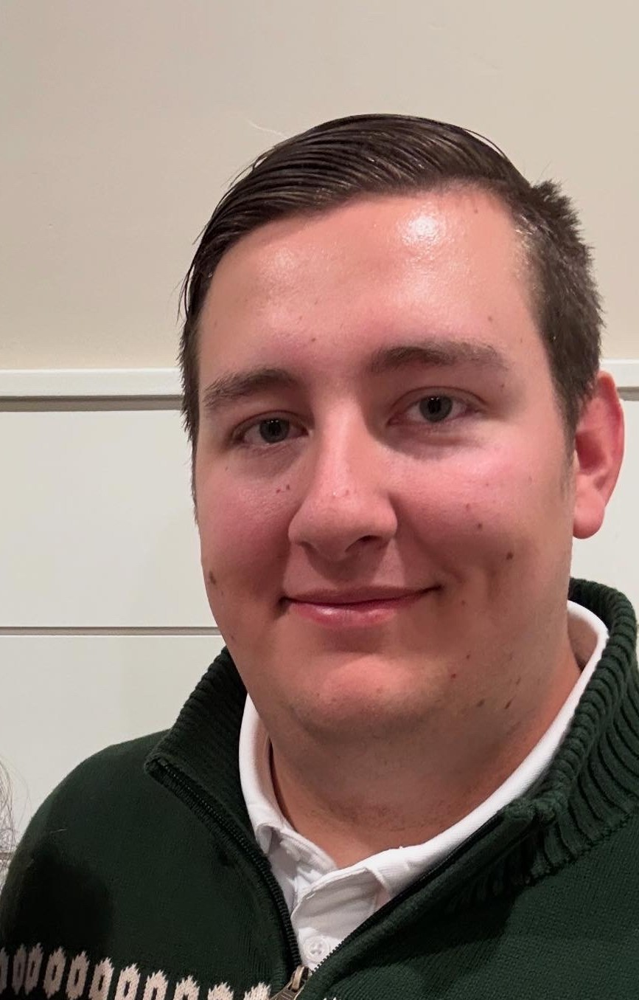
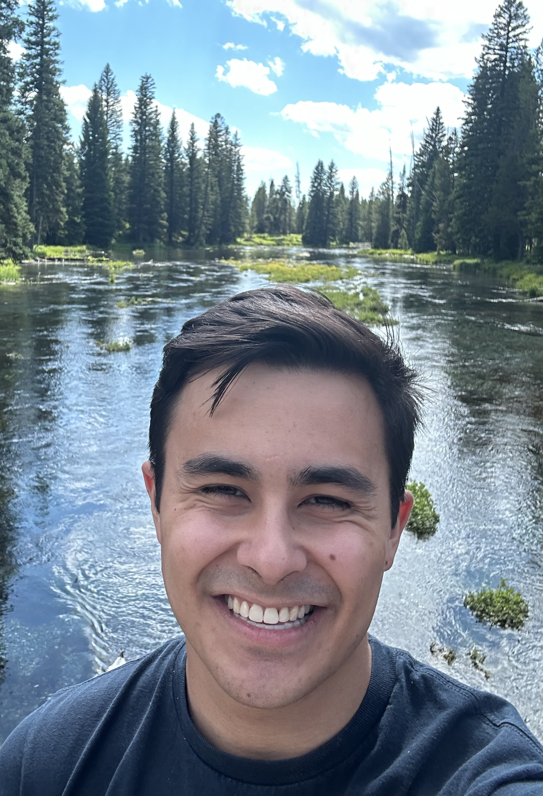
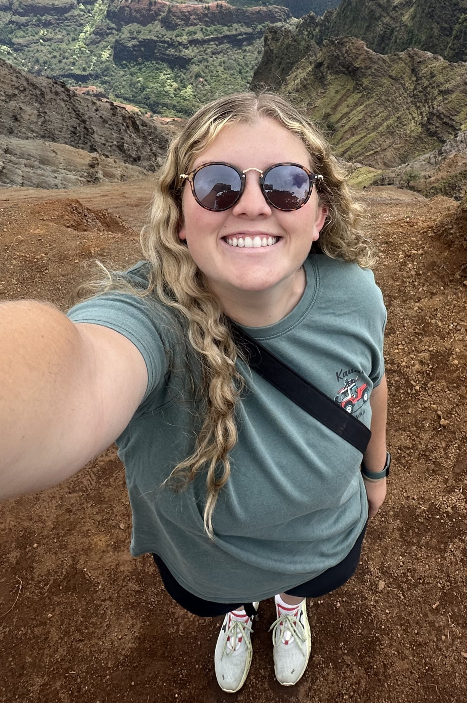
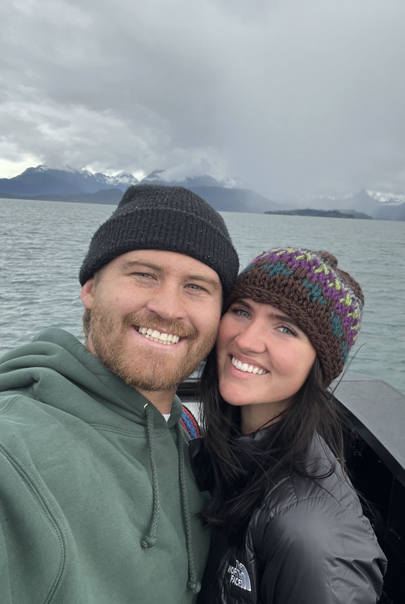
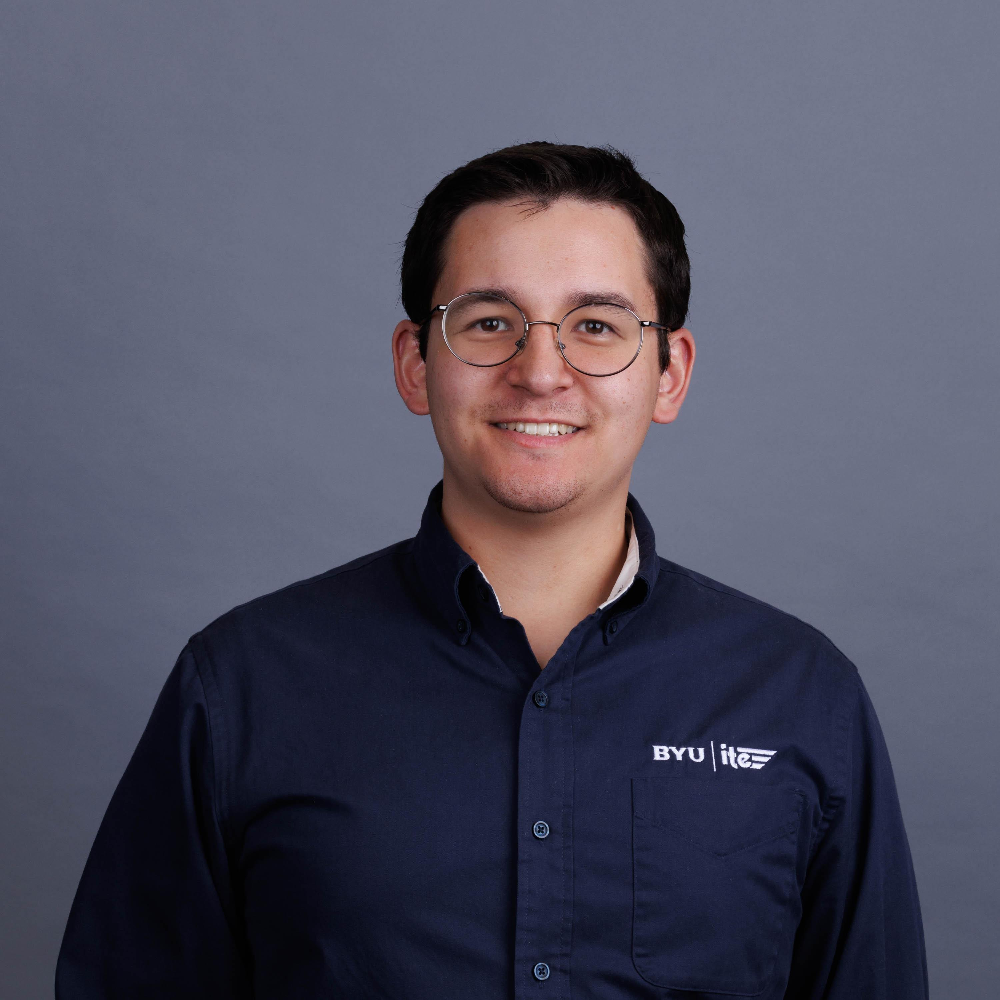
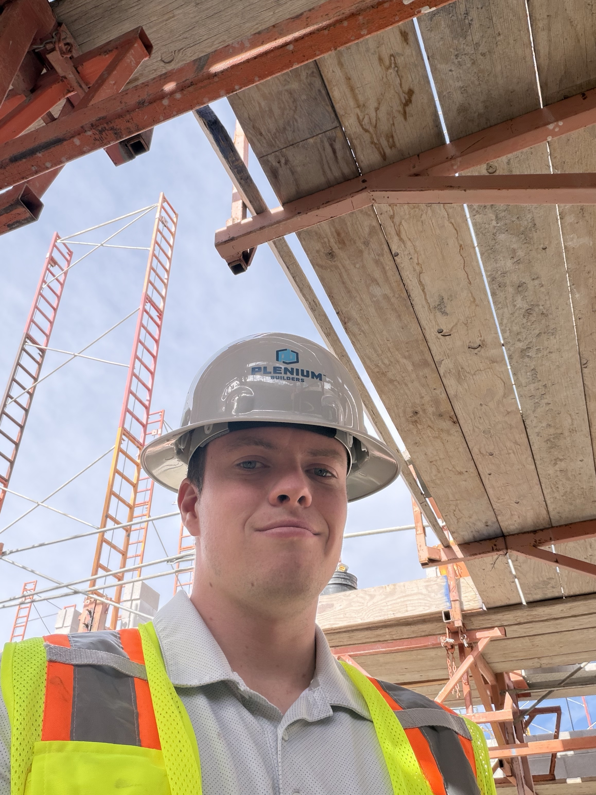

# Teaching Assistants (TAs)

We have a large team of TAs for this course who are here to support you. 10 TAs in total! They can help with course material, assignments, and any other class-related questions you may have. TAs are also responsible for grading your assignments.

If you’re stuck on something for more than 30 minutes, please reach out to a TA—that’s what we're here for! You can get help either in person during office hours or online via Teams.

Please make sure you're set up on the class Team, as TAs will occasionally share important updates and assignment hints there.

Most TAs are available to meet in the evenings. You can message them via Teams to schedule an appointment.

If you have a question about a grade, please contact the TA responsible for grading that assignment. You can find who that is under [Grading Responsibilities](#grading-responsibilities) at the bottom of this page.

If you submit an assignment late, be sure to let the grading TA know so they’re aware they need to grade it.

---

## About the TAs

{width=100px}
 **Brandan Williamson** - I'm the head TA for the class. I'm from Ripon, California. I'm a Senior here at BYU studying Civil Engineering and Computer Science. This is my third year as a TA. I've helped redo some of the coursework each semester. I'll be helping answer questions and grading assignments, and writing the free response for the exams. Feel free to message me during the evenings for help too.

{width=100px}
 **Griffin Izu** - I'm from Irvine, California, and I am a senior in Civil Engineering. This will be my sixth semester as a TA in this class! I love playing the trombone and bass guitar, listening to music, collecting records, and playing video games. I'm very excited to meet you all, and I'm always happy to help/chat!

{width=100px}
 **Reagan Bodnar** - I'm from Las Vegas, Nevada and this is my last year at BYU. I'm studying construction management and this will be my third semester as a TA for this class!!! I love volleyball and reading :) I can't wait to meet you all!

{width=100px}
 **Preston Cobabe** - Hi, I’m Preston. I love lifting weights, cooking especially smoking meat on my Traeger, and shooting film photography. I’ve been married for a year now to my wife Kate, and when I’m not working or studying, I enjoy traveling, exploring new food spots, and spending time outdoors.

[//]: # (![samantha_f_ta_profile.jpg]&#40;images/samantha_f_ta_profile.jpg&#41;{width=100px})

[//]: # ( **Samantha Farnsworth** - I'm from Orem, Utah, and currently a junior in the Civil Engineering program! I’m also minoring in Art History &#40;feel free to ask me about the crossover sometime lol&#41;. In my free time, I love drawing, playing tennis, and listening to music. This is my first semester as a TA, and I'm so excited to meet you all!!)

{width=100px}
 **Luke Gonzalez** - Hello! I'm in my sophomore/junior year of Civil Engineering. First time as a TA, so I ask for your patience, but I’m more than willing to help as much as I can! I love music! And sports! And all sorts of stuff I guess idk. Excited to be here!

{width=100px}
 **Tyler Carruth** - This is my third year at BYU studying Civil Engineering and my first time as a TA. If you let me, I WILL get on a soap box and talk your ear off about zoning laws and public transit. I enjoy weight lifting, Minecraft, and adding random songs to my wife's curated playlists.

{width=100px}
 **Carsen Lee** - I’m from Reno, Nevada and am a junior in the construction management program. This will be my first semester as a TA! In my free time I play a lot of sports (especially basketball), hike, and do anything with friends and family. I look forward to meeting you all!

{width=100px}
 **McKay Cumming** - Hi! I am a sophomore in Civil Engineering. I am from Herriman, Utah. In my free time I like being with friends, catching a movie, and being outside! I particularly love pickleball and soccer. This is my first semester as a TA for this class, but I’m excited to get to know yall!

---

## Grading Responsibilities

Homework is graded automatically, then a TA reviews those grades. Each assignment has one TA responsible for it. **Message that TA on Teams** if you:

- have a question about your grade, or
- turned the assignment in late, so they know to grade it.

---

### Unit 1 - Excel

| Assignment | Grading TA |
|---|---|
| Pre-class quizzes | Preston Cobabe |
| In-class workbooks | Preston Cobabe |
| Unit 1 Project | Brandan Williamson |
| Exam | Brandan Williamson |

#### Homework

| Topic | Grading TA |
|---|---|
| [A Tour of Class Resources](../../unit1/0_getting_started/day1_hw.md) | The TA you signed up and met with |
| [Analyzing & Managing Data](../../unit1/1_analyzing_managing_data/data_hw.md) | Luke Gonzalez |
| [Lookups, Match, and IF Functions](../../unit1/2_lookup_match_if/lookmatif_hw.md) | Tyler Carruth |
| [PivotTables, Goal Seek, and Data Validation](../../unit1/3_pivot_goalseek/pivgolseek_hw.md) | Carsen Lee |
| [Graphing and Numerical Solver](../../unit1/4_graphing_numsolver/graphsolver_hw.md) | Griffin Izu |
| [Gantt Chart and Project Scheduling](../../unit1/5_gantt_charts/gantt_hw.md) | Reagan Bodnar |

---

### Unit 2 - Intro to Python

| Assignment | Grading TA |
|---|---|
| Pre-class quizzes | Preston Cobabe |
| In-class workbooks | Preston Cobabe |
| Unit 2 Project | Brandan Williamson |
| Exam | Brandan Williamson |

#### Homework

| Topic | Grading TA |
|---|---|
| [Introduction to Python, Variables, and Lists](../../unit2/00_intro_python_variables_lists/into_var_list_hw.md) | McKay Cumming |
| [Working with Lists (For Loops)](../../unit2/01_for_loops_into_functions/for_hw.md) | Tyler Carruth |
| [IF Statements](../../unit2/02_if_statements/if_hw.md) | Carsen Lee |
| [Dictionaries and While Loops](../../unit2/03_dictionaries_while_loops/dict_while_hw.md) | Griffin Izu |
| [Introduction to Functions](../../unit2/04_intro_functions/intro_function_hw.md) | Reagan Bodnar |
| [Functions and Files](../../unit2/05_advance_functions_files/advance_functions_files_hw.md) | Luke Gonzalez |
| [Introduction to Classes](../../unit2/06_classes/intro_classes_hw.md) | McKay Cumming |
| [Unit 2 Project Proposal - Pseudocode](../../unit2/07_unit2_project/u2_pro_pseudo_hw.md) | Preston Cobabe |

---

### Unit 3 - Advanced Python

| Assignment | Grading TA |
|---|---|
| Pre-class quizzes | Preston Cobabe |
| In-class workbooks | Preston Cobabe |
| Final Project | Brandan Williamson |
| Exam | Brandan Williamson |

#### Homework

| Topic | Grading TA |
|---|---|
| [Using Python Locally](../../unit3/00_local_python/local_py_hw.md) | Preston Cobabe |
| [Numpy](../../unit3/01_numpy/numpy_hw.md) | Carsen Lee |
| [Matplotlib](../../unit3/02_matplotlib/matplot_hw.md) | Griffin Izu |
| [Pandas DataFrame](../../unit3/03_intro_to_pandas/pandas1_hw.md) | Reagan Bodnar |
| [Manipulating and Grouping Pandas DataFrames](../../unit3/04_continuing_pandas/pandas2_hw.md) | Luke Gonzalez |
| [Working with Excel Files in Python](../../unit3/05_python_and_excel/excel_hw.md) | McKay Cumming |
| [ipywidgets](../../unit3/06_ipywidgets/ipy_hw.md) | Tyler Carruth |
| [Final Project Proposal](../../unit3/07_final_project/final_pro_proposal.md) | Preston Cobabe |
