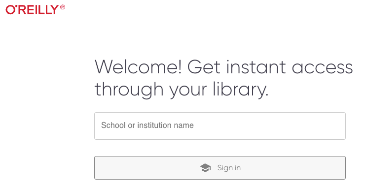
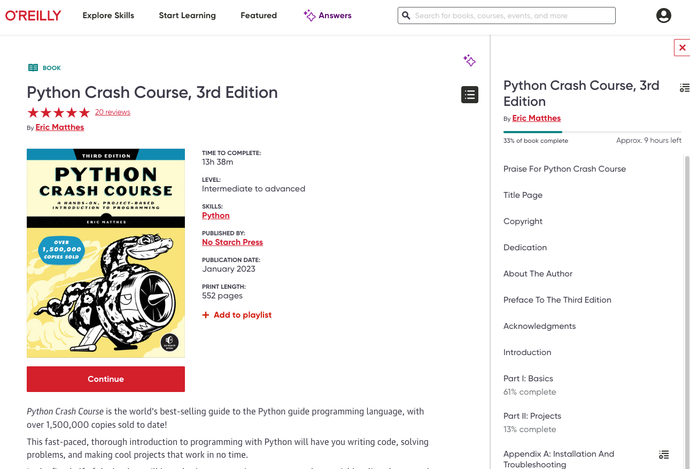

# How to Access the Textbooks

To access the textbooks we will be using for the Python section of this course, go to one of the following links:

[Python Crash Course, 3rd Edition - O'Reilly](https://lib.byu.edu/remoteauth/?url=https://www.lib.byu.edu/cgi-bin/remoteauth.pl?url=https://learning.oreilly.com/library/view/~/9781098156664/?ar&orpq&email=^u){target="_blank"}

[Python Data Science Handbook, 2nd Edition - O'Reilly](https://www.oreilly.com/library-access/?next=%2Flibrary%2Fview%2Fpython-data-science%2F9781098121211%2F){:target="_blank"}

You will be redirected to a page that looks something like this:

 

Click on "School or institution name" and type "Brigham Young University" and select it from the dropdown menu. Then 
click on the "Sign In" button. At this point, if you are accessing from campus, you will be logged in automatically. If you are off campus, you will be taken to the BYU login page. Log in with your BYU NetID and password.

The page will reload, and now you will have access to the book. Click "Continue" to start reading or use the Table of 
Contents on the right side to jump directly to a given chapter. You will need 
to do this each time you access 
the 
book. Once you are logged in, the 
links to the book will immediately load. After a period of time, you will be logged out and need to repeat the process.

