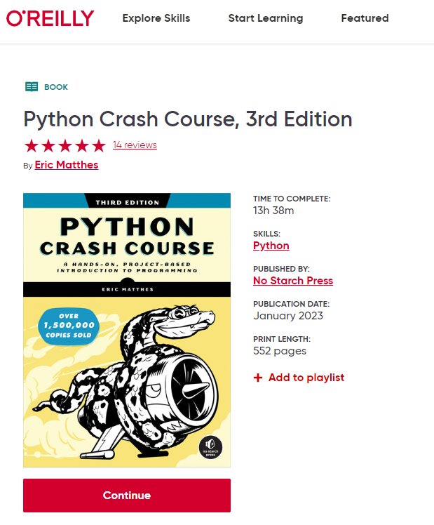

# How to access Course Book

To access the textbook, go to the following link: [Python Crash Course, 3rd Edition - O'Reilly](https://lib.byu.edu/remoteauth/?url=https://www.lib.byu.edu/cgi-bin/remoteauth.pl?url=https://learning.oreilly.com/library/view/~/9781098156664/?ar&orpq&email=^u){target="_blank"}

You will be redirected to a page that looks something like this. Click on "Institution not listed?

 

Now enter your BYU email. This will be your netID followed by "@byu.edu"

Click "Got It"

The page will reload, and now you will have access to the book. Click either "Start" or "Continue" to start reading and gain access to the book. You will need to do this each time you access the book. Once you are logged in, the links to the book will immediately load. After a period of time, you will be logged out and need to repeat the process.

