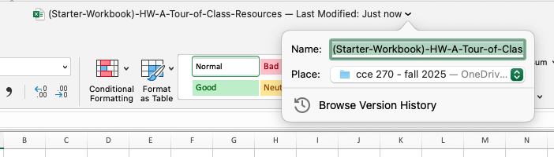
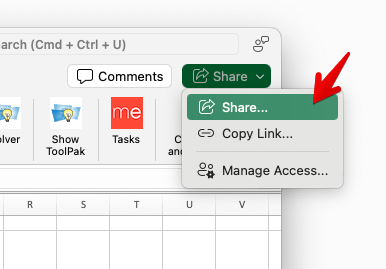
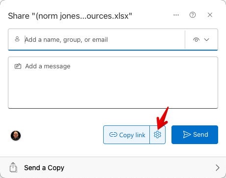
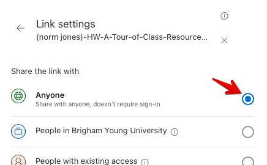
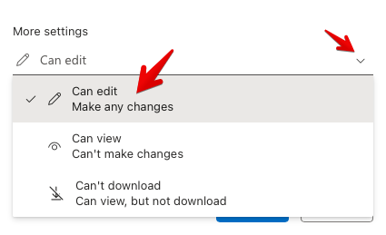
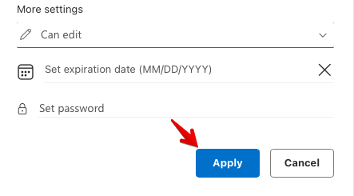
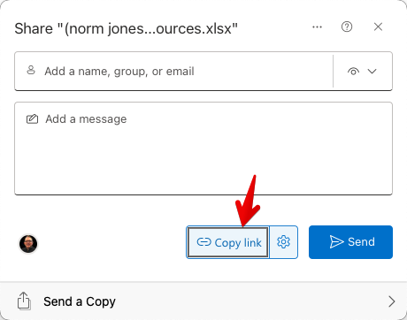

#  HW: A Tour of Class Resources

**Purpose:** This assignment will help you understand and become comfortable with using class resources. If you struggle to find any of the prompts, please ask a TA or a friend.

---

### Part 1 - Mounting your OneDrive
Mounting your OneDrive to your computer will allow you to store all of the assignments for the class in one place. You will need to download many files for this class, and having them organized in one place will make life much easier.

- Follow these instructions if you are a Mac User: [OneDrive for Mac](https://support.microsoft.com/en-us/office/sync-files-with-onedrive-on-macos-d11b9f29-00bb-4172-be39-997da46f913f){:target="_blank"}
- Follow these instructions if you are a Windows User: [OneDrive for Windows](https://support.microsoft.com/en-us/office/sync-files-with-onedrive-in-windows-615391c4-2bd3-4aae-a42a-858262e42a49){:target="_blank"}

Once mounted, create a new folder for the class. Call it something like "CCE 270". You will store all of your Excel 
assignments in this folder for the class.

---

### Part 2 - Download and Upload to OneDrive

Let's go over how to take a given file and download it to the CCE 270 folder in your OneDrive.

1. Here is the starter sheet for the assignment today: [(Starter-Workbook)-HW-A-Tour-of-Class-Resources.xlsx](%28Starter-Workbook%29-HW-A-Tour-of-Class-Resources.xlsx)
2. Right-click on the file link and select "Save 
   Link As..." and save the file to your OneDrive folder (IMPORTANT!). If you save it to your Downloads folder or 
   somewhere else, be sure to move it to your OneDrive folder.
2. Open the file and then at the top of the window is the workbook name. Click on this, and a drop-down like this 
   will appear:
   
    >>

4. Rename it something like “(Your-Name)-HW-A-Tour-of-Class-Resources”

---

### Part 3 - Tour of Class Resources

Open the workbook you just downloaded. Click on the "Questions" tab at the bottom. You will see a list of questions. 
Enter an answer for each question.

1. Who do you talk to if you have a problem with how an assignment is graded or if you turn in an assignment late?
2. What times would work with your schedule to attend TA office hours? Include at least 4 hours that you could go.
3. What are the next 5 things due for this class?
4. How many Projects and Exams will there be in this class?
5. What is the best method to get hold of TAs or professors?

Then click on the "Screenshots" tab at the bottom. You will see a list of screenshots to take. Paste the screenshots 
in the spaces provided.

1. Take a screenshot of the Teaching Assistants page on our class website.
2. Take a picture of your OneDrive folder with your Homework starter sheet in it. Make sure the screenshot shows the folder name you created in Part 1.
3. On our class website, navigate to the "Office Hours" tab and take a screenshot of the office hours for September 8th to September 12th.
4. Post a message in Microsoft Teams in the Homework Help channel. Take a screenshot.

Next, sign up for a time to meet with a TA: [Fall 2025 TA Sign Up](https://docs.google.
com/spreadsheets/d/1-Bh8VJSgd64NqzSXTpAwxWb9tHoDet4bmJpfBLBqsG8/edit?usp=sharing){:target="_blank"}
     Once you meet with a TA, they will give you the appropriate amount of points in Learning Suite. 
Meetings will be from September 8th, 2025 to September 12th, 2025. After the 12th, you will lose 3 points for not meeting with a TA until you complete this assignment. 

---

### Part 4: Turning in your Excel Workbook
For this class, **you will only turn in the links to your Excel files**. We will go over how to make any Excel sheet shareable so anyone can access it.

1. Make sure your Excel file is saved in your OneDrive folder for this class.
2. On the top right, click the share button --> share as shown below:

    >>

3. Then click the settings button next to the Copy Link button: 

    >>

2. From here, we want your Excel sheet so that ANYONE with this link can edit. This will allow us to access the link 
   you turn in. To do this, click "anyone" at the top:

    >>

4. Then underneath "More settings", change "Can view" to "Can edit":

    >>

4. Then click Apply: 

    >>

5. Finally, copy the link by clicking the "Copy Link" button.

    >>

3. Then paste the link into Learning Suite in the feedback box for the assignment.

!!!IMPORTANT
    Make sure that your Excel file is turned in properly. You WILL be docked points if not shared so anyone with a link can edit, OR if you turn in an Excel file instead of a link to the file.

---

## Rubric

**_REMINDER_** - For this class, **you will only turn in the links to your Excel files**. You will get a 0 for this assignment if you turn in an Excel file or a link that is not shareable.

|                      Item                      | Points Possible |
|:----------------------------------------------:|:---------------:|
|       The worksheet is renamed correctly       |        1        |
|             Question 1 is correct              |        1        |
|  At least 4 times are included in question 2   |        4        |
|      Question 3-5 are answered correctly       |        3        |
|   All screenshots include proper information   |        8        |
|       Signed up for a time to meet a TA        |        3        |
|                 Met with a TA                  |       10        |
| 
**Total**
 |       30        |

---

The following is not a part of the rubric, but specifies how you can lose points. For example: if you fail to share your link correctly.

| **Reasons for Points Lost** |    **Amount**     |  
|:---------------------------:|:-----------------:|
|   Link shared incorrectly   |       -10%        |
|  Turned in late (per week)  | -10% (up to -50%) |
