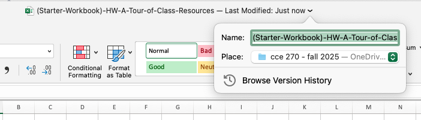

#  HW: A Tour of Class Resources

**Purpose:** This assignment will help you understand and become comfortable with using class resources. If you struggle to find any of the prompts, please ask a TA or a friend.

---

### Part 1 - Set Up a Folder for the Class

You will download a lot of files for this class, so start by creating one place to keep them all. Somewhere
convenient on your computer (your Documents folder works well), create a new folder and name it something like
"CCE 270". You will save all of your Excel assignments for this class in this folder.

Keeping everything in one folder will save you a lot of time hunting for files later, and it makes it much easier
to find the right file when it is time to turn something in.

---

### Part 2 - Download the Starter Workbook

Let's go over how to take a given file and download it to your CCE 270 folder.

1. Here is the starter sheet for the assignment today: [(Starter-Workbook)-HW-A-Tour-of-Class-Resources.xlsx](%28Starter-Workbook%29-HW-A-Tour-of-Class-Resources.xlsx)
2. Right-click on the file link and select "Save
   Link As..." and save the file to your CCE 270 folder. If you save it to your Downloads folder or
   somewhere else, be sure to move it to your CCE 270 folder.
3. Open the file and then at the top of the window is the workbook name. Click on this, and a drop-down like this
   will appear:

    >>

4. Rename it something like "(Your-Name)-HW-A-Tour-of-Class-Resources"

---

### Part 3 - Tour of Class Resources

Open the workbook you just downloaded. Click on the "Questions" tab at the bottom. You will see a list of questions. 
Enter an answer for each question.

1. Who do you talk to if you have a problem with how an assignment is graded or if you turn in an assignment late?
2. What times would work with your schedule to attend TA office hours? Include at least 4 hours that you could go.
3. What are the next 5 things due for this class?
4. How many Projects and Exams will there be in this class?
5. What is the best method to get hold of TAs or professors?

Then click on the "Screenshots" tab at the bottom. You will see a list of screenshots to take. Paste the screenshots 
in the spaces provided.

1. Take a screenshot of the Teaching Assistants page on our class website.
2. Take a picture of your class folder with your Homework starter sheet in it. Make sure the screenshot shows the folder name you created in Part 1.
3. On our class website, navigate to the "Office Hours" tab and take a screenshot of the office hours for January 12th to January 16th.
4. Post a message in Microsoft Teams in the Homework Help channel. Take a screenshot.

Next, sign up for a time to meet with a TA using the following link. Include your first and last name:

:arrow_right: **[Winter 2026 TA Sign Up](https://docs.google.com/spreadsheets/d/1JbsmB4Mj7WCmvFXq76wXcVQ5Zv-8juTxfyIjG_cw1OQ/edit?usp=sharing){:target="_blank"}** :arrow_left:

Once you meet with a TA, they will give you the appropriate amount of points in Learning Suite. 
Meetings will be from January 12th, 2026 to January 16th, 2026. After the 16th, you will lose 3 points for not meeting with a TA until you complete this assignment.

---

### Part 4: Turning in your Excel Workbook

For this class, **you will upload your Excel file directly to Learning Suite**. You attach the workbook itself to
the assignment, the same way you would attach a file to an email.

1. Make sure your work is saved, then close the workbook so that all of your changes are written to the file.
2. Go to the assignment in Learning Suite and upload your `.xlsx` file as an attachment.
3. Double-check that the file you uploaded is the one that contains your completed work. It is easy to grab the
   blank starter workbook by mistake, which is why renaming your file in Part 2 matters.

!!! IMPORTANT
    Make sure that your Excel file is turned in properly. You WILL be docked points if you upload the wrong file or upload something that is not an Excel workbook.

---

## Rubric

**_REMINDER_** - For this class, **you will upload your Excel file directly to Learning Suite**. Make sure the file you upload is for the correct assignment and contains your finished work.

|                      Item                      | Points Possible |
|:----------------------------------------------:|:---------------:|
|       The worksheet is renamed correctly       |        1        |
|             Question 1 is correct              |        1        |
|  At least 4 times are included in question 2   |        4        |
|      Question 3-5 are answered correctly       |        3        |
|   All screenshots include proper information   |        8        |
|       Signed up for a time to meet a TA        |        3        |
|                 Met with a TA                  |       10        |
| 
**Total**
 |       30        |

---

The following is not a part of the rubric, but specifies how you can lose points. For example: if you fail to upload your file correctly.

| **Reasons for Points Lost** |    **Amount**     |  
|:---------------------------:|:-----------------:|
|  File uploaded incorrectly  |       -10%        |
|  Turned in late (per week)  | -10% (up to -50%) |
