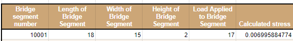

#  HW: Analyzing/Managing Data, Conditional Formatting

**Purpose:** This assignment aims to test your ability to manage and format data. In this assignment, you will filter out certain types of data in different sheets. You will use the different ways of managing data that we went over in class: Conditional formatting and filters. The data we will be using is measurements taken from the Provo river. If you are interested in looking at more data from the Provo river you can access it at this link: 

[Provo River Data](https://waterdata.usgs.gov/monitoring-location/10163000/#parameterCode=00065&period=P7D){:target="_blank"}
   
## Instructions
1. First make a copy of the starter sheet here:
   [Starter Sheet - HW Analyzing/Managing Data, Conditional Formatting](https://docs.google.com/spreadsheets/d/1z9aHndUNtykZRRPncvE9h9ZbW7JfEta5npLSiirBanQ/edit?usp=sharing){:target="_blank"}
2. Rename it something like “[Your Name] HW Analyzing/Managing Data, Conditional Formatting”

---

#### Part 1

1. Navigate to the sheet that says “Streamflow data Part 1”
2. Select the entire table and create a filter, the filter icon should be in each of the headers
3. Filter by Approved status so it only shows rows with an approved status "P"
4. Duplicate that sheet and rename it: “Part 1 Approved Status”
5. Go back to sheet called "Streamflow data Part 1"
6. Reset the filter
7. Next filter the data by date. Only show rows of data that were taken before 6/21/21
8. Duplicate that sheet and rename it “Part 1 Date”
9. Go back to sheet called "Streamflow data Part 1"
10. Reset the filter
11. Next filter the data by Flowrate (CFS). Only show the rows whose flow is between 45 - 50
12. Duplicate that sheet and rename it “Part 1 Flow Rate”

#### Part 2

1. Navigate to the sheet that says “Streamflow Data Part 2”
2. Format the table using colors, bold the headers, and make it easy to read.
3. Give the data in column B a scaled color scheme that will have the low numbers be green the high numbers be red and the middle numbers be yellow
4. Give the data in column C a color if it is greater than 180
5. Give the data in column D a color if it is equal to 230
6. Give the data in column E a scaled color where the lower numbers are the darker version of the color and the higher numbers are the lighter version of that color
7. Give the data in column F a color if the text does not contain a 5

#### Part 3

1. Navigate to the Summary Statistics sheet.
2. On this page, you will see spots to use formulas to summarize the data taken at different places on the river (or stations). Use the appropriate formula and data from your “Streamflow data Part 2” sheet to make those calculations in the top half of the table.
3. Most engineers when making calculations use Meters per Second. In the bottom half of the table, use the conversion factor in cell C20 to convert all the values in the top half of the table from cfs to cms. Hint: Don't forget to use absolute cell references!

#### Part 4

1. Navigate to the Calculations sheet.
2. In the calculated stress column use this formula: Stress = (Load Applied to Bridge Segment * Height of Bridge Segment) / (Width of Bridge Segment * Length of Bridge Segment^2)
   * If you want to check your work, use this table

   

3. Add up all the stresses from the calculated stress column in cell G34 using the sum function
4. In cell G35, use the count function to total the amount of calculations you made in the Calculated Stress column.
5. In cell G36, Find the average stress along the bridge from all the calculations.

---

## Turning in/Rubric
Turn sharing, editing on. Then turn in the link to learning suite in the feedback box

**Rubric:**

|                                                 Item                                                 | Points Possible |
|:----------------------------------------------------------------------------------------------------:|:---------------:|
|                 All sheets in workbook are named as the instructions say to be named                 |        4        |
|                            Part 1 - Approved Status is filtered correctly                            |        2        |
|                                 Part 1 - Date  is filtered correctly                                 |        2        |
|                               Part 1 - Flow Rate is filtered correctly                               |        2        |
|                         Part 2 - Streamflow Data Part 2 is nicely formatted                          |        2        |
|                    Part 2 - Streamflow Data Part 2 columns are colored correctly                     |        5        |
|             Part 3 - Correct equations and data are used in the Summary Statistics page              |        4        |
| Part 3 - Absolute cell reference is used in the 2nd half of the table of the Summary Statistics page |        4        |
|                          Part 4 - The stress equation is written correctly                           |        2        |
|      Part 4 - Correct values for total stress, number of calculations made, and average stress       |        3        |
|                            
**Total**
                            |       30        |
