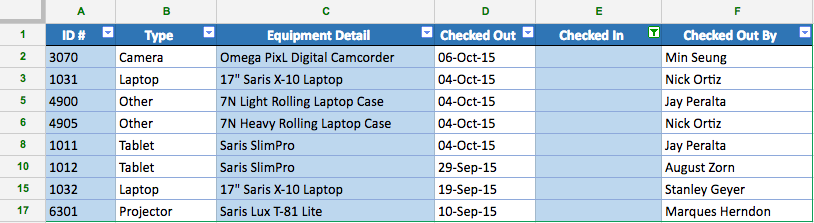

#  Reading: Analyzing and Displaying Data

---
## Preface:
In Google sheets, there are many ways to analyze and display data. For this class we will go over Conditional Formatting, Filtering Data, Data Validation, Graphing Data, and Working with Functions. These are all important tools to know when working with data in Google Sheets. They will help you to better understand your data and make it easier to read and analyze. In this reading, we will go over what each of these tools are and how to use them.

## Learning Objectives:
By the end of this reading, you should be able to:
- Understand what Conditional Formatting is and how to use it.
- Understand what Filtering Data is and how to use it.
- Understand what Data Validation is and how to use it.
- Understand what Graphing Data is, when to use the different types of graphs, and how to create them.
- Understand what functions are and how to use them.

## Reading:
### Conditional Formatting
Conditional formatting is a feature in Google Sheets that allows you to format cells based on certain conditions. This can be useful when you want to highlight certain data points or make your data easier to read. For example, you can use conditional formatting to highlight cells that contain a certain value, or to format cells based on their value. 

#### Initial Set Up
Now let's go over how to add conditional formatting to your data in Google Sheets:

1. Select the range of cells you want to format

2. Click on Format --> Conditional formatting

3. Select the condition you want to format your cells on. In the conditional format rules drop box, you can set up the conditions or rules you want to format the cells based on. For example, you can format the cells if the value of the cell is greater than a given value. Another is to format if the date is between a given date range. 

4. You can also choose the formatting options you want to apply to the cells that meet the condition. For example, you can choose to change the text color, background color, font style, or border style of the cells.

5. Once you have set up the conditions and formatting options, click on Done to apply the conditional formatting to the selected range of cells.

6. Your cells will now be formatted based on the conditions you set up. For example, in the screenshot below, the cells are highlighted red if they contain the number 5.

#### Specific Examples
**Color Gradient** - 
\nThis is useful for sheets with large amounts of data as you can visually distinguish the higher and lower values of the data. 

### Filtering Data
Filtering data is a feature in Google Sheets that allows you to show only the data that meets certain criteria. This can be useful when you want to focus on specific data
2. then click on Format > Conditional formatting. You can then choose the condition you want to format the cells based on, and the formatting options you want to apply.

Visual Example:

There will be 2 reading assignment before the next class, with an optional one as well. It will be on Conditional Formatting, Filter and Sorting Data, and Working with Functions being optional.

 [Conditional Formatting](https://blog.coupler.io/conditional-formatting-google-sheets/){:target="_blank"} - Read Whole Document
 
 [Filtering and Sorting Data](https://edu.gcfglobal.org/en/googlespreadsheets/sorting-and-filtering-data/1/){:target="_blank"} - Read until you see "Challenge" **do not do the challenge**
 
 [Working with Functions](https://edu.gcfglobal.org/en/googlespreadsheets/working-with-functions/1/){:target="_blank"} - **Optional**

---

# Pre-Class Quiz Challenge

## Instructions
1. First make a copy of the starter sheet here: [Starter Sheet Pre - Analyzing/Managing Data, Conditional Formatting](https://docs.google.com/spreadsheets/d/1nHMTqHvprWHruS2jWq81fNMTIU7UjirWh8wV3Ddkvtg/edit?usp=sharing){:target="_blank"}
     The challenge comes from the [Filtering and Sorting Data](https://edu.gcfglobal.org/en/googlespreadsheets/sorting-and-filtering-data/1/){:target="_blank"} reading. 
2. Select the **Equipment Log** tab if it is not already open.
3. **Freeze** row 1.
4. **Sort** the spreadsheet by the **Checked Out** date from most recent to the oldest.
     **Hint**: Sort by column D from Z to A.
5. **Sort the range** A2:F9 by column **B** from **A to Z**.
     **Hint**: Make sure the box next to **data has header** row is left unchecked.
6. Filter the spreadsheet so it only shows equipment that has never been checked in.
     **Hint**: Filter column E to show cells that are empty.
7. When you're finished, your spreadsheet should look like this:
   
8. Change the access so anyone with the link can edit. Copy the Link and paste into the pre-class quiz.
   
