#  Reading: Analyzing & Managing Data

---

In Excel, there are many ways to analyze and display data. For this topic, you will focus on Conditional Formatting, Filtering Data, Excel Tables, and working with Functions. These are all important tools to know when working with data in Excel. They will help you to better understand your data and make it easier to read and analyze. In this reading, you will learn what these tools are and how to use them.

!!! note "Reading Excel instructions"
    A reference such as `A2:F30` means every cell from A2 through F30. A ribbon path such as **Data > Filter** means select the **Data** tab, then select **Filter**. Review [Cells and Formulas](../../resources/excel_review/basic_excel_review.md) for worksheet and workbook terms, relative and absolute references, and named cells.

---

## Conditional Formatting

Conditional formatting is a feature in Excel that allows you to format cells based on certain conditions. This can be useful when you want to highlight certain data points or make your data easier to read.

There are many different ways to use conditional formatting in Excel. Some common uses include:
- Highlighting cells that contain certain values, text, dates, or numbers
- Highlighting cells that are above or below a certain value
- Highlighting cells that contain duplicate values
- Highlighting cells that are blank or contain errors
- Putting icons next to cells that meet certain criteria
- Data bars to show the relative size of values in a range
- Color scales to show the relative size of values in a range

To apply conditional formatting to your data in Excel, follow these steps:

1. Select the range of cells you want to format. This can be a single cell, a row, a column, or a range of cells. 

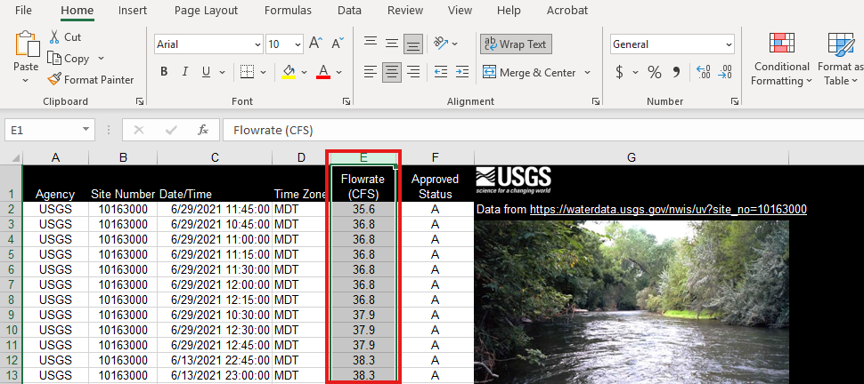

2. Make sure you are on the Home tab, then select Conditional Formatting from the ribbon. This will open a drop-down menu with several options for conditional formatting.

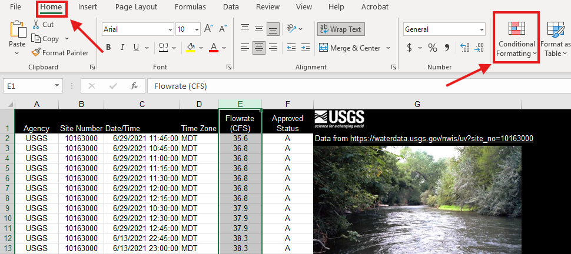 

3. Select the type of conditional formatting you want to apply. There are several options to choose from, including Highlight Cells Rules, Top/Bottom Rules, Data Bars, Color Scales, and Icon Sets. You can also create a new rule by selecting "New Rule" from the drop-down menu. 

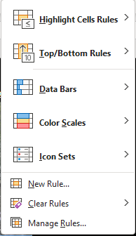

4. Once you select a conditional formatting rule, a dialog box will allow you to set the condition and choose the formatting. For example, to highlight text entries that contain the character "5," select **Highlight Cells Rules > Text that Contains**.

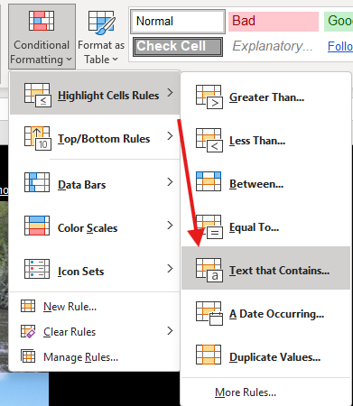

5. Enter `5` in the **Text that Contains** box to highlight text containing that character. Numeric comparisons use a different rule. To highlight numbers greater than 5, select **Highlight Cells Rules > Greater Than** and enter `5`. To include 5 as well, create a formula-based rule and enter a formula such as `=A2>=5`, where A2 is the first cell in the selected range. A comparison can also refer to another cell; for example, `=A2>=$D$1` compares each selected value with the fixed value in D1.

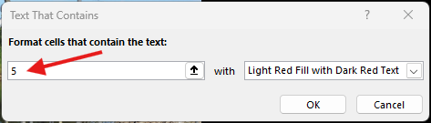

6. After entering the value or formula, choose the formatting options, such as font color, fill color, and border style. You can use a preset format or select **Custom Format**. To format an entire row based on one cell's value, apply a formula-based rule to the complete row range; the Custom Format dialog controls the appearance, not which cells receive the rule.

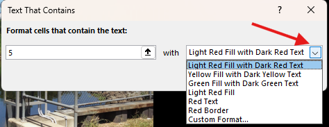

7. In the Custom Format dialog box, choose the font, border, and fill options. Once you have selected the formatting, click **OK**.

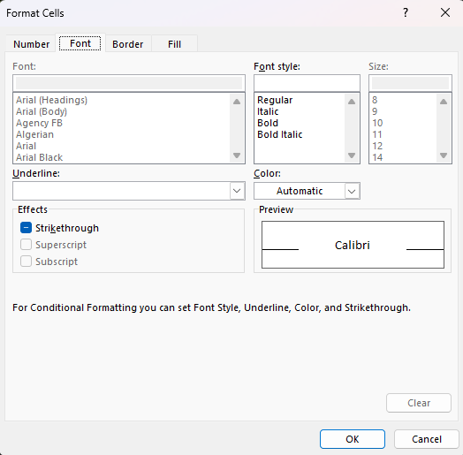

8. Once you have selected what the condition is and how you want it to look, you can click OK. This will apply the conditional formatting to the selected cells. 

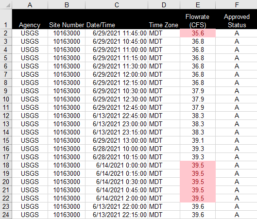

You can add multiple conditional formatting rules to the same range. The Conditional Formatting Rules Manager lists the rules in priority order, with higher rules taking precedence when formats conflict. Lower rules may still add nonconflicting formatting unless **Stop If True** is selected for a higher rule. You can edit, delete, or reorder rules in the Rules Manager.

Conditional formatting rules can also be copied to other cells. Select the cells with the conditional formatting, copy them, and then use **Paste Special > Formats** on the destination cells.

To see more examples of conditional formatting and the different options available, check out this link from 
W3Schools: [Conditional Formatting](https://www.w3schools.com/excel/excel_conditional_formatting.php){:target="_blank"}

---

## Filtering Data

Filtering data is a feature in Excel that allows you to show only the data that meets certain criteria. This can be useful when you have a large data set and only want to focus on a specific section of it. This differs from conditional formatting as filtering allows you to change the range of data you see, while conditional formatting changes the visual aspect of the data but does not alter the view range.

To set up filtering in Excel, follow these steps:

1. Select the complete data range, including its header row and every related column. If you select one cell within a contiguous data range, Excel can usually detect the surrounding range, but you should confirm that every related column is included.

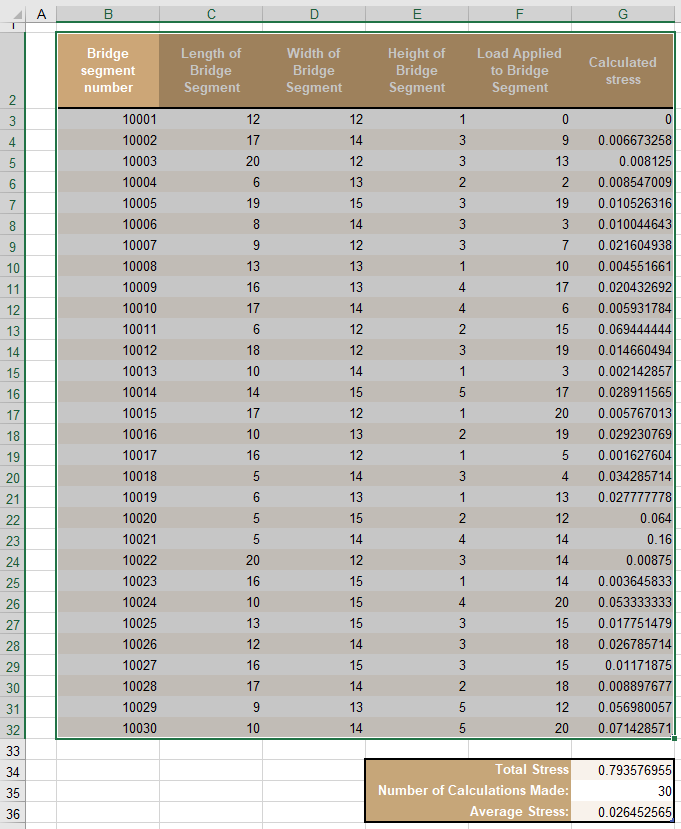

2. Go to the **Data** tab and select **Filter**. Alternatively, on the **Home** tab, select **Sort & Filter > Filter**. You can also use **Ctrl + Shift + L** in Windows. On a Mac, use **Command + Shift + F** or **Ctrl + Shift + L**.

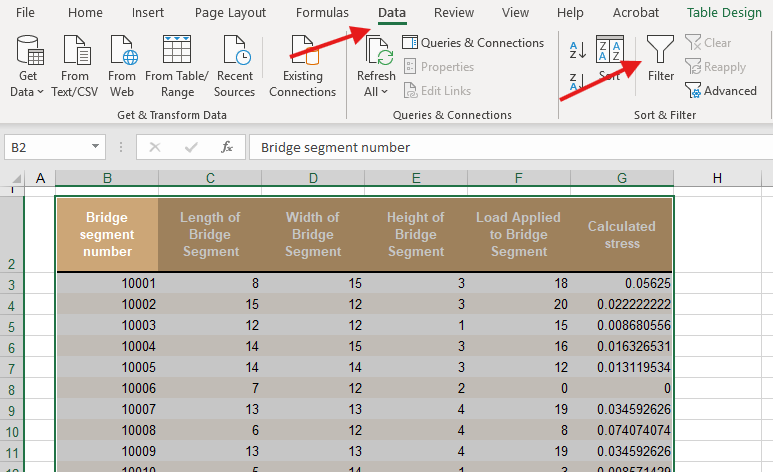
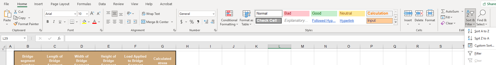

3. Excel will add a filter button to each cell in the header row.

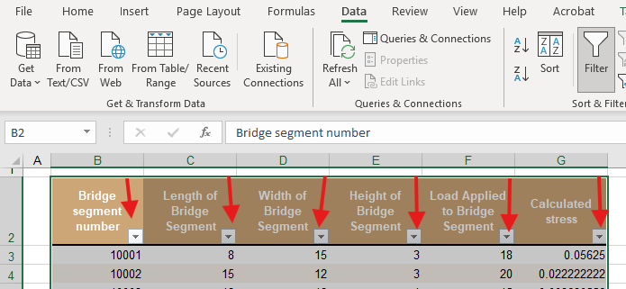

4. To filter the data, click on the filter icon in the header of the column you want to filter. This will open a drop-down menu with several options for filtering the data.

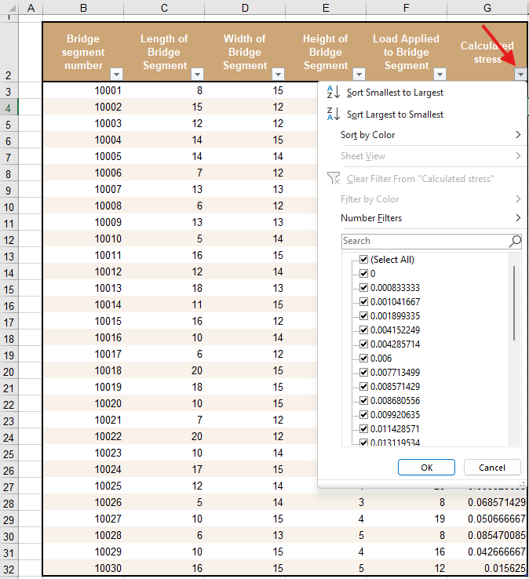

5. There are many ways to filter data, including:
   - Filter by values/number: This allows you to filter the data based on specific values or numbers. For example, if you have a column of numbers and only want to see the rows with values greater than 50, you can filter the data to only show those rows.
   - Filter by color: This allows you to filter the data based on the color of the cells. For example, if you have cells that are highlighted in red, you can filter the data to only show those rows.

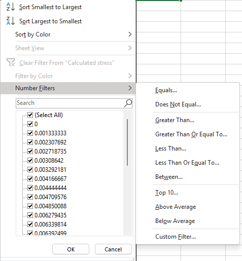

6. To filter by values, select the "Number Filters" option from the drop-down menu. This will open a sub-menu with several options for filtering the data based on numbers. You can choose to filter by "Equals", "Does Not Equal", "Greater Than", "Less Than", "Between", and more. In this case we will select "Greater Than" and enter the value we want to filter by. This will then open the following dialog box:

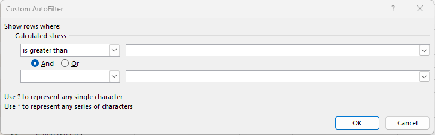

7. In this dialog box, you can add two conditions to filter by, such as "greater than" and/or "less than". You can also choose to filter by "Top 10" or "Above Average" to show only the top or bottom values in the data set. Once you have selected the conditions you want to filter by, click "OK" to apply the filter.

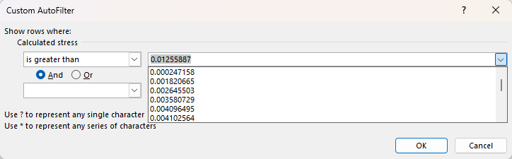

8. After a filter is applied, the rows that do not meet the criteria will be hidden from view. You can tell that a filter is applied by looking at the filter icon in the header of the column. The icon will change to show that a filter is applied. (See the difference between the arrows in the top right of the image below) Also note that the row numbers will also reflect the hidden rows.

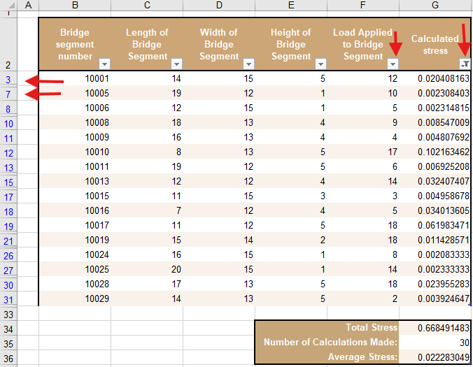

9. To remove a filter from one column, click its filter button and select **Clear Filter From [Column Name]**. This will show all values for that column while retaining filters on other columns. To clear all active filters, go to the **Data** tab and select **Clear** from the Sort & Filter group.

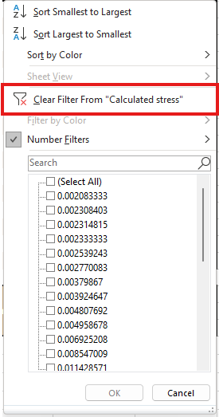

Filters can be applied to multiple columns at the same time. These filters are **additive**: each additional filter further reduces the visible records. For example, filtering the Type column for Camera and the Days Checked Out column for values of 5 or greater displays only rows that meet both conditions. You can also use **Custom Filter** to combine multiple criteria within a column.

For more help on creating custom filters, check out: [Filter by using advanced criteria](https://support.microsoft.com/en-us/office/filter-by-using-advanced-criteria-4c9222fe-8529-4cd7-a898-3f16abdff32b){:target="_blank"}

For more general help on filtering data in Excel, check out the following websites: [Filter data in a range or table](https://support.microsoft.com/en-us/office/filter-data-in-a-range-or-table-01832226-31b5-4568-8806-38c37dcc180e){:target="_blank"} and [Excel Filters by W3Schools](https://www.w3schools.com/excel/excel_filter.php){:target="_blank"}

---

## Using Excel Tables

An Excel **Table** is a range of related data that Excel manages as a single object. Although any organized group of cells may look like a table, an Excel Table includes additional tools for sorting, filtering, formatting, adding data, and working with formulas.

Tables are especially useful when a data set will change over time. When you add new rows or columns next to a Table, Excel can automatically expand the Table to include the new data.

Some benefits of using an Excel Table include:

- Filter and sort buttons are automatically added to each column header.
- Alternating row colors, called **banded rows**, make large data sets easier to read.
- Table formatting automatically extends to new rows and columns.
- A formula entered in one cell of a Table column can automatically fill the entire column.
- Columns can be referenced by name instead of only by cell addresses.
- An optional **Total Row** can calculate sums, averages, counts, minimums, and maximums.
- Filters, formulas, and totals automatically adjust as the Table grows.

### Creating a Table

To convert a range of data into an Excel Table, follow these steps:

1. Select a cell within the data. You can also select the entire data range. For the pre-class workbook, select cells **A1:F30**.

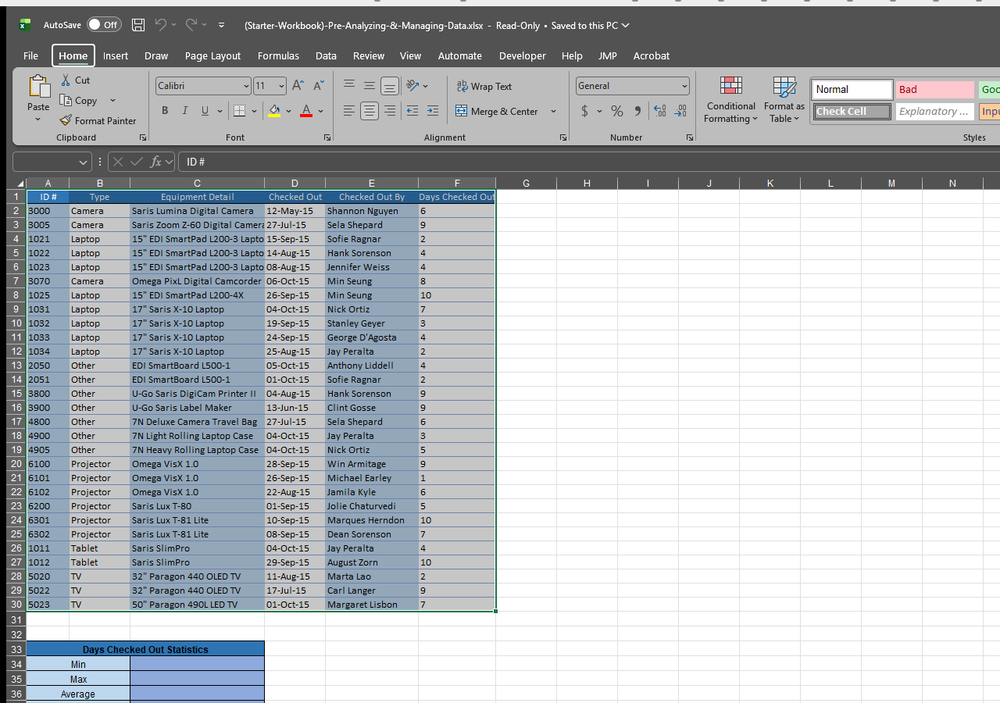

2. On the **Home** tab, select **Format as Table**, and then choose a Table style. In Excel for Windows, you can also use the shortcut **Ctrl + T**.

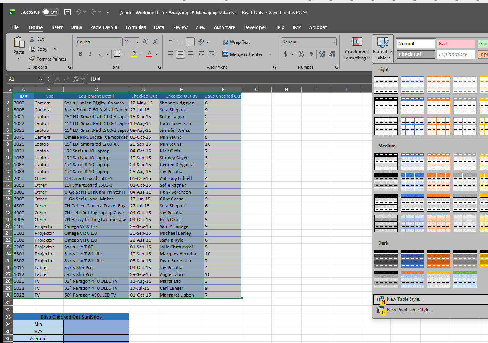

3. Excel will display the **Create Table** dialog box. Confirm that the correct cell range is shown and select **My table has headers**. This prevents Excel from replacing the existing headings with names such as Column1 and Column2.

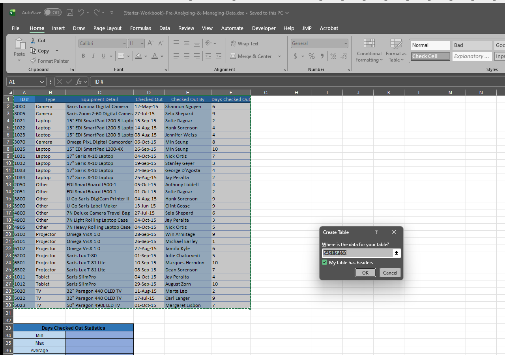

4. Select **OK**. Excel will format the data and add filter buttons to the header row.

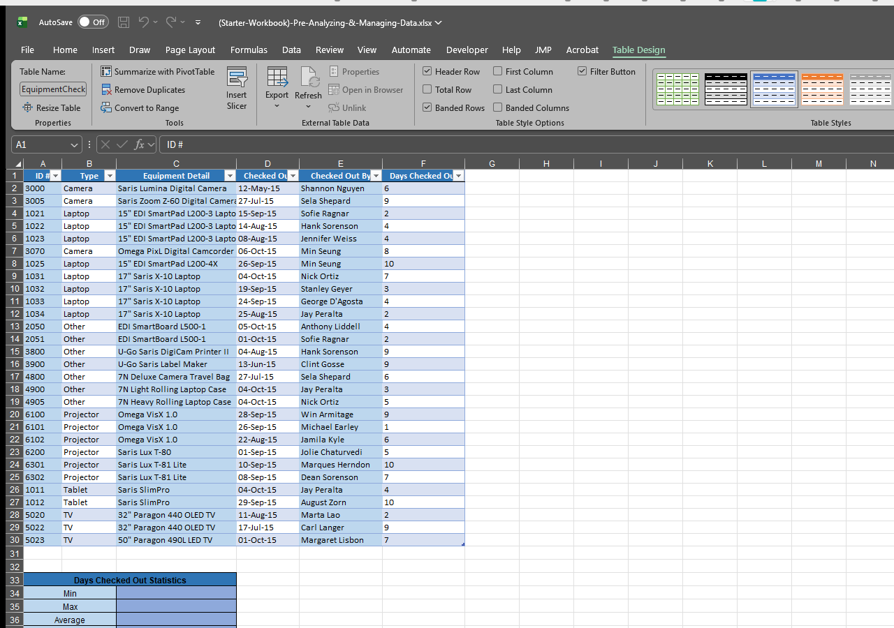

The filter buttons in a Table work the same way as the filters described in the previous section. You can filter by values, numbers, dates, colors, or multiple criteria. Filtering hides rows that do not meet the selected criteria; it does not delete those rows.

### The Table Design Tab

When you select a cell inside a Table, Excel displays the **Table Design** tab. On a Mac, this tab may be labeled **Table**. From this tab, you can:

- Change the Table style
- Turn banded rows or columns on or off
- Show or hide the filter buttons
- Add a Total Row
- Resize the Table
- Give the Table a descriptive name

Excel initially gives Tables names such as `Table1`. Giving a Table a meaningful name, such as `EquipmentCheckout`, makes it easier to identify and use later.

### Using the Total Row

To add a Total Row, select a cell in the Table and then select **Table Design > Total Row**. A new row will appear at the bottom of the Table. Select a cell in that row to choose a calculation such as **Sum**, **Average**, **Count**, **Minimum**, or **Maximum**.

For example, the Total Row can display the average of the **Days Checked Out** column. The result updates when the Table is filtered, allowing you to summarize only the visible records.

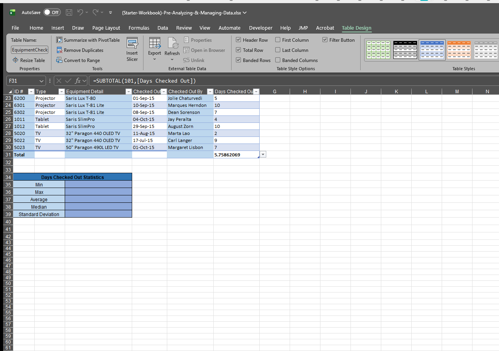

Tables become even more useful when working with formulas. Instead of referring to a range such as `F2:F30`, a formula can refer to a named Table column, such as `EquipmentCheckout[Days Checked Out]`. These are called **structured references**. You will work with formulas in the next section.

For additional information, see [Create and format tables](https://support.microsoft.com/en-us/excel/get-started/create-and-format-tables){:target="_blank"}, [Overview of Excel tables](https://support.microsoft.com/en-us/excel/overview-of-excel-tables){:target="_blank"}, and [Using structured references with Excel tables](https://support.microsoft.com/en-us/excel/using-structured-references-with-excel-tables){:target="_blank"}.

---

## Filters versus Tables

A Table does not replace filtering. It organizes the data and adds filter controls automatically.

- Use **filters on a normal range** for a quick, temporary review.
- Use an **Excel Table** for a spreadsheet that will continue to be updated or reused. Tables automatically extend formatting and formulas to new rows and support named columns and a Total Row.
- Always include every related column in the filtered range or Table. If a column is left outside, sorting can rearrange the included columns without moving the excluded column. This can cause values from different records to become incorrectly matched.
- Both methods temporarily hide rows that do not meet the selected criteria; neither deletes the data.

**Rule of thumb:** Use a filtered range for a quick check. For an ongoing spreadsheet, an Excel Table is usually the better option.

---

## Working with Functions 

In Excel, functions help users to analyze, manage, and compute data. A function is set up in three parts:

Throughout this unit, you will learn new and useful functions. For this topic, you will focus on the most common functions for analyzing data:

|      Function       | Syntax              | Purpose                                                                                                                                                |                                  Help Link                                     |
|:-------------------:|---------------------|--------------------------------------------------------------------------------------------------------------------------------------------------------|:------------------------------------------------------------------------------:|
|         Sum         | =SUM(arguments)     | Adds all of the arguments together                                                                                                                     |     [SUM](https://www.w3schools.com/excel/excel_sum.php){:target="_blank"}     |
|       Average       | =AVERAGE(arguments) | Averages arguments together                                                                                                                            | [AVERAGE](https://www.w3schools.com/excel/excel_average.php){:target="_blank"} |
|         Max         | =MAX(arguments)     | Returns the highest number out of the arguments                                                                                                        |     [MAX](https://www.w3schools.com/excel/excel_max.php){:target="_blank"}     |
|         Min         | =MIN(arguments)     | Returns the lowest number out of the arguments                                                                                                         |     [MIN](https://www.w3schools.com/excel/excel_min.php){:target="_blank"}     |
| Standard Deviation  | =STDEV(arguments)   | Returns the sample standard deviation of the arguments. Use `STDEV` for the activities and homework in this topic.                                    | [STDEV](https://support.microsoft.com/en-us/excel/functions/stdev-function){:target="_blank"} |
|        Mode         | =MODE(arguments)    | Returns the most frequently occurring number in the arguments                                                                                         |    [MODE](https://www.w3schools.com/excel/excel_mode.php){:target="_blank"}  |
|       Median        | =MEDIAN(arguments)  | Returns the median of the arguments                                                                                                                    |  [MEDIAN](https://www.w3schools.com/excel/excel_median.php){:target="_blank"}  |

 
For example, `=MODE(B2:B30)` returns the most common value in cells B2:B30, and `=STDEV(B2:B30)` returns the sample standard deviation of those values.

!!! note "Optional: STDEV.S and STDEV.P"
    When you search for a standard deviation function in Excel, `STDEV.S` and `STDEV.P` may appear before `STDEV`. `STDEV.S` is the current function for a sample and produces the same type of result as `STDEV`. `STDEV.P` is used when the supplied data represent the entire population. For the activities and homework in this topic, use `STDEV`.

You can find more functions at W3Schools. You can also find a list of functions in Excel by going to the **Formulas** tab and selecting **Insert Function**, or by selecting the **Insert Function (fx)** button next to the formula bar. The dialog box lets you search for functions and review their arguments and descriptions.

### Naming a Cell

A named cell gives a cell reference a meaningful name that can be used in formulas. Named cells make formulas easier to read and act as fixed references by default.

To name a cell:

1. Select the cell you want to name.
2. Click the **Name Box** to the left of the formula bar.
3. Type a name without spaces, such as `con_fac`, and press **Enter**.
4. Use the name in a formula. For example, `=C4*con_fac` multiplies the value in C4 by the value stored in the named cell.

## Freezing Rows/Columns

When working with large data sets in Excel, it can be helpful to freeze certain rows or columns so that they remain visible while you scroll through the rest of the data. This is especially useful for keeping headers or labels in view while you work with the data.
Use the option that matches what you want to keep visible:

- To freeze the top row, select **View > Freeze Panes > Freeze Top Row**.
- To freeze the first column, select **View > Freeze Panes > Freeze First Column**.
- To freeze custom rows and columns, select the cell immediately below the rows and immediately to the right of the columns you want to keep visible. Then select **View > Freeze Panes > Freeze Panes**. For example, select C3 to freeze rows 1–2 and columns A–B.

Excel displays a thicker boundary between the frozen and scrolling areas. To remove the frozen panes, select **View > Freeze Panes > Unfreeze Panes**.

Freezing rows and columns can be a useful tool when working with large data sets in Excel. It allows you to keep important information in view while you work with the rest of the data. This can be useful for keeping headers or labels visible, making it easier to understand and remember the data you are working with.
For more information, see [Freeze panes to lock rows and columns](https://support.microsoft.com/en-us/excel/get-started/freeze-panes-to-lock-rows-and-columns){:target="_blank"}.

---

## Pre-Class Quiz Challenge

1. First download the starter workbook: [(Starter-Workbook)-Pre-Analyzing-&-Managing-Data.xlsx](%28Starter-Workbook%29-Pre-Analyzing-%26-Managing-Data.xlsx) and save it to the CCE 270 folder you created for this class.
    Before you start, make sure to make a copy of the file.
    The challenge is a modified version of one from this website [Filtering and Sorting Data](https://edu.gcfglobal.org/en/googlespreadsheets/sorting-and-filtering-data/1/){:target="_blank"}. 
2. **Highlight** the cells in **B2:B30** that contain Camera.
     Hint: Use conditional formatting
3. **Highlight** the cells in **A2:A30** that have an ID number between 1000 and 2500.
4. Select cells **A1:F30** and add a **Filter**. 
5. **Sort** the spreadsheet by the **Checked Out** date from most recent to the oldest.
6. **Filter** the **Days Checked Out** column to show only values of 5 or greater.
7. Fill in the **Days Checked Out Statistics** area in rows 34-38 using the **Days Checked Out** values in **F2:F30**. Use `STDEV` for standard deviation.
8. When you're finished, your spreadsheet should look something like this:

---

## Turning in/Rubric

**_REMINDER_** - For this class, **you will upload your Excel file directly to Learning Suite**. Make sure the file you upload is for the correct assignment and contains your finished work.

1. Make sure your work is saved, then close the workbook so that all of your changes are written to the file.
2. Go to the assignment in Learning Suite and upload your `.xlsx` file as an attachment.
3. Double-check that the file you uploaded is the one that contains your completed work.

**Rubric:**

|                      Item                      | Points Possible |
|:----------------------------------------------:|:---------------:|
| 
**Total**
 |        3        |

---

The following is not a part of the rubric, but specifies how you can lose points. For example: if you fail to upload your file correctly.

| **Reasons for Points Lost** |    **Amount**     |  
|:---------------------------:|:-----------------:|
|  File uploaded incorrectly  |       -10%        |
