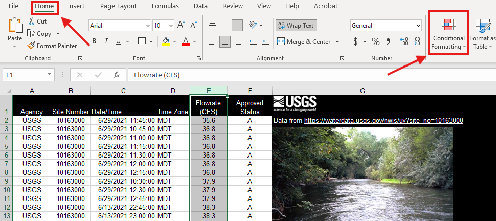

#  Reading: Analyzing & Managing Data

---

In Excel, there are many ways to analyze and display data. For this topic, you will focus on Conditional Formatting, Filtering Data, and working with Functions. These are all important tools to know when working with data in Excel. They will help you to better understand your data and make it easier to read and analyze. In this reading, you will go over what each of these tools are and how to use them.

---

## Conditional Formatting

Conditional formatting is a feature in Excel that allows you to format cells based on certain conditions. This can be useful when you want to highlight certain data points or make your data easier to read.

There are many different ways to use conditional formatting in Excel. Some common uses include:
- Highlighting cells that contain certain values, text, dates, or numbers
- Highlighting cells that are above or below a certain value
- Highlighting cells that contain duplicate values
- Highlighting cells that are blank or contain errors
- Putting icons next to cells that meet certain criteria
- Data bars to show the relative size of values in a range
- Color scales to show the relative size of values in a range

To set up conditional formatting to your data in Excel, follow these steps:

1. Select the range of cells you want to format. This can be a single cell, a row, a column, or a range of cells. 

2. Make sure you are on the Home tab, then select Conditional Formatting from the ribbon. This will open a drop-down menu with several options for conditional formatting.

 

3. Select the type of conditional formatting you want to apply. There are several options to choose from, including Highlight Cells Rules, Top/Bottom Rules, Data Bars, Color Scales, and Icon Sets. You can also create a new rule by selecting "New Rule" from the drop-down menu. 

4. Once you have selected the type of conditional formatting you want to apply, a dialog box will appear. This dialog box will allow you to set the conditions for the formatting and choose the formatting options. Say for example, you want to highlight any cells that contains a "5" in the data set. You would select "Text that contains" from the drop-down menu.

5. This will open a dialog box where you can enter the value you want to format. In this case, you would enter "5" in the box. You can also choose the condition to be based on a formula. For example, if you want to highlight cells that are greater than 5, you would enter the formula ">=5" in the box. The condition could also be based off another cell. For example, if you want to highlight cells that are greater than the value in cell A1, you would enter the formula ">=A1" in the box.

6. After you have entered the value or formula, you can choose the formatting options. This includes the font color, fill color, and border style. You can also choose to apply the formatting to the entire row or column. There are some preset options to choose from, or you can create your own custom formatting by selecting "Custom Format" from the drop-down menu.

7. Inside the custom format dialog box, you can choose the font, border, and fill options. You can also choose to apply the formatting to the entire row or column. Once you have selected the formatting options, click "OK" to apply the formatting.

8. Once you have selected what the condition is and how you want it to look, you can click OK. This will apply the conditional formatting to the selected cells. 

You can also add multiple conditional formatting rules to the same range of cells. To do this, simply repeat the steps above for each rule you want to add. The rules will be applied in the order they are listed in the Conditional Formatting Rules Manager. Conditional formatting rules can be edited or deleted at any time by selecting the rule in the Conditional Formatting Rules Manager and clicking "Edit Rule" or "Delete Rule". It is important to note that the order of the rules can affect how they are applied. For example, if you have two rules that apply to the same cells, the first rule will take precedence over the second rule. This means that if the first rule is true, the second rule will not be applied. Conditional formatting rules can also be copied and pasted to other cells. To do this, simply select the cells with the conditional formatting you want to copy, right-click, and select "Copy". Then, right-click on the cells where you want to paste the formatting and select "Paste Special". In the Paste Special dialog box, select "Formats" and click "OK". This will apply the conditional formatting to the selected cells.

To see more examples of conditional formating and the different options available, check out this link from 
W3Schools: [Conditional Formatting](https://www.w3schools.com/excel/excel_conditional_formatting.php){:target="_blank"}

---

## Filtering Data

Filtering data is a feature in Excel that allows you to show only the data that meets certain criteria. This can be useful when you have a large data set and only want to focus on a specific section of it. This differs from conditional formatting as filtering allows you to change the range of data you see, while conditional formatting changes the visual aspect of the data but does not alter the view range.

To set up filtering in Excel, follow these steps:

1. Select the columns of data you want to add filters to. You can select the entire table or just the headers.

2. Then go to the Data tab in the ribbon and select the Filter button. This will add a filter icon to each of the headers in the selected columns. Also on the Home tab in, select "Sort & Filter" and then the Filter button. You can also use the shortcut Ctrl + Shift + L (Cmd + Shift + L for Mac users) to add filters to the selected columns.

3. This will add filters to the top of the table on the header column.

4. To filter the data, click on the filter icon in the header of the column you want to filter. This will open a drop-down menu with several options for filtering the data.

5. There are many ways to filter data, including:
   - Filter by values/number: This allows you to filter the data based on specific values or numbers. For example, if you have a column of numbers and only want to see the rows with values greater than 50, you can filter the data to only show those rows.
   - Filter by color: This allows you to filter the data based on the color of the cells. For example, if you have cells that are highlighted in red, you can filter the data to only show those rows.

6. To filter by values, select the "Number Filters" option from the drop-down menu. This will open a sub-menu with several options for filtering the data based on numbers. You can choose to filter by "Equals", "Does Not Equal", "Greater Than", "Less Than", "Between", and more. In this case we will select "Greater Than" and enter the value we want to filter by. This will then open the following dialog box:

7. In this dialog box, you can add two conditions to filter by, such as "greater than" and/or "less than". You can also choose to filter by "Top 10" or "Above Average" to show only the top or bottom values in the data set. Once you have selected the conditions you want to filter by, click "OK" to apply the filter.

8. After a filter is applied, the rows that do not meet the criteria will be hidden from view. You can tell that a filter is applied by looking at the filter icon in the header of the column. The icon will change to show that a filter is applied. (See the difference between the arrows in the top right of the image below) Also note that the row numbers will also reflect the hidden rows.

9. To remove a filter, click on the filter icon in the header of the column and select "Clear Filter From [Column Name]". This will remove the filter and show all the data in the table again. You can also remove all filters by going to the Data tab in the ribbon and selecting "Clear" from the Sort & Filter group.

Filters can also be applied to multiple columns at the same time. To do this, simply repeat the steps above for each column you want to filter. The filters will be applied in the order they are listed in the Filter drop-down menu. You can also use the "Custom Filter" option to create more complex filters that combine multiple criteria. This allows you to filter the data based on multiple conditions, such as showing only rows that meet both criteria.

For more help on creating custom filters, check out: [Filter by using advanced criteria](https://support.microsoft.com/en-us/office/filter-by-using-advanced-criteria-4c9222fe-8529-4cd7-a898-3f16abdff32b){:target="_blank"}

For more general help on filtering data in Excel, check out the following websites: [Filter data in a range or table](https://support.microsoft.com/en-us/office/filter-data-in-a-range-or-table-01832226-31b5-4568-8806-38c37dcc180e){:target="_blank"} and [Excel Filters by W3Schools](https://www.w3schools.com/excel/excel_filter.php){:target="_blank"}

---

## Working with Functions 

In Excel, functions help users to analyze, manage, and compute data. A function is set up in three parts:

Throughout this unit, you will learn new and useful functions. For this topic, you will focus on the most common functions for analyzing data:

|      Function       | Syntax              | Purpose                                                                                                                                                |                             Help Link (W3Schools)                              |
   |:-------------------:|---------------------|--------------------------------------------------------------------------------------------------------------------------------------------------------|:------------------------------------------------------------------------------:|
   |         Sum         | =SUM(arguments)     | Adds all of the arguments together                                                                                                                     |     [SUM](https://www.w3schools.com/excel/excel_sum.php){:target="_blank"}     |
   |       Average       | =AVERAGE(arguments) | Averages arguments together                                                                                                                            | [AVERAGE](https://www.w3schools.com/excel/excel_average.php){:target="_blank"} |
   |         Max         | =MAX(arguments)     | Returns the highest number out of the arguments                                                                                                        |     [MAX](https://www.w3schools.com/excel/excel_max.php){:target="_blank"}     |
   |         Min         | =MIN(arguments)     | Returns the lowest number out if the arguments                                                                                                         |     [MIN](https://www.w3schools.com/excel/excel_min.php){:target="_blank"}     |
   | Standard Deviation  | =STDEV.P(arguments) | Returns the standard deviation for the entire population.   Use this if the range you pass to the function is the entire   dataset.**            | [STDEV.P](https://www.w3schools.com/excel/excel_stdevp.php){:target="_blank"}  |
   | Standard Deviation  | =STDEV.S(arguments) | Returns the standard deviation for a sample of the entire    population. Use this if the range you pass is a subset of the   overall population. | [STDEV.S](https://www.w3schools.com/excel/excel_stdevs.php){:target="_blank"}  |
   |       Median        | =Median(arguments)  | Returns the median of the arguments                                                                                                                    |  [MEDIAN](https://www.w3schools.com/excel/excel_median.php){:target="_blank"}  |

 
** This function replaced the older STDEV function, which is still available for compatibility with earlier versions of Excel.

You can find more functions at W3Schools. You can also find a list of all functions in Excel by going to the Formulas tab in the ribbon and selecting "Insert Function". This will open a dialog box with a list of all the functions available in Excel. You can also search for specific functions by typing in the search box at the top of the dialog box. Within this dialog box, you can also find the function arguments and a description of what the function does. This is a great way to learn about new functions and how to use them. This can also be pulled by clicking on the function name in the formula bar.

---

## Pre-Class Quiz Challenge

1. First download the starter sheet: [(Starter-Workbook)-Pre-Analyzing-&-Managing-Data.xlsx](%28Starter-Workbook%29-Pre-Analyzing-%26-Managing-Data.xlsx) and save it to the OneDrive folder you created for this class.
    Before you start, make sure to make a copy of the file and rename it something like “(Your-Name)-Pre-Analyzing-&-Managing-Data”.
    The challenge is a modified version of one from this website [Filtering and Sorting Data](https://edu.gcfglobal.org/en/googlespreadsheets/sorting-and-filtering-data/1/){:target="_blank"}. 
2. **Highlight** those in the **Type** column that checked out Cameras.
     Hint: Use conditional formatting
3. **Highlight** those in **column A** that have an ID number between 1000 and 2500.
4. Select cells **A1:F30** and add a **Filter**. 
5. **Sort** the spreadsheet by the **Checked Out** date from most recent to the oldest.
6. **Sort** the spreadsheet by **Days Checked Out** to only show those who have a value of 5 and higher.
7. Fill in the **Days Checked out Statistics** chart using the **Days checked out** info in the main table.
8. When you're finished, your spreadsheet should look something like this:

---

## Turning in/Rubric

**_REMINDER_** - For this class, **you will only turn in the links to your Excel files**. You will get a 0 for this assignment if you turn in an Excel file or a link that is not shareable. 

1. Make sure your file is saved to your OneDrive folder.
2. On the top right, click the share button --> share --> settings
2. Click "anyone" at the top, then underneath "More settings", change "can view" to "can edit". Then click apply. 
3. Copy the link, then turn it into Learning Suite in the feedback box for that assignment.

**Rubric:**

|                      Item                      | Points Possible |
|:----------------------------------------------:|:---------------:|
| 
**Total**
 |        3        |

---

The following is not a part of the rubric, but specifies how you can lose points. For example: if you fail to share your link correctly.

| **Reasons for Points Lost** |    **Amount**     |  
|:---------------------------:|:-----------------:|
|   Link shared incorrectly   |       -10%        |