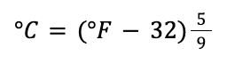
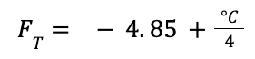
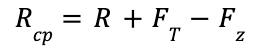
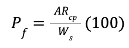
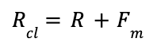
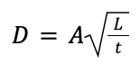
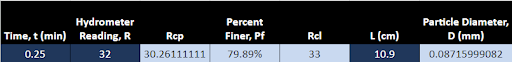

#  HW: Lookups, Match, Data Validation

**Purpose:** insert smth here

## Instructions
1. First make a copy of the starter sheet here:
   [Starter Sheet- HW Lookups, Match, Data Validation](https://docs.google.com/spreadsheets/d/1AVq6HfUD7hCXnJXD6L9dSqogVHGz_7yDUDuqRiZO5n0/edit?usp=sharing)
2. Rename it something like “[Your Name] HW 1.2 - Lookups, Match, Data Validation”

---

### Hydrometer Analysis Sheet

#### Part 1
3. Navigate to the Hydrometer Analysis sheet
4. Name the cells in the spreadsheet according to this table:
    
      Variable                          |  Cell  | Name
      --------------------------------- | ------ | -----
      Dry weight of soil sample         |   E3   |  Ws
      Specific gravity                  |   E4   |  Gs
      Temperature (°F)                  |   E5   |  Tf
      Temperature (°C)                  |   E6   |  Tc
      Meniscus correction factor        |   E7   |  Fm
      Zero correction Factor		        |   E8   |  Fz
      Temperature correction factor     |   E9   |  Ft
      Stoke's law coefficient           |   E10  |  A
      Specific gravity correction factor|   E11  |  Gc

5. Use the table of equations below to calculate the following cell values:

      Cell | Equation
     ----- | ---------------
       E6  | 
       E9  | 
   
6. In cell E10, use VLOOKUP and MATCH to find the correct Stokes’ law coefficient (Use the purple Table of Stokes Law Coefficients in the “Tables” sheet)
7. Use the table of equations below to calculate the following cell values, then apply the equations to the rest of their related columns:
    &nbsp;&nbsp;&nbsp;&nbsp;&nbsp;&nbsp;&nbsp;**Hint:** You will need to use both absolute and relative cell references in your equations  
   
      Cell | Equation
     ----- | ---------------
       C15  | 
       D15  | 
       E15  | 
       G15  | 
   
8. If you did everything right the first row should look like this:

   
---

#### Part 2

---

#### Part 3

**Turn sharing and editing on. Turn in the link to Learning Suite in the feedback box**
