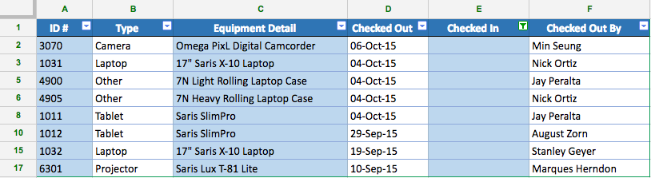

#  Reading: Analyzing/Managing Data, Conditional Formatting

---
# Pre Class Reading Assignment

There will be 2 reading assignment before the next class, with an optional one as well. It will be on Conditional Formatting, Filter and Sorting Data, and Working with Functions being optional.

 [Conditional Formatting](https://blog.coupler.io/conditional-formatting-google-sheets/){:target="_blank"} - Read Whole Document
 
 [Filtering and Sorting Data](https://edu.gcfglobal.org/en/googlespreadsheets/sorting-and-filtering-data/1/){:target="_blank"} - Read until you see "Challenge" **do not do the challenge**
 
 [Working with Functions](https://edu.gcfglobal.org/en/googlespreadsheets/working-with-functions/1/){:target="_blank"} - **Optional**
 

## Things to look out for and think about
- Why do we use conditional formatting?
- How would you use conditional formatting when given a table full of data?
- How do you add a filter to your data set?
- What are at least 3 different ways you can filter your data?
- Why do we want to filter our data?

---

# Pre-Class Quiz Challenge

## Instructions
1. First make a copy of the starter sheet here: [Starter Sheet Pre - Analyzing/Managing Data, Conditional Formatting](https://docs.google.com/spreadsheets/d/1nHMTqHvprWHruS2jWq81fNMTIU7UjirWh8wV3Ddkvtg/edit?usp=sharing){:target="_blank"}
     The challenge comes from the [Filtering and Sorting Data](https://edu.gcfglobal.org/en/googlespreadsheets/sorting-and-filtering-data/1/){:target="_blank"} reading. 
2. Select the **Equipment Log** tab if it is not already open.
3. **Freeze** row 1.
4. **Sort** the spreadsheet by the **Checked Out** date from most recent to the oldest.
     **Hint**: Sort by column D from Z to A.
5. **Sort the range** A2:F9 by column **B** from **A to Z**.
     **Hint**: Make sure the box next to **data has header** row is left unchecked.
6. Filter the spreadsheet so it only shows equipment that has never been checked in.
     **Hint**: Filter column E to show cells that are empty.
7. When you're finished, your spreadsheet should look like this:
   
8. Change the access so anyone with the link can edit. Copy the Link and paste into the pre-class quiz.
   
