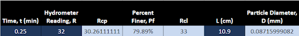
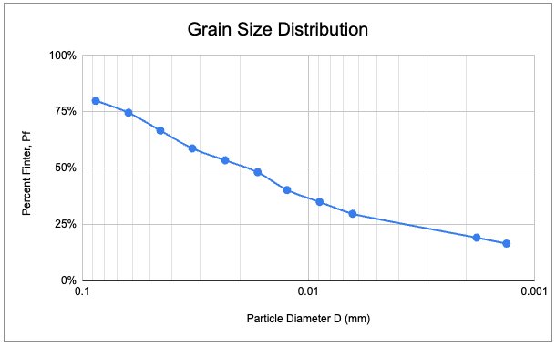
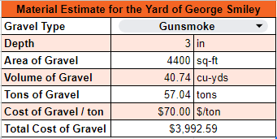

#  HW: Lookups, Match, Data Validation

**Purpose:** Learn how to use lookups, match functions, and data validation when working with tables of data.

## Instructions
1. First make a copy of the starter sheet here:
   [Starter Sheet - HW Lookups, Match, Data Validation](https://docs.google.com/spreadsheets/d/1AVq6HfUD7hCXnJXD6L9dSqogVHGz_7yDUDuqRiZO5n0/edit?usp=sharing){:target="_blank"}
2. Rename it something like “[Your Name] HW 1.2 - Lookups, Match, Data Validation”

---

### Hydrometer Analysis Sheet

#### Part 1
1. Navigate to the Hydrometer Analysis sheet
2. Name the cells in the spreadsheet according to this table:
    
      | Variable                           | Cell | Name |
      |------------------------------------|------|------|
      | Dry weight of soil sample          | E3   | Ws   |
      | Specific gravity                   | E4   | Gs   |
      | Temperature (°F)                   | E5   | Tf   |
      | Temperature (°C)                   | E6   | Tc   |
      | Meniscus correction factor         | E7   | Fm   |
      | Zero correction Factor		           | E8   | Fz   |
      | Temperature correction factor      | E9   | Ft   |
      | Stokes' law coefficient            | E10  | A    |
      | Specific gravity correction factor | E11  | Gc   |

**Hint**: To name a cell, click on the cell, then click on the name box in the top left corner of the screen and type the name you want to give the cell. Press Enter to save the name. You can then reference the cell by its name in formulas.

3. Use the equations below to calculate the following cell values:
    
       | Cell | Equation                                       |
       |------|------------------------------------------------|
       | E6   | $\,^oC = \left(\,^oF - 32\right) \dfrac{5}{9}$ |
       | E9   | $F_t = -4.85 + \dfrac{\,^oC}{4}$               |

4. In cell E10, use the VLOOKUP and MATCH functions to find the correct Stokes’ law coefficient by pulling the 
   temperature (°C) in cell E6 and the specific gravity (Gs) in cell E4 (Use the purple Table of Stokes Law 
   Coefficients in the Tables sheet). 

    **NOTE**: For the temperature key used in VLOOKUP, you should not expect an 
   exact 
   match so you will 
   need 
   to do a range lookup (is_sorted = TRUE). The same is true for the Gs key to the MATCH function, so you will need 
   to again specify a range lookup (search_type = 1). If you want to do an exact match, you can use the ROUND() 
   function to round the temperature and Gs values to the nearest whole number inside the argument list as you pass 
   them as keys to the 
   functions. 

   5. Use the equations below to calculate the following cell values, then fill down the remaining rows in the relevant table:

      **Hint:** You will need to use both absolute and relative cell references to fill down the table correctly  
   
      | Cell | Equation                          |
      |------|-----------------------------------|
      | C15  | $R_{cp} = R + F_T - F_Z$          |
      | D15  | $P_f = \dfrac{AR_{cp}}{W_S}(100)$ |
      | E15  | $R_{cl} = R + F_m$                |
      | G15  | $D = A\sqrt{\dfrac{L}{t}}$        |

6. If you did everything right, the first row should look like this:

 

and the chart should look like this:

---

### Soil Services Sheet

#### Part 2
1. Navigate to the Soil Services sheet
2. In column D, use the VLOOKUP and MATCH functions to find the correct price per test for each row (Use the blue 
   table in the Tables sheet). 
3. In column E, multiply the test quantities and prices per test to get the total price for each row
4. In cell E33, sum the total prices in column E - if you did it correctly, your total should be $15,202

---

### Material Estimator Sheet

#### Part 3
1. Navigate to the Material Estimator sheet
2. In the merged cell B2:C2, create a dropdown menu using data validation that includes the four gravel types in the red table in the Tables sheet
3. Create a Data Validation in B3 and B4 to allow the input of only numbers greater than 0. It should reject any invalid input
4. In cell B5, convert the area of the gravel into volume. You will also need to go from square feet to cubic yards
5. In cell B6, convert the volume to tons by multiplying B5 by 1.4
6. In cell B7, use the VLOOKUP function to find the correct price based on the gravel type that is chosen using the dropdown menu
7. In cell B8, multiply cells B6 and B7 to get your total
8. You can make sure everything is right by checking your answer below:
   
   

## Turning in/Rubric
Turn sharing, editing on. Then turn in the link to learning suite in the feedback box

**Rubric:**

|                        Item                        | Points Possible |
|:--------------------------------------------------:|:---------------:|
| Part 1 - All cells named like the table instructs  |        1        |
|   Part 1 - VLOOKUP and MATCH equation is correct   |        5        |
|      Part 1 - Equations are written correctly      |        2        |
| Part 1 - All table values are calculated correctly |        2        |
|  Part 2 - VLOOKUP and MATCH equations are correct  |        5        |
|       Part 2 - Total price column is correct       |        2        |
|         Part 3 - Dropdown menu is correct          |        2        |
|     Part 3 - B3:B4 data validation is correct      |        2        |
|      Part 3 - Equations are written correctly      |        2        |
|        Part 3 - VLOOKUP equation is correct        |        5        |
|           Part 3 - Total cost is correct           |        2        |
|   
**Total**
   |       30        |
