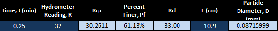
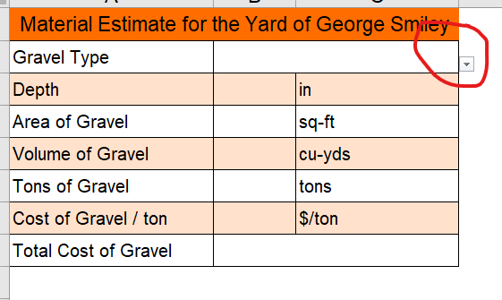
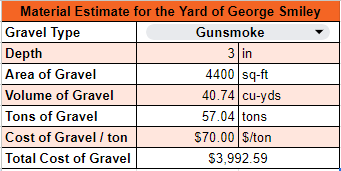
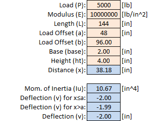
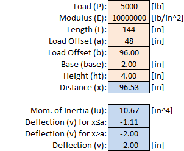

# HW: Lookups, Match, and IF Functions

**Purpose:** This assignment gives you practice using VLOOKUP, MATCH, IF, and IFS in several engineering examples.

---

## Getting Started
1. First make a copy of the starter workbook: [(Starter-Workbook)-HW-Lookups-Match-IF.xlsx](%28Starter-Workbook%29-HW-Lookups-Match-IF.xlsx)

2. Remember to save it in the CCE 270 folder that you created in the first assignment.

For a refresher on relative, absolute, mixed, and named references, see [Cells and Formulas](../../resources/excel_review/basic_excel_review.md).

!!! note "Skills used in this assignment"
    - **Named cells:** Select a cell, enter a name in the Name Box, and press Enter. A name can then be used in a formula instead of the cell reference.
    - **Absolute references:** Use `$` to keep a lookup range fixed when filling a formula. While editing a reference, press `F4` on Windows or `Command+T` on Mac to cycle through reference types.
    - **Unit conversions:** Write the conversion as a formula so the result updates when the input changes.
    - **Fill formulas:** After filling a formula, check that relative references moved and absolute references stayed fixed.
    - **Summary functions:** `AVERAGE(range)` returns the arithmetic mean and `MEDIAN(range)` returns the middle value.

    A reference such as `Tables!$A$4:$H$17` means cells `A4:H17` on the **Tables** worksheet. The `!` separates the worksheet name from the range, and the `$` signs keep the range fixed when a formula is filled. Excel may call this a `table_array`, but it can be an ordinary range rather than a formatted Excel Table.

---

## Part 1 - Hydrometer Analysis Worksheet

1. Navigate to the **Hydrometer Analysis** worksheet.

2. Name the cells in the workbook according to this table:
    
      | Variable                           | Cell | Name |
      |------------------------------------|------|------|
      | Dry weight of soil sample          | E3   | Ws   |
      | Specific gravity                   | E4   | Gs   |
      | Temperature (°F)                   | E5   | Tf   |
      | Temperature (°C)                   | E6   | Tc   |
      | Meniscus correction factor         | E7   | Fm   |
      | Zero correction Factor	            | E8   | Fz   |
      | Temperature correction factor      | E9   | Ft   |
      | Stokes' law coefficient            | E10  | K    |
      | Specific gravity correction factor | E11  | Gc   |

**Hint:** Select the cell. The Name Box, located to the left of the formula bar, displays the active cell reference, such as `E3`. Click the Name Box, type the requested name, and press Enter. You can then use the name in a formula. You can also manage names from **Formulas > Defined Names**.

3. Use the equations below to calculate the following cell values:
    
   | Cell | Equation                                       |
   |------|------------------------------------------------|
   | E6   | $\,^oC = \left(\,^oF - 32\right) \dfrac{5}{9}$ |
   | E9   | $F_t = -4.85 + \dfrac{\,^oC}{4}$               |

4. In `E10`, use VLOOKUP and MATCH to find the Stokes' law coefficient. Use the defined name `StokesLaw`, which refers to `Tables!$A$4:$H$17`, as the VLOOKUP range. Use the named temperature cell `Tc` as `lookup_value`. MATCH the named specific-gravity cell `Gs` against `Tables!$B$3:$H$3` to determine `col_index_num`, then add 1 because `StokesLaw` also includes the temperature column.

!!! note
    The temperature will not usually appear exactly in the coefficient range. Use an approximate VLOOKUP (`range_lookup = TRUE`) so Excel selects the largest listed temperature less than or equal to the calculated temperature. The temperature values must remain sorted in ascending order. Use an exact MATCH (`match_type = 0`) for the specific-gravity heading. Do not round the temperature: rounding selects the nearest whole number, which is a different rule from selecting the lower breakpoint.

5. Enter the equations in the first calculation row, then fill `C15:E15` and `G15` through row 25:
 
   | Cell | Equation                          |
   |------|-----------------------------------|
   | C15  | $R_{cp} = R + F_T - F_Z$          |
   | D15  | $P_f = \dfrac{G_cR_{cp}}{W_S}$       |
   | E15  | $R_{cl} = R + F_m$                |
   | G15  | $D = K\sqrt{\dfrac{L}{t}}$        |

   Column **D** is already formatted as a percentage. In `D15`, enter `=Gc*C15/Ws`; do not multiply by 100. The equivalent cell-reference form is `=$E$11*C15/$E$3`. The names `Gc` and `Ws` make the fixed inputs easier to identify and debug, while the relative reference `C15` changes to the corrected reading on each row when the formula is filled.

6. If you did everything right, the first row should look like this:

 {width=750px}

---

## Part 2 - Soil Services Worksheet

1. Navigate to the **Soil Services** worksheet.

2. In `D2`, use VLOOKUP and MATCH to find the correct price per test. Use the defined name `PricePerTest` as the VLOOKUP range; it refers to `Tables!$J$1:$T$9`. Use an exact VLOOKUP (`range_lookup = FALSE`) for the service name in `B2`. Use an approximate MATCH (`match_type = 1`) for the quantity in `C2` against the sorted headings in `Tables!$K$2:$T$2`. Add 1 to the MATCH result because the VLOOKUP range begins with the service-name column. Quantities of 10 or more use the ten-test price. Fill the formula through `D31`.

3. In `E2`, multiply the quantity in `C2` by the price per test in `D2`. Fill the formula through `E31`.

4. In `E35`, use SUM to total `E2:E31`. If your calculations are correct, the result should be **$16,774.00**.

5. Calculate the average of `E2:E31` in `E33` and the median in `E34`.

6. In `F2`, use IF to compare the total price in `E2` with the average in `E33`. Return "Above Average" when the total is greater than or equal to the average; otherwise, return "Below Average." Fill the formula through `F31` and keep the reference to `E33` fixed.

7. In `G2`, use IF to compare the total price in `E2` with the median in `E34`. Return "Above Median" when the total is greater than the median; otherwise, return "Below Median." Fill the formula through `G31` and keep the reference to `E34` fixed.

!!! tip
    Press `F4` on Windows or `Command+T` on Mac while editing a reference to cycle through relative, absolute, and mixed references. After filling a formula, `Ctrl+Down Arrow` on Windows or `Command+Down Arrow` on Mac can help you jump to the bottom of the data and check the last result.

---

## Part 3 - Material Estimator Worksheet

1. Navigate to the **Material Estimator** worksheet.

2. When you select cell `B2`, an arrow appears on the right side of the cell. Use the preconfigured Data Validation dropdown to choose a gravel type from the lookup range in the **Tables** worksheet. You will learn how to create dropdown lists in a later lesson.

3. Calculate the gravel volume in `B5` from the area in `B4` and depth in `B3`. Convert the depth from inches to feet, calculate cubic feet, and then convert cubic feet to cubic yards.

<b>Unit-conversion hint</b>

Divide the depth by 12 to convert inches to feet. Multiply by the area to obtain cubic feet, then divide by 27 to convert cubic feet to cubic yards.

4. In `B6`, convert the volume to tons by multiplying `B5` by 1.4.

5. In `B7`, use VLOOKUP with an exact match (`range_lookup = FALSE`) to find the price for the gravel type selected in `B2`. Use the defined name `GravelCosts`, which refers to `Tables!$V$1:$W$6`, and return the value from its second column.

6. In `B8`, multiply the tons in `B6` by the unit price in `B7` to calculate the total cost.

7. You can make sure everything is right by checking your answer below:
   

---

## Part 4 - Simply Supported Beam Worksheet

1. Navigate to the **Simply Supported Beam** worksheet.

2. Name the cells in the workbook according to this table:

   | Variable          | Cell | Name |
   |-------------------|------|------|
   | Load              | B4   | P    |
   | Modulus           | B5   | E    |
   | Length            | B6   | L    |
   | Load offset       | B7   | a    |
   | Load offset       | B8   | b    |
   | Base              | B9   | base |
   | Height            | B10  | ht   |
   | Distance          | B11  | x    |
   | Moment of Inertia | B13  | Iu   |
   | Deflection        | B16  | v    |

3. Use the following table to write the equations shown below in the cells indicated. As you write the formulas, use the names you have defined for the input cells.

**Hint:** The most common mistake on these equations is the parentheses, so be careful when writing your equations.

   | Cell      | Equation                                                                          |
   |-----------|-----------------------------------------------------------------------------------|
   | B8        | $b=L-a$                                                                           |
   | B13       | $I_u=\dfrac{1}{12}base*ht^3$                                                      |
   | B14 (x≤a) | $v=\dfrac{Pbx}{6EI_uL}\left(b^2+x^2-L^2\right)$                                   |
   | B15 (x>a) | $v=\dfrac{-Pb}{6EI_uL}\left[\dfrac{L}{b}(x-a)^3+\left(L^2-b^2\right)x-x^3\right]$ |

4. Write an **IF** formula in `B16` that tests whether $x \le a$, which is equivalent to the Excel logical test `B11<=B7`. Return the value in `B14` when the condition is true and the value in `B15` when it is false. Use only distance values in the physical beam domain, $0 \le x \le L$.

If written correctly, the two branches of your formula should look like the examples below.

**For `x = 38.18 in` (`x ≤ a`):**

**For `x = 96.53 in` (`x > a`):**

5. These equations describe a simplified, piecewise cubic deflection curve. Change **x** in cell **B11** to evaluate the beam at different positions. When **x** is **38.18 in**, the deflection should be approximately **-2.00 in**. When **x** is **96.53 in**, the deflection should also be approximately **-2.00 in**. This engineering example is used to practice named cells, formulas, and conditional logic.

---

## Turning in/Rubric

!!! note "Do not put your name or NetID in the file"
    Learning Suite records who submitted each file, so your name is not needed
    inside the file itself. Leaving it out means your work can be graded
    anonymously, which keeps grading fair. This applies to scans and photos
    too — please don't write your name on the page.

**_REMINDER_** - For this class, **you will upload your Excel file directly to Learning Suite**. Make sure the file you upload is for the correct assignment and contains your finished work.

1. Make sure your work is saved, then close the workbook so that all of your changes are written to the file.
2. Go to the assignment in Learning Suite and upload your `.xlsx` file as an attachment.
3. Double-check that the file you uploaded is the one that contains your completed work.

**Rubric:**

|                         Item                         | Points Possible |
|:----------------------------------------------------:|:---------------:|
|  Part 1 - All cells named like the table instructs   |        1        |
| Part 1 - Temperature equations are written correctly |        2        |
|    Part 1 - VLOOKUP and MATCH equation is correct    |        5        |
| Part 1 - Hydrometer equations are written correctly |        2        |
|   Part 2 - VLOOKUP and MATCH equations are correct   |        5        |
|        Part 2 - Total price column is correct        |        2        |
|     Part 2 - IF statements are written correctly     |        2        |
|       Part 3 - Equations are written correctly       |        2        |
|         Part 3 - VLOOKUP equation is correct         |        4        |
|  Part 4 - All cells named like the table instructs   |        1        |
|       Part 4 - Equations are written correctly       |        2        |
|     Part 4 - IF statements are written correctly     |        2        |
|    
**Total**
    |       30        |

---

The following is not a part of the rubric, but specifies how you can lose points. For example: if you fail to upload your file correctly.

| **Reasons for Points Lost** |    **Amount**     |  
|:---------------------------:|:-----------------:|
|  File uploaded incorrectly  |       -10%        |
|  Turned in late (per week)  | -10% (up to -50%) |
