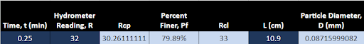
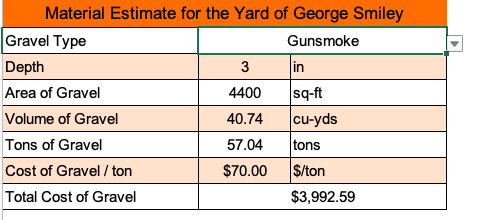

#  HW: Lookups, Match, and IF Functions

**Purpose:** This assignment aims to test your ability to use more complex functions. In this assignment, you will continue to test your knowledge on how to use the Lookups, Match, and IF functions on different engineering problems. 

---

## Getting Started
1. First make a copy of the starter sheet here: [(Starter-Workbook)-HW-Lookups-Match-IF.xlsx](%28Starter-Workbook%29-HW-Lookups-Match-IF.xlsx)

2. Rename it something like "(Your-Name-HW-Lookups-Match-IF"

3. Remember to save it in your OneDrive folder that you created in the first assignment

---

##  Part 1 - Hydrometer Analysis Sheet

1. Navigate to the Hydrometer Analysis sheet

2. Name the cells in the spreadsheet according to this table:
    
      | Variable                           | Cell | Name |
      |------------------------------------|------|------|
      | Dry weight of soil sample          | E3   | Ws   |
      | Specific gravity                   | E4   | Gs   |
      | Temperature (°F)                   | E5   | Tf   |
      | Temperature (°C)                   | E6   | Tc   |
      | Meniscus correction factor         | E7   | Fm   |
      | Zero correction Factor	            | E8   | Fz   |
      | Temperature correction factor      | E9   | Ft   |
      | Stokes' law coefficient            | E10  | K    |
      | Specific gravity correction factor | E11  | Gc   |

**Hint**: To name a cell, click on the cell, then click on the name box in the top left corner of the screen, it should have the cell reference list. Type the name you want to give the cell. Press Enter to save the name. You can then reference the cell by its name in formulas. You can also go the Formulas tab, under the "Defined Names" group, you can manage names, create new names, or edit existing ones.

3. Use the equations below to calculate the following cell values:
    
   | Cell | Equation                                       |
   |------|------------------------------------------------|
   | E6   | $\,^oC = \left(\,^oF - 32\right) \dfrac{5}{9}$ |
   | E9   | $F_t = -4.85 + \dfrac{\,^oC}{4}$               |

4. In cell E10, use the VLOOKUP and MATCH functions to find the correct Stokes’ law coefficient by pulling the 
   temperature (°C) in cell E6 and the specific gravity (Gs) in cell E4 (Use the purple Table of Stokes Law 
   Coefficients in the Tables sheet). 

!!!Note
      For the temperature key used in VLOOKUP, you should not expect an exact match so you will need to do a range lookup (is_sorted = TRUE). If you want to do an exact match, you can use the ROUND() function to round the temperature to the nearest whole number inside the argument list as you pass them as keys to the functions. 

5. Use the equations below to calculate the following cell values, then fill down the remaining rows in the relevant table:
 
   | Cell | Equation                          |
   |------|-----------------------------------|
   | C15  | $R_{cp} = R + F_T - F_Z$          |
   | D15  | $P_f = \dfrac{KR_{cp}}{W_S}(100)$ |
   | E15  | $R_{cl} = R + F_m$                |
   | G15  | $D = K\sqrt{\dfrac{L}{t}}$        |

6. If you did everything right, the first row should look like this:

 {width=750px}

---

## Part 2 - Soil Services Sheet

1. Navigate to the Soil Services sheet

2. In column D, use the VLOOKUP and MATCH functions to find the correct price per test for each row (Use the blue 
   table in the Tables sheet)

3. In column E, multiply the test quantities and prices per test to get the total price for each row

4. In cell E35, sum the total prices in column E - if you did it correctly, your total should be $16,774.00

5. Use the Median and Average functions to find the median and average of the total prices in column E. Place the median in cell E34 and the average in cell E33

6. In column F, use the IF function to determine if the total price in column E is above or below the average price in cell E33. If it is above or equal to, return "Above Average", if it is below, return "Below Average"

7. In column G, use the IF function to determine if the total price in column E is above or below the median price 
   in cell E34. If it is above, return "Above Median", if it is equal to or below, return "Below Median"

---

## Part 3 - Material Estimator Sheet

1. Navigate to the Material Estimator sheet

2. When you click on cell B2, you will see a little arrow on the right side of the cell. Click on it to see a dropdown menu that allows you to choose between the different types of gravel found on the table in the Tables sheet. This is from a data validation. You will learn how to make these next class.

3. In cell B5, convert the area of the gravel into volume. You will also need to go from square feet to cubic yards

4. In cell B6, convert the volume to tons by multiplying B5 by 1.4

5. In cell B7, use the VLOOKUP function to find the correct price based on the gravel type that is chosen using the dropdown menu

6. In cell B8, multiply cells B6 and B7 to get your total

7. You can make sure everything is right by checking your answer below:
   

---

## Part 4 - Simple Supported Beam Sheet

1. Navigate to the **Simply Supported Beam** sheet

2. Name the cells in the spreadsheet according to this table:

   | Variable          | Cell | Name |
   |-------------------|------|------|
   | Load              | B4   | P    |
   | Modulus           | B5   | E    |
   | Length            | B6   | L    |
   | Load offset       | B7   | a    |
   | Load offset       | B8   | b    |
   | Base              | B9   | base |
   | Height            | B10  | ht   |
   | Distance          | B11  | x    |
   | Moment of Inertia | B13  | Iu   |
   | Deflection        | B16  | v    |

3. Use the following table to write the equations shown below in the cells indicated. As you write the formulas, use the names you have defined for the input cells.

**Hint:** The most common mistake on these equations is the parentheses, so be careful when writing your equations.

   | Cell      | Equation                                                                          |
   |-----------|-----------------------------------------------------------------------------------|
   | B8        | $b=L-a$                                                                           |
   | B13       | $I_u=\dfrac{1}{12}base*ht^3$                                                      |
   | B14 (x≤a) | $v=\dfrac{Pbx}{6EI_uL}\left(b^2+x^2-L^2\right)$                                   |
   | B15 (x>a) | $v=\dfrac{-Pb}{6EI_uL}\left[\dfrac{L}{b}(x-a)^3+\left(L^2-b^2\right)x-x^3\right]$ |

4. Next, write an **IF** statement in cell **B16** that will return the value in cell **B14** if ***x≤a*** (B7) or cell **B15** if ***x>a*** (B7).

If written correctly, your sheet should look like this when **x** is set to **278** and **15**:

5. The force of the load on the beam causes the deflection to take the shape of a parabola as shown in the diagram. If you change the value of **x** in cell **B11**, the deflection will change accordingly. If you correctly wrote the equations, when **x** is set to **38.18**, the deflection should be **-2** and when **x** is set to **96.53**, the deflection should be **-2**.

---

## Turning in/Rubric

**_REMINDER_** - For this class, **you will only turn in the links to your Excel files**. You will get a 0 for this assignment if you turn in an Excel file or a link that is not shareable. 

1. On the top right, click the share button --> share --> settings
2. Click "anyone" at the top, then underneath "More settings", change "can view" to "can edit". Then click apply. 
3. Copy the link, then turn it into Learning Suite in the feedback box for that assignment.

**Rubric:**

|                         Item                         | Points Possible |
|:----------------------------------------------------:|:---------------:|
|  Part 1 - All cells named like the table instructs   |        1        |
| Part 1 - Temperature equations are written correctly |        2        |
|    Part 1 - VLOOKUP and MATCH equation is correct    |        5        |
|    Part 1 - Table equations are written correctly    |        2        |
|   Part 2 - VLOOKUP and MATCH equations are correct   |        5        |
|        Part 2 - Total price column is correct        |        2        |
|     Part 2 - IF statements are written correctly     |        2        |
|       Part 3 - Equations are written correctly       |        2        |
|         Part 3 - VLOOKUP equation is correct         |        4        |
|  Part 4 - All cells named like the table instructs   |        1        |
|       Part 4 - Equations are written correctly       |        2        |
|     Part 4 - IF statements are written correctly     |        2        |
|    
**Total**
    |       30        |

---

The following is not a part of the rubric, but specifies how you can lose points. For example: if you fail to share your link correctly.

| **Reasons for Points Lost** |    **Amount**     |  
|:---------------------------:|:-----------------:|
|   Link shared incorrectly   |       -10%        |
|  Turned in late (per week)  | -10% (up to -50%) |