# Reading: Lookups, Match, and IF Functions

---

Excel has many powerful functions that can automate calculations and data analysis. In this reading, we will focus on VLOOKUP, MATCH, IF, and IFS. We will also introduce HLOOKUP for awareness.

Later in the course, you will use Goal Seek to determine the input required to produce a specified result. For now, concentrate on lookup and logical functions.

### Useful Shortcuts

| Task | Windows | Mac |
|---|---|---|
| Cycle through relative, absolute, and mixed references while editing a formula | `F4` | `Command+T` or `F4` |
| Jump to the edge of the current data region | `Ctrl+Arrow` | `Command+Arrow` |

The `F4` shortcut is especially useful for locking lookup ranges before filling a formula down a column.

---

## VLOOKUP/HLOOKUP Functions

The VLOOKUP and HLOOKUP functions are used to find values in a lookup range. VLOOKUP searches down the first column, while HLOOKUP searches across the first row. These functions are particularly useful when you have a large dataset and need to find specific information quickly.

The syntax for the VLOOKUP function is as follows:

    VLOOKUP(lookup_value, table_array, col_index_num, [range_lookup])

where:

| Parameter      | Explanation                                                                                                                 |
|----------------|-----------------------------------------------------------------------------------------------------------------------------|
| lookup_value   | The value to be found in the first column of the lookup range.                                                              |
| table_array    | The range containing the lookup information. Use a cell reference or a defined name.                                       |
| col_index_num  | The column number within `table_array` from which the matching value must be returned.                                     |
| [range_lookup] | A logical value (`TRUE` or `FALSE`) that specifies whether you want VLOOKUP to find an exact match or an approximate match. |  

The HLOOKUP syntax is similar:

    HLOOKUP(lookup_value, table_array, row_index_num, [range_lookup])

HLOOKUP searches for the lookup value in the first row and returns a value from the specified row. We will not practice HLOOKUP in this lesson, but you should recognize what it does and how it differs from VLOOKUP.

### Example of VLOOKUP
The following workbook computes the volume and weight of a set of cylinders. The weight is computed from the volume and the unit weight. However, the unit weight depends on the material being used. Unit weights for a set of common materials are shown in a lookup range at the top:

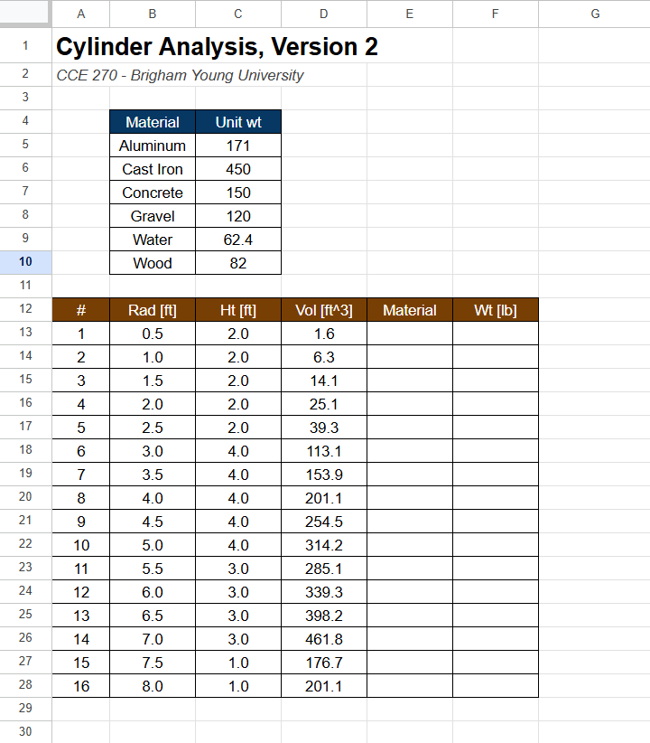

The objective of this example is to determine the appropriate unit weight for each cylinder and calculate the correct weight by multiplying the selected unit weight by the computed volume. We will do this by automatically selecting the correct unit weight from the list using the VLOOKUP function.

For our case, we will use VLOOKUP to select a unit weight value from the lookup range using the user-specified material. The unit weight returned by the function is then multiplied by the volume to compute the cylinder weight as follows:

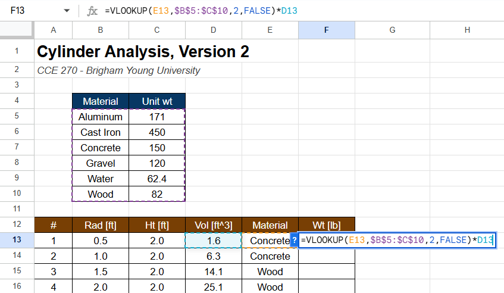

The first argument (`E13`) refers to the Material value on the same row and is a relative reference. The second argument (`$B$5:$C$10`) is an absolute reference to the lookup range. The `lookup_value` ("Concrete" in this case) is used to search the first column of that range. The match is found on its third row, worksheet cell `B7`. The third argument (`2`) tells VLOOKUP to return a value from the second column of the lookup range. The returned value, 150, is multiplied by the volume, 1.6, to compute the weight. The final argument should be `FALSE` because the material name requires an exact match. After filling this formula down the column, the weight values are computed as follows:

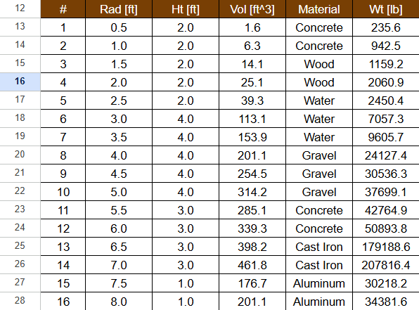

If values in the lookup range are edited, all the weights update automatically.

### The `range_lookup` Argument
In the example shown in the previous section, we are doing an exact match on the lookup value in the first column. In some cases we are not looking for an exact match, but we need to find a match from a set of numerical ranges. For example, suppose that we wanted to categorize the cylinder weights using the following guidelines:

|         Range         |  Category   |
|:---------------------:|:-----------:|
|    0 ≤ wt < 1,000     | Ultra Light |
| 1,000 ≤ wt < 2,000    |    Light    |
| 2,000 ≤ wt < 10,000   |   Medium    |
| 10,000 ≤ wt < 100,000 |    Heavy    |
|     wt ≥ 100,000      | Extra Heavy |

We will then add a new lookup range and an extra column as follows:

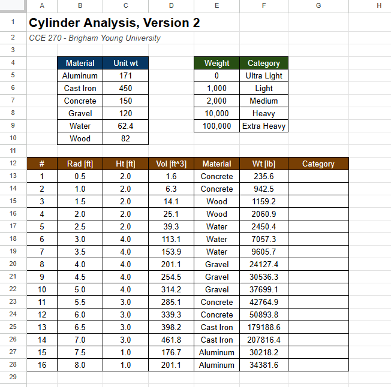

Note that the lower-bound values in the first column of the weight-category lookup range are sorted in ascending order. This is required for an approximate lookup. Next, we enter a formula using VLOOKUP as follows:

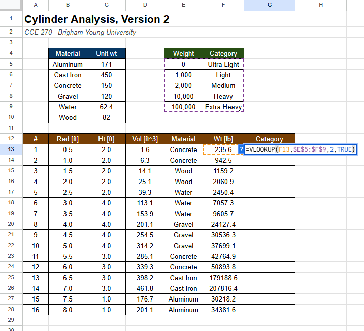

Notice that the last argument, `range_lookup`, is `TRUE`. Excel takes the `lookup_value` (235.6 in this case) and searches the first column of the lookup range for the largest lower-bound value that is less than or equal to it. In this case, the match occurs on the first row, so the value returned from column 2 is "Ultra Light." After filling the formula down the Category column, the resulting values are as follows:

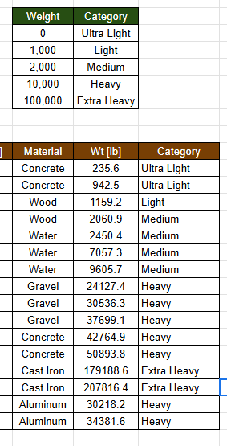

The `range_lookup` argument is optional. If it is omitted, Excel assumes `TRUE`. Omitting it when an exact match is intended can return an incorrect value. Always enter `TRUE` for an approximate lookup or `FALSE` for an exact lookup.

Here is an extra resource for further information on VLOOKUP: [VLOOKUP](https://support.microsoft.com/en-us/office/vlookup-function-0bbc8083-26fe-4963-8ab8-93a18ad188a1){:target="_blank"}

---

## MATCH Function

The MATCH function returns the position of an item in a range of cells. It is often used with VLOOKUP to find the index of a value in a row or column. MATCH can perform exact or approximate matches, depending on the `match_type` specified.

Let's first look at the syntax of the function.

    MATCH(lookup_value, lookup_array, [match_type])

where:

| Parameter    | Explanation                                                                                      |
|--------------|--------------------------------------------------------------------------------------------------|
| lookup_value | The value to be found in the range of cells.                                                     |
| lookup_array | The row or column containing the values to search. Use a cell reference or a defined name.       |
| [match_type] | An optional parameter that specifies how Excel matches `lookup_value` in `lookup_array`.         |

The `match_type` has three options, as shown below. If it is omitted, Excel uses **1**. This performs an approximate match on values sorted in ascending order and returns the position of the largest value less than or equal to `lookup_value`. A value of **-1** requires descending order and returns the position of the smallest value greater than or equal to `lookup_value`. A value of **0** requires an exact match.

| Match Type |        Explanation        |
|:-----------:|:-------------------------:|
|      1      | Ascending Order (default) |
|      0      |        Exact Match        |
|     -1      |     Descending Order      |

When paired with VLOOKUP, MATCH allows you to perform a two-dimensional lookup in a range containing both rows and columns. For example, consider the following worksheet containing average monthly temperatures in degrees Fahrenheit by elevation.

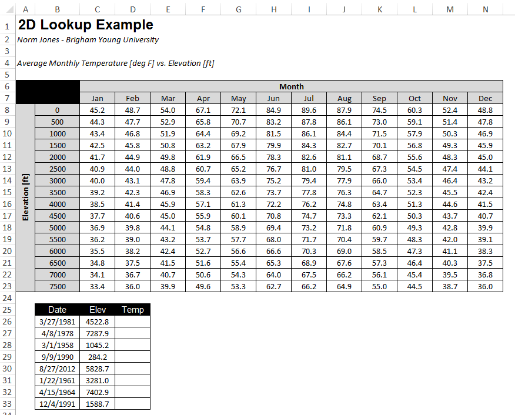

Starting at row 24, another range is listed and the objective is to fill in the **Temp** column with a formula that
looks up the temperature corresponding to the elevation from column **C** and the month associated with the date
provided in column **B**. This requires a double lookup. We use VLOOKUP to find the row we need based on a range lookup of elevation using the VLOOKUP function. Then, for the third argument to VLOOKUP, we need to determine which column to use based on the month desired. To find the right column based on the month, we first need to find the month label ("Jan", "Feb", etc.) from a date value. This can be accomplished using the **[TEXT](https://support.microsoft.com/en-us/office/text-function-20d5ac4d-7b94-49fd-bb38-93d29371225c){:target="_blank"}** function which takes a date as an argument and returns the month or day value depending on the format specified by the second argument as follows:

    TEXT(B28,"MMM")

For the values shown, the function would return "**Mar**". Then we need to use this text string to automatically find the index of the column corresponding to this month. This can be done with the MATCH function as follows:

    MATCH(TEXT(B28,"MMM"),$B$7:$N$7,0)

The first argument is the lookup value, the second is the row or column to search, and the third specifies the match type. A value of **0** requires an exact match. For the arguments shown, MATCH returns **4** because the selected range begins in column B and the March heading is its fourth item. That result is the correct VLOOKUP column index. We can now complete the VLOOKUP formula:

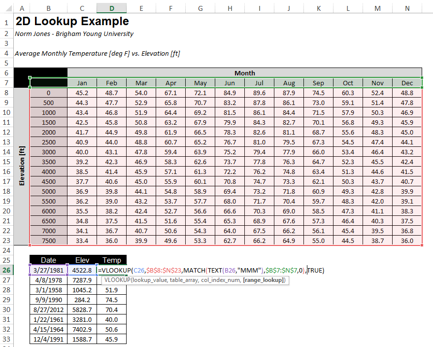

Note that we are using a range lookup on elevation so the last argument to VLOOKUP is **TRUE**.

Here is an extra resource for further information on Match: [MATCH](https://support.microsoft.com/en-us/office/match-function-e8dffd45-c762-47d6-bf89-533f4a37673a){:target="_blank"}

---

## IF/IFS Functions

### IF Statements

The **IF function** evaluates a logical condition and returns one value when the condition is `TRUE` and another value when it is `FALSE`. A logical condition evaluates to a Boolean value: `TRUE` or `FALSE`.

#### Syntax

The syntax for an IF statement is as follows:

    =IF(logical_expression, value_if_true, value_if_false)

An IF statement has three arguments:

- **logical_expression**: This is what is known as the conditional statement. This function can compare whether a number is greater than (**>**), less than (**<**), or if a number or text is equal to (**=**) in the given condition
- **value_if_true**: This is a placeholder for what will be returned if the given condition is found to be true.
- **value_if_false**: This is a placeholder for what will be returned if the given condition is found to be false.

#### Example Problem - IF Statement

Let's look at a simple example of an IF statement using strings. Here are a few fictional locations that have different types of material their driveways are made out of. Using an IF statement, we can quickly differentiate for specifically a concrete driveway.

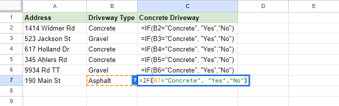

We can write a single statement in cell C2, drag it down, and watch it populate with either a "Yes" or a "No" depending on the conditional statement we gave the function.

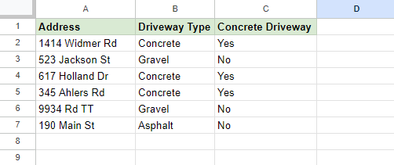

One more example is using a number. Using the length of a driveway, we can find which of the driveways are longer than the given distance of 75 ft.

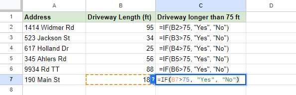

Again, we can quickly populate the rest of the range by dragging the fill handle down.

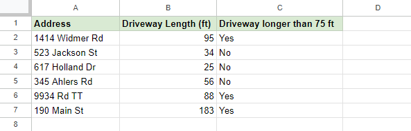

---

### IFS Statements

The **IFS function** tests multiple logical conditions in order. It is useful for assigning categories when more than two outcomes are possible.

#### Syntax

The syntax for an IFS statement is as follows:

    =IFS(logical_test1, value_if_true1, [logical_test2, value_if_true2], ...)

IFS requires at least one logical-test/value pair. Additional pairs can be added as needed.

**Note:** More than one condition can be true, so IFS returns the value associated with the first condition that evaluates to `TRUE`. Order the conditions carefully. A final condition of `TRUE` can provide a default result.

#### Example Problem - IFS Statement

Using the same data as the IF example, we will categorize the driveway lengths into three tiers: short, medium, and long.

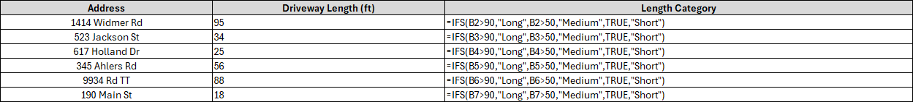

**Note:** The final condition is `TRUE`, which acts as the default. Any length that is not greater than 90 or greater than 50 is categorized as "Short," including a length of exactly 50 ft.

Dragging them down, we can see the final result. Now each driveway is nicely categorized by its length.

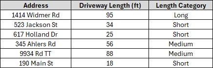

#### Nested IF Compared with IFS

Several outcomes can also be handled by placing one IF function inside another. For example, both formulas below assign the same letter grade.

Nested IF:

    =IF(E2>=90,"A",IF(E2>=80,"B",IF(E2>=70,"C",IF(E2>=60,"D","F"))))

IFS:

    =IFS(E2>=90,"A",E2>=80,"B",E2>=70,"C",E2>=60,"D",TRUE,"F")

The nested IF formula works, but IFS is often easier to read and revise when there are many outcomes. In both formulas, the conditions are ordered from the highest grade threshold to the lowest.

---

## Pre-Class Quiz Challenge

1. First download the starter workbook: [(Starter-Workbook)-Pre-Lookups-Match-IF.xlsx](%28Starter-Workbook%29-Pre-Lookups-Match-IF.xlsx)
     Be sure to make a copy of the workbook.

2. The workbook contains two worksheets: **LOOKUP-MATCH** for practicing VLOOKUP and MATCH, and **IF-IFS** for practicing IF and IFS. Take a minute to review the contents of the LOOKUP-MATCH worksheet.

VLOOKUP and MATCH can be difficult at first, especially when one function is nested inside another. We will first practice each function separately and then combine them.

3. In column E, use MATCH with an exact match (`match_type = 0`) to find the position of the service type listed in column D within the header row of the lookup range in cells K1:N8. If written correctly, MATCH will return 2, 3, or 4. We will use this number in the next step. Hint: The entire lookup range is not used for this step.

4. In column F, use VLOOKUP with an exact match (`range_lookup = FALSE`) to find the cost of the service listed in column B from the lookup range in cells K1:N8. For `col_index_num`, use the value returned by MATCH in column E.

5. In column G, you will multiply the values in columns C and F to get the total cost for each service

6. In column I, try combining everything you wrote in columns E, F, and G into one formula. The formula should return the total cost for each service based on the service type, quantity, and cost per service

Look below for a solution to see if you did it correctly and for some hints. (Click on the **bold** words to see the hints)

<b>Solution</b>

For any customer with the Service: "Sidewalk Replacement", Quantity: "10", and Type: "Full", the cost should be $1,890. You can test this by overwriting the formulas that are randomly generated in the "Service" and "Type" columns with these values.

<b>Hint 1: Function Syntax</b>

Column B - `lookup_value` for VLOOKUP
Column C - Quantity used to calculate the total
Column D - `lookup_value` for MATCH

<b>Hint 2: N/A Errors</b>

If you are getting several `#N/A` errors, check the `range_lookup` argument in VLOOKUP and the `match_type` argument in MATCH. Review the reading if needed.

<b>Hint 3: N/A Errors Part 2</b>

  
Use `FALSE` for `range_lookup` and `0` for `match_type`.

 

Next, look at the **IF-IFS** worksheet. It is a simple grade book for a class. You will use IF and IFS to assign points, pass/fail status, and letter grades to students.

7. Go to column D ("Points") and use RANDBETWEEN to give points to students randomly. Points should be between 0 and 100. RANDBETWEEN generates new values whenever the workbook recalculates. To make the values static, select the generated cells, copy them, and use Paste Special > Values. This replaces the formulas with their current values. If you need help, look at the solution below.

8. In column E, write a simple IF formula in the Pass/Fail column. Return "Pass" for a score greater than or equal to 60 and "Fail" for a score below 60.

9. In column F, use either a nested IF formula or an IFS formula to assign a letter grade based on the following thresholds. The IFS version is usually easier to read.

| Grading Scale | Letter Grade |
|:-------------:|:------------:|
|   90 - 100    |      A       |
|    80 - 89    |      B       |
|    70 - 79    |      C       |
|    60 - 69    |      D       |
|     < 60      |      F       |

Look below for a solution to see if you did it correctly and for some hints. (Click on the **bold** words to see the hints)

<b>RANDBETWEEN Function</b>

  
=RANDBETWEEN(0,100)

---

## Turning in/Rubric

**_REMINDER_** - For this class, **you will upload your Excel file directly to Learning Suite**. Make sure the file you upload is for the correct assignment and contains your finished work.

1. Make sure your work is saved, then close the workbook so that all of your changes are written to the file.
2. Go to the assignment in Learning Suite and upload your `.xlsx` file as an attachment.
3. Double-check that the file you uploaded is the one that contains your completed work.

**Rubric:**

|                      Item                      | Points Possible |
|:----------------------------------------------:|:---------------:|
| 
**Total**
 |        3        |

---

The following is not a part of the rubric, but specifies how you can lose points. For example: if you fail to upload your file correctly.

| **Reasons for Points Lost** |    **Amount**     |  
|:---------------------------:|:-----------------:|
|  File uploaded incorrectly  |       -10%        |
