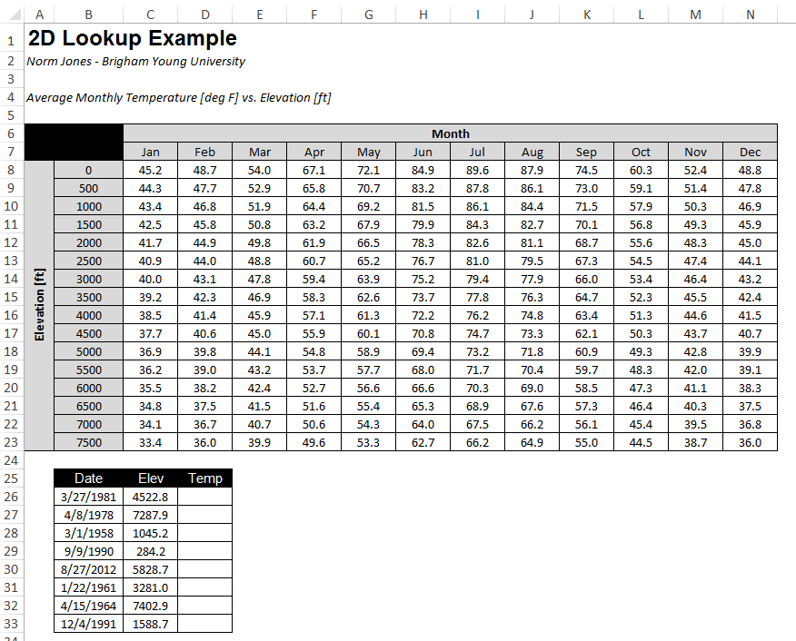
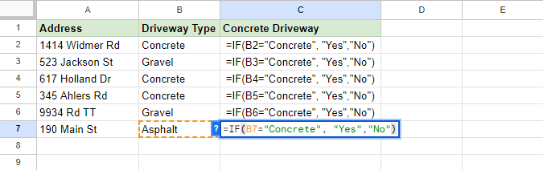

#  Reading: Lookups, Match, and IF Functions

---

Excel has  there are many ways to analyze and display data. For this topic, you will focus on Conditional Formatting, Filtering Data, and working with Functions. These are all important tools to know when working with data in Excel. They will help you to better understand your data and make it easier to read and analyze. In this reading, you will go over what each of these tools are and how to use them.

Before class, you will learn about a few types of IF Statements: IF and IFS. You will also learn about Goal Seek.

#### Things to look out for and think about!
- Look for the differences in the function syntax between the VLOOKUP and MATCH.
- Think about how using Data Validations can help minimize errors in your formulas
- Watch for white space (e.g., spaces) either before or after your match text, it can cause problems

---

## VLOOKUP/HLOOKUP Functions

### Indexing a List with VLOOKUP
When writing formulas, we often encounter cases where one or more of the inputs to the function will depend on the value of another input. More specifically, we need to use one of the inputs to lookup the other input from a table. This can be easily accomplished using the VLOOKUP function. 

For example, the following workbook computes the volume and weight of a set of cylinders. The weight is computed from the volume and the unit weight. However, the unit weight depends on the material being used. Unit weights for a set of common materials are shown in a table at the top:


The objective of this example is to determine the appropriate unit weight for each cylinder and calculate the correct weight by multiplying the selected unit weight by the computed volume. We will do this by automatically selecting the correct unit weight from the list using the VLOOKUP function.

### VLOOKUP Function
Once the material values are entered in column E, we are ready to use the VLOOKUP function. The syntax for the VLOOKUP function is as follows:

    VLOOKUP(search_key, range, index, [is_sorted])

where:

| Parameter   | Explanation                                                                                                                 |
|-------------|-----------------------------------------------------------------------------------------------------------------------------|
| search_key  | The value to be found in the first column of the array.                                                                     |
| range       | The table of information in which data is looked up. Use a reference to a range or a range name.                            |
| index       | The column number in the table defined by `range` from which the matching value must be returned.                             |
| [Is_sorted] | A logical value (`TRUE` or `FALSE`) that specifies whether you want VLOOKUP to find an exact match or an approximate match. |

For our case, we will use VLOOKUP to select a unit weight value from the table using the user-specified material. The unit weight returned by the function is then multiplied by the volume to compute the cylinder weight as follows:


The first argument (E13) to the VLOOKUP function refers to the Material value on the same row and is a relative 
reference. The second argument (\$B\$5:\$C\$10) is an absolute reference to the table use for the lookup. The 
search_key ("Concrete" in this case) is used to search through the first column in the table to find the row 
matching the search_key. In this case, the match is found on the third row of the table (cell B7). The third 
argument (2) tells the VLOOKUP function from which column of the table the return value should be selected. Since the value is 2, we go to the second column of the lookup table on the selected row and find our value (150). This is the value that is returned by the function and multiplied by the volume (1.6) to compute the weight. After copying this formula to the rest of the column, the weight values are all correctly computed as follows:


If the  values in the lookup table are edited, all of the weights would be automatically updated.

### Is_Sorted Parameter
In the example shown in the previous section, we are doing an exact match on the lookup value in the first column. In some cases we are not looking for an exact match, but we need to find a match from a set of numerical ranges. For example, suppose that we wanted to categorize the cylinder weights using the following guidelines:

|         Range         |  Category   |
|:---------------------:|:-----------:|
|       wt ≤ 1000       | Ultra Light |
|   1000 ≤ wt ≤ 2000    |    Light    |
|  2000 ≤ wt ≤ 10,000   |   Medium    |
| 10,000 ≤ wt ≤ 100,000 |    Heavy    |
|     100,000 ≤ wt      | Extra Heavy |

We will then add a new table and an extra column as follows:


Note that the weight values in the first column of the weight-category table at the top right has been sorted in ascending order. This is critical in order for the lookup to work. Next, we enter a formula using the VLOOKUP function as follows:


Notice that the last argument (is_sorted) has a value of TRUE. This means that we take the search_key (235.6 in this case) and we look through the first column of the table until we find a row where the value on the row is less than or equal to the search_key and the value on the next row is greater than the search_key. In this case, the match occurs on the first row and so the resulting value from column 2 is "Ultra Light". After copying the formula to the rest of the Category column, the resulting values are as follows:


It is important to note that the is_sorted argument to the VLOOKUP function is optional. If it is omitted, it is assumed to be TRUE by default. A common error with the VLOOKUP function is to omit this argument when the VLOOKUP function is intended to be used as an exact match. This can lead to unintended errors, depending on how the values in the first column are ordered. Therefore, it is strongly recommended to always enter a TRUE or FALSE value for the is_sorted argument every time the VLOOKUP function is used.

Here is an extra resource for further information on Vlookup: [VLOOKUP](https://www.benlcollins.com/spreadsheets/vlookup-function/){:target="_blank"}


---

## MATCH Function

The MATCH function returns the position of an item in a range of cells. Let's first look at the syntax of the function.

    MATCH(search_key, range, [search_type])

where:

| Parameter   | Explanation                                                                                       |
|-------------|---------------------------------------------------------------------------------------------------|
| search_key  | The value to be found in the range of cells.                                                      |
| range       | The table of information in which data is looked up. Use a reference to a range or a range name.  |
| search_type | An optional parameter that directs the function on how to find the `search_key` in the `range`.   |

The search_type has three different options for an input as shown in the table below. If nothing is input for this parameter, the default value will be **1** which indicates that the values are sorted in ascending order. It will perform a range lookup and return the largest value less than or equal to the search_key. The second value is **-1** and works opposite to 1. It indicates that the values are sorted in descending order and perform a range lookup and return the smallest value greater than or equal to the search_key. The last acceptable input is **0**. This option directs the function to search for an exact match to the search_key.  

| Search Type |        Explanation        |
|:-----------:|:-------------------------:|
|      1      | Ascending Order (default) |
|      0      |        Exact Match        |
|     -1      |     Descending Order      |

MATCH is a great function to pair with the VLOOKUP function. Occasionally it is useful to do a two-dimensional lookup where a value is found from a table containing both rows and columns. For example, consider the following sheet containing a table of temperatures in degree F illustrating a relationship between average monthly temp and elevation in ft for a particular location.



Starting at row 24, another table is listed and the objective is to fill in the **Temp** column with a formula that looks up the temperature corresponding to the elevation from column **C** and the month associated with the date provided in column **B**. This requires a double lookup. We use VLOOKUP to find the row we need based on a range lookup of elevation using the VLOOKUP function. Then, for the third argument to VLOOKUP, we need to determine which column to use based on the month desired. To find the right column based on the month, we first need to find the month label ("Jan", "Feb", etc.) from a date value. This can be accomplished using the **TEXT** function which takes a date as an argument and returns the month or day value depending on the format specified by the second argument as follows:

    TEXT(B28,"MMM")

For the values shown, the function would return "**Mar**". Then we need to use this text string to automatically find the index of the column corresponding to this month. This can be done with the MATCH function as follows:

    MATCH(TEXT(B28,"MMM"),$B$7:$N$7,0)

The first argument to the MATCH function is the lookup value, the second argument is an array (row or column of values) and the third argument indicates the type of match to perform (a value of **0** tells it to find an exact match). The function looks through the array to find the lookup value and returns the index of the item if found. For the arguments shown, the function would return a value of **3**. At this point, we are ready to use the VLOOKUP function. We would formulate the function call as follows:


Note that we are using a range lookup on elevation so the last argument to VLOOKUP is **TRUE**.

Here is an extra resource for further information on Match: [MATCH](https://blog.sheetgo.com/google-sheets-formulas/match-formula-google-sheets/){:target="_blank"}


---

## IF/IFS Functions

### IF Statements

**IF Statements** are a function within Google Sheets that can compare two values and determine if they are true or false. This type of two-outcome expression in programming is known as a boolean.

#### Syntax

The syntax for an IF statement is as follows:

    =IF(logical_expression, value_if_true, value_if_false)

An IF statement has three arguments:

- **logical_expression**: This is what is known as the conditional statement. This function can compare whether a number is greater than (**>**), less than (**<**), or if a number or text is equal to (**=**) in the given condition
- **value_if_true**: This is a placeholder for what will be returned if the given condition is found to be true.
- **value_if_false**: This is a placeholder for what will be returned if the given condition is found to be false.

#### Example Problem - IF Statement

Let's look at a simple example of an IF statement using strings. Here are a few fictional locations that have different types of material their driveways are made out of. Using an IF statement, we can quickly differentiate for specifically a concrete driveway.



We can write a single statement in cell C2, drag it down, and watch it populate with either a "Yes" or a "No" depending on the conditional statement we gave the function.


One more example is using a number. Using the length of a driveway, we can find which of the driveways are longer than the given distance of 75 ft.


Again, we can see that we can quickly populate the rest of the table by dragging the corner of the cell down.


---

### IFS Statements

**IFS Statements** are an even more powerful version of an IF statement that can allow for multiple conditional statements to take place within one function. This type of function allows for easy categorization by testing a given number or string against one found in a table

#### Syntax

The syntax for an IFS statement is as follows:

    =IFS(logical_expression1, value_if_true1, [logical_expression2, value_if_true2], [logical_expression3, ...)

An IFS statement only technically requires two arguments, both of which are nearly the same as the IF statement. However, there can be any number of logical expressions within one IFS statement.

**Note**: More than one condition can be true so the function will always return the value for the first condition that is found true.

#### Example Problem - IFS Statement

Using the same premise as the IF statement, we can utilize the table we used before. This time around, we will categorize the different lengths of driveways into three tiers: short, medium, and long.


**Note**: The third condition ```<=50``` includes ```=``` so that 50 is included in "less than or **equal** to 50

Dragging them down, we can see the final result. Now each driveway is nicely categorized by its length.


---

## Pre-Class Quiz Challenge

1. First make a copy of the starter sheet here: [Starter Sheet Pre - Lookups, Match, Data Validation](https://docs.google.com/spreadsheets/d/1uMdVl5TzfQAnsSvh1fv3kuw2ci_jPpJNpaVRDbW3EH8/edit?usp=sharing){:target="_blank"}
2. Using Data Validations, add dropdowns in cells B2 to B25 for all the different types of services. (Tree Removal, 
   Sidewalk Replacement, Siding Replacement, Gutter Cleaning, Gutter Replacement, Grass Removal, and Grass 
   Replacement). Use the **Dropdown (from a range)** option to reference the first column in the table on the right.
3. Now add dropdowns in cells D2 to D25 for the level of each service can receive (Full, Partial, and Finishing)
4. In cells E2 to E25 use the Vlookup and Match functions to correctly give a quote for the service and type that 
   the customer would like multiplied by the quantity. You will use the VLOOKUP function to find a price from the 
   service table based on the service selected in column B, and you will use the MATCH function to find the correct 
   column in the service table from which to find a price, based on the type selected in column D.

Look below for a solution to see if you did it correctly and for some hints. (Click on the **bold** words to see the hints)

<details>
<summary><b>Solution</b></summary>

For any customer with the Service: "Sidewalk Replacement", Quantity: "10", and Type: "Full", the cost should be $1,890.

</details>


<details>
<summary><b>Hint 1: Function Syntax</b></summary>

Column B - Search Key
Column C - Multiply the total of your VLOOKUP and Match Function at the end
Column D - Search Key for the Index or MATCH Function

</details>


<details>
<summary><b>Hint 2: N/A Errors</b></summary>

If you are getting a lot of N/As maybe your is_sorted on your Vlookup is not correct or your search type for match is incorrect. Look over the pre-class readings for help

</details>


<details>
<summary><b>Hint 3: N/A Errors Part 2</b></summary>
  
Make the is_sorted false and the search type 0

</details>
<br>

---

## Turning in/Rubric

**_REMINDER_** - For this class, **you will only turn in the links to your Excel files**. You will get a 0 for this assignment if you turn in an Excel file or a link that is not shareable. 

1. On the top right, click the share button --> share --> settings
2. Click "anyone" at the top, then underneath "More settings", change "can view" to "can edit". Then click apply. 
3. Copy the link, then turn it into Learning Suite in the feedback box for that assignment.

**Rubric:**

|                      Item                      | Points Possible |
|:----------------------------------------------:|:---------------:|
|                                                |                 |
| <div style="text-align: right">**Total**</div> |        5        |

The following is not apart of the rubric, but specifies how you can lose points. For example: if you fail to share your link correctly.

|               **Reasons for Points Lost**                | **Amount** |  
|:--------------------------------------------------------:|:----------:|
|                 Link shared incorrectly                  |     3      |
|      Turned in late. 10% for every week it's late.       |            |