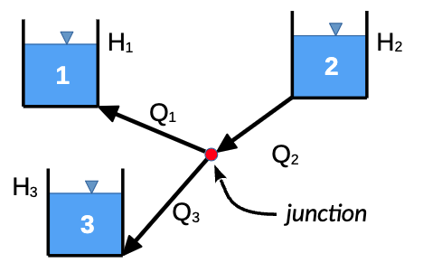

#  HW: IF Statements and Goal Seek

**Purpose:** Learn how to use external/API tools to solve complex equations

## Instructions
1. First make a copy of the starter sheet here:
   [Starter Sheet- HW IF Statements & Goal Seek](https://docs.google.com/spreadsheets/d/1sIy8cmeFlV-ywMx1ixMTT4DmRqJgFFUSpKn-a7KTaow/edit?gid=1350239100#gid=1350239100){:target="_blank"}
2. Rename it something like “[Your Name] HW 1.4 - IF Statements and Goal Seek”

---

#### Part 1 - Three Reservoir Problem

For this exercise we will be solving the classic three reservoir problem. Consider the following diagram:

The diagram shows three reservoirs connected by pipes. The flow rate through each pipe is determined by the 
difference in water levels between the two reservoirs connected by the pipe. The flow rate is also affected by the pipe diameter, length, and friction factor. The flow rate through each pipe is given by the following equation:

$$Q = \dfrac{\pi}{4} * D^2 * V$$

where: 

- $Q$ is the flow rate in m^3/s
- $D$ is the diameter of the pipe in meters
- $V$ is the velocity of the water in the pipe in m/s

The velocity of the water in the pipe is given by the following equation:

$$V = \sqrt{\dfrac{2 * g * (H_1 - H_2)}{\left[\dfrac{f * L}{D}\right] \pm 1}}$$

where:

- $g$ is the acceleration due to gravity (9.81 m/s^2)
- $H_1$ is the water level in the reservoir (or junction) at the start of the pipe in meters
- $H_2$ is the water level in the reservoir (or junction) at the end of the pipe in meters
- $f$ is the friction factor
- $L$ is the length of the pipe in meters
- $D$ is the diameter of the pipe in meters
- $\pm$ is a positive sign for the pipe inflow and a negative sign for outflow

The flow rate for the junction is equal to the sum of the flow rates into the junction, minus the flowrates out of the 
junction.

$$Q_{j} = \pm Q_{1} \pm Q_{2} \pm Q_{3}$$

The sign depends on the direction of the flow. If the flow is into the junction, the sign is positive. If the flow is out of the junction, the sign is negative.

To solve this problem, we will guess at the hydraulic head at the junction and use the **Goal Seek** tool to find a head 
value
in the 
junction that results in a 
net 
flow 
rate at the junction ($Q_j$) of zero. This will give us the water levels that will balance the flow rates through the 
system.

To solve the problem, do the following:

1. Navigate to the **Three Reservoir Problem** sheet
2. Name the cells in the spreadsheet according to this table:

**Hint:** You can edit cell names by navigating to the name box in the top left corner of the spreadsheet

   | Variable                | Cell | Name |
   |-------------------------|------|-----|
   | Gravity                 | C4   | g   |
   | Head at junction, $H_j$ | C5   | H_j |

3. Use the following table to write the equations shown below in the cells indicated. As you write the formulas, use the names you have defined for the two variables listed above. Use relative addressing for the other variables.

**Hint:** The most common mistake on these equations is the parentheses, so be careful when writing your equations.

   | Variable | Cell | Equation                                                                     |
   |:--------:|:----:|------------------------------------------------------------------------------|
   |  $V_1$   | C13  | $\sqrt{\dfrac{2 * g * (H_j - H_1)}{\left[\dfrac{F_1 * L_1}{D_1}\right] -1}}$ |
   |  $V_2$   | D13  | $\sqrt{\dfrac{2 * g * (H_2 - H_j)}{\left[\dfrac{F_2 * L_2}{D_2}\right] +1}}$ |
   |   $V_3$   | E13  | $\sqrt{\dfrac{2 * g * (H_j - H_3)}{\left[\dfrac{F_3 * L_3}{D_3}\right] -1}}$ |

4. Now that we have the velocity in each pipe, we will multiply by the cross-sectional area of the pipe to get the 
   flow rate in the pipe. Use the 
   following table to write the equations shown below in the cells indicated. 

   | Variable |  Cell | Equation                       |
   |:--------:|:---------:|--------------------------------|
   |  $Q_1$   |   C14  | $V_1$ * $\dfrac{\pi}{4}*(D_1)^2$ |
   |  $Q_2$   |   D14  | $V_2$ * $\dfrac{\pi}{4}*(D_2)^2$ |
   |   $Q_3$   |   E14  | $V_3$ * $\dfrac{\pi}{4}*(D_3)^2$ |
   |   $Q_j$    |   C16  | $Q_2$ - $Q_1$ - $Q_3$           |

5. Using a starting value of $H_j$, use **Goal seek** to a value for $H_j$ that results in $Q_j$ = zero. At this point,
   the flow rates in and out of the junction will be balanced and we will solved for the correct values of $Q_1$, 
   $Q_2$, and $Q_3$.

---

#### Part 2

1. Navigate to the **Simply Supported Beam** sheet
2. Name the cells in the spreadsheet according to this table:

**Hint:** You can edit cell names by navigating to the name box in the top left corner of the spreadsheet

   | Variable          | Cell | Name |
   |-------------------|------|------|
   | Load              | B4   | P    |
   | Modulus           | B5   | E    |
   | Length            | B6   | L    |
   | Load offset       | B7   | a    |
   | Load offset       | B8   | b    |
   | Base              | B9   | base |
   | Height            | B10  | ht   |
   | Distance          | B11  | x    |
   | Moment of Inertia | B13  | Iu   |
   | Deflection        | B16  | v    |

3. Use the following table to write the equations shown below in the cells indicated. As you write the formulas, use the names you have defined for the input cells.

**Hint:** The most common mistake on these equations is the parentheses, so be careful when writing your equations.

   | Cell      | Equation                                                                          |
   |-----------|-----------------------------------------------------------------------------------|
   | B8        | $b=L-a$                                                                           |
   | B13       | $I_u=\dfrac{1}{12}base*ht^3$                                                      |
   | B14 (x≤a) | $v=\dfrac{Pbx}{6EI_uL}\left(b^2+x^2-L^2\right)$                                   |
   | B15 (x>a) | $v=\dfrac{-Pb}{6EI_uL}\left[\dfrac{L}{b}(x-a)^3+\left(L^2-b^2\right)x-x^3\right]$ |

4. Next, write an **IF** statement in cell **B16** that will return the value in cell **B14** if ***x≤a*** (B7) or cell **B15** if ***x>a*** (B7).

If written correctly, your sheet should look like this when **x** is set to **278** and **15**:

5. The force of the load on the beam causes the deflection to take the shape of a parabola as shown in the diagram. Use **Goal seek** to compute the two **x** locations that result in a deflection of **-2.0** inches: one closer to the left support, and one closer to the right support. Record your answers in cells **B20** and **B21**.

**Hint:** Goal seek will find the answer closest to the pre-existing x value so to find the first solution, start with an x value near the left side, and to find the second solution, start with an x value near the right side. Your first solution should fall in the range between 30 and 40 inches while the second should fall in the range between 90 and 100 inches.

---

**Turn sharing and editing on. Turn in the link to Learning Suite in the feedback box**

---

**Rubric:**

|                         Item (Three Reservoir Problem)                    | Points Possible |
|:-------------------------------------------------------------------------:|:---------------:|
|                             Cells named correctly                         |        3        |
|           Velocity equations are written correctly and use cell names     |        4        |
|                    Flow rate equations are written correctly              |        4        |
|           Correct flow rate values are found with goal seek (±0.005)      |        4        |
|                
**Total**
             |       15        |

|               Item (Simply Supported Beam)                | Points Possible |
|:---------------------------------------------------------:|:---------------:|
|                   Cells named correctly                   |        3        |
|    Equations are written correctly and use cell names     |        4        |
|           The IF statement is written correctly           |        4        |
|   The two correct values are found with goal seek (±2)    |        4        |
|      
**Total**
       |       15        |

The following is not apart of the rubric, but specifies how you can lose points. For example: if you fail to share your link correctly.

|                      **Reasons for Points Lost**                      | **Amount** |  
|:---------------------------------------------------------------------:|:----------:|
|                        Link shared incorrectly                        |     3      |
|       Turned in late. 10% or 3 points for every week it's late.       |    3-15    |
