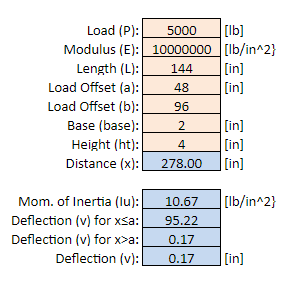

#  HW: IF Statements and Goal Seek

**Purpose:** Learn how to use external/API tools to solve complex equations

## Instructions
1. First make a copy of the starter sheet here:
   [Starter Sheet- HW IF Statements & Goal Seek](https://docs.google.com/spreadsheets/u/0/d/1rUlyf8lmHztFnhjQZp-jJvgtg7bNhADAEoz0q4NbXms/edit){:target="_blank"}
2. Rename it something like “[Your Name] HW 1.4 - IF Statements and Goal Seek”

---

#### Part 1
1. Navigate to the **Solar Installation** sheet
2. In the “**Solar System Generation**” table, create a dropdown data validation in cell **C6** with the options of “East”, “West”, “North”, and “South”
3. Change the dropdown in cell **C6** to “East”
4. In cell **C7**, write an IFS statement that changes the cell's value based on the dropdown in cell C6. Use these values for each direction:
  
   | Variable | Value |
   |----------|-------|
   | East     | 600   |
   | West     | 630   |
   | North    | 500   |
   | South    | 710   |

5. In cell **C9**, write the following formula to calculate the total annual kilowatt-hour (kWh) generation of the solar panel system. 

   | Cell | Equation                                     |
   |------|----------------------------------------------|
   | C9   | # of Panels * Annual kWh Generated per Panel |

6. Use **Goal Seek** to calculate the number of panels needed for the annual kWh generation to be 120% (14,400 kWh) of the annual kWh usage.

---

#### Part 2
1. In the “**Solar System Cost**” table, create a dropdown data validation in cell **F8** with the options “Yes” and “No”
2. Change the dropdown in cell **F8** to “Yes”
3. In cell **F9**, write an IF or IFS statement that changes the cell's value based on the dropdown in cell **F8**. If a battery is included in the cost, **F9** should be $13,000. Otherwise, it should be $0.00
4. In cell **F10**, write the following formula to calculate the total solar system cost. Then use Goal Seek to calculate what the price per watt should be for the total cost to equal $36,184

   | Cell | Equation                                                        |
   |------|-----------------------------------------------------------------|
   | F10  | (# of Panels * Watts per Panel * Price per Watt) + Battery Cost |

---

#### Part 3
1. There are 4 different companies that can be selected for plans, materials, and installation. We will use the cells in column I to select companies. Note that cells **I8:I9** have been merged into a single cell both rows 8 and 9 relate to installation. In the “**Subcontractors & Budgeting**” table, create dropdowns in cells **I6**, **I7**, and **I8:I9** that all contain the company options “Tesla", “Enphase", “Altair", and “Solaredge”.
2. In cells **J6:J9** use VLOOKUP and MATCH to find the service costs/labor in the table below that corresponds with the company options in the dropdown menus in **I6**, **I7**, and **I8:I9** (i.e. if the company is changed using the dropdown menu in cell **I6**, the value of cell **J6** should also correctly change to whatever that company charges for the service in the table).

   **Hint:** Use absolute cell references when referring to the tables in your function so that dragging down the cell will fill them properly 
   **Hint:** The MATCH function in **J9** must reference **I8** since merged cells only preserve the topmost value.

3. Choose the company in **I6:I9** that offers the cheapest price for each service.

   **Hint:** Solaredge has the cheapest rate for panel installation when combined with their number of installers.

4. In cell **J11**, write the following formula to calculate the total cost of all the services. Then use **Goal Seek** to calculate the maximum number of hours it must take for the panels to be installed so the budget does not exceed **$15,523**

   | Cell | Equation                                                                                     |
   |------|----------------------------------------------------------------------------------------------|
   | J11  | Engineering Plans + Material + (Installing Panels (per hour) * # of Installers * # of Hours) |

---

#### Part 4

1. Navigate to the **Simply Supported Beam** sheet
2. Name the cells in the spreadsheet according to this table:

**Hint:** You can edit cell names by navigating to the name box in the top left corner of the spreadsheet

   | Variable          | Cell | Name |
   |-------------------|------|------|
   | Load              | B4   | P    |
   | Modulus           | B5   | E    |
   | Length            | B6   | L    |
   | Load offset       | B7   | a    |
   | Load offset       | B8   | b    |
   | Base              | B9   | base |
   | Height            | B10  | ht   |
   | Distance          | B11  | x    |
   | Moment of Inertia | B13  | Iu   |
   | Deflection        | B16  | v    |

3. Use the following table to write the equations shown below in the cells indicated. As you write the formulas, use the names you have defined for the input cells.

**Hint:** The most common mistake on these equations is the parentheses, so be careful when writing your equations.

   | Cell      | Equation                                                                          |
   |-----------|-----------------------------------------------------------------------------------|
   | B8        | $b=L-a$                                                                           |
   | B13       | $I_u=\dfrac{1}{12}base*ht^3$                                                      |
   | B14 (x≤a) | $v=\dfrac{Pbx}{6EI_uL}\left(b^2+x^2-L^2\right)$                                   |
   | B15 (x>a) | $v=\dfrac{-Pb}{6EI_uL}\left[\dfrac{L}{b}(x-a)^3+\left(L^2-b^2\right)x-x^3\right]$ |

4. Next, write an **IF** statement in cell **B16** that will return the value in cell **B14** if ***x≤a*** (B7) or cell **B15** if ***x>a*** (B7).

If written correctly, your sheet should look like this when **x** is set to **278** and **15**:

5. The force of the load on the beam causes the deflection to take the shape of a parabola as shown in the diagram. Use **Goal seek** to compute the two **x** locations that result in a deflection of **-2.0** inches: one closer to the left support, and one closer to the right support. Record your answers in cells **B20** and **B21**.

**Hint:** Goal seek will find the answer closest to the pre-existing x value so to find the first solution, start with an x value near the left side, and to find the second solution, start with an x value near the right side.

---

**Turn sharing and editing on. Turn in the link to Learning Suite in the feedback box**

---

**Rubric:**

|                         Item (Solar Installation)                         | Points Possible |
|:-------------------------------------------------------------------------:|:---------------:|
|         Data validation and IFS statement is correct in 1st table         |        2        |
|                  Equation written correctly in 1st table                  |        2        |
|     The correct # of panels is found with goal seek in 1st table (±2)     |        2        |
|       Data validation and IF/IFS statement are correct in 2nd table       |        2        |
|                Equation is written correctly in 2nd table                 |        2        |
|   The correct price per watt is found with goal seek in 2nd table (±2)    |        2        |
|        Data validation and VLOOKUP statements correct in 3rd table        |        2        |
|                  Equation written correctly in 3rd table                  |        2        |
|     The correct # of hours is found with goal seek in 3rd table (±2)      |        2        |
|              
**Total**
               |       18        |

|               Item (Simply Supported Beam)                | Points Possible |
|:---------------------------------------------------------:|:---------------:|
|                   Cells named correctly                   |        2        |
|    Equations are written correctly and use cell names     |        3        |
|           The IF statement is written correctly           |        3        |
|   The two correct values are found with goal seek (±2)    |        4        |
|      
**Total**
       |       12        |
