#  Reading: IF Statements and Goal Seek

---

# Pre Class Reading Assignment

Before class, you will be learning about a few different type of IF Statements. For example IF and IF. You will also learn about Goal Seek.

---

## IF Statements

**IF Statements** are a function within Google Sheets that can compare two values and determine if it is true or false. This type of two-outcome expression in programming is known as a boolean.

### Syntax

The syntax for an IF statement is as follows:

```=IF(logical_expression, value_if_true, value_if_false)```

An IF statement has three arguments:

- **logical_expression**: This is what is known as the conditional statement. This function can compare whether a number is greater than (**>**), less than (**<**), or if a number or text is equal to (**=**) in the given condition
- **value_if_true**: This is a placeholder for what will be returned if the given condition is found to be true.
- **value_if_false**: This is a placeholder for what will be returned if the given condition is found to be false.

### Example Problem - IF Statement

Let's look at a simple example of an IF statement using strings. Here are a few fictional locations that have different types of material their driveways are made out of. Using an IF statement, we can quickly differentiate for specifically a concrete driveway.

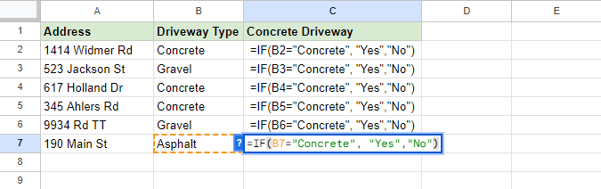

We can write a single statement in cell C2 and drag it down and watch it populate with either a "Yes" or a "No", all depending on the conditional statement we gave the function.

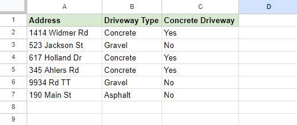

One more example is using a number. Using the length of a driveway, we can find which of the driveways are longer than the given distance of 75 ft.

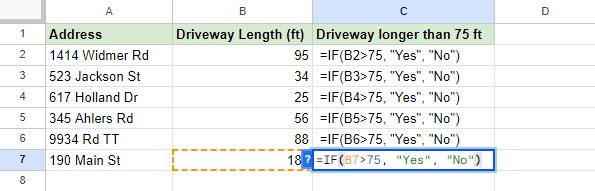

Again, we can see that we can quickly populate the rest of the table by dragging the corner of the cell down.

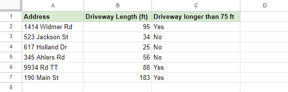

---

## IFS Statements

**IFS Statements** are an even more powerful version of an IF statement that can allow for multiple conditional statements to take place within one function. This type of function allows for easy categorization by testing a given number or string against one found in a table

### Syntax

The syntax for an IFS statement is as follows:

```=IFS(logical_expression1, value_if_true1, [logical_expression2, value_if_true2], [logical_expression3, ...)```

An IFS statement only technically requires two arguments, both of which are nearly the same as the IF statement. However, there can be an infinite amount of logical expressions within one IFS statement.

**Note**: More than one condition can be true so the function will always return the value for the first condition that is found true.

### Example Problem - IFS Statement

Using the same premise as the IF statement, we can utilize the table we used before. This time around, we will categorize the different lengths of driveways into three tiers: short, medium, and long.

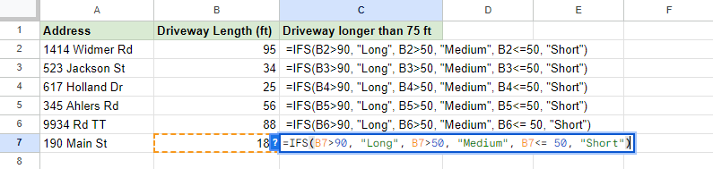

**Note**: The third condition ```<=50``` includes ```=``` so that 50 is included in "less than or **equal** to 50

Dragging them down, we can see the final result. Now each driveway is nicely categorized by its length.

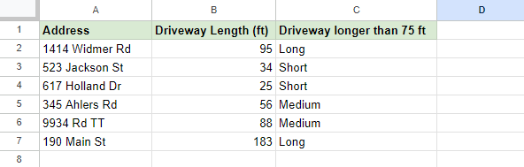

---

## Goal Seek

**Goal Seek** is an add-on plugin for Google Sheets. It is a powerful tool that utilizes an algorithm that plugs in different calculations to find a solution for an unknown variable using a known end-goal value. A great example of this is often found in sales when determining how many units need to be sold to break even or meet a certain quota.

### Installing Goal Seek

Installing Goal Seek is fairly simple. Go to the top ribbon and find **Extensions > Add-ons > Get add-ons** and a window for Google's Workshop Marketplace should pop up. Once the window opens, type into the search bar **"Goal Seek"**. The first option for Google's Goal Seek should appear like the picture down below. 

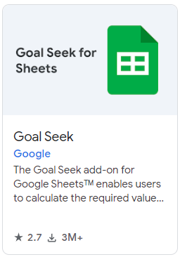

After clicking on it, a page should open up with a blue button that says **"Install"**. 

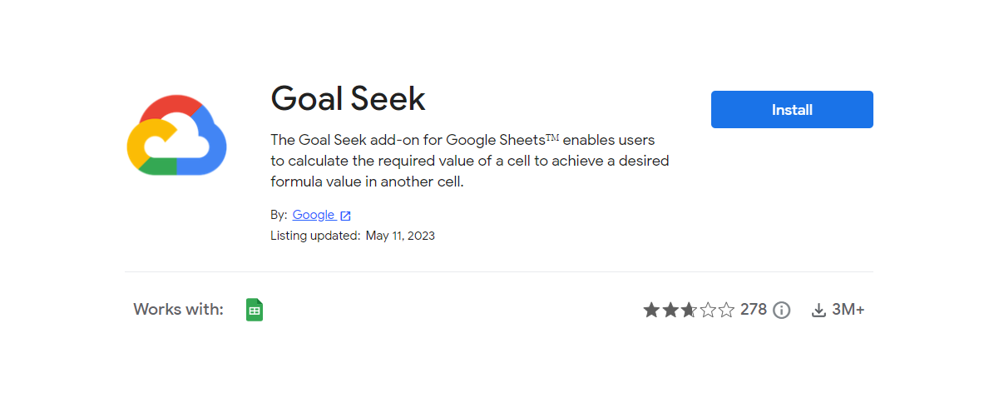

Press the install button and another tab will open up regarding which Google account you want to use. Select which account you prefer to use. Google will ask permission to utilize this account with two separate pop-ups; click **"Continue"** and then **"Allow"**. 

Goal seek should now be installed and ready to use!

### Using Goal Seek

To use Goal Seek, you will find it on the top ribbon, **Extensions > Add-ons > Goal Seek > Open**

Goal seek takes three steps to use after your sheet is setup:

- **Set Cell**
- **To Value**
- **By Changing Cell**

### Example Problem 
Let's use the example of a contractor wanting to find what he would have to charge to make a profit of **$1250**, by building his friend a 12' x 12' deck. Given the cost of materials ($6000) and the $22/hr of pay for each employee, we can calculate the project cost. Using goal seek, we can allow the computer to do the rest of the work for us.

First, select the cell you want to set by 1) selecting the cell (B11) and 2) clicking the **Set Cell** grid icon on the goal seek tab. 

**Hint**: This cell should **almost always** be the cell that contains your formula.

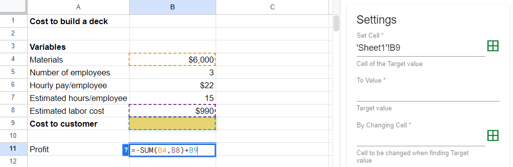

Then, set the **To Value** to whatever value you are trying to find. In our case, this number would be 1250.

Finally, select the cell that would need to change to evaluate the final part of the question. In this instance, this would be cell B9.

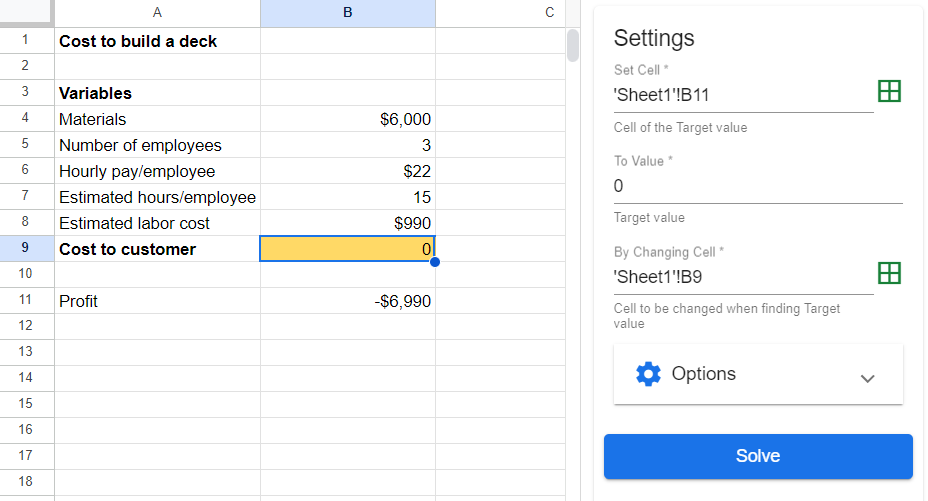

When all three inputs are filled on the Goal Seek tab, the Solve button will light up blue. If you press the button, the computer should start jumping between values trying to find the solution to what gets a profit of $1250.

In this example, our solution is $8240.000057, or **$8240**!

### How does this work?

Each attempt by the computer tries to get closer and closer by guessing a number.

**Attempt 1**


**Attempt 2**

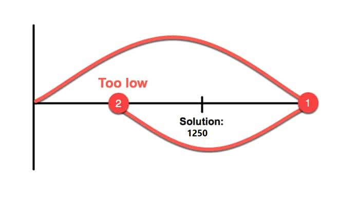

**Attempt 3**


**Attempt 4 and onwards**


---

# Pre-Class Quiz Challenge
