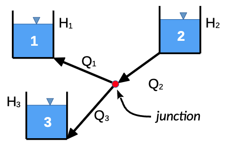

#  HW: Pivot Tables, Goal Seek, and Data Validation

**Purpose:** Learn how to use Goal Seek to solve complex equations and how to create Pivot Tables to summarize data.

## Instructions
1. First make a copy of the starter sheet here:
   [HW_Goal_Seek&PivotTables_EXCEL.xlsx](HW_Goal_Seek%26PivotTables_EXCEL.xlsx){:target="_blank"}
2. Rename it something like “[Your Name]-HW-Goal Seek and Pivot Tables”
---

#### Part 1: Three Reservoir Problem

For this exercise we will be solving the classic three reservoir problem. Consider the following diagram:

The diagram shows three reservoirs connected by pipes. The flow rate through each pipe is determined by the 
difference in water levels between the two reservoirs connected by the pipe. The flow rate is also affected by the pipe diameter, length, and friction factor. The flow rate through each pipe is given by the following equation:

$$Q = \dfrac{\pi}{4} * D^2 * V$$

where: 

- $Q$ is the flow rate in m^3/s
- $D$ is the diameter of the pipe in meters
- $V$ is the velocity of the water in the pipe in m/s

The velocity of the water in the pipe is given by the following equation:

$$V = \sqrt{\dfrac{2 * g * (H_1 - H_2)}{\left[\dfrac{f * L}{D}\right] \pm 1}}$$

where:

- $g$ is the acceleration due to gravity (9.81 m/s^2)
- $H_1$ is the water level in the reservoir (or junction) at the start of the pipe in meters
- $H_2$ is the water level in the reservoir (or junction) at the end of the pipe in meters
- $f$ is the friction factor
- $L$ is the length of the pipe in meters
- $D$ is the diameter of the pipe in meters
- $\pm$ is a positive sign for the pipe inflow and a negative sign for outflow

The flow rate for the junction is equal to the sum of the flow rates into the junction, minus the flowrates out of the 
junction.

$$Q_{j} = \pm Q_{1} \pm Q_{2} \pm Q_{3}$$

The sign depends on the direction of the flow. If the flow is into the junction, the sign is positive. If the flow is out of the junction, the sign is negative.

To solve this problem, we will guess at the hydraulic head at the junction and use the **Goal Seek** tool to find a head 
value
in the 
junction that results in a 
net 
flow 
rate at the junction ($Q_j$) of zero. This will give us the water levels that will balance the flow rates through the 
system.

To solve the problem, do the following:

1. Navigate to the **Three Reservoir Problem** sheet
2. Name the cells in the spreadsheet according to this table:

**Hint:** You can edit cell names by navigating to the name box in the top left corner of the spreadsheet

   | Variable                | Cell | Name |
   |-------------------------|------|------|
   | Gravity                 | C4   | g    |
   | Head at junction, $H_j$ | C5   | H_j  |

3. Use the following table to write the equations shown below in the cells indicated. As you write the formulas, use the names you have defined for the two variables listed above. Use relative addressing for the other variables.

**Hint:** The most common mistake on these equations is the parentheses, so be careful when writing your equations.

   | Variable | Cell | Equation                                                                     |
   |:--------:|:----:|------------------------------------------------------------------------------|
   |  $V_1$   | C13  | $\sqrt{\dfrac{2 * g * (H_j - H_1)}{\left[\dfrac{F_1 * L_1}{D_1}\right] -1}}$ |
   |  $V_2$   | D13  | $\sqrt{\dfrac{2 * g * (H_2 - H_j)}{\left[\dfrac{F_2 * L_2}{D_2}\right] +1}}$ |
   |  $V_3$   | E13  | $\sqrt{\dfrac{2 * g * (H_j - H_3)}{\left[\dfrac{F_3 * L_3}{D_3}\right] -1}}$ |

4. Now that we have the velocity in each pipe, we will multiply by the cross-sectional area of the pipe to get the 
   flow rate in the pipe. Use the 
   following table to write the equations shown below in the cells indicated. 

   | Variable |   Cell   | Equation                         |
   |:--------:|:--------:|----------------------------------|
   |  $Q_1$   |   C14    | $V_1$ * $\dfrac{\pi}{4}*(D_1)^2$ |
   |  $Q_2$   |   D14    | $V_2$ * $\dfrac{\pi}{4}*(D_2)^2$ |
   |  $Q_3$   |   E14    | $V_3$ * $\dfrac{\pi}{4}*(D_3)^2$ |
   |  $Q_j$   |   C16    | $Q_2$ - $Q_1$ - $Q_3$            |

5. Using a starting value of $H_j$, use **Goal seek** to a value for $H_j$ that results in $Q_j$ = zero. At this point,
   the flow rates in and out of the junction will be balanced, and we will solve for the correct values of $Q_1$, 
   $Q_2$, and $Q_3$.

6. Apply Data Validation to the **Diameter (D)** and **Length (L)** inputs to only allow positive numbers. This will 
   ensure that the Diameter and Length values are valid inputs for the equations. Apply data validation to **all 
   three pipe inputs** (C8:E9).

---

#### Part 2: Flow Rate & Velocity Pivot Table
1. Create a pivot table on the existing "PivotTable" sheet using the data from the Reservoir Flow sheet. Notice how 
   there are multiple scenarios. In this dataset, each scenario is one complete system of water flowing through 
   **Pipe 1, Pipe 2,** and **Pipe 3** with a shared **junction head** (Hj) but potentially different lengths and 
   diameters for 
   each pipe. 

   * Use **Pipe** and **Flow Direction** as the rows.
   * Use **Flow Rate** and **Velocity** and  as the values.
   * Make sure that the Value settings are set to find the _Average_ **Flow Rate** and **Velocity**.

Pipe 1 and 3 are usually **Outflow** pipes, while Pipe 2 is usually an **Inflow** pipe. What does this tell you about 
the system? Do outflow pipes have a higher or lower average flow rate than inflow pipes? What about average velocity?

---

#### Part 2.1: Personal Pivot Table 

In this part, we want you to create another pivot table in a **New Worksheet**, but in this case we want you to examine the data and create a pivot table that explores data correlations that **YOU** find interesting. Make sure to use at least two combinations of fields in the **Rows** section and at least two combinations of fields in the **Values** section.

For example, how does the average flow rate change with different pipe diameters? Or how does the average velocity change with different pipe lengths?

---

**_REMINDER_** - For this class, **you will only turn in the _links_ to your Excel files**. You will get a 0 for this assignment if you turn in an Excel file or a link that is not shareable. 

1. On the top right, click the "share" button --> share --> settings
2. Click "anyone" at the top, then underneath "More settings", change "can view" to "can edit". Then click apply. 
3. Turn in the link to Learning Suite in the feedback box.

---

**Rubric:**

|               Part 1: Three Reservoir Problem               | Points Possible |
|:-----------------------------------------------------------:|:---------------:|
|                    Cells named correctly                    |        3        |
| Velocity equations are written correctly and use cell names |        4        |
|          Flow rate equations are written correctly          |        4        |
| Correct flow rate values are found with goal seek (±0.005)  |        5        |
|      Data validation applied to Pipe inputs (D and L)       |        2        |
|       
**Total**
        |       18        |

|    Part 2: Flow Rate & Velocity Pivot Table    | Points Possible |
|:----------------------------------------------:|:---------------:|
|    Pivot Table is created on existing sheet    |        2        |
|  Table created using data from Reservoir Flow  |        2        |
|  Table includes Pipe and Flow Direction Rows   |        3        |
| Values are **Average** Flow Rate and Velocity  |        3        |
|          Pivot Table in new worksheet          |        2        |
| 
**Total**
 |       12        |

The following is not a part of the rubric, but specifies how you can lose points. For example: if you fail to share 
your link correctly.

|                      **Reasons for Points Lost**                      | **Amount** |  
|:---------------------------------------------------------------------:|:----------:|
|                        Link shared incorrectly                        |     3      |
|       Turned in late. 10% or 3 points for every week it's late.       |    3-15    |
