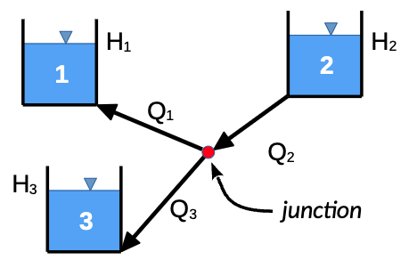

# HW: PivotTables, Goal Seek, and Data Validation

**Purpose:** Build an engineering calculation, use Goal Seek to solve for an unknown input, apply Data Validation, and use PivotTables to summarize and interpret data.

## Instructions

First make a copy of the starter workbook: [(Starter-Workbook)-HW-Pivot-GoalSeek-DataV.xlsx](%28Starter-Workbook%29-HW-Pivot-GoalSeek-DataV.xlsx)

If you need a reminder about worksheet, range, relative, absolute, or named references, review [Cells and Formulas](../../resources/excel_review/basic_excel_review.md).

---

## Part 1: Three Reservoir Problem

In this exercise, three reservoirs are connected to a common junction by three pipes.

The flow in each pipe depends on the difference between its reservoir head and the junction head, as well as the pipe diameter, length, and Darcy friction factor. In this exercise, $H_j$ is the **piezometric head** at the junction: elevation head plus pressure head, but not velocity head. Treat the supplied friction factors as constants. This simplified model neglects pumps, turbines, minor losses, and reservoir-surface velocity.

The flow rate in each pipe is:

$$Q = \dfrac{\pi D^2}{4}V$$

where $Q$ is the flow rate in m³/s, $D$ is the pipe diameter in meters, and $V$ is the water velocity in m/s.

For flow from a reservoir **into** the junction:

$$V = \sqrt{\dfrac{2g(H_i-H_j)}{\dfrac{fL}{D}+1}}$$

For flow **out of** the junction toward a reservoir:

$$V = \sqrt{\dfrac{2g(H_j-H_i)}{\dfrac{fL}{D}-1}}$$

Here, $H_i$ is the reservoir head for pipe $i$, $g=9.81$ m/s², $f$ is the Darcy friction factor, and $L$ and $D$ are the pipe length and diameter. The starter values produce inflow through Pipe 2 and outflow through Pipes 1 and 3.

At steady state, total inflow must equal total outflow. Define net flow into the junction as:

$$Q_j=Q_2-Q_1-Q_3$$

We will use Goal Seek to change $H_j$ until $Q_j=0$.

1. Navigate to the **Three Reservoir Problem** worksheet.
2. Name the following cells. These names make the formulas easier to read.

    **Hint:** Select the cell, enter the name in the Name Box to the left of the formula bar, and press Enter.

    | Variable | Cell | Name |
    |----------|------|------|
    | Gravity | C4 | g |
    | Junction head, $H_j$ | C5 | H_j |

    A named reference identifies a shared value by purpose, while cell references identify the pipe-specific inputs. Using both keeps formulas concise and makes it easier to locate an incorrect input or reference.

!!! note "Translating the equations into Excel"
    Begin a formula with `=`. Use `*` for multiplication, `/` for division, `^2` to square a value, `SQRT(...)` for a square root, and `PI()` for $\pi$. Use parentheses to preserve the order of operations. Refer to the named cells `g` and `H_j` and to the appropriate pipe-input cells rather than typing the supplied numerical values into formulas.

<b>Formula hint for $V_1$</b>

For Pipe 1, one correct translation of the velocity equation is:

`=SQRT((2*g*(H_j-C11))/((C10*C9/C8)-1))`

Identify how `C8:C11` correspond to $D_1$, $L_1$, $f_1$, and $H_1$ before using the formula.

3. Enter the following velocity equations. Use the defined names `g` and `H_j`, and use relative references for the pipe inputs.

    **Hint:** Enter each numerator and denominator inside parentheses before applying `SQRT`.

    | Variable | Cell | Equation |
    |:--------:|:----:|----------|
    | $V_1$ | C13 | $\sqrt{\dfrac{2g(H_j-H_1)}{\dfrac{f_1L_1}{D_1}-1}}$ |
    | $V_2$ | D13 | $\sqrt{\dfrac{2g(H_2-H_j)}{\dfrac{f_2L_2}{D_2}+1}}$ |
    | $V_3$ | E13 | $\sqrt{\dfrac{2g(H_j-H_3)}{\dfrac{f_3L_3}{D_3}-1}}$ |

4. Calculate each pipe flow rate and the net flow at the junction.

    | Variable | Cell | Equation |
    |:--------:|:----:|----------|
    | $Q_1$ | C14 | $V_1\dfrac{\pi}{4}(D_1)^2$ |
    | $Q_2$ | D14 | $V_2\dfrac{\pi}{4}(D_2)^2$ |
    | $Q_3$ | E14 | $V_3\dfrac{\pi}{4}(D_3)^2$ |
    | $Q_j$ | C16 | $Q_2-Q_1-Q_3$ |

5. Before using Goal Seek, check your formulas with the starting value $H_j=50$ m. Small rounding differences are acceptable.

    | Value | Expected result |
    |:------|----------------:|
    | $V_1$ | 2.001 m/s |
    | $V_2$ | 5.032 m/s |
    | $V_3$ | 3.148 m/s |
    | $Q_1$ | 0.01006 m³/s |
    | $Q_2$ | 0.03952 m³/s |
    | $Q_3$ | 0.01582 m³/s |
    | $Q_j$ | 0.01364 m³/s |

6. In the **Goal Seek record** at the bottom of the worksheet, enter the settings below before running Goal Seek:

    - **Set Cell:** `C16`
    - **To Value:** `0`
    - **By Changing Cell:** `C5`

7. Run **Data > What-If Analysis > Goal Seek** using the starting value already in `C5`. After Goal Seek finishes, record the solved $H_j$ and final $Q_j$ in the labeled cells. Confirm that the final net flow is approximately zero.

8. Apply Data Validation to `C8:E9` so the diameter and length inputs accept only numbers greater than 0. This checks that those inputs are positive; it does not test every physical constraint in the model.

---

## Part 2: Flow Rate and Velocity PivotTable

The **Reservoir Flow** worksheet contains ten balanced scenarios. Each scenario has three pipes that share one solved junction head. Pipe dimensions, reservoir heads, and flow directions vary.

1. Select the ordinary source range `'Reservoir Flow'!A1:J31`. An ordinary range is a group of cells that has not been converted to an Excel Table.
2. In the **Create PivotTable** dialog, verify the source in **Table/Range**, choose **Existing Worksheet**, and set **Location** to `PivotTable!A9`. The location is the upper-left cell where Excel will place the PivotTable.
3. Arrange the fields as follows:

    - **Rows:** Flow Direction
    - **Columns:** Pipe
    - **Values:** Average of Flow Rate and Average of Velocity. Use **Value Field Settings**, as introduced in the reading, to change each summary to **Average**.
    - **Filters:** Scenario

4. In the **Part 2 observation** box above the PivotTable, describe what this dataset shows about average flow rate or velocity for inflow and outflow. Describe the dataset rather than claiming a universal hydraulic rule.

!!! tip "Optional: use an Excel Table"
    You may convert `A1:J31` to an Excel Table before creating the PivotTable. A Table makes the source easier to identify and automatically includes added rows when the PivotTable is refreshed.

---

## Part 3: Personal PivotTable

Using the same source, `'Reservoir Flow'!A1:J31`, create a second PivotTable in a **new worksheet** to explore a relationship or pattern that interests you. Include:

- At least one categorical field in **Rows**
- A second categorical field in **Rows**, **Columns**, or **Filters**
- At least two numeric fields in **Values**
- An appropriate summary calculation for each value

For example, you could place Scenario in Rows, Pipe in Columns, and average Flow Rate and Velocity in Values. Record a one- or two-sentence interpretation in the **Part 3 observation** box on the original **PivotTable** worksheet.

---

## Turning in/Rubric

!!! note "Do not put your name or NetID in the file"
    Learning Suite records who submitted each file, so your name is not needed
    inside the file itself. Leaving it out means your work can be graded
    anonymously, which keeps grading fair. This applies to scans and photos
    too—please don't write your name on the page.

**_REMINDER_** - For this class, **you will upload your Excel file directly to Learning Suite**. Make sure the file you upload is for the correct assignment and contains your finished work.

1. Make sure your work is saved, then close the workbook so that all of your changes are written to the file.
2. Go to the assignment in Learning Suite and upload your `.xlsx` file as an attachment.
3. Double-check that the file you uploaded is the one that contains your completed work.

---

**Rubric:**

| Item | Points Possible |
|:-----|:---------------:|
| Part 1: Named cells, formulas, and checkpoint values are correct | 7 |
| Part 1: Goal Seek settings are recorded and solved $H_j$ is within ±0.01 m | 5 |
| Part 1: Final continuity check is recorded and $|Q_j| \leq 0.0001$ m³/s | 2 |
| Part 1: Data Validation is applied to all diameter and length inputs | 2 |
| Part 2: Prescribed PivotTable uses the correct source, location, fields, and summaries | 6 |
| Part 2: Observation is complete and supported by the PivotTable | 2 |
| Part 3: Personal PivotTable meets the field and summary requirements | 4 |
| Part 3: Interpretation is complete and supported by the PivotTable | 2 |
| 
**Total**
 | **30** |

---

The following is not a part of the rubric, but specifies how you can lose points. For example: if you fail to upload your file correctly.

| **Reasons for Points Lost** | **Amount** |
|:---------------------------:|:----------:|
| File uploaded incorrectly | -10% |
| Turned in late (per week) | -10% (up to -50%) |
