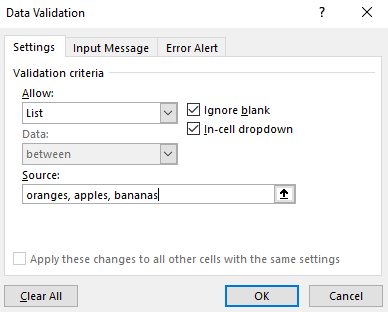
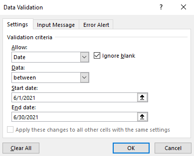
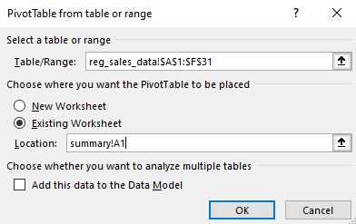
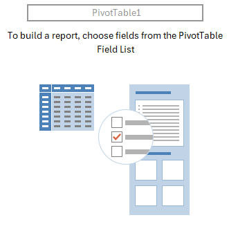
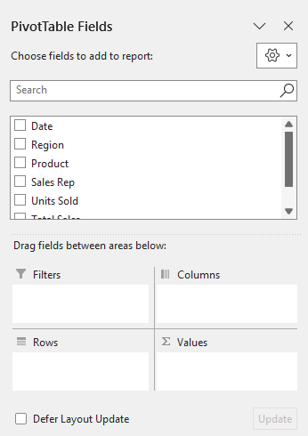
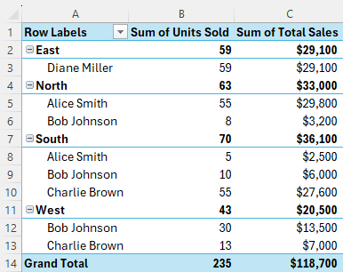
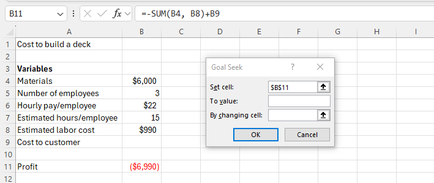
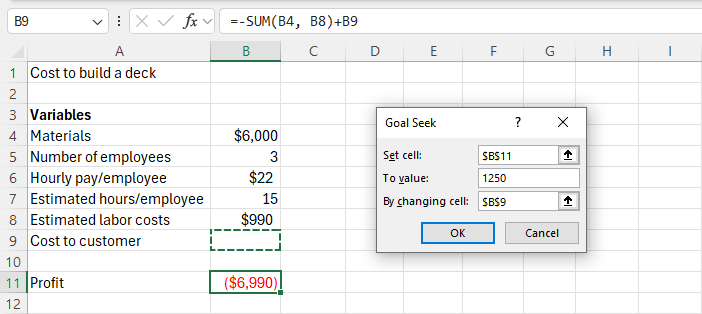

# Reading: PivotTables, Goal Seek, and Data Validation

---

## Data Validation

Data Validation controls what users may enter in a cell. For example, it can require a positive number, a date within a specified range, or an item from a list. Validation helps prevent entry errors; filtering only changes which existing rows are visible.

To add Data Validation:

1. Select the cells to validate.
2. Select **Data > Data Validation**.
3. On the **Settings** tab, choose the allowed data type and enter the criteria.
4. Optional: use **Input Message** to explain what should be entered.
5. Optional: use **Error Alert** to stop an invalid entry or warn the user about it.
6. Select **OK**.

!!! Note
      A cell normally has one Data Validation rule. When an input must satisfy several conditions, a **Custom** validation formula can combine them. For example, a custom formula could require a value to be both numeric and positive.

---

### Dropdown

Use a list when entries must come from a set of allowed choices. In **Data Validation**, select **List** and identify the source. The source can be typed choices or, preferably, a range of cells containing the allowed values. The example below accepts values from a drop-down list.

### Dates

Date validation can limit entries to dates before, after, or between specified dates. The example below allows only dates from June 1 through June 30, 2021.

For additional examples, see Microsoft's [Apply data validation to cells](https://support.microsoft.com/en-us/office/apply-data-validation-to-cells-29fecbcc-d1b9-42c1-9d76-eff3ce5f7249){:target="_blank"}.

---

## PivotTables

A **PivotTable** is an interactive summary of source data. It can group records, calculate totals or averages, and quickly rearrange a summary without changing the original data.

Before creating a PivotTable, make sure the source data has:

* One header row with a unique, nonblank name for every column
* Consistent data types within each column
* No blank rows or columns inside the source range
* One record per row

The **PivotTable Fields** pane has four areas:

* **Rows:** categories listed vertically
* **Columns:** categories compared horizontally
* **Values:** calculated summaries such as Sum, Count, or Average
* **Filters:** fields used to limit the records included in the summary

The following example uses a regional sales dataset. To follow along, download:
[reg_sales_data.xlsx](reg_sales_data.xlsx)

The dataset contains region, product, sales representative, units sold, and total sales. We will summarize units sold and total sales by region and sales representative.

### Creating the PivotTable

1. Select the source range `A1:F31`.
2. Select **Insert > PivotTable**. Excel displays the following dialog box:

3. Choose **Existing Worksheet**, select a location on the `summary` worksheet, and select **OK**. The empty PivotTable will look like this:

### Editing the PivotTable

Use the **PivotTable Fields** pane to arrange the summary:

4. Drag **Region** to **Rows**.
5. Drag **Sales Rep** below Region in **Rows**.
6. Drag **Units Sold** to **Values**. Open **Value Field Settings** and confirm that it is summarized by **Sum**.
7. Drag **Total Sales** to **Values** and confirm that it is also summarized by **Sum**.

The PivotTable should look like this:

The PivotTable now shows total units sold and total sales for each sales representative within each region.

!!! Note "Refresh and changing source data"
      After changing source data, use **Refresh** to update the PivotTable. If new records are added outside an ordinary source range, update the PivotTable's data source before refreshing.

!!! Tip "Optional: use an Excel Table"
      This activity uses an ordinary range. You may instead convert the source to an Excel Table with **Ctrl+T**. A Table expands as rows are added, keeps headers and formatting consistent, and makes the PivotTable source easier to maintain. You must still refresh the PivotTable to update its results.

### Additional Readings

Below are some links to additional readings on PivotTables.

* [Introduction Excel PivotTable](https://www.w3schools.com/excel/excel_table_pivot_intro.php){:target="_blank"}
* [Create a PivotTable to Analyze Worksheet Data](https://support.microsoft.com/en-us/office/create-a-pivottable-to-analyze-worksheet-data-a9a84538-bfe9-40a9-a8e9-f99134456576){:target="_blank"}
* [Pivot Tables in Excel](https://www.excel-easy.com/data-analysis/pivot-tables.html){:target="_blank"} (bonus functions of PivotTables)

---

## Goal Seek

**Goal Seek** changes one input cell until a formula cell reaches a specified value. It is useful when you know the required result but need to determine the input that produces it, such as the number of units needed to break even.

### Using Goal Seek

Select **Data > What-If Analysis > Goal Seek**. The dialog box requires three entries:

* **Set Cell:** the cell containing the formula whose result you want to control
* **To Value:** the desired numerical result of that formula
* **By Changing Cell:** one input cell referenced, directly or indirectly, by the formula

Goal Seek changes only one input and returns one solution per run. For equations with more than one valid solution, a different starting value may lead to a different solution.

### Example Problem

A contractor wants to determine the price to charge for a deck so that the project earns a profit of **\$1,250**. The worksheet calculates project cost from materials and labor, then calculates profit from the price charged.

Open Goal Seek and select the profit formula as the **Set Cell**.

Enter `1250` as the **To Value**. Select the price cell, `B9`, as the **By Changing Cell**.

Select **OK** to run Goal Seek. Excel changes the price until the profit formula is approximately \$1,250.

In this example, Excel returns approximately **\$8,240**. Goal Seek uses numerical approximation, so Excel may display extra decimal places or a very small difference from the target. Round the result to a precision appropriate for the problem.

### How does this work?

Goal Seek repeatedly tests input values until the formula result is sufficiently close to the target. It does not prove that the solution is unique. If an equation has multiple roots, run Goal Seek again with a different starting value and check each result in the original formula.

---

## Pre-Class Quiz Challenge

Here is a link for the pre-class starter workbook: [(Starter-Workbook)-Pre-Pivot-GoalSeek-DataV.xlsx](%28Starter-Workbook%29-Pre-Pivot-GoalSeek-DataV.xlsx)

The `Reg_sales_data` worksheet contains the regional sales dataset used in the PivotTable example above. The workbook also includes the Data Validation and Goal Seek exercises below.

### Part 1: Data Validation

Navigate to the `Dogshow` worksheet and use Data Validation, found on the **Data** tab, to limit:

1. The breed of dogs (`C6:C23`) to the list provided.
2. The judges' scores (`D6:F23`) to whole numbers from 0 through 10.
3. The winners (`C28:C30`) to the names of entered dogs.

Fill in the red entry area using allowed breeds and judge scores. Test your validation by trying at least one valid entry and one invalid entry for both a list and a numerical rule. Enter a `SUM` formula for each total score, then enter the names and scores of the first-, second-, and third-place dogs.

### Part 2: PivotTable

1. Select the entire source range on the `Reg_sales_data` worksheet and create a PivotTable on the existing `PivotTable` worksheet, starting at `A6`.
2. Place **Sales Rep** and then **Product** in **Rows**.
3. Place **Units Sold** and **Total Sales** in **Values**. Confirm that both fields are summarized by **Sum**.
4. In the labeled response box above the PivotTable, answer this question: Which sales representative and product combination has the greatest total sales?

### Part 3: Goal Seek

Navigate to the `Fishing` worksheet.

While fly-fishing, you model the path of a jumping fish with the equation:

$y = -(x-2)^2 + 5$

The two roots are the horizontal positions where the fish crosses the water surface. Their difference is the horizontal distance traveled above the water. The parabola's maximum gives the greatest height above the water.

1. Use Goal Seek to find both $x$ values that make $y=0$. Run Goal Seek twice, changing the starting value in the $x$ input cell before each run.
2. Copy the two roots into `C28` and `C29`.
3. Confirm that the horizontal distance shown in `F32` is the absolute difference between the two roots.
4. Enter the average of the two roots in `E28`. This is the $x$ coordinate of the parabola's axis of symmetry. The worksheet formula in `F33` will calculate the maximum $y$ value.

<b>Hint: starting values for Goal Seek</b>

Try an initial $x$ value of `-1` for one run and `5` for the other. Each result should make the original equation approximately zero.

---

## Turning in/Rubric

**_REMINDER_** - For this class, **you will upload your Excel file directly to Learning Suite**. Make sure the file you upload is for the correct assignment and contains your finished work.

1. Make sure your work is saved, then close the workbook so that all of your changes are written to the file.
2. Go to the assignment in Learning Suite and upload your `.xlsx` file as an attachment.
3. Double-check that the file you uploaded is the one that contains your completed work.

**Rubric:**

|                              Item                              | Points Possible |
|:--------------------------------------------------------------:|:---------------:|
|         
**Total**
         |        3        |

---

The following is not a part of the rubric, but specifies how you can lose points. For example: if you fail to upload your file correctly.

| **Reasons for Points Lost** |    **Amount**     |  
|:---------------------------:|:-----------------:|
|  File uploaded incorrectly  |       -10%        |
