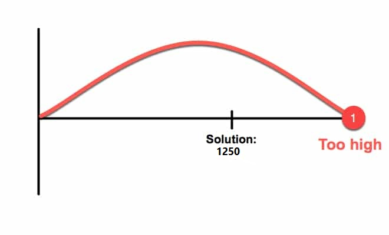

#  Reading: Data Validation, Pivot Tables & Goal Seek

---
## Data Validation
Data validation is a feature in Excel that allows you to control the type of data entered into a cell. This 
can be useful to ensure that the data entered into a cell is appropriate for the context of how it will be used. For 
example, you may have a formula that only works with positive values. You can use data validation to ensure that 
the cell(s) used as input to the formula only accepts positive values. 
This is different from 
filtering 
data as data 
validation controls the data that can be entered into a cell while filtering data changes the range of data you see.
Data validation can help prevent errors in your data and make it easier to work with.  

Let's go over how to add data validation to your data in Excel:

1. Select the range of cells you want to add data validation to. 
2. Click on **Data | Data validation**. 
3. In the data validation criteria box, you can set up the criteria for the data that can be entered into the cells. For example, you can choose to allow only numbers, text, dates, or a list of items. 
4. You can also choose the output of the data validation you want to apply to the cells. For example, you can choose to show a warning message if the data entered does not meet the criteria or to reject the data altogether. 
5. Once you have set up the criteria and output options, click on Save to apply the data validation to the selected range of cells.

**Dropdown**  

This is useful when you want to limit the data that can be entered into a cell to a specific list of items. For 
example, you can create a drop-down list of options for a cell that allows the user to select from a list of items. 
To do this, follow the same steps as above and select **List**. You can then enter the items you want to include in 
the drop-down list.
In the example below, the data validation is set up to allow only the values in the drop-down list to be entered 
into the cells.

If you're wanting to create a drop-down list from a range of cells, you can select the range of cells that contain the items you want to include in the drop-down list. This is useful when you have a long list of items that you want to include in the drop-down list.

**Dates**  

This is useful when you want to limit the data that can be entered into a cell to a specific date range. For example, you can create a data validation that only allows dates between 6/1/2021 and 6/30/2021 to be entered into the cells. To do this, follow the same steps as above and select the criteria that best fit the date range you want your data to have. In the example below, the data validation is set up to allow only dates between 6/1/2021 and 6/30/2021 to be entered into the cells.

There are many other options for data validation. Here is an extra resource for further examples of Data Validation: [Data Validation](https://www.geeksforgeeks.org/excel/what-is-data-validation-in-excel/){:target="_blank"}

---

# Pivot Tables

**Pivot Tables** are used to summarize and analyze large sets of data in more meaningful ways. They can be used to narrow down data sets and see relationships between data points among other things. Pivot tables allow us to summarize multiple columns and rows of data at a time.

For example, here is a data set showing sales data. If you would like to follow 
along, you can use this data set:
[reg_sales_data.xlsx](reg_sales_data.xlsx){:target="_blank"}

The data set shows the sales data for a set of regional sales managers. The data set includes region, the product, 
the name of the sales rep, the number of units sold, and the total sales. Now suppose we want to create a summary of 
the units sold and the total sales in each region, organized by sales rep. We could manually extract that 
information from the table, or we could use some combination of COUNTIF and SUMIF to accomplish this. Or we could 
find that information in a few clicks using a pivot table. The following steps show how to create a pivot table in 
Excel. 

## Creating the Pivot Table

1. First, we select the data set. In this case, we select the cells in the range A1:F31.
2. Next, we select the Insert|Pivot Table option from the menu. This will bring up the following dialog box:

We can either choose to put the pivot table in a new sheet or in the existing sheet. In this case, we will put the 
pivot table in an existing sheet named "summary". We will click the Ok button. This will create a pivot table in the 
existing "summary sheet." The empty pivot table will look like this:

## Editing the Pivot Table

Now we need to decide what data we want to summarize in the pivot table. We can do this using the Pivot table editor 
on the right. The editor will look like this:

Now we can start adding data to the pivot table. Adding data to the pivot table is done by dragging and dropping the 
desired data into the appropriate sections in the editor. The sections are **Rows**, **Columns**, and **Values**.

3. Go to the editor and click and drag the **Region** category into the **Rows** section. 
4. Click on the **Sales Rep** option and drag it to the **Rows** section. 

At this point you should see a list of regions and the sales reps for each region in the pivot table. This data set 
is a little odd in that the same sales rep is listed in multiple regions, so apparently the sales reps are not 
limited to work in a single region. Now we need to add the data that we want to summarize. 

5. Click and drag the **Units Sold** option to the **Values** section. If you click on the "Sum of Units Sold" 
   button, you'll notice 
   that 
   the "Summarize Values By" option is set to "Sum". This means that the pivot table will show the sum of the units 
   sold for each sales rep in each region.
6. Click and drag the **Total Sales** option to the **Values** section. Select the . Once agin, 
   the default 
   is to summarize by sum. You can also summarize by min, max, average, count, and other options.

At this point, the pivot table should look like this:

Now we can see the total units sold and total sales for each sales rep in each region. As you can see, it only takes a few clicks to create a pivot table that summarizes a large data set in a meaningful 
way. Pivot tables are fun!

## Additional Readings

Below are some links to additional readings on pivot tables.

* [Create a PivotTable to Analyze Worksheet Data](https://support.microsoft.com/en-us/office/create-a-pivottable-to-analyze-worksheet-data-a9a84538-bfe9-40a9-a8e9-f99134456576){:target="_blank"}
* [Introduction Excel PivotTable](https://www.w3schools.com/excel/excel_table_pivot_intro.php){:target="_blank"}
* [Pivot Tables in Excel](https://www.excel-easy.com/data-analysis/pivot-tables.html){:target="_blank"} (bonus 
  functions of pivot tables)

---

## Goal Seek

In many Excel computations, we encounter equations that are too complex or impractical to solve directly. Instead, 
we often rely on an iterative, trial-and-error approach—adjusting input values until the formula produces the desired result. **Goal Seek** is a function in Excel that automates this process. It is a 
powerful tool 
that utilizes an algorithm that plugs in different calculations to find a solution for an unknown variable using a known end-goal value. One example of this is often found in sales when determining how many units need to be sold to break even or meet a certain quota.

### Using Goal Seek

To use Goal Seek, head to **Data** > **What-If Analysis** > **Goal Seek.** This will open the Goal Seek dialog box, 
where you can enter your desired values and the cells you want to change.

Goal Seek has three basic components: 
- **Set Cell**
- **To Value**
- **By Changing Cell**

### Example Problem 
Let's use the example of a contractor wanting to find what he would have to charge to make a profit of **\$1250** by 
building his friend a 12' x 12' deck. Given the cost of materials (\$6000) and the $22/hr of pay for each employee, we 
can calculate the project cost. Using Goal Seek, we can allow the computer to do the rest of the work for us.

First, select the cell you want to set by 1) selecting the cell (B11) and 2) clicking the **Set Cell** grid icon on the goal seek tab. 

**Hint**: This cell should **almost always** be the cell that contains your formula.

Then, set the **To Value** to whatever value you are trying to find. In our case, this number would be 1250.

Finally, select the cell that would need to change to evaluate the final part of the question. In this instance, this would be cell B9.

When all three inputs are filled on the Goal Seek tab, the Solve button will light up blue. If you press the button, the computer should start jumping between values trying to find the solution to what gets a profit of $1250.

In this example, our solution is $8240.000057, or **$8240**!

### How does this work?

Each attempt by the computer tries to get closer and closer by guessing a number.

**Attempt 1**

**Attempt 2**

**Attempt 3**

**Attempt 4 and onwards**

---

# Pre-Class Quiz Challenge

Here is a link for the pre-class starter sheet: [pre-class practice.xlsx](pre-class%20practice.xlsx){:target="_blank"}

Note that this is a slightly modified version the regional sales data set that we used in the pivot table example above. 

## Instructions

**Pivot Table:**

1. Select the entire table on the **regional_sales_data** sheet and create a pivot table in the existing **pivot** sheet.
2. Use the Rows|Add feature to add the **Sales Rep** and **Product** columns in that order. Then add the **Units Sold** (Count) and **Total Sales** (Sum) columns as values. This will summarize the total units sold and total sales for each sales rep for each product.

**Goal Seek:**

1. Use the Pivot Table to find how many units of Widget A Bob Johnson has sold. 
2. Then, use **Goal Seek** to calculate how many units he would have needed to sell to make **\$6000** in Total Sales. Assume the unit price is $500.

