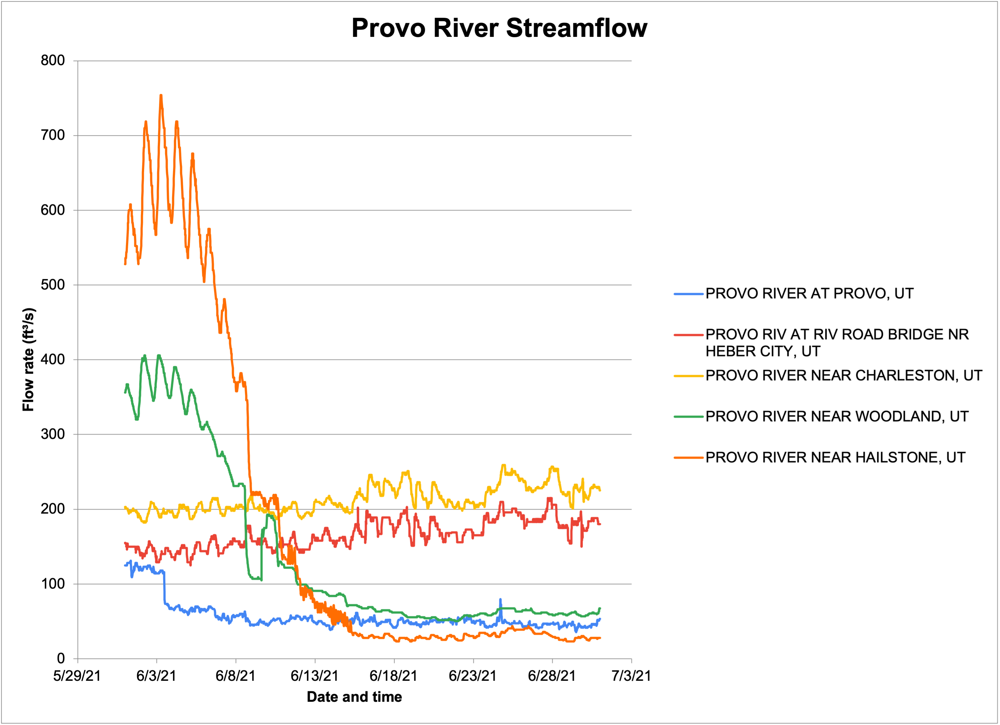
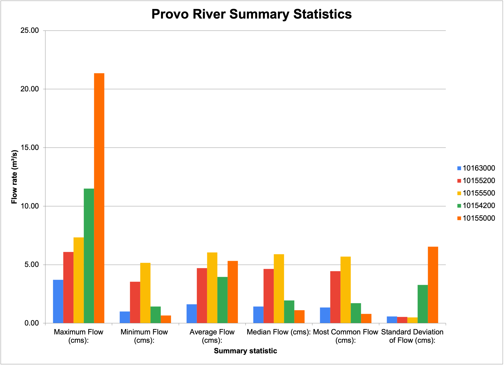
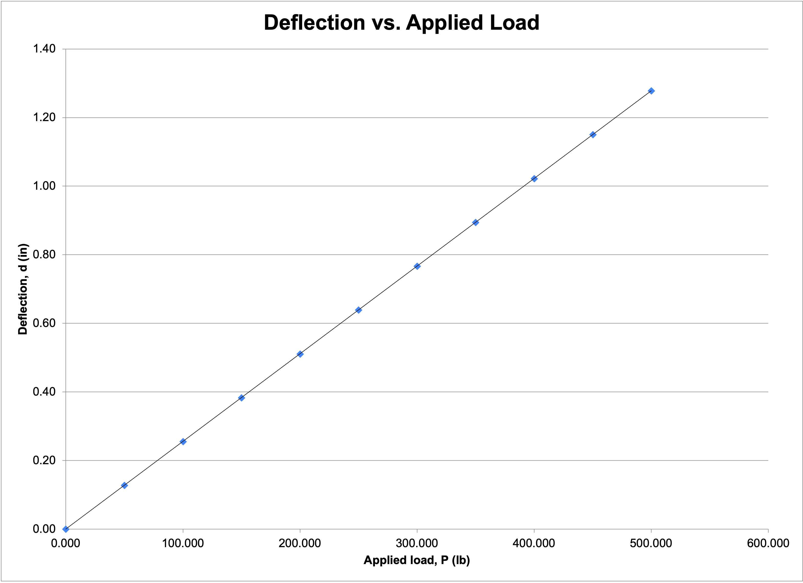

# HW: Graphing and Numerical Solver

**Purpose:** Use Goal Seek to reach a target, use Solver to maximize or minimize an objective subject to constraints, and create charts that match the type of data being displayed.

Review [Cells and Formulas](../../resources/excel_review/basic_excel_review.md) if you need a reminder about worksheets, ranges, formulas, or cell references.

---
## Getting Started

1. First make a copy of the starter workbook here: [(Starter-Workbook)-HW-Graphing-and-Solver.xlsx](%28Starter-Workbook%29-HW-Graphing-and-Solver.xlsx)
2. Remember to save it in the CCE 270 folder that you created in the first assignment.

---

## Part 1 - Simplified Missile Trajectory

This is a simplified mathematical trajectory exercise. It does not model interception, impact damage, building clearance, or safe landing. Use **Goal Seek** to find the two horizontal positions, $x$, where the modeled height is $y=50$.

1. Navigate to the `Missile Launch` worksheet.
2. In `K21`, enter the trajectory formula using the value of $x$ stored in `K22`:

   ```excel
   =-(K22^2)+155*K22
   ```

3. Enter a small positive starting value, such as `1`, in `K22`.
4. Open **Data > What-If Analysis > Goal Seek** and use:

   - **Set cell:** `K21`
   - **To value:** `50`
   - **By changing cell:** `K22`

5. Run Goal Seek, then copy and paste the resulting value of `K22` into `K28` (**1st Location**).
6. Enter a starting value near the far end of the plotted trajectory, such as `150`, in `K22` and run Goal Seek again with the same settings.
7. Copy and paste the second value of `K22` into `K29` (**2nd Location**).

Goal Seek normally returns the solution nearest the starting value. Use starting values on opposite sides of the trajectory to find both positions.

---

## Part 2 - Construction Materials Testing Allocation

A materials laboratory performs concrete cylinder tests and soil density tests. Use **Solver** to determine the number of each test that maximizes weekly contribution without exceeding available technician or equipment hours.

Navigate to the `Testing Allocation` worksheet. The model uses these data:

| Test | Contribution per test | Technician hours per test | Equipment hours per test |
|---|---:|---:|---:|
| Concrete cylinder | \$220 | 3 | 2 |
| Soil density | \$150 | 2 | 3 |
| Weekly capacity |  | 120 | 120 |

1. The yellow cells `E5:E6` hold the numbers of concrete cylinder and soil density tests. These are the **changing cells**.
2. Enter formulas in the blue cells: contribution by test in `F5:F6`, resource totals in `B10:B11`, and total weekly contribution in `B14`. Each total should use both test quantities and the corresponding values in the table.

<details>
<summary><b>Formula-planning hint</b></summary>

- Each value in `F5:F6` is the contribution per test multiplied by the number of tests.
- Each resource total is a `SUMPRODUCT` of the two per-test requirements and the two test quantities.
- `B14` is the sum of the two contributions in `F5:F6`.

</details>

3. Open **Data > Solver** and configure the model to:

   - **Maximize** the total weekly contribution.
   - Change both test-quantity cells.
   - Keep total technician hours at or below 120.
   - Keep total equipment hours at or below 120.
   - Require both test quantities to be nonnegative integers.
   - Use the **Simplex LP** solving method.

4. Solve the model and keep the Solver solution.
5. Verify the result: recalculate both resource totals and confirm that neither exceeds 120 hours. Also confirm that both test quantities are nonnegative whole numbers.

---

## Part 3 - Wide-Flange Beam Shape Optimization

A structural engineering firm is sizing a steel beam for a building. To reduce cost, the firm wants the lightest steel W-shape that meets three structural requirements (bending, shear, and deflection) and the architect's maximum depth. Use **Solver** to select that shape from a table of 289 W-shapes.

The model selects a shape by row number. `B6` holds a row number on the `Wide Flange Properties` worksheet, and `B5` uses `INDEX` to return the shape name in that row. Solver changes `B6` until it finds the lightest shape that satisfies every constraint.

1. Navigate to the `Steel Beam Optimization` worksheet.
2. Name the cells in the table below. Select a cell, type the name in the Name Box (left of the formula bar), and press Enter.

    | Variable | Cell | Name |
    |---|:---:|:---:|
    | Span | `B12` | `L` |
    | Distributed load | `B13` | `w` |
    | Modulus of elasticity | `B14` | `E` |
    | Moment of inertia | `B15` | `I` |

3. In `B7`, `B9`, `B10`, `B11`, and `B15`, use `VLOOKUP` and/or `MATCH` to return the weight ($W$), plastic section modulus ($Z_x$), depth ($d$), web thickness ($t_w$), and moment of inertia ($I_x$) of the shape in `B5`. The properties of every W-shape are in `Wide Flange Properties!A1:F290`. Each formula must update when `B5` changes.

<details>
<summary><b>Formula-planning hint</b></summary>

- Use `B5` as the `lookup_value` and lock the table range with absolute references.
- `MATCH` can find the column number from a column heading in `Wide Flange Properties!A1:F1`, such as `"Zx"`. This lets one formula pattern work for all five cells.
- Use `FALSE` as the last `VLOOKUP` argument so that it returns an exact match.

</details>

4. In `B19:B21`, enter formulas for the structural demands. Unit conversions are already included in the equations.

    | Cell | Demand | Equation | Units |
    |:---:|---|:---:|:---:|
    | `B19` | Maximum moment | $\dfrac{wL^2}{8}$ | k-ft |
    | `B20` | Maximum shear | $\dfrac{5wL}{8}$ | k |
    | `B21` | Maximum deflection | $\dfrac{(w/12)(12L)^4}{185EI}$ | in |

    The capacities in `C19:C21`, the depth limit in `C25`, and the checks in `B29:C32` are already entered.

5. Enter a starting row number, such as `2`, in `B6`. Confirm that `B5` displays a shape name and that `B7:B11`, `B15`, and `B19:B21` display numbers.
6. Open **Data > Solver** and configure the model to:

    - **Minimize** the weight in `B7`.
    - Change the row number in `B6`.
    - Keep `B6` between `2` and `290`.
    - Require each demand in `B19:B21` to be less than or equal to its capacity in `C19:C21`.
    - Require the actual depth in `B25` to be less than or equal to the maximum depth in `C25`.
    - Use the **Evolutionary** solving method.

7. Solve the model and keep the Solver solution.
8. Verify the result: every status in `C29:C32` must be `OK`. The Evolutionary method uses random trial solutions, so it can stop at a shape that is not the lightest or that fails a check. If any status is `NOT GOOD`, run Solver again.

!!! tip "Why Evolutionary?"
    `INDEX` and `VLOOKUP` make the weight jump from one row to the next, so the model is not smooth. Simplex LP and GRG Nonlinear require a linear or smooth model. Evolutionary does not. See the [Solver Setup](graphsolver_read.md#solver-setup) section of the reading.

---
## Part 4 - Graphing Streamflow Data

This data comes from [USGS Water Data for the Nation](https://waterdata.usgs.gov/nwis){:target="_blank"} and contains streamflow data for the Provo River in Utah.

1. Create an **XY Scatter with Straight Lines** chart from `Streamflow Data!A3:F2883` and move it to a chart sheet named `Chart 1`. Do not display markers because the chart contains 2,880 observations per station.

   - Horizontal axis: date/time
   - Vertical axis: flow rate (ft³/s)
   - Series: the five streamflow stations
   - Include a descriptive title, axis titles with units, and a legend.

An XY scatter chart treats each date/time as a numerical x-value, so it preserves the actual spacing between observations. It may still draw a line across a period with no observations. If a missing period must be visible, include blank values and set the chart to display empty cells as gaps.



2. Create a **clustered column chart** from `Summary Statistics!A10:F16` and move it to a chart sheet named `Chart 2`.

   - Horizontal axis: summary statistic
   - Vertical axis: flow rate (m³/s)
   - Series: the five streamflow stations
   - Include a descriptive title, axis titles with units, and a legend.



## Part 5 - Graphing Load Calculation Data

1. Create an **XY scatter chart with markers** from `Load Calculations!D20:E31` and move it to a chart sheet named `Chart 3`.

   - Horizontal axis: applied load, $P$ (lb)
   - Vertical axis: deflection, $d$ (in)
   - Add a linear trendline.
   - Include a descriptive title and axis titles with units. Include a legend only if it helps identify the data.



---
## Turning in/Rubric


!!! note "Do not put your name or NetID in the file"
    Learning Suite records who submitted each file, so your name is not needed
    inside the file itself. Leaving it out means your work can be graded
    anonymously, which keeps grading fair. This applies to scans and photos
    too — please don't write your name on the page.

**_REMINDER_** - For this class, **you will upload your Excel file directly to Learning Suite**. Make sure the file you upload is for the correct assignment and contains your finished work.

1. Make sure your work is saved, then close the workbook so that all of your changes are written to the file.
2. Go to the assignment in Learning Suite and upload your `.xlsx` file as an attachment.
3. Double-check that the file you uploaded is the one that contains your completed work.

---

**Rubric**

| Item | Points Possible |
|:---|:---:|
| Part 1: Correct trajectory formula | 2 |
| Part 1: Correct Goal Seek setup | 2 |
| Part 1: Found and recorded both roots | 3 |
| Part 2: Correct contribution and resource formulas | 3 |
| Part 2: Correct objective and changing cells | 2 |
| Part 2: Correct capacity, nonnegative, and integer constraints | 3 |
| Part 2: Used the Simplex LP solving method | 1 |
| Part 2: Retained a valid Solver result | 1 |
| Part 2: Verified the returned solution against both capacities | 1 |
| Part 3: All four cells named as the table instructs | 1 |
| Part 3: Correct VLOOKUP/MATCH property formulas in B7, B9, B10, B11, and B15 | 3 |
| Part 3: Correct demand formulas in B19:B21 | 2 |
| Part 3: Correct objective, changing cell, and row-number bounds | 1 |
| Part 3: Correct demand-capacity and depth constraints | 1 |
| Part 3: Used the Evolutionary solving method | 1 |
| Part 3: Retained a valid Solver result with all checks OK | 1 |
| Parts 4-5: Correct source range and chart type for all three charts | 6 |
| Parts 4-5: Correct axes, series, and trendline where required | 3 |
| Parts 4-5: Appropriate titles, units, legends, and chart-sheet names | 3 |
| <div style="text-align: right">**Total**</div> | **40** |

---

The following is not a part of the rubric, but specifies how you can lose points. For example: if you fail to upload your file correctly.

| **Reasons for Points Lost** |    **Amount**     |  
|:---------------------------:|:-----------------:|
|  File uploaded incorrectly  |       -10%        |
|  Turned in late (per week)  | -10% (up to -50%) |
