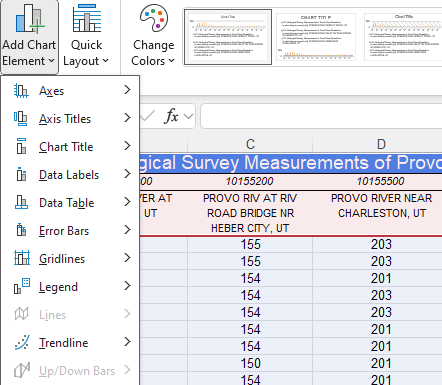
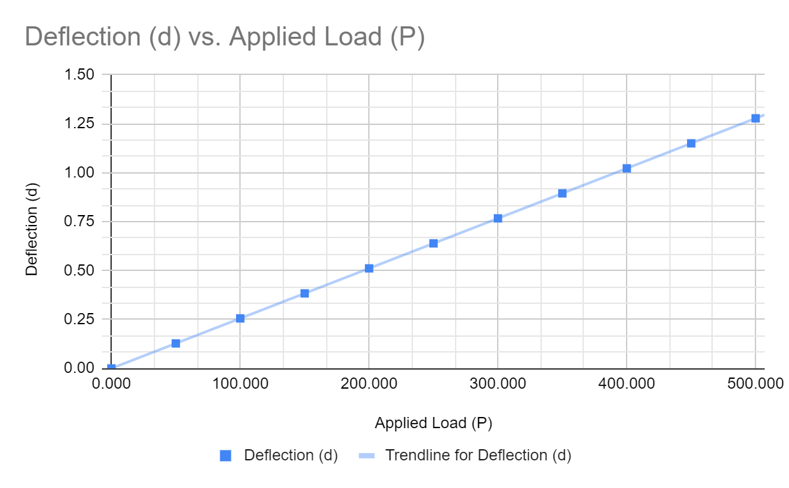

# HW: Graphing and Numerical Solver

**Purpose:** This assignment tests your ability to use the programs available to you in Excel to solve complex 
problems. In this assignment, you will proceed to test your knowledge on how to use Goal Seek, the Solver add-in, 
and organize data through creating various styles of graph.
---
## Getting Started

1. First make a copy of the starter sheet here: [(Starter-Workbook)-HW-Graphing-and-Solver.xlsm](%28Starter-Workbook%29-HW-Graphing-and-Solver.xlsm){:target="_blank"}
2. Rename it something like "[Your Name]-HW-Graphing-and-Solver"
3. Remember to save it in your OneDrive folder that you created in the first assignment.

!!!Note
      All of our previous files in class have been **.xls** files or Excel files. This file is an **.xlm** file. That means that the file contains macros, which are small programs that can automate tasks in Excel. You will need to enable macros when you open the file to use the Solver and Goal Seek functions. The macros in this file reveal a secret message when you solve the problems correctly.

---

## Part 1 - Asteroid Defense Missile Trajectory

You have just discovered that an asteroid is headed for Earth! You need to determine if the trajectory of an 
"asteroid-stopping" defense missile will clear the nearby buildings and destroy the asteroid before it impacts with earth.
Unfortunately a building is in the way, and you need to know if you can clear it with the current trajectory and 
land the remains in a safe zone. Your task is to use goal seek to determine the horizontal location of the missile when it reaches the height of the 
building. Copy 
and paste your answers into the appropriate cells. If you are right, something magical will happen!

1. Navigate to the "Missile Launch" Sheet.
2. In cell K21 enter the trajectory equation for the missile in terms of the horizontal distance (X) and the 
   vertical distance (Y). The trajectory equation is given as: 

$y = -(x^2)+ 155 *x$

3. In cell K22 enter a value for the horizontal distance (X) of the missile. This is the value that you will change to find the 
   horizontal location of the missile when it reaches the height of the building. Try entering a very small number 
   first. 
4. Head to **Data > What-If Analysis > Goal Seek**. The Goal Seek window will open.
5. Set the **"Set cell"** to K21 (the trajectory equation) and set the **"To value"** to 50 (the height of the building).
6. In the **"By changing cell"** box, enter K22 (the horizontal distance of the missile).
7. Click **"OK"** to run the Goal Seek. Excel will change the value in K22 to find the horizontal location of the missile when it reaches the height of the building.
8. Copy and paste the value of K22 into cell K28 or **"1st Location."** This is the first horizontal location of the 
   missile when it reaches the height of the building.
9. Now, you need to find the second horizontal location of the missile when it reaches the height of the building. 
   To do this, you will need to change the value in K22 to a larger number and run Goal Seek again.
10. Copy and paste the value of K22 into cell K29 or **"2nd Location."** This is the second horizontal location of 
    the missile when it reaches the height of the building.

Congratulations! You have found the horizontal locations of the missile when it reaches the height of the building!

---

## Part 2 - Missile Force Calculation 

Now that you've determined the horizontal location of the missile when it reaches the height of the building, 
    you need to find how much 
force it will take to hit the asteroid and destroy it. The missile is loaded with a payload that will destroy the 
asteroid on impact, but you need to ensure that the missile has enough force to reach the asteroid.

1. Navigate to the Missile & Asteroid Table. This table contains the data for the Missile and the Asteroid. Each 
   table contains the mass and acceleration of the object.
2. In cell N31 use the data provided to solve for the force of the missile using the equation: $F=m*a$
3. In cell Q31  solve for the force of the asteroid using the same equation.

### Setting up the Solver

Now that we have all of our data filled out, we are going to find the point where the force of the missile and 
   the asteroid are **equal** to each other. We are going to do this by changing the acceleration of the missile using 
**Solver**. The solver has three basic functions. The "Set Objective" parameter should always be the cell that 
contains the 
equation that you want to optimize. You can find a Max, Min, or a specific value. "By Changing Variable Cells" are 
the cells that you want to change to optimize the objective. "Subject to the Constraints" are the constraints that you want to apply to the optimization.

4. Go to **Data > Analyze > 
Solver**. The Solver Parameters window will open. Set the objective to cell N31 (the force of the missile) and set the 
    "Value of" to the value in cell Q31 (the force of the asteroid).
5. In the "By Changing Variable Cells" box, enter the cell that contains the acceleration of the missile (cell M31).
6. Click on "Add" to add a constraint. Set the constraint to be that the acceleration of the missile (cell M31) must 
   be greater than 0. This ensures that the missile has a positive acceleration.
7. Click "OK" to close the Add Constraint window.
8. Click "Solve" to run the Solver. The Solver will find the optimal acceleration for the missile that will make the 
   force of the missile equal to the force of the asteroid.

---
## Part 3 - Graphing Streamflow Data

This data comes from [USGS Water Data for the Nation](https://waterdata.usgs.gov/nwis){:target="_blank"} and contains 
streamflow data for the 
    Provo River in Utah. You will be creating three different charts using this data. Each chart should be on its own 
    sheet and should be titled appropriately. The colors of the charts should be changed to something other than the default colors.
1. Using the data in the "Streamflow" data sheet recreate this graph. Make sure to change the colors and include a 
   Title, Axis Labels, and a Legend. Put the chart on its own sheet called "Chart 1."

2. Using the data in the "Summary Statistics" data sheet recreate this graph. Make sure to change the colors and 
   include a 
   Title, Axis Labels, and a Legend. Put the chart on its own sheet called "Chart 2."

3. Using the data in the "Load Calculations" sheet recreate this graph. Make sure to change the colors and include a 
   Title, Axis Labels, and a Legend. Put the chart on its own sheet called "Chart 3."

---
## Turning in/Rubric

**_REMINDER_** - For this class, **you will only turn in the _links_ to your Excel files**. You will get a 0 for this assignment if you turn in an Excel file or a link that is not shareable. 

1. On the top right, click the share button --> share --> settings
2. Click "anyone" at the top, then underneath "More settings", change "can view" to "can edit". Then click apply. 
3. Copy the link, then turn it into Learning Suite in the feedback box for that assignment.

---

**Rubric**

|           Item (Goal Seek & Solver)            | Points Possible |
|:----------------------------------------------:|:---------------:|
|        Solved for Vertical Location (Y)        |        2        |
|       Solved for Horizontal Location (X)       |        2        |
|            Found the first location            |        2        |
|           Found the second location            |        2        |
|         Used Force formula for missile         |        2        |
|        Used Force formula for asteroid         |        2        |
|                Added constraint                |        1        |
|       Found equal force by using Solver        |        2        |
| 
**Total**
 |       15        |

|                Item (Graphing)                 | Points Possible |
|:----------------------------------------------:|:---------------:|
|            Chart 1 resembles image             |        2        |
|         Chart 1 is on a separate sheet         |        1        |
|            Chart 2 resembles image             |        2        |
|         Chart 2 is on a separate sheet         |        1        |
|            Chart 3 resembles image             |        2        |
|         Chart 3 is on a separate sheet         |        1        |
|       Charts are all labeled and titled        |        6        |
| 
**Total**
 |       15        |

---

The following is not a part of the rubric, but specifies how you can lose points. For example: if you fail to share your link correctly.

| **Reasons for Points Lost** |    **Amount**     |  
|:---------------------------:|:-----------------:|
|   Link shared incorrectly   |       -10%        |
|  Turned in late (per week)  | -10% (up to -50%) |
