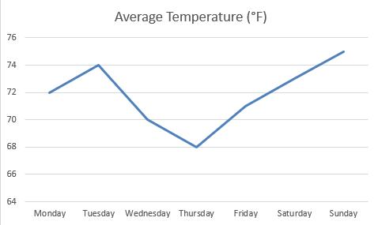

# HW: Graphing and Numerical Solver

**Purpose:** Learn how to use Solver to solve complex equations and graph data.

## Asteroid Defense Missile Trajectory

1. First make a copy of the starter sheet here:[(Your Name)-HW-Graphing-and-Solver.xlsm](%28Your%20Name%29-HW-Graphing-and-Solver.xlsm){:target="_blank"}
2. Rename it something like [Your Name]-HW-Graphing-and-Solver

An asteroid is headed for earth. You need to determine if the trajectory of an "asteroid-stopping" defense missile will clear the nearby buildings and destroy the asteroid before it impacts with earth.

!!!Note
      While all of our previous files in class have been **.xls** files, (Excel files), This file is an **.xlm** file.
That means that the file contains macros, which are small programs that can automate tasks in Excel. You will need to enable macros when you open the file to use the Solver and Goal Seek functions. The macros in this file reveal a secret message when you solve the problems correctly.

An asteroid is on a collision course with earth, and you need to shoot a missile at it to obliterate it. 
Unfortunately a building is in the way, and you need to know if you can clear it with the current trajectory and 
land the remains in a safe zone. Use goal seek to determine the horizontal location of the missile when it reaches the height of the building. Copy and paste your answers into the appropriate cells. If you are right, something magical will happen!

<b>Hint!</b>

  
Type the equation into K21 dependent on K22 (X). Run a Goal seek on K21 to equal 50 by changing the (X) value. Approach the Y value from both sides (You will need to initially set your (x) value to a low number and then a high number).

 

Use Solver to optimize the launch angle or velocity so the missile: Clears the building height of 50 m before a 
specific X value (e.g., < 155 m) and lands in a target zone (e.g., between 200 m and 250 m).

- Set Objective: A calculated Landing X or Missile Clearance
- To: Maximize or Set to target
- By Changing: Angle, Initial Velocity, etc.

Don't forget to add constraints! The Height at X = 155 ≥ 50, and the final X should be between 200 and 250.

Final X between 200 and 250

---
## Graphing Astronomical Data

1. Using the data in the Streamflow data sheet recreate this graph but change the colors to something else and put the chart on its own page called chart 1:

2. Using the data in the Streamflow data sheet recreate this graph but change the colors to something else and put the chart on its own page called chart 2:

3. Using the data in the Load Calculations sheet recreate this graph but change the colors to something else. Put the chart on its own sheet called chart 3:

---
### Turning in/Rubric

**_REMINDER_** - For this class, **you will only turn in the _links_ to your Excel files**. You will get a 0 for this assignment if you turn in an Excel file or a link that is not shareable. 

1. On the top right, click the share button --> share --> settings
2. Click "anyone" at the top, then underneath "More settings", change "can view" to "can edit". Then click apply. 
3. Copy the link, then turn it into Learning Suite in the feedback box for that assignment.

---

**Rubric**

|                 Item (Solver)                  | Points Possible |
|:----------------------------------------------:|:---------------:|
|        Solved for Vertical Location (Y)        |        2        |
|       Solved for Horizontal Location (X)       |        2        |
|            Found the first location            |        2        |
|           Found the second location            |        2        |
|      Used Solver to optimize launch angle      |        2        |
|        Used Solver to optimize velocity        |        2        |
|               Added constraints                |        2        |
|          Final x between 200 and 250           |        2        |
| 
**Total**
 |       16        |

|                Item (Graphing)                 | Points Possible |
|:----------------------------------------------:|:---------------:|
|    Chart 1 looks similar to the chart above    |        3        |
|         Chart 1 is on a separate sheet         |        1        |
|    Chart 2 looks similar to the chart above    |        3        |
|         Chart 2 is on a separate sheet         |        1        |
|    Chart 3 looks similar to the chart above    |        3        |
|         Chart 3 is on a separate sheet         |        1        |
| 
**Total**
 |       12        |

---

The following is not a part of the rubric, but specifies how you can lose points. For example: if you fail to share your link correctly.

| **Reasons for Points Lost** |    **Amount**     |  
|:---------------------------:|:-----------------:|
|   Link shared incorrectly   |       -10%        |
|  Turned in late (per week)  | -10% (up to -50%) |
