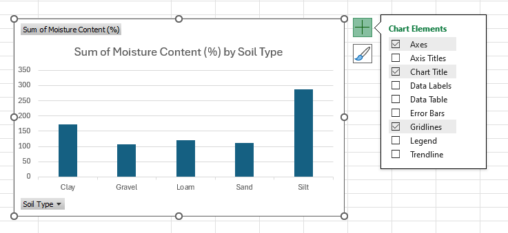
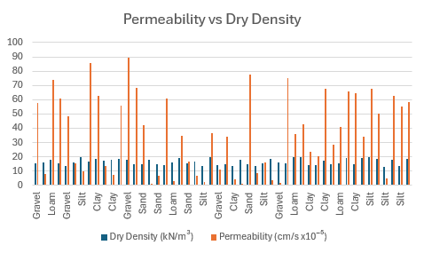
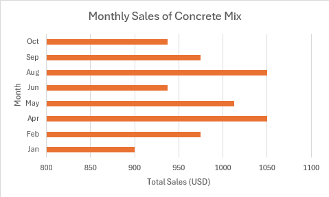
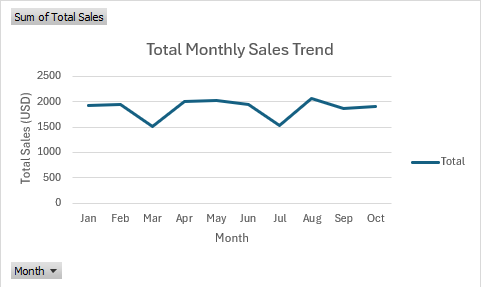

# Graphing and Numerical Solver
---

## Graphing Data
One of the most helpful tools in Excel is Graphing. This allows us to see trends in data, compare variables, and 
visualize the values in our data set. 
This can be hard to do by hand, and Excel makes it much easier! Let's walk through how to graph a given data set. 

1. Highlight the data that you want to graph. Sometimes you don't need all the data, so only highlight what you need. In the example below, there is too much information for one graph so only the needed columns were highlighted.

2. Select **Insert** > **Chart**

3. From here, Excel offers a large variety of options for a graph that suits your data. There is even an option for 
   Recommended Charts, which will automatically select the best graph for your data set. This is a great option if 
   you are unsure what type of graph to use. For this class, we will primarily use line, bar, column, and pie graphs.

4. After selecting the graph, check and make sure the data is on the proper x and y axes. If you would like to switch the x and y-axis, you can do so by right-clicking on the graph and selecting **Select 
   Data**. This will open a new window where you can change the data for the x and y axes.

5. From here you can change the data for the x and y axes, switch rows and columns, and edit the labels for the axes, 
   OR you can click on the **Switch Row/Column** which is useful when you want to change rows and columns in your data 
set 
(like turning a landscape table into a portrait one)
6. There are two sidebars next to the graph. The first is the plus sign (+) which is the _Chart Elements_ sidebar. 
   This allows you to add or remove elements from the graph such as a title, labels, and a legend.

7. The second option is the paintbrush icon which is the _Chart Styles_ sidebar. This allows you to change the style 
   and color of 
   the graph. 
8. If you would like to change the font, size, and color of the text in the graph, you can do so by 
   clicking on the text in the graph.

These are just a few of the ways that organizing/formatting can help us to distinguish 
our 
data. Other types of graphs have more unique features to them, but these are the general few! 

### Specific Examples

Often when we are trying to organize our data, we are trying to find the best possible way to visulize it. Here are 
just a few examples of specific types of graphs and their uses: 

**Line Graph**

Line graphs are used to show trends over time. They are useful for showing how a variable changes over a period of time, such as sales or temperature.

**Bar/Column chart**

Bar and column charts are used to compare different categories of data. They are useful for showing the differences between groups, such as sales by region or product.

**Pie Chart**

Pie charts are used to show the proportion of different categories in a whole. They are useful for showing how a variable is divided into different parts, such as market share or budget allocation.

This pie chart shows the amount of moisture content in different types of sand. Each slice represents a different 
type of sand, and the size of each slice represents the proportion of moisture content in that type of sand.

Here is an extra resource for further examples of graphing: [Graphing](https://support.microsoft.com/en-us/office/available-chart-types-in-office-a6187218-807e-4103-9e0a-27cdb19afb90){:target="_blank"}

---

## Solver in Excel
The Solver is a powerful tool in Excel that allows you to find an optimal value for a formula in one cell, subject 
to constraints on the values of other cells.The Solver can be used to find the maximum or minimum value of a formula by changing the values in the cells that are referenced by the formula. 

It can be used for various purposes, such as optimization problems, 
resource allocation, and financial modeling. The solver can handle linear and nonlinear problems, making it a 
versatile tool for data analysis. You can use the solver to find the maximum profit for a business, 
choose an optimal budget allocation, or minimize costs in a project.

### How to add Solver to Excel

To enable the **Solver Add-in** in Excel (it is not enabled by default), follow these steps:

1. Go to **File** > **Options** (found near the bottom of the left-hand menu).  
2. In the **Excel Options** window, select **Add-ins** from the sidebar.  
3. At the bottom, in the **Manage** dropdown, select **Excel Add-ins**, then click **Go...**  
4. In the **Add-Ins available** box, check the box next to **Solver Add-in**.  
5. Click **OK** to enable it.

After you load the Solver Add-in, the **Solver** command is available in the **Analysis** group on the **Data** tab. These steps only need to be completed once.

---
### Example Problem

The following workbook is an example of how to use the Solver. You are the owner of a soil testing business, and you 
are trying to calculate the cost per test that will allow your company to pay off a $25,000 piece of soil 
testing equipment in exactly 12 months, given they expect to perform 40 tests per month.

To open up the solver we go to **Data** > **Analysis** > **Solver** 

In general, the Solver is like [Goal Seek](https://byu-cce270.readthedocs.io/en/latest/unit1/3_pivot_goalseek/pivgolseek_read/#goal-seek){:target="_blank"} in that it 
iteratively changes one 
(or 
more) input cell(s) until some condition is met. But in this case there are three possible conditions (max, min, 
value of) and a set of constraints can be defined. When we use the **Value Of** option, it is essentially the same 
as Goal Seek. We are going to change **Set Objective** to the cell that contains the number of months it will take 
to pay off the equipment, which is cell B7 in this case.

The **Set Objective** cell is the cell containing the formula that represents the objective of the problem. In this case, it is the cell that contains the cost per test.

The **By Changing Variable Cells** are the cells that the solver will change to find the optimal solution. In this 
case, it is the cells that contains the number of projected site tests per month and cost per service.

The **Subject to the Constraints** section allows you to add constraints to the problem.

Using the options shown above, we can solve for by clicking the **Solve** button. Doing so brings up the following message:

Generally you want to select the OK option to keep the solver solution. The solution found by the solver is: **$52.08**

The real power of the solver is performing optimization using the **Max** and **Min** options. This is something 
that cannot be done with Goal Seek. 

For example, suppose we wanted to find the maximum number of months it takes to 
pay off equipment without changing the price. We might as well input our Total revenue and Profit to see how it affects 
our data.
We can do this by changing the **Set 
Objective** to **Max**, and adding the constraint that the site tests per month is not greater than 60. To add a 
constraint, click **Add** > input your **Cell Reference** and the **Constraint**. As the Solver iterates, a variety of input values are tested. Such constraints can ensure that the Solver algorithm stays stable and will be more likely to converge on a solution.

We then click the **Solve** button again. The result is shown below:

---

## Additional Readings

This is just a sample of the many things you can do with a solver. It is easy to use and can be extremely powerful and convenient. Here are some additional resources that you may find helpful:

* [Define and solve a problem by using Solver](https://support.microsoft.com/en-us/office/define-and-solve-a-problem-by-using-solver-5d1a388f-079d-43ac-a7eb-f63e45925040){:target="_blank"}
* [How to use Solver in Excel with examples](https://www.ablebits.com/office-addins-blog/excel-solver-examples/){:target="_blank"}
* [Solver in Excel](https://www.excel-easy.com/data-analysis/solver.html){:target="_blank"}

---

## Pre-Class Quiz Challenge

### Exercise #1 - Graphing 

Make sure to rename the starter sheet something like “[Your Name]-Pre-Graphing-and-Solver.”

In this workbook, we are going to be focusing on three main sheets: Sales_Data, Graphing, and Topographic Map. 

Navigate to the Sales_Data sheet in the starter workbook. This data contains sales information for an engineering 
surplus store. The data includes the month, region, product, units sold, unit price, and total sales. 

You are the employee tasked with creating graphs to visualize this data. 

First, your boss wants you to create a **pie chart** that shows **total sales by product.** Your end result should look 
similar to this: 

<b>Hint!</b>

it may be helpful to use a Pivot Table to summarize the data first...

 

Your boss would also like to see a **bar graph** that shows the **Monthly Sales of Concrete Mix** You should end up 
with a 
graph that looks similar to this: 

Finally, to visualize any trends in the data, your boss wants you to create a **line graph** that shows the **Total Sales by Month.** Your end result should look similar to this:

### Exercise #2 - Topographic Map

You need to create a topographic map of a hillside for a project. Your team has set up some GPS points with known 
horizontal distances from the base of the hill. Since the GPS device isn't accurate at giving elevations use the 
calculator below to find the correct elevations. 

1. Set up a goal seek on D18 dependent upon D19 changing to the values 
shown at the flag (you could also just type the value into the x input directly but practice using goal seek).
2. To find the minimum and maximum elevations set up a solver for D18 dependent upon D19 that has the conditions 
   $x>=1$ and 
$x<=1000$.

---

 ## Turning in/Rubric

**_REMINDER_** - For this class, **you will only turn in the links to your Excel files**. You will get a 0 for this assignment if you turn in an Excel file or a link that is not shareable. 

1. On the top right, click the share button --> share --> settings
2. Click "anyone" at the top, then underneath "More settings", change "can view" to "can edit". Then click apply. 
3. Copy the link, then turn it into Learning Suite in the feedback box for this assignment.

**Rubric:**

|                      Item                      | Points Possible |
|:----------------------------------------------:|:---------------:|
| 
**Total**
 |        5        |

The following is not a part of the rubric, but specifies how you can lose points. For example: if you fail to share your link correctly.

|               **Reasons for Points Lost**                | **Amount** |  
|:--------------------------------------------------------:|:----------:|
|                 Link shared incorrectly                  |    0.5     |
