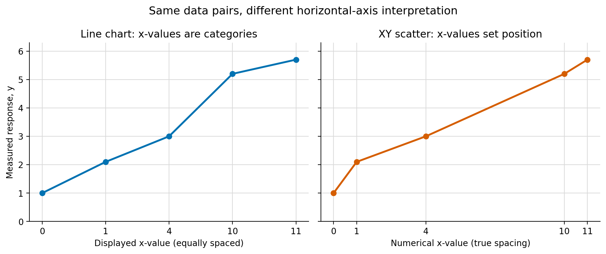
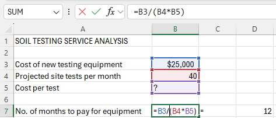

# Reading: Graphing and Numerical Solver

---

## Before You Begin

Review [Cells and Formulas](../../resources/excel_review/basic_excel_review.md) if you need a reminder about worksheets, ranges, formulas, or cell references.

In this topic, you will choose appropriate charts, use **Goal Seek** to reach a target, and use **Solver** to optimize a model with constraints.

## Choosing a Chart

A chart should match the question you are asking. **Recommended Charts** can suggest options, but you must decide whether a suggestion represents the data correctly.

| Question | Recommended chart |
|---|---|
| How do values compare across categories? | Bar or column |
| How does a value change over ordered time periods? | Line |
| How are two numerical variables related? | XY scatter |
| How is one total divided among a few categories? | Pie, used sparingly |

Bar and column charts perform the same basic comparison. Bars are horizontal and work especially well with long category names; columns are vertical. A pie chart is appropriate only when the slices are genuine parts of one meaningful whole.

### Line Chart versus XY Scatter

Line and XY scatter charts can look nearly identical, especially when both connect their points. The important difference is how Excel interprets the horizontal axis.

| Feature | Line chart | XY scatter chart |
|---|---|---|
| Horizontal axis | Category or date/time axis | Numerical value axis |
| Point spacing | Based on categories or time units | Based on the actual x-values |
| Typical purpose | Show a trend over ordered periods | Examine a relationship between two numerical variables |
| Example | Monthly streamflow | Applied load versus beam deflection |

The following charts contain the same unevenly spaced x-values. The line chart treats the displayed x-values as categories; the scatter chart places each point at its numerical x-coordinate.

For most scientific and engineering data with numerical x- and y-values, use an **XY scatter chart**. Use a line chart for an ordered series such as monthly totals. See Microsoft's [comparison of line and scatter charts](https://support.microsoft.com/en-us/excel/present-your-data-in-a-scatter-chart-or-a-line-chart) for more examples.

## Creating and Editing a Chart

1. Select only the data needed for the chart, including useful headings.
2. Select **Insert**, then choose the chart type that matches the question.
3. Check that Excel used the intended categories, series, and values.
4. Add a descriptive title and axis titles with units where applicable. Use a legend only when it helps identify categories or multiple series. Pie charts have no axes; use a legend or data labels to identify their slices.
5. Adjust the scale, labels, and formatting so the chart is readable and does not mislead.

Use **Chart Design > Select Data** to add or edit series. For an XY scatter chart, edit a series to specify its **Series X values** and **Series Y values**.

**Switch Row/Column** does not exchange the x- and y-axes. It changes whether Excel interprets rows or columns as data series and categories.

**Chart Filters** hide or show plotted series or categories. They do not filter, change, or delete the underlying worksheet data. A trendline can summarize an association between two variables, but an association alone does not establish that one variable causes the other.

### Useful Chart Shortcuts

| Action | Windows | Mac |
|---|---|---|
| Create an embedded chart from selected data | `Alt+F1` | Use **Insert > Recommended Charts** |
| Create a chart sheet | `F11` | `F11` or `Fn+F11` |
| Format the selected chart element | `Ctrl+1` | `Command+1` |

Keyboard mappings can vary with laptop function-key settings. The ribbon commands always provide the same tools.

For descriptions of other chart types, see [Available chart types in Office](https://support.microsoft.com/en-us/excel/available-chart-types-in-office).

---

## Goal Seek versus Solver

[Goal Seek](../3_pivot_goalseek/pivgolseek_read.md#goal-seek) and Solver both change inputs and recalculate formulas, but they answer different kinds of questions.

| Feature | Goal Seek | Solver |
|---|---|---|
| Purpose | Make one formula reach one target value | Reach a target, maximize, or minimize an objective |
| Changing cells | One | One or more |
| Constraints | No | Yes |
| Typical question | What input makes the result equal 50? | What feasible design produces the best result? |

Use **Goal Seek** when one changing cell must produce one target and no constraints are needed. Use **Solver** when you need a maximum or minimum, multiple changing cells, or constraints. Solver can also reach a specified value, but Goal Seek is simpler for a one-input target problem.

## Goal Seek Example: 12-Month Payback

Suppose a soil-testing business purchases equipment for $25,000 and expects to perform 40 tests per month. What fee per test will repay the equipment in exactly 12 months?

Open **Data > What-If Analysis > Goal Seek** and enter:

| Goal Seek box | Entry |
|---|---|
| Set cell | `B7` — months to repay |
| To value | `12` |
| By changing cell | `B5` — fee per test (labeled **Cost per test** in the figure) |

Goal Seek returns approximately `$52.08` per test. Check the result by confirming that the updated value in `B5` makes `B7` equal 12.

---

## Solver in Excel

Solver adjusts one or more decision cells to maximize, minimize, or reach a specified objective while satisfying constraints. Common applications include allocating resources, minimizing project cost, and maximizing profit.

!!! warning "Desktop Excel is required"
    Complete Solver work in the Windows or Mac desktop version of Excel. The standard Solver add-in cannot be used in Excel for the web or on mobile versions, including Android. If you normally use a mobile device, plan to use a desktop computer for these exercises.

### Enable the Solver Add-in

**Windows desktop**

1. Select **File > Options > Add-ins**.
2. Beside **Manage**, select **Excel Add-ins**, then **Go**.
3. Select **Solver Add-in**, then **OK**.

**Mac desktop**

1. Select **Tools > Excel Add-ins**.
2. Select **Solver Add-in**, then **OK**.

Solver will appear on the **Data** tab. These steps usually need to be completed only once. See Microsoft's [Solver installation instructions](https://support.microsoft.com/en-us/excel/load-the-solver-add-in-in-excel) if the add-in does not appear.

### Solver Setup

A Solver model has five parts:

1. **Objective cell:** a formula to maximize, minimize, or set to a value.
2. **Changing variable cells:** the decisions Solver may change.
3. **Constraints:** limits that define feasible solutions.
4. **Solving method:** the algorithm suited to the model.
5. **Validation:** a check that the result satisfies the formulas and constraints.

Choose the solving method based on the model:

- **Simplex LP:** linear models.
- **GRG Nonlinear:** smooth nonlinear models.
- **Evolutionary:** non-smooth or discontinuous models, including some models whose decision-dependent formulas use step functions.

### Solver Example: Allocate Limited Resources

An engineering firm performs site inspections and plan reviews. Each service provides a different contribution and uses different amounts of engineer and technician time. The firm wants to choose the weekly mix that maximizes total contribution without exceeding 48 hours of either resource.

Enter the following model in an empty worksheet, placing the five headings in `A3:E3` and the service data in rows 4 and 5. Use `E4:E5` for the numbers of services to perform.

| Row | Service | Contribution per service | Engineer hours per service | Technician hours per service | Number of services |
|---:|---|---:|---:|---:|---:|
| 4 | Site inspection | \$500 | 4 | 2 | Enter in `E4` |
| 5 | Plan review | \$400 | 2 | 4 | Enter in `E5` |

Enter these formulas and capacities:

| Cell | Meaning | Entry |
|---|---|---|
| `B8` | Total contribution | `=SUMPRODUCT(B4:B5,E4:E5)` |
| `B9` | Engineer hours used | `=SUMPRODUCT(C4:C5,E4:E5)` |
| `C9` | Engineer hours available | `48` |
| `B10` | Technician hours used | `=SUMPRODUCT(D4:D5,E4:E5)` |
| `C10` | Technician hours available | `48` |

`SUMPRODUCT` multiplies corresponding values and then adds the products. For example, the formula in `B9` calculates the engineer hours used by both services.

Open **Data > Solver** and configure:

| Solver setting | Entry |
|---|---|
| Set Objective | `B8` — total contribution |
| To | **Max** |
| By Changing Variable Cells | `E4:E5` — numbers of services |
| Constraints | `B9<=C9`, `B10<=C10`, `E4:E5>=0`, and `E4:E5` are integers |
| Solving Method | **Simplex LP** |

Solver returns 8 site inspections and 8 plan reviews, for a total contribution of \$7,200. Verify the solution: each resource uses exactly 48 hours. This is a meaningful optimization because increasing either service uses limited resources needed by the other service; the best answer is a mix rather than simply the largest permitted value of one input.

For more detail, see Microsoft's [Solver documentation](https://support.microsoft.com/en-us/excel/define-and-solve-a-problem-by-using-solver).

---

## Pre-Class Quiz Challenge

### Exercise 1 — Graphing Sales Data

Download the [(Starter-Workbook)-Pre-Graphing-and-Solver.xlsx](%28Starter-Workbook%29-Pre-Graphing-and-Solver.xlsx){:target="_blank"} workbook. It contains the worksheets `Monthly_Sales`, `Graphing`, and `Topo_Solver`.

Use the data in `Monthly_Sales!A1:F31`. Create any supporting PivotTables on a new worksheet or in unused cells, but place all three finished charts as embedded charts on the `Graphing` worksheet.

1. Create a **pie chart** of total sales by product.
2. Create a horizontal **bar chart** of monthly Concrete Mix sales.
3. Create a **line chart** of total sales by month.

<b>PivotTable field hints</b>

- Pie: **Product** in Rows; **Total Sales** in Values, summarized by Sum.
- Bar: **Month** in Rows; **Total Sales** in Values, summarized by Sum; filter **Product** to Concrete Mix.
- Line: **Month** in Rows; **Total Sales** in Values, summarized by Sum.
- Check that months appear in chronological order.

Give every chart a descriptive title. Add axis titles with units to the bar and line charts. For the pie chart, identify slices with a legend or data labels. Include a legend only when it adds useful information.

### Exercise 2 — Topographic Profile

On `Topo_Solver`, the formula in `B4` calculates elevation from the horizontal distance in `A4`. Local minima represent depressions, and local maxima represent peaks. Use Solver to obtain numerical estimates of their locations.

1. For each depression, enter a starting value in `A4` that lies inside the interval listed in `B7:B10`.
2. Set objective `B4` to **Min** by changing `A4`.
3. Translate the listed interval into two constraints. For example, \(200 \le x \le 350\) becomes `A4>=200` and `A4<=350`.
4. Select **GRG Nonlinear**, solve, and paste the resulting values from `A4:B4` into the corresponding answer row as **values only**.
5. Repeat for each peak listed in `B11:B13`, using **Max** instead of **Min** and a starting value inside that peak's interval.

<b>Why do the interval and starting value matter?</b>

The profile contains several local minima and maxima. GRG Nonlinear searches from the current starting value, while the two interval constraints isolate the feature you intend to find. Solver therefore returns a numerical estimate of that local feature, not a proof that it is the only or global optimum.

Check that each returned horizontal distance lies inside its required interval and that substituting it into the formula produces the recorded elevation.

---

## Turning In and Rubric

Upload the completed Excel workbook directly to Learning Suite.

1. Save and close the workbook so all changes are written to the file.
2. Upload the `.xlsx` file to the correct assignment.
3. Confirm that the uploaded file contains your completed work.

| Item | Points Possible |
|---|---:|
| Three appropriate and correctly labeled sales charts | 1.5 |
| Solver setup and numerical estimates for the topographic features | 1.5 |
| **Total** | **3** |

| Reasons for Points Lost | Amount |
|---|---:|
| File uploaded incorrectly | -10% |
