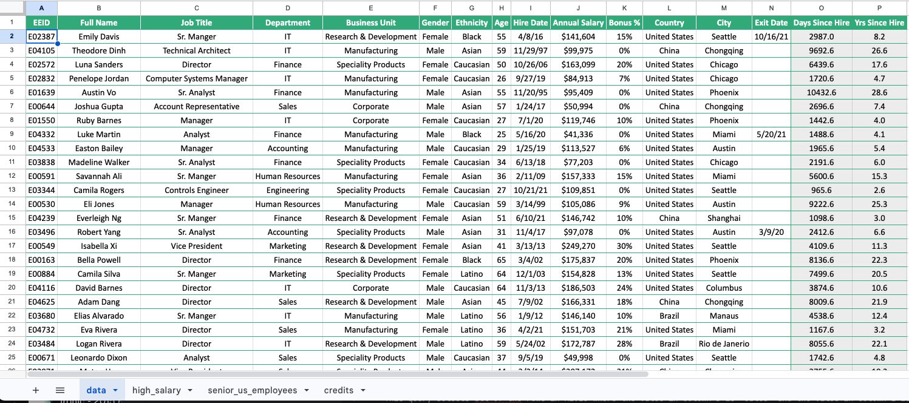
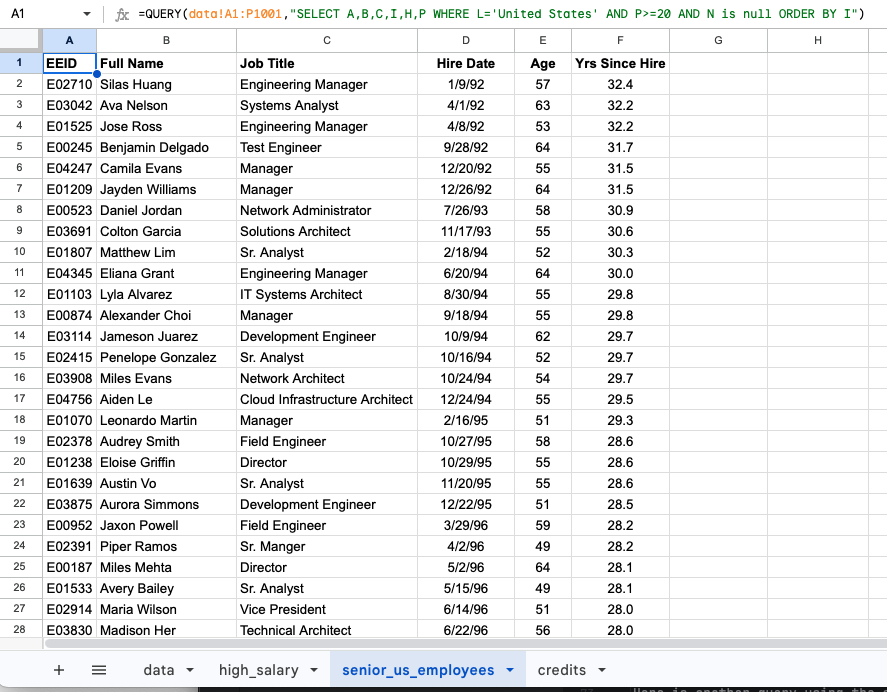

# Pivot Tables

**Pivot Tables** are used to summarize and analyze large sets of data in more meaningful ways. They can be used to narrow down data sets and see relationships between data points among other things. Pivot tables allow us to summarize multiple columns and rows of data at a time.

For example, here is a data set showing sales data for a set of regional sales managers:


The data set shows the sales data for a set of regional sales managers. The data set includes region, the product, 
the name of the sales rep, the number of units sold, and the total sales. Now suppose we want to create a summary of 
the units sold and the total sales in each region, organized by sales rep. We could manually extract that 
information from the table or we could use some combination of COUNTIF and SUMIF to accomplish this. Or we could 
find that information in a few clicks using a pivot table. The following steps show how to create a pivot table in 
Google Sheets. If you would like to follow along, you can use the following data set:

[Regional Sales Data](https://docs.google.com/spreadsheets/d/1HygXNHTQ9lTOVWQUdVSqpdcsOC05I2fCadVpGEYwrhs/edit?gid=51987489#gid=51987489){:target="_blank"}


## Creating Pivot Table

1. First, we select the data set. In this case, we select the cells in the range A1:F31.
2. Next, we select the Insert|Pivot table option from the menu. This will bring up the following dialog box:


We can either choose to put the pivot table in a new sheet or in the existing sheet. In this case, we will put the 
pivot table in an existing sheet named "summary". We will click on the Create button. This will create a new sheet with 
the 
pivot table. The pivot table will look like this:


## Editing the Pivot Table

Now we need to decide what data we want to summarize in the pivot table. We can do this using the Pivot table editor 
on the right. The editor will look like this:


3. Go to the editor and click on the **Add** button in the **Rows** section. Select the **Region** option. 
4. Click on the **Add** button in the **Rows** section. This time, select the **Sales Rep** option.

At this point you should see a list of regions and the sales reps for each region in the pivot table. This data set 
is a little odd in that the same sales rep is listed in multiple regions, so apparently the sales reps are not 
limited to work in a single region. Now we need to add the data that we want to summarize. 

5. Click on the **Add** button in the **Values** section. Select the **Units Sold** option. Notice that the "Summarize by" option is set to "SUM". This means that the pivot table will show the sum of the units sold for each sales rep in each region.
6. Click on the **Add** button in the **Values** section. Select the **Total Sales** option. Once agin, the default 
   is to summarize by sum. You can also summarize by min, max, average, count, and other options.

At this point, the pivot table should look like this:


Now we can see the total units sold and total sales for each sales rep in each region. We can also see the grand 
total of units sold and total sales for each region and the grand total for all regions. Here is another simple 
pivot table that shows the total units sold and total sales for each product:

:

As you can see, it only takes a few clicks to create a pivot table that summarizes a large data set in a meaningful 
way. Pivot tables are fun!

## Additional Readings

Below are some links to additional readings on pivot tables.

* [Google Sheets - Pivot Tables](https://support.google.com/docs/answer/1272900?hl=en-GB&co=GENIE.Platform%3DDesktop){:target="_blank"}
* [How to Use Pivot Tables in Google Sheets](https://www.howtogeek.com/407943/what-are-pivot-tables-in-google-sheets-and-how-do-i-use-them/){:target="_blank"}
* [Pivot Tables in Google Sheets](https://www.benlcollins.com/spreadsheets/pivot-tables-google-sheets/){:target="_blank"}

# Query Function
The **Query** function is a powerful function that is not available in Microsoft Excel, but is available in Google Sheets. In some ways, the query function is similar to applying a filter to a table containing a large set of data. Like the list option, it allows you to create a custom and often simplified view of the data in the table by apply one or more conditions and only display the rows in the table that match certain conditions. However, unlike a filter, the query function allows you to select and reorganize the columns that you want to view, including sorting the data by the values in one or more of the columns. Furthermore, with the query function you can create this summary of the table in an entirely different sheet.

The query function uses a query string that is based on SQL syntax. SQL stands for _Structured Query Language_. SQL is a standard language for storing, manipulating and retrieving data in databases. In the case of using the query function in Google Sheets, the data are stored in a table in Google Sheets and the query function is used to extract data from the table based on a set of conditions. Here is the general structure for the query function:

## Syntax

The syntax for the query function is as follows:

```=QUERY(data, query, [headers])```

The query function has three arguments:

- **data**: This is the range of cells that contains the data that you want to query. The data can be in the form of a range of cells, a named range, or a range of cells in another sheet.
- **query**: This is a text string in double quotes representing the query that you want to run on the data. The query is written in the form of a SQL query. The query can be a simple query that selects all the data in the table or a more complex query that selects only the data that meets certain conditions.
- **headers**: This is an optional argument that specifies whether the first row of the data contains headers. If the headers argument is set to TRUE, the first row of the data are treated as headers and is not included in the results of the query. If the headers argument is set to FALSE, the first row of the data are treated as data and is included in the results of the query. The default value for the headers argument is TRUE.

The way you formulate a query string is similar to how you would write a SQL query, but the syntax is slightly different. While SQL query strings can be fairly complex, for Google Sheets the syntax is simplified. The general structure of a query string is as follows:

```"SELECT _list of columns_ WHERE _conditional expression_ ORDER BY _column_"```

The **list of columns** is a comma separated list of the columns you want to include in the output. The **conditional expression** is a logical expression that filters the rows of the table. The **ORDER BY** clause is used to sort the output by a column.

The query string is case-insensitive, so you can write it in all caps or all lowercase, or any combination of the two.

Here is an example of a simple query that selects all the data in a table:

```=QUERY(A1:F5, "SELECT * WHERE C > 10")```

This query selects all the rows in A1:F5 where the value in column C are greater than 10 and returns all the columns. By contrast, this query:

```=QUERY(A1:F5, "SELECT A, B, D WHERE C > 10")```

returns only columns A, B, and D from the rows where the value in column C is greater than 10.

In some cases, you may want to apply multiple conditions to the data. You can do this by using the AND and OR operators in the query. For example, the following query selects all the data in the range A1:C5 where the value in column A is greater than 10 and the value in column B is less than 20:

```=QUERY(A1:C5, "SELECT * WHERE A > 10 AND B < 20")```

You can also use the OR operator to select data that meets one of two conditions. For example, the following query selects all the data in the range A1:C5 where the value in column A is greater than 10 or the value in column B is less than 20:

```=QUERY(A1:C5, "SELECT * WHERE A > 10 OR B < 20")```

In some cases, it is convenient to sort the data by the values in one of the columns. You can do this by using the ORDER BY clause in the query. For example, the following query selects the data in the range A1:C5 that meet the specified condition and sorts the data by the values in column A:

```=QUERY(A1:C5, "SELECT * WHERE C > 10 ORDER BY A")```

You can also use the ORDER BY clause to sort the data in descending order. For example, the following query selects the data in the range A1:C5 that meet the specified condition and sorts the data by the values in column A in descending order:

```=QUERY(A1:C5, "SELECT * WHERE C > 10 ORDER BY A DESC")```

## Example Problem - Employee Database

To best illustrate how the query function works, let's consider the following example. The following worksheet contains a table of information about employees in a large multinational corporation.

[Employee Data](https://docs.google.com/spreadsheets/d/1sUXazdoYdaaf5bpILrYyn8qKoJO5BTQ9aQ1Pdomc5J0/edit?usp=sharing){:target="_blank"}

Here is a screenshot of the data:


_(the data in this sheet came from this website: https://www.thespreadsheetguru.com/sample-data/)_

Now suppose we want to create a simplified summary of the data that only includes a subset of the columns and only the employees with a salary greater than $150,000. We can use the query function to do this. We also want to sort the results in order from high to low salary. We can apply this query a separate sheet. Here is the query that you would use:

```=QUERY(data!A1:P1001,"SELECT B,C,D,E,F,J WHERE J>150000 ORDER BY J DESC")```

Here is a screenshot of the results:


Note that the range includes the headings and therefore the query results includes the headings also. You should 
also note that a query function is dynamic. If the data in the source table changes, the results of the query will automatically update to reflect the changes. This is a powerful feature of the query function.

Here is another query using the same data. In this case, we want to select only employees in the United States that 
are still active and have worked for the company at least 20 years. To determine if they are active, we will check 
to see if the exit date in column N is blank. We will also sort the results by the date that they employees were 
hired so that the longest service employees are listed first. We will only include a few of the columns of interest 
in the result. As before, we will put the query in a separate sheet. Here is the query:

```=QUERY(data!A1:P1001,"SELECT A,B,C,I,H,P WHERE L='United States' AND P>=20 AND N is null ORDER BY I")```

Here is a screenshot of the results:



## Additional Readings

This is just a sample of the many things you can do with the query function. It is easy to use and can be extremely 
powerful and convenient. Here are some additional resources that you may find helpful:

* [Google Sheets Query Function Documentation](https://support.google.com/docs/answer/3093343?hl=en){:target="_blank"}
* [Google Sheets Query function: The Most Powerful Function in Google Sheets](https://www.benlcollins.com/spreadsheets/google-sheets-query-sql/){:target="_blank"}

## Pre-Class Quiz Challenge
Here is a link for the pre-class starter sheet: [Pre-Class Challenge](https://docs.google.com/spreadsheets/d/1U3q5NoCiYXrQ9XyYayJCNSyTibYSjzqggOx4_vNVk20/edit?gid=51987489#gid=51987489){:target="_blank"}

Note that this is a slightly modified version the regional sales data set that we used in the pivot table example above. 

### Instructions

**Pivot Table:**

1. Select the entire table on the **regional_sales_data** sheet and create a pivot table in the existing **pivot** sheet.
2. Use the Rows|Add feature to add the **Sales Rep** and **Product** columns in that order. Then add the **Units Sold** (Count) and **Total Sales** (Sum) columns as values. This will summarize the total units sold and total sales for each sales rep for each product.

**Query Function:**

3. In cell **A1** in the **query** sheet, create a query that references the data (A1:F31) in the **regional_sales_data** sheet and selects columns **A**, **C**, **D**, and **F** where the total sales value in column **F** is greater than or equal to **$4000**. Sort the results by the total sales value in descending order. This will show the date, product, sales rep, and total sales for all sales greater than or equal to $4000.
 
