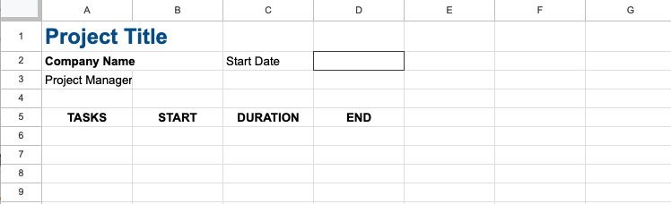
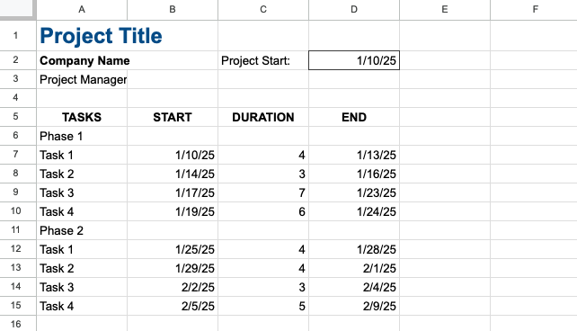

# In-Class Exercise: Gantt Chart/Project Scheduling and Tracking

The following exercise will have you create a simple Gantt chart in a Google sheets similar to the one featured in 
the video on the reading page. There are seven main steps to creating a Gantt chart in Google Sheets.

1. Project Information, Phases, and Tasks 
2. Creating the Timeline 
3. Applying Formatting 
4. Adding Progress Bars for Tasks on Timeline 
5. Making the Timeline Dynamic 
6. Adding Summary Progress Bars 
7. Summary Duration and Grouping 

For the in-class exercise, we will be completing steps 1-4. For the homework, you will complete steps 5-7.

To begin, open the in-class workbook: [Gantt Chart In-Class Starter Sheet](https://docs.google.com/spreadsheets/d/1H05DH9pcKG1q65efnIZw92OVbZCzvgBX7EyZPLdpek4/edit?gid=0#gid=0){:target="_blank"}. Make a copy 
and follow the instructions below.

## Step 1 - Project Information, Phases, and Tasks

In this step, you will add the project title, company name, project manager's name, and project start date to the Gantt chart. We will also enter some phases and tasks for the project.

Note that some of the information has already been entered in the starter sheet for you. You should see the following:

First, you will need to enter the following information:

1. Enter a name for your project in cell A1. [optional]
2. Enter your company name in cell A2. [optional]
3. Enter your name as the project manager in cell A3. [optional]
4. Enter a date in cell E5 for the project start date.

Now we need to enter some phases and tasks for the project. 

5. Enter "Phase 1" in cell A6.
6. Enter a series of tasks for Phase 1 in cells A7:A10.

You can use "Phase 1, Task 1", "Phase 1, Task 2", etc. as the phase and task names. In practice, you would use wider column widths and enter more descriptive phase and task names.

Next, we will enter the start and end dates for each task.

7. Enter the start date for each task in cells B7:B10. Typically, the start date for the first task is the project 
   start date.
8. Enter the duration for each task in cells C7:C10.
9. Calculate the end date for each task using a formula by adding the duration to the start date in cells D7:D10. Add the number of days to the start date and subtract 1 to get the end date.

**Note**: The instructions in the video say to add 1 to the end date of one task to get the start date of the next task. 
This assumes that you cannot start the next task until the previous task is completed. This is not always the case. 
So just enter independent start dates for each task. The start dates should be ascending order - that is, the start 
date of task 2 should be on the same day or after the start date of task 1, etc.

10. Copy-paste your Phase 1 title and tasks to cells A11:A15.
11. Modify the start dates and durations for Phase 2 tasks in cells B12:B15 and C12:C15.

(see 0:18 - 1:26 of the video)

At this point, your Gantt chart should look something like this:

## Step 2 - Creating the Timeline

In this step, you will create the timeline for the Gantt chart. You will use  a series of date functions including TODAY(), WEEKDAY(), LEFT(), and TEXT() to create the timeline.

1. Enter a date in cell F4 that is 1 day prior to the start date (will adjust this later).
2. Drag the date in cell F4 6 cells to the right to fill in a week's worth of dates.
3. Select the 7 dates, and use custom formatting to display only the day of the month.
4. Resize the columns to make the dates small boxes.
5. In cell F5, use the TEXT function to display the day of the week for the date in cell F4. (Hint: Use the "DDD" format). Then, use the LEFT function to display only the first letter of the day of the week.
6. Drag the formula in cell F5 to fill in the rest of row 5 for the week.

Now we want to add a header for the week with the date of the first day of the week.

7. Merge the cells F3:L3 and use a formula in the merged cell to reference the date of the first day of the week in cell F4. 
8. Change the date formatting to display the full date in the merged cell.

Next, we will copy our completed week to the next 3 weeks to the right to create a total of 4 weeks.

9. Select columns F:L and copy to the clipboard.
10. Paste the columns to M:S, T:Y, and Z:AG. At this point you will have 4 weeks of dates. **Note**: this is different from the video. In the video, the formatting is copy-pasted separately from the dates. You can do it that way if you prefer.
11. Change the date in cell F4 to reference the project start date in cell D2.
12. Enter a formula in cell G4 to reference the date in cell F4 plus 1 day. Drag the formula all the way to the right to fill in the rest of the dates for all 4 weeks.

Now try double-clicking on the project start date to select a new date and watch the timeline update.

(see 1:27 - 3:08 of the video)

At this point, your Gantt chart should look something like this:

## Step 3 - Applying Formatting

Now, let's clean things up. In this step, you will apply conditional formatting to the Gantt chart to color the cells 
between 
the start and 
end dates of each task. You will also apply formatting to make the Gantt chart look nice.

1. Select the entire worksheet and change the vertical alignment to center.
2. Adjust the column widths as needed to better fit the data.
3. Turn off gridlines for the entire worksheet.
4. Use horizontal alignment to center the contents of cells B3:AG16.
5. Left-justify week headers in row 3.
6. Adjust background colors, font colors, size, etc as needed to make the headers stand out.
7. Select the first week header (F3:L4) and add an outside border and a light fill color of your choice.
8. Copy-paste this formatting to the other week headers.
9. Format the phase rows with a background color and bold text.
10. Add horizontal borders to the task rows.

(see 3:09 - 5:14 of the video)

At this point, your Gantt chart should look something like this:

## Step 4 - Adding Progress Bars for Tasks on Timeline

In this step, you will add progress bars to the Gantt chart to show the progress of each task. This will consist of a color bar covering the dates associated with each task. We could add this manually, but there is a way to have it automatically update using conditional formatting.

1. Select all of the cells below the timeline where we want to put the progress bars (F6:AG15).
2. Add a conditional formatting rule to fill the cell with a color if the date in the cell is greater than or equal to the start date of the task and less than or equal to the end date of the task. Use the "Custom formula is" option for the conditional formatting rule. Then enter a formula as if you were in the upper left cell of the range. Use the AND() function to check if the date is greater than or equal to the start date and less than or equal to the end date. Use absolute references for the row and relative references for the column. Pick a color for the fill.

(see 5:15 - 6:00 of the video)

At this point, your Gantt chart should look something like this:

Yay! You have finished the in-class portion of the Gantt chart. Now you can finish the Gantt chart on your own for 
your homework assignment by completing steps 5-7.

---

## Turning in/Rubric
Turn sharing and editing on, then submit the link to Learning Suite in the feedback box. In-class assignment scores are based on valid effort and completion.
