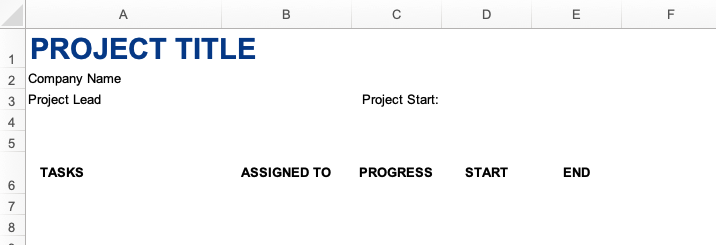
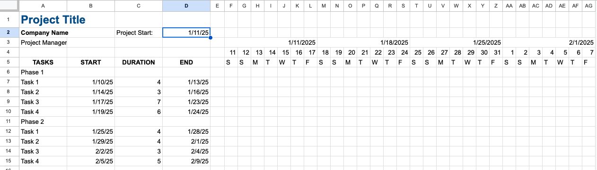
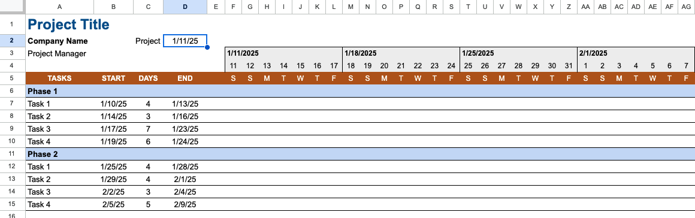
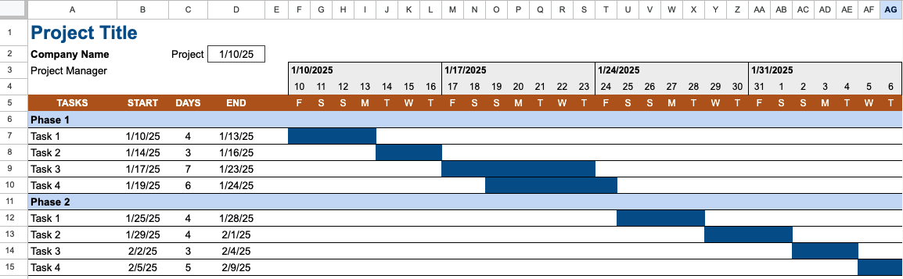
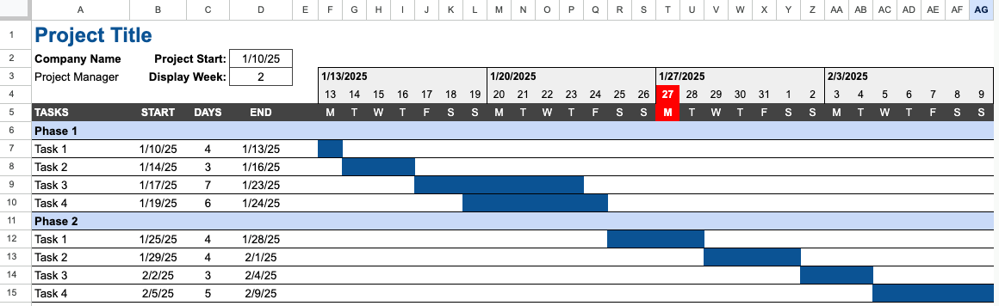
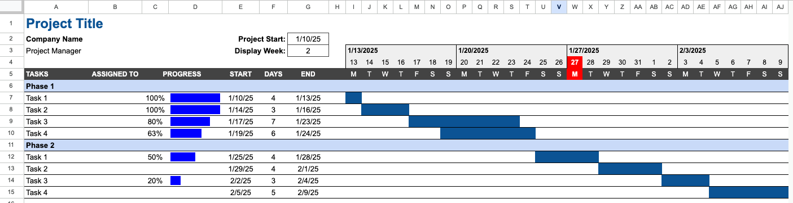
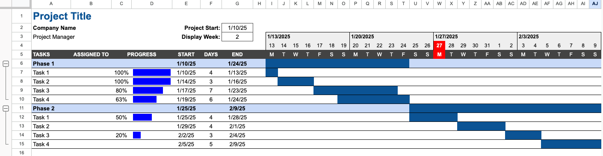

# In-Class Exercise: Gantt Chart/Project Scheduling and Tracking

The following exercise will have you create a simple Gantt chart in a Google sheets similar to the one featured in 
the video on the reading page. There are seven main steps to creating a Gantt chart in Google Sheets.

1. Project Information, Phases, and Tasks 
2. Creating the Timeline 
3. Applying Formatting 
4. Adding Progress Bars for Tasks on Timeline 
5. Making the Timeline Dynamic 
6. Adding Summary Progress Bars 
7. Summary Duration and Grouping 

For the in-class exercise, we will be completing steps 1-4. For the homework, you will complete steps 5-7.

To begin, open the in-class workbook and follow the instructions below. [(Starter-Workbook)-Class-Gantt-Chart.xlsx](%28Starter-Workbook%29-Class-Gantt-Chart.xlsx)

Be sure to rename the file to something like "(Your-Name)-Gantt-Chart-Class.xlsx" and save it in your OneDrive folder.

---

## Step 1 - Project Information, Phases, and Tasks

In this step, you will add the project title, company name, project manager's name, and project start date to the Gantt chart. We will also enter some phases and tasks for the project.

Note that some of the information has already been entered in the starter sheet for you. You should see the following:



First, you will need to enter the following information:

1. Enter a name for your project in cell A1.
2. Enter your company name in cell A2.
3. Enter your name as the project manager in cell A3.
4. Enter a date in cell C3 for the project start date. This should be the next time you have class. Also name this cell "project_start" (We will be using this name in formulas later).

Now we need to enter some phases and tasks for the project. 

5. Enter "Phase 1" in cell A7.
6. Enter a series of tasks for Phase 1 starting in cells A8.

You can use "Phase 1, Task 1", "Phase 1, Task 2", etc. as the phase and task names. In practice, you would use wider column widths and enter more descriptive phase and task names. Create at least 2 phases with 3-4 tasks each.

Next, we will enter the start and end dates for each task.

7. Enter the start date for each task in column B next to each task. Typically, the start date for the first task is the project 
   start date. The start date for the first task should reference the project start date in cell C3.

**Note**: The instructions in the pre class video say to add 1 to the end date of one task to get the start date of the next task. This assumes that you cannot start the next task until the previous task is completed. This is not always the case. So just enter independent start dates for each task. The start dates should be ascending order - that is, the start date of task 2 should be on the same day or after the start date of task 1, etc.

8. In E6, enter "WORK DAYS" to indicate that the duration for each task is in work days (not calendar days).
9. Enter the duration in column F for each task in column C.
10. In D8, enter a formula to calculate the end date for each task based on the start date and duration. Use the WORKDAY() function to calculate the end date. The WORKDAY() function takes a start date and a number of work days and returns the end date. Use absolute references for the start date and relative references for the duration.
11. Modify the formula in D8 to show nothing if the start date or duration is blank. Use the IF() function to check if either the start date or duration is blank. If either is blank, return nothing. Otherwise, return the end date using the WORKDAY() function. Then copy this formula to the rest of the tasks in column D.
12. Change the formatting of the chart to make it look more professional. You can fill the header row (row 6) with a color, indent the task and phase names, and add some borders to the table. You can board and highlight the project start date, work days, and start dates to help indicate that it is something to be filled in. You don't have to use the same colors as shown in our pictures. 
13. Select column B and insert a new column to the left. This will become the new column B.
14. In cell the new cell B6, enter "ASSIGNED TO". This is where you can enter the person responsible for each task.
15. Adjust the column widths as needed to fit the new column.

At this point, your Gantt chart should look something like this:


---

## Step 2 - Creating the Timeline

In this step, you will create the timeline for the Gantt chart. You will use  a series of date functions including TODAY(), WEEKDAY(), LEFT(), and TEXT() to create the timeline.

1. Enter a date in cell F4 that is 1 day prior to the start date (will adjust this later).
2. Drag the date in cell F4 6 cells to the right to fill in a week's worth of dates.
3. Select the 7 dates, and use custom formatting to display only the day of the month.
4. Resize the columns to make the dates small boxes.
5. In cell F5, use the TEXT function to display the day of the week for the date in cell F4. (Hint: Use the "DDD" format). Then, use the LEFT function to display only the first letter of the day of the week.
6. Drag the formula in cell F5 to fill in the rest of row 5 for the week.

Now we want to add a header for the week with the date of the first day of the week.

7. Merge the cells F3:L3 and use a formula in the merged cell to reference the date of the first day of the week in cell F4. 
8. Change the date formatting to display the full date in the merged cell.

Next, we will copy our completed week to the next 3 weeks to the right to create a total of 4 weeks.

9. Select columns F:L and copy to the clipboard.
10. Paste the columns to M:S, T:Y, and Z:AG. At this point you will have 4 weeks of dates. **Note**: this is different from the video. In the video, the formatting is copy-pasted separately from the dates. You can do it that way if you prefer.
11. Change the date in cell F4 to reference the project start date in cell D2.
12. Enter a formula in cell G4 to reference the date in cell F4 plus 1 day. Drag the formula all the way to the right to fill in the rest of the dates for all 4 weeks.

Now try double-clicking on the project start date to select a new date and watch the timeline update.

(see 1:27 - 3:08 of the video)

At this point, your Gantt chart should look something like this:



## Step 3 - Applying Formatting

Now, let's clean things up. In this step, you will apply conditional formatting to the Gantt chart to color the cells 
between 
the start and 
end dates of each task. You will also apply formatting to make the Gantt chart look nice.

1. Select the entire worksheet and change the vertical alignment to center.
2. Adjust the column widths as needed to better fit the data.
3. Turn off gridlines for the entire worksheet.
4. Use horizontal alignment to center the contents of cells B3:AG16.
5. Left-justify week headers in row 3.
6. Adjust background colors, font colors, size, etc as needed to make the headers stand out.
7. Select the first week header (F3:L4) and add an outside border and a light fill color of your choice.
8. Copy-paste this formatting to the other week headers.
9. Format the phase rows with a background color and bold text.
10. Add horizontal borders to the task rows.

(see 3:09 - 5:14 of the video)

At this point, your Gantt chart should look something like this:




## Step 4 - Adding Progress Bars for Tasks on Timeline

In this step, you will add progress bars to the Gantt chart to show the progress of each task. This will consist of a color bar covering the dates associated with each task. We could add this manually, but there is a way to have it automatically update using conditional formatting.

1. Select all of the cells below the timeline where we want to put the progress bars (F6:AG15).
2. Add a conditional formatting rule to fill the cell with a color if the date in the cell is greater than or equal to the start date of the task and less than or equal to the end date of the task. Use the "Custom formula is" option for the conditional formatting rule. Then enter a formula as if you were in the upper left cell of the range. Use the AND() function to check if the date is greater than or equal to the start date and less than or equal to the end date. Use absolute references for the row and relative references for the column. Pick a color for the fill.

(see 5:15 - 6:00 of the video)

At this point, your Gantt chart should look something like this:



**Purpose:** Learn how to format and display a project schedule using a Gantt chart in Google Sheets.

For your homework, we will complete the Gantt chart we started in class. We will:

* Make the timeline dynamic so that it always starts on a Monday and highlights the current day.
* Add summary progress bars to the Gantt chart.
* Add summary duration and grouping to the Gantt chart.

Start with the Gantt chart you created in class. If you were not able to complete the in-class activity, you will need to complete that first before starting the homework.

## Step 5 - Making the Timeline Dynamic

Before beginning, make a copy of your in class assignment and rename it according to the proper HW naming convention.

In this step, you will make the timeline dynamic so that it always starts on a Monday. This will ensure that the formatting of the Gantt chart is consistent. We will also highlight the current day on the timeline.

Notice that the first week always starts on the project start date. But it would be more convenvient if each of the weeks started on a Monday. We will add a formula to make this happen.

1. In cell F4, enter the following formula: 
```
=$D$2-WEEKDAY(D2,3)
```
2. Experiment with the start date to verify that the formula is working correctly.

Next, we will add a new control that lets us display the week we want to see. This will allow us to scroll through the weeks of the project beyond the first 4 weeks. For example, given the phases and tasks it is possible that the entire project would take more than 4 weeks. By changing the display week, we can see that week on the left and the subsequent 3 weeks after that.

3. In cell C3, enter "Display Week:".
4. In Cell D3, enter a number (1, 2, 3, etc.) to represent the week you want to display.
5. Change the formatting of cells C3 and D3 to make them match the formatting of the project start date (cells C2 and D2). Make sure D3 is formatted as a number and not a date.
6. In cell F4, edit the formula you edited above to add "+(D3-1)*7" to the end of the formula. This will allow you to change the display week and see the subsequent weeks of the project. 
7. Try entering different numbers in cell D3 to see how the display week changes.

Next, we will use conditional formatting to highlight the current day on the timeline.

8. Select cells F4:AG5.
9. Click on Format|Conditional formatting.
10. In the Conditional format rules pane, select "Custom formula is" from the dropdown.
11. Enter the following formula:
```
=F$4=TODAY()
```
12. Change the highlight color to red (or some other color that stands out) and the font to be white and bold.
13. Click on "Done" to apply the conditional formatting.

If necessary, change the project start date so that the current day is highlighted on the timeline.

(see 6:01 - 7:55 of the video)

At this point, your Gantt chart should look something like this:



## Step 6 - Adding Summary Progress Bars

In this step, you will add progress bars to the Gantt chart to show the progress of each task. We will use the sparkline feature to show a progress bar for each task.

1. Insert 3 new columns between A (Task) and B (Start). These new columns will become B, C, and D.
2. In cell B4, enter "ASSIGNED TO". This where you can enter the person responsible for each task.
3. In cell C4, enter "PROGRESS".
4. Adjust the column widths as needed to fit the new columns.
5. Select cells C6:C15 and change the format to "Percent".
6. Enter in some sample percentages for the progress of each task in cells C7:C10 and C12:C15. Leave a few of them blank indicating they have not started yet.

Next, we will add a sparkline to show the progress of each task based on the percentage complete.

7. Enter the following formula in cell D7: 
```
=SPARKLINE(C7,{"charttype","bar";"color1","blue";"max",1})
```
Note: You can choose a different color than blue if you like.

8. Copy the formula in cell D7 to cells D8:D15 using Paste Special|Paste Formula Only.

Note that for cells that do not have a percentage entered in the progress column, the sparkline will show an error. We can use the IFERROR() function to hide the error.

9. Edit the formula in cell D7 to the following:
```
=IFERROR(SPARKLINE(C7,{"charttype","bar";"color1","blue";"max",1}),)
```
10. Copy the formula in cell D7 to cells D8:D15 using Paste Special > Paste Formula Only.

Next, we will do a little cleanup.

11. Merge cells C5:D5.
12. Resize column C to just fit the percentage numbers and make the progress bars more visible.

(see 7:55 - 9:24 of the video)

At this point, your Gantt chart should look something like this:



## Step 7 - Summary Duration and Grouping

In this step, you will add a summary duration for each phase of the project and you will group the tasks into phases so they can be hidden or expanded as needed.

First, we will add a summary progress bar for each phase.

1. In cell E6, use the Min() function to find the minimum start date for all tasks in phase 1.
2. In cell G6, use the Max() function to find the maximum end date for all tasks in phase 1.

Note that when you finish entering these two formulas, you will see an overall time range bar for phase 1. This is because the Min() and Max() functions are finding the earliest start date and the latest end date for all tasks in phase 1.

3. Copy the formulas in cells E6 and G6 to cells E11 and G11 to find the start and end dates for phase 2.

Next, we will group the tasks into phases so they can be hidden or expanded as needed.

4. Select the rows for the tasks in phase 1 (rows 7-10).
5. Then, right-click and select "View more row actions|Group rows 7-10". **Note**: this command is located in a different place than was shown in the video.
6. Do the same for the tasks in phase 2 (rows 12-15).

Now you can hide or expand the tasks in each phase by clicking on the plus or minus sign just to the left to the phase title.

(see 9:25 - 10:30 of the video)

At this point, your Gantt chart is complete, and it should look something like this:



Congratulations. You did it!


---
			
## Turning in/Rubric

**_REMINDER_** - For this class, **you will only turn in the links to your Excel files**. You will get a 0 for this assignment if you turn in an Excel file or a link that is not shareable. 

1. On the top right, click the share button --> share --> settings
2. Click "anyone" at the top, then underneath "More settings", change "can view" to "can edit". Then click apply. 
3. Copy the link, then turn it into Learning Suite in the feedback box for that assignment.

**Rubric:**

|                      Item                      | Points Possible |
|:----------------------------------------------:|:---------------:|
| <div style="text-align: right">**Total**</div> |        5        |

---

The following is not a part of the rubric, but specifies how you can lose points. For example: if you fail to share your link correctly.

| **Reasons for Points Lost** |    **Amount**     |  
|:---------------------------:|:-----------------:|
|   Link shared incorrectly   |       -10%        |
|  Turned in late (per week)  | -10% (up to -50%) |