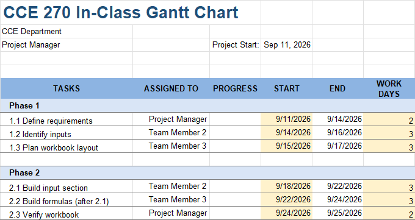
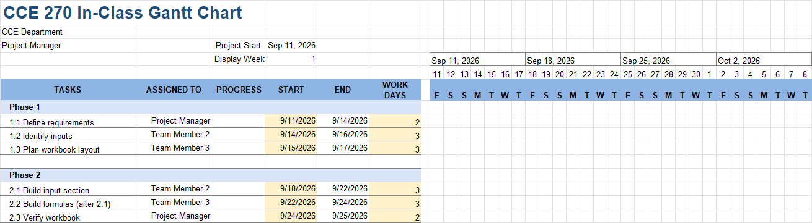
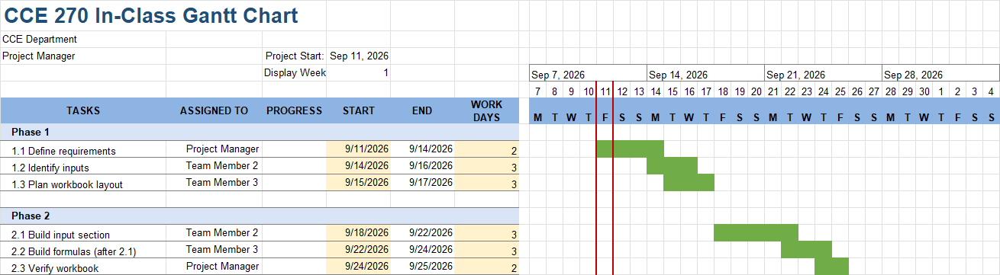
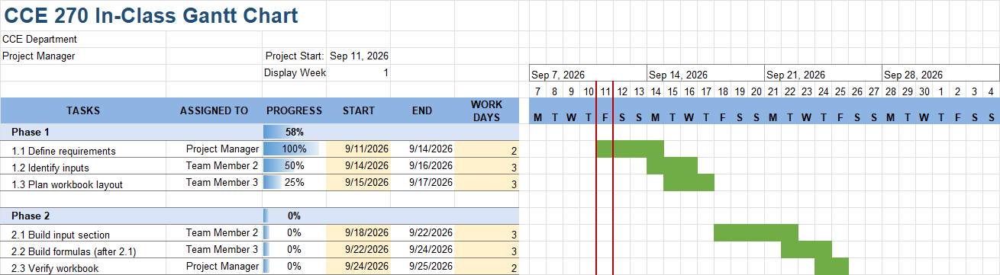
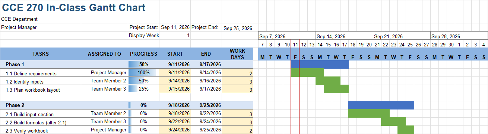

# In-Class Exercise: Gantt Chart and Project Scheduling

In this exercise, you will build a formula-driven Gantt chart. You will continue using the same workbook for homework, so complete each step and preserve the workbook structure.

Download [(Starter-Workbook)-Class-Gantt-Chart.xlsx](%28Starter-Workbook%29-Class-Gantt-Chart.xlsx) and save it in your CCE 270 folder. Do not enter your name or NetID. Use role labels when a person must be identified.

The exercise has seven parts:

1. Enter project information, phases, tasks, dates, and durations.
2. Create a four-week timeline.
3. Make the timeline respond to a display-week control.
4. Create task bars and a current-day marker.
5. Display task and phase progress.
6. Calculate and display phase-summary dates.
7. Identify weekends and manage rule order.

## Step 1: Build the Task Model

**Purpose:** Create the data that drives the schedule. Keeping task inputs in consistent columns allows one formula or formatting rule to work for every task.

The starter workbook contains headings in row 6. You will use the following structure:

| Row type | Task or phase | Assigned to | Progress | Start | End | Work days |
|:---------|:--------------|:------------|:---------|:------|:----|:----------|
| Phase 1 | `A7` | — | `C7` | `D7` | `E7` | blank |
| Phase 1 tasks | `A8:A10` | `B8:B10` | `C8:C10` | `D8:D10` | `E8:E10` | `F8:F10` |
| Phase 2 | `A12` | — | `C12` | `D12` | `E12` | blank |
| Phase 2 tasks | `A13:A15` | `B13:B15` | `C13:C15` | `D13:D15` | `E13:E15` | `F13:F15` |

### Student Task

1. Replace `PROJECT TITLE` in `A1` with a short project title.
2. Replace `Company Name` in `A2` with a company or organization name.
3. Replace `Project Lead` in `A3` with the role label `Project Manager`.
4. In `D3`, enter the date of your next class meeting.
5. Select `D3`, enter `project_start` in the Name Box to the left of the formula bar, and press Enter.
6. Enter `Phase 1` in `A7` and `Phase 2` in `A12`.
7. Enter three specific tasks under each phase in `A8:A10` and `A13:A15`. Use WBS numbers such as `1.1`, `1.2`, and `2.1` as part of each task name.
8. Assign every task to `Project Manager`, `Team Member 2`, or `Team Member 3` in column B.
9. Enter realistic Monday-through-Friday task start dates in the task rows of column D. The first task should use `=project_start`; if that date is on a weekend, use the next Monday instead. Tasks may overlap.
10. Enter `WORK DAYS` in `F6`, then enter a positive whole-number duration in each task row of column F.
11. In `E8`, calculate the task end date. Leave the cell blank when the start date or duration is blank. Copy the formula only to the other task rows.

The start date and work-day duration are inputs. The end date is a calculated result. Separating inputs from results makes the schedule easier to update and audit.

<details>
<summary><b>Formula hint for the task end date</b></summary>

Use `IF` and `OR` to test the two inputs, then use `WORKDAY`:

```excel
=IF(OR(D8="",F8=""),"",WORKDAY(D8,F8-1))
```

When the start date is Monday through Friday, `F8-1` counts it as the first workday. A one-workday task that starts Monday therefore ends Monday. Do not enter weekend task start dates in this exercise.

</details>

<details>
<summary><b>Optional: add a fourth task to a phase</b></summary>

Insert a worksheet row directly above the next phase row before you create formulas or conditional formatting. Copy the format of an existing task row into the inserted row. You must update the phase formulas and formatting ranges to include the new row.

</details>

### Format and Check

- Format `D3`, task start dates, and task end dates as dates.
- Format input cells, phase rows, and the row-6 headings consistently.
- Use indentation to distinguish tasks from phases.
- Change one duration and confirm that its end date changes.
- Confirm that a one-workday task has the same start and end date.
- Confirm that a task spanning a weekend excludes Saturday and Sunday from its work-day count.



## Step 2: Create the Timeline

**Purpose:** Create actual Excel dates across the chart. Conditional formatting will compare each task's dates with these timeline dates.

### Student Task

1. In `H5`, enter `=project_start`.
2. In `I5`, enter `=H5+1`, then fill the formula right through `AI5`.
3. Apply the custom number format `d` to `H5:AI5` so each cell displays only the day of the month.
4. In `H6`, enter `=LEFT(TEXT(H5,"ddd"),1)`, then fill the formula right through `AI6`.
5. Center `H5:AI6` and make columns `H:AI` narrow enough to resemble a calendar grid.
6. Merge `H4:N4`. In the merged cell, enter `=H5` and apply a readable date format.
7. Copy the completed week header to `O4:U4`, `V4:AB4`, and `AC4:AI4`. Each merged header should refer to the first date below it.

The cells in row 5 remain dates even though the `d` format displays only day numbers. This is important because calculations and conditional formatting require date values, not text labels.

### Check Your Work

- `H5:AI5` contains 28 consecutive dates.
- Each weekly header displays the first date of its seven-day block.
- Changing `project_start` changes every timeline date.



## Step 3: Make the Timeline Dynamic

**Purpose:** Let the user choose which four-week period is displayed without changing any task data.

### Student Task

1. Enter `Display Week:` in `C4`.
2. Enter `1` in `D4` and format it as a whole number.
3. Select `D4`, enter `display_week` in the Name Box, and press Enter.
4. Replace the formula in `H5` with a formula that finds Monday of the project-start week and advances seven days for each additional display week.
5. Enter different positive whole numbers in `D4` and observe the timeline.

<details>
<summary><b>Formula hint for H5</b></summary>

```excel
=project_start-WEEKDAY(project_start,3)+(display_week-1)*7
```

With return type 3, `WEEKDAY` returns 0 for Monday through 6 for Sunday. Subtracting that value finds Monday. The final term moves the display by whole weeks.

</details>

### Check Your Work

- When `display_week` is 1, `H5` is Monday of the week containing `project_start`.
- Increasing `display_week` by 1 moves every displayed date forward seven days.
- Task start and end dates do not change when the display changes.

## Step 4: Create Task Bars and Mark Today

**Purpose:** Convert task dates into bars without manually coloring cells. The bars will update when task dates change.

### Task-Bar Rule

1. Select `H7:AI15`.
2. Create a conditional-formatting rule using **Use a formula to determine which cells to format**.
3. Write a formula that colors a cell when the timeline date is between the task start and end dates and the row contains a work-day duration.
4. Choose a solid fill for task bars.

<details>
<summary><b>Task-bar formula and reference explanation</b></summary>

Use this formula for the upper-left cell of the selected range:

```excel
=AND($D7<>"",$E7<>"",$F7<>"",H$5>=$D7,H$5<=$E7)
```

`H$5` changes columns but always reads the timeline date in row 5. `$D7`, `$E7`, and `$F7` remain in their assigned columns but change rows. These mixed references let Excel evaluate every task against every displayed date.

</details>

### Current-Day Rule

5. Select `H5:AI15` and create another formula-based rule.
6. Use `=H$5=TODAY()` and apply a visible left and right border.

The current-day rule compares every timeline column with today's date. If today is outside the displayed four weeks, change `display_week` temporarily to test the rule.

### Check Your Work

- Change one task start date or duration. Its bar should move or change length.
- Phase rows should not yet display bars because their Work Days cells are blank.
- The current-day border should extend through one timeline column when today is displayed.



## Step 5: Display Progress

**Purpose:** Store progress as numeric percentages and display it without replacing the underlying values.

### Student Task

1. Format `C7:C15` as Percentage.
2. Enter a progress value in each of the six task rows. Use values from 0% through 100%.
3. Apply conditional-formatting Data Bars to `C7:C15`.
4. In `C7`, enter `=AVERAGE(C8:C10)`.
5. In `C12`, enter `=AVERAGE(C13:C15)`.
6. Bold or otherwise distinguish each phase row.

A blank progress cell means information is missing. A value of 0% means the task is defined but has not started. Enter a value for every defined task before calculating a phase average.

For this exercise, `AVERAGE` gives each task equal weight. A later project-control model could weight progress by work days, cost, or another measure of task size.

### Check Your Work

- Changing a task percentage changes its data bar.
- Each phase percentage changes when one of its task percentages changes.
- The percentage remains visible and numeric.



## Step 6: Add Phase and Project Summaries

**Purpose:** Summarize detailed task dates at the phase and project levels. These formulas are examples of rolling detailed data into management-level information.

### Student Task

1. In `D7`, enter `=MIN(D8:D10)`.
2. In `E7`, enter `=MAX(E8:E10)`.
3. In `D12`, enter `=MIN(D13:D15)`.
4. In `E12`, enter `=MAX(E13:E15)`.
5. Enter `Project End:` in `E3`.
6. In `F3`, enter `=MAX(E7:E15)` and format it as a date.
7. Create a second conditional-formatting rule for phase rows over `H7:AI15`. Use a darker fill than the task bars.

<details>
<summary><b>Phase-bar formula</b></summary>

```excel
=AND($D7<>"",$E7<>"",$F7="",H$5>=$D7,H$5<=$E7)
```

The blank Work Days test identifies phase-summary rows. The task-bar rule uses the opposite test, so the two rules serve different row types.

</details>

### Check Your Work

- Each phase starts on its earliest task start date.
- Each phase ends on its latest task end date.
- `F3` shows the latest end date in the project.
- Phase bars use different formatting from task bars.



## Step 7: Identify Weekends and Manage Rule Order

**Purpose:** Add calendar context while preserving the task and phase bars.

### Student Task

1. Select `H5:AI15`.
2. Create a formula-based conditional-formatting rule using `=WEEKDAY(H$5,2)>5`.
3. Apply a light gray fill or light pattern.
4. In the conditional-formatting rules manager, place the weekend rule below the task, phase, and current-day rules so it does not hide them.

The formula returns TRUE for Saturday or Sunday because `WEEKDAY(date,2)` numbers Monday through Sunday as 1 through 7. This direct test is easier to interpret than calculating the number of workdays between the same date.

### Final Check

- Change `display_week` and verify that weekend formatting remains aligned.
- Change a task input and confirm that its end date, task bar, phase summary, and project end update.
- Confirm that task bars, phase bars, weekend formatting, and the current-day marker remain distinguishable where their rules overlap.
- Save the workbook. You will continue from this file for homework.


## Additional Features

The optional video [Working with Work Days](https://youtu.be/5or9BN3GanM?si=vqCg6j2NkW6HjevW){:target="_blank"} demonstrates additional timeline controls. Features such as holiday calendars, automatic dependencies, resources, and critical path are outside this exercise.

## Turning In

Upload the completed `.xlsx` file directly to Learning Suite.

1. Save and close the workbook.
2. Upload it to the correct in-class assignment.
3. Confirm that the uploaded file contains the completed seven-step chart.
4. Keep your local copy because the homework continues from it.

**Rubric:**

| Item | Points Possible |
|:-----|:---------------:|
| Task model, formulas, and named inputs are functional | 2 |
| Timeline and conditional-formatting rules are functional | 2 |
| Workbook is saved and retained for the homework continuation | 1 |
| **Total** | **5** |

The following deductions are separate from the rubric.

| Reason for Points Lost | Amount |
|:-----------------------|:------:|
| File uploaded incorrectly | -10% |
| Turned in late, per week | -10% up to -50% |
