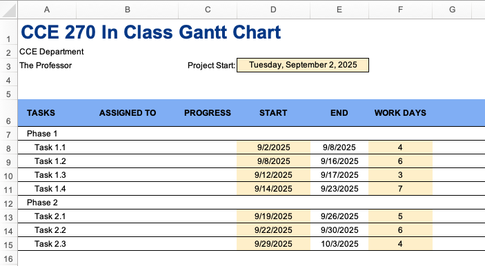
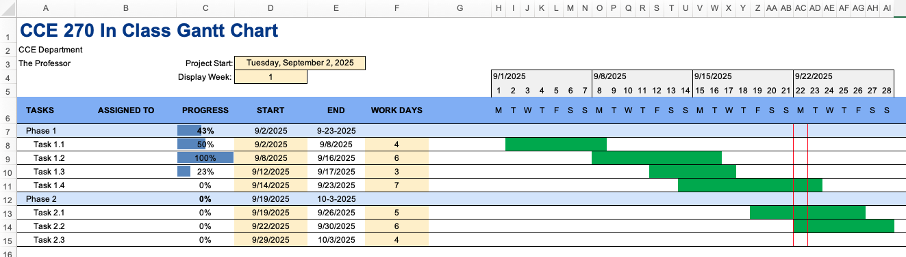

# In-Class Exercise: Gantt Chart/Project Scheduling and Tracking

The following exercise will have you create a simple Gantt chart in Excel similar to the one featured in the video on the reading page and a few other features. 

We will use  seven main steps to create a Gantt chart in Excel.

1. Project Information, Phases, and Tasks 
2. Creating the Timeline 
3. Applying Formatting 
4. Adding Progress Bars for Tasks on Timeline 
5. Making the Timeline Dynamic 
6. Adding Summary Progress Bars 
7. Summary Duration and Grouping 

For the in-class exercise, we will be creating a basic Gantt, later in the homework, you will be adding some 
additional functionality. .

To begin, open the in-class workbook and follow the instructions below. [(Starter-Workbook)-Class-Gantt-Chart.xlsx](%28Starter-Workbook%29-Class-Gantt-Chart.xlsx)

Be sure to rename the file to something like "(Your-Name)-Gantt-Chart-Class.xlsx" and save it in your OneDrive folder.

---

## Step 1 - Project Information, Phases, and Tasks

In this step, you will add the project title, company name, project manager's name, and project start date to the Gantt chart. We will also enter some phases and tasks for the project.

Note that some of the information has already been entered in the starter sheet for you. You should see the following:


### General Project Information
First, you will need to enter the following information:

1. Enter a name for your project in cell A1.
2. Enter your company name in cell A2.
3. Enter your name as the project manager in cell A3.
4. Enter a date in cell C3 for the project start date. This should be the next time you have class. Also name this cell "project_start" (We will be using this name in formulas later).
* remember, cell or range names should not have spaces in them.

### Phases and Tasks
Now we need to enter some phases and tasks for the project. 

5. Enter "Phase 1" in cell A7.
6. Enter a series of tasks for Phase 1 starting in cells A8.

You can use "Phase 1, Task 1", "Phase 1, Task 2", etc. as the phase and task names. In practice, you would use wider column widths and enter more descriptive phase and task names. Create at least 2 phases with 3-4 tasks each.

For this simple sheet, it is helpful if the Phases will be left justified and the tasks right justified. This isn't 
required for your homework, but it does help make the chart easier to read.

* **Note**: For  most projects the numbering for tasks is a sub-set of the phase number. For example, if Phase 1 has 3 
  tasks, they would be numbered 1.
1, 1.2, and 1.3. So the tasks for Phase 2 would be numbered 2.1, 2.2, etc. These nubmers are often called the WBS (Work 
Breakdown Structure) numbers. You will learn about them in your 300 level CFM class.


### Task Dates and Duration
Next, we will enter the start and end dates for each task. (We will not add start dates fro the Phases).

7. Enter the start date for each task in column C next to each task. Typically, the start date for the first task is  the project 
   start date. For this project, the  start date for the first task should reference the project start date in 
   cell C3 using the cell/range name "project_start" we applied above.

* **Note** if the cell you enter the cell/range name is is not formated as a date, a number will appear. Change the 
  formatting to a date format to see the date. The "Short Date" format is a good choice.


* **Note**: The instructions in the pre-class video say to add 1 to the end date of one task to get the start date  of the next task. This assumes that you cannot start the next task until the previous task is completed. This is not always the case. So just enter independent start dates for each task. The start dates should be ascending order - 
that is, the start date of task 2 should be on the same day or after the start date of task 1, etc. Most projects 
  have tasks that are done in parallel, so the start date of one task may be before the end date of another task.

 
Finish this step by adding your  your own start dates for all the tasks you entered.

8. Add a new column named "Work Days" in In F6, we used the title  "WORK DAYS" to indicate that the duration for 
   each task is in  work days (not calendar days).
9. Enter the duration in column F for each task in column C.
10. In D8, enter a formula to calculate the end date for each task based on the start date and duration. Use the WORKDAY() function to calculate the end date. The WORKDAY() function takes a start date and a number of work days and returns the end date.
11. Modify the formula in D8 to show nothing if the start date or duration is blank. Use the IF() function to check if either the start date or duration is blank. If either is blank, return nothing. Otherwise, return the end date using the WORKDAY() function. Then copy this formula to the rest of the tasks in column D.

* **Note**: Use the IF() function combined with the ISBLANK with the WORKDAY function you used above. In English the 
  statement would be IF Cell C7 is blank, the this cell is blank, if not do the workday function. To make a cell 
  blank in Excel use "" with no space between the quotes. The format for the IF statement is IF(logical_test, 
  value_if_true, value_if_false).. The logical test would be ISBLANK(). The value if true would be "" and the value if false would be the WORKDAY function.

### Formatting
12. Change the formatting of the chart to make it look more professional. You can fill the header row (row 6) with a 
    color, indent the task and phase names, and add some borders to the table. You can put boarders around  and 
    highlight the 
    project start date, work days, and start dates to help indicate that it is something to be filled in. You don't have to use the same colors as shown in our pictures. 
13. Select column B and insert a new column to the left. This will become the new column B.
14. In cell the new cell B6, enter "ASSIGNED TO". This is where you can enter the person responsible for each task.
15. Adjust the column widths as needed to fit the new column.

At this point, your Gantt chart should look something like this:



---

## Step 2 - Creating the Timeline

In this step, you will create the timeline for the Gantt chart. You will use  a series of date functions including 
TODAY(), WEEKDAY(), LEFT(), and TEXT() to create the timeline. We will start the timeline in column H. You may want 
to review the video on the reading page to see an example of how this is done.

In your Gantt chart, row 5 will be the dates for the timeline and row 6 will be the days of the week. 

1. In  cell H5 reference the project start date in cell D3. Use the name "project_start" you applied above.
2. In cell I5, enter a formula to reference the date in cell H5 plus 1 day. Then drag the formula to the right to 
   fill in the rest of row 5 for a week (7 days). Make the data go through column N.
3. Select the 7 dates, and use custom formatting to display only the day of the month. (You can quickly pull up the 
   custom formatting dialog by pressing Ctrl+1 on Windows or Command+1 on Mac). Select the "d" format to display 
   only the day of the month. _This may not be a choice, but pick one that starts with "d" and then modify it to 
   just be "d"._
4. Resize the columns to make the dates small boxes and center the dates.

### Days of the week
5. In cell H6, use the TEXT function to display the day of the week for the date in cell H5. (Hint: Use the "DDD" 
   format). Then, use the LEFT function to display only the first letter of the day of the week. So the formula in  H6 would be something like: left(text(H5,"DDD"),1). 
6. Drag the formula in cell H6 to fill in the rest of row 5 for the week.

### Week Header
Now we want to add a header for the week with the date of the first day of the week.

7. Merge the cells H4:N4 and use a formula in the merged cell to reference the date of the first day of the week in cell H5. 
8. Change the date formatting to display the full date in the merged cell.
9. Add a border around the week header and fill it with a color of your choice.

### Copying the Week
Next, we will copy our completed week to the next 3 weeks to the right to create a total of 4 weeks.

10. Select columns H:N and copy to the clipboard. Paste the columns to O:U. You will then need to modify O5 to reference the date in N5 plus 1 day. Now copy the columns O:U to the clipboard.
11. Paste the new columns to V:AB and AC:AI. At this point you will have 4 weeks of dates.

Now try double-clicking on the project start date to select a new date and watch the timeline update.

At this point, your Gantt chart should look something like this:


---

## Step 3 - Adding Progress Bars for Tasks on Timeline

In this step, you will add progress bars to the Gantt chart to show the progress of each task. This will consist of a color bar covering the dates associated with each task. We could add this manually, but there is a way to have it automatically update using conditional formatting.

1. Select all of the cells below the timeline where we want to put the progress bars (H7:AI15).
2. Add a conditional formatting rule to fill the cell with a color if the date in the cell is greater than or equal to the start date of the task and less than or equal to the end date of the task. Use the "Custom formula is" option for the conditional formatting rule. Then enter a formula as if you were in the upper left cell of the range. Use the AND() function to check if the date is greater than or equal to the start date and less than or equal to the end date. Use absolute references for the row and relative references for the column. Pick a color for the fill.


---

## Step 4 - Making the Timeline Dynamic

In this step, you will make the timeline dynamic so that it always starts on a Monday. This will ensure that the formatting of the Gantt chart is consistent. We will also highlight the current day on the timeline.

Notice that the first week always starts on the project start date. But it would be more convenient if each of the weeks started on a Monday. We will add a formula to make this happen.
### Starting the Week on a Monday
1. In cell H5 (the first cell in the calendar row), enter the following formula and format the cell as a date. This 
   formula will calculate the date of the Monday of: the week that contains the project start date.
```
=project_start-WEEKDAY(project_start,3)
```

2. Experiment with the start date to verify that the formula is working correctly.

Next, we will add a new control that lets us display the week we want to see. This will allow us to scroll through the weeks of the project beyond the first 4 weeks. For example, given the phases and tasks it is possible that the entire project would take more than 4 weeks. By changing the display week, we can see that week on the left and the subsequent 3 weeks after that.

### Display Week Control

3. In cell C4, enter "Display Week:".
4. In Cell D4, enter a number (1, 2, 3, etc.) to represent the week you want to display.
5. Change the formatting of cells C4 and D4 to make them match the formatting of the project start date (cells C3 and D3). Make sure D4 is formatted as a number and not a date. 
6. Name the cell D4 "display_week".
7. In cell H5, edit the formula you edited above to add "+(display_week-1)*7" to the end of the formula. This will  allow you to change the display week and see the subsequent weeks of the project. 
8Try entering different numbers in cell D4 to see how the display week changes.

### Add Gantt Bars using Conditional Formatting
Next, we will use conditional formatting to highlight the current day on the timeline.

9. Select cells H5:AI15.
10. Click on Format|Conditional formatting and Select "New Rule"
11. In the Conditional format rules pane, select "Use a formula to determine which cell to format" from the dropdown.
12. We want to rule to format the cell if the date at the top of the column is between the start and end dates for 
    the task in that row. We will need to use a logical AND function to check if the date is greater than or equal to the start date and less than or equal to the end date. The formula will be entered as if you were in the upper left cell of the range. Use absolute references for the row and relative references for the column.

    Enter the following formula:
```
=AND(H$5 >= $D7, H$5 <= $E7)
```
This rule look at the date in row 5 of the current column (H\$5) and checks if it is greater than or equal to the start date in column D (\$D7) and less than or equal to the end date in column E (\$E7). The \$ before the row number makes the reference absolute, so it always refers to row 5. The \$ before the column letter makes the reference absolute, so it always refers to column D or E. The lack of \$ before the column letter in H\$5 makes the reference relative, so it changes as you move across the columns.

Make sure the cells in the Phase rows are blank. Highlight htme and delete if this row is getting highligted in the 
Gannt chart.

12. Add another rule and have the formatting add side borders to the cells in the current day row. You should check 
    to see if the date in row 5 of the current column is equal to today's date. Use the TODAY() function to get today's date. The formula will be entered as if you were in the upper left cell of the range. Use absolute references for the row and relative references for the column.

If you want, you can also change the fill color of the cell to make it stand out more or just highlight the date in the header rows.

If necessary, change the project start date so that the current day is highlighted on the timeline. That is "Today" 
is somewhere in the 4 weeks of the timeline.

At this point, your Gantt chart should look something like this:


---

## Step 5 - Adding Summary Progress Bars

In this step, you will add progress bars to the Gantt chart to show the progress of each task. We be using a special conditional formating called "data bars" to show the progress of each task based on the percentage complete. We will also use conditional formatting to gray out part of the timeline based on the percent complete.

1. Select C7:C15 (The progress column), set the number format to "Percent". For testing purposes, enter some sample percentages for the progress of each task in cells C8:C11 and C13:C15. Leave a few of them blank or 0 to indicate they have not started yet.
2. Reselect C7:C15 and add conditional formatting using "Data Bars". Choose a color, like gray for the data bar. You can choose a different color than gray if you like.
3. Make Column C wider so you can see the data bars better.
4In the cells that have the Phase titles (cells C7 and C12 in the figures), use the average function to calculate    
   the  average percent complete for each phase base on the tasks in that phase.

### More Formatting
4. Highlight each phase in the timeline and  bold the data in that row to make it stand out 
more.

Your chart should now look something like this:


### Grey Out Past Dates
Next, we will conditionally format the timeline to gray out the dates based on the percent complete for each task.

To help with this, we are going to add relative name ranges. This would be like naming an entire column or row and 
so we can  use that name in a formula.

5. To do this, select C7 (the top data cell in the progress column) and then click on the "Formulas" tab. Then click on 
   "Define Name". In the dialog box, enter 
   "task_progress" for the name. Make sure the "Refers to" box contains the following formula: =Sheet1!\$C7. Then 
   click OK. This will create a relative name range that you can use in conditional formatting. _note that the 
   column is fixed and the row is relative._
6. Do the same thing for the start and end dates. Use the names "task_start" and "task_end" for the start and end dates.
7. Select H7:AI15. Add a new conditional formatting rule using "Custom formula is" and enter the following formula:
```
=1*AND(H$5>=task_start,H$5<=task_start+(task_progress*(task_end-task_start+1))-1)
```
Make sure you set a format for these cells. 

What this formula does is check if the date in row 5 of the current column (H\$5) is greater than or equal to the 
start date of the task (task_start) and less than or equal to the start date plus the number of days that have been 
completed based on the percentage complete (task_progress). The multiplication by 1 at the beginning of the formula 
is used to convert the TRUE/FALSE result of the AND function into a 1/0 value that can be used for conditional 
formatting. The video on the reading page explains this in more detail.

8. Set the formatting to fill the cell with a light gray color.
9. Try entering different percentages in column C to see how the timeline changes.

Your chart should now look something like this:


---

## Step 6 - Summary Duration and Grouping

In this step, you will add a summary duration for each phase of the project and you will group the tasks into phases so they can be hidden or expanded as needed.

First, we will add a summary progress bar for each phase.

1. In cell D7, use the Min() function to find the minimum start date for all tasks in phase 1.
2. In cell E7, use the Max() function to find the maximum end date for all tasks in phase 1.

Note that when you finish entering these two formulas, you will see an overall time range bar for phase 1. This is because the Min() and Max() functions are finding the earliest start date and the latest end date for all tasks in phase 1. However, our conditional formatting for the calendar is now showing the progress for the entire phase, not just the individual tasks. We will fix this in a moment.

3. Write the same formulas used in phase 1 to phase 2. 
4. Open the conditional formatting rules manager and edit the rule you created in Step 3 above. Change the formula 
   to the following:
```
=AND(task_start<>"",H$5>=$D7,H$5<=$E7,$F7<>"")
```
This formula now also look to see if a number has been entered in the "Work Days" column. If there is no number, then the conditional formatting will not be applied. This way, the summary bars will only show if there is a number in the "Work Days" column.
5. Once again, open the conditional formatting rules manager and edit the rule you created in  Step 5 above. Change 
   the formula to the following:
```
=1*AND(H$5>=task_start,$F7<>"",H$5<=task_start+(task_progress*(task_end-task_start+1))-1)
```

Now the conditional formatting will only apply if there is a number in the "Work Days" column.

Your chart should now look something like this:



Congratulations. You did it! There are many more features you could add to this Gantt chart, but this is a good start. See step 7 below for one more feature you can add and other resources for more features you can add.

---

## Step 7 - Bonus - Highlighting Weekends

1. Select H5:AI15.
2. Add a new conditional formatting rule using "Custom formula is" and enter the following formula
```
=NETWORKDAYS(H$5,H$5)=0
```
3. Set the formatting to a pattern color, not a fill patter to a light color of your choice. Also select a hatched pattern to make it stand out more.

Your chart should now look something like this with the hatched pattern being on top of any previous formatting. If not, you can change the order of the conditional formatting rules in the manager or check your setting for your pattern color and fill color for your new rule.


The author of the video you watched for your pre-class reading has several more videos on adding more features to a Gantt chart. The following video shows how to hide and unhide the weekends on the timeline. [Make a Gantt Chart in Excel - Part 2: Working with Work Days by Vertex42](https://youtu.be/5or9BN3GanM?si=vqCg6j2NkW6HjevW)

Have fun exploring more features you can add to your Gantt chart.

---
			
## Turning in/Rubric

**_REMINDER_** - For this class, **you will only turn in the links to your Excel files**. You will get a 0 for this assignment if you turn in an Excel file or a link that is not shareable. 

1. On the top right, click the share button --> share --> settings
2. Click "anyone" at the top, then underneath "More settings", change "can view" to "can edit". Then click apply. 
3. Copy the link, then turn it into Learning Suite in the feedback box for that assignment.

**Rubric:**

|                      Item                      | Points Possible |
|:----------------------------------------------:|:---------------:|
| <div style="text-align: right">**Total**</div> |        5        |

---

The following is not a part of the rubric, but specifies how you can lose points. For example: if you fail to share your link correctly.

| **Reasons for Points Lost** |    **Amount**     |  
|:---------------------------:|:-----------------:|
|   Link shared incorrectly   |       -10%        |
|  Turned in late (per week)  | -10% (up to -50%) |