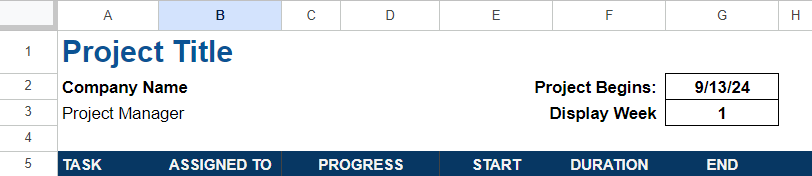
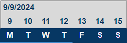

#  HW: Gantt Chart/Project Scheduling and Tracking

**Purpose:** Learn how to format and display a project schedule using a Gantt chart in Google Sheets.

## Instructions
1. Create a new Google Sheet and rename is something like "[Your Name] HW 1.6 - Gantt Charts"
2. Following the same format as the in class activity, give your project a project title, insert your company name, project manager name, and the start date as the =TODAY() function. 
3. Create a header starting in cell A5 with the following titles:
      
      * A5: TASK
      * B5: ASSIGNED TO
      * C5-D5: PROGRESS (merge these two columns)
      * E5: START
      * F5: DURATION
      * G5: END

    When you're finished your sheet should look something like this:

    
    
4. Set up the dates on your schedule by referencing your start date in cell I4 and then adding one day in cell J4. Continue so your project schedule dates end on cell AJ4.
5. In cell I4, modify the formula to always start the project schedule on a Monday. You will do this using the WEEKDAY() function.
  * Hint: The formula will look like =  [cell where your project start date is] - WEEKDAY([cell where your project start date is], 3).
6. In cell I5, we will reference the day of the week the date above it will fall on. 
  * Hint: Use the LEFT() and TEXT() functions to do this.
7. Merge cells I4:O4. Set the value of the new merged cell to the date in cell I4, or the start of the week.
8. Use the format painter to apply these same changes to the rest of the weeks. When you're done, the formatting of your weeks should look something like this:

      

9. In the TASK column (column A), write PHASE 1 in cell A6. Below this cell, create four tasks that will take place during phase 1.
10. Below the first phase and its 4 tasks, write PHASE 2, and create four tasks below it that will take place during phase 2.
11. For your first task, reference it's start date as the start of the project. 
12. Create a duration for each of the tasks and set the end date for the tasks as their start date + the duration.
13. Once all task start and end dates are in, input the start and end dates of PHASE 1 and PHASE 2 by referencing the day the first task in the phase started as the start date, and the last day the last task in the phase ended as the end date.
14. Create a conditional formatting rule that will take the duration of the task and input a bar in the schedule for the correct amount of days.
  * Hint: This rule is very similar to what we did for the in class activity.
15. Now that most of your data is inserted into the Gantt Chart, format the headers and add borders to certain cells to display the data in the way that makes the most sense to you.
16. Create a conditional formatting rule that applies to cells I4:AJ5 that will highlight the cells if the date in those cells is today's date.
  * Hint: Use the TODAY() function.
17. In row C in your table, insert percentages for how complete at least 4 of your tasks are. 
18. In row D in your table, use the IFERROR and SPARKLINE function to create a bar chart to display the completion progress of each your tasks.
  * Hint: If you did your formula correctly, nothing will display in the D column if there is no percentage complete given for a task.

---

**Turn sharing and editing on. Turn in the link to Learning Suite in the feedback box**

---

**Rubric:**

|                     Gantt Chart                  | Points Possible |
|:-------------------------------------------------------------------------:|:---------------:|
|   Sheet notes project title, company name, and student name as the project manager       |        2        |
|  Headers are all included correctly as noted in step 3      |        6        |
|   Tasks and phases are included with each phase including 4 tasks      |        4        |
|     Start and end dates for each task are computed correctly  | 4  |
| Phase start and end dates are computed correctly    |        2        |
|  Conditional formatting rule for task durations is input correctly and displays task durations correctly    |        5        |
|      Table is formatted with colors and headers         |        2        |
|       Conditional formatting rule to highlight today's date works correctly       |        2        |
|     SPARKLINE and IFERROR formulas are used correctly together    |        3        |
|  
**Total**
                           |       30        |
