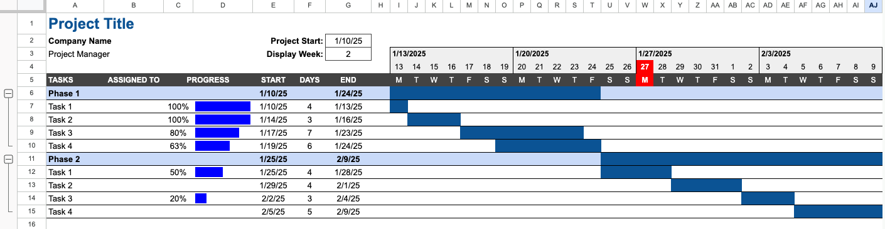

#  Homework: Gantt Chart/Project Scheduling and Tracking

**Purpose:** Learn how to format and display a project schedule using a Gantt chart in Google Sheets.

For your homework, we will complete the Gantt chart we started in class. We will:

* Make the timeline dynamic so that it always starts on a Monday and highlights the current day.
* Add summary progress bars to the Gantt chart.
* Add summary duration and grouping to the Gantt chart.

Start with the Gantt chart you created in class. If you were not able to complete the in-class activity, you will need to complete that first before starting the homework.

## Step 5 - Making the Timeline Dynamic

Before beginning, make a copy of your in class assignment and rename it according to the proper HW naming convention.

In this step, you will make the timeline dynamic so that it always starts on a Monday. This will ensure that the formatting of the Gantt chart is consistent. We will also highlight the current day on the timeline.

Notice that the first week always starts on the project start date. But it would be more convenvient if each of the weeks started on a Monday. We will add a formula to make this happen.

1. In cell F4, enter the following formula: 
```
=$D$2-WEEKDAY(D2,3)
```
2. Experiment with the start date to verify that the formula is working correctly.

Next, we will add a new control that lets us display the week we want to see. This will allow us to scroll through the weeks of the project beyond the first 4 weeks. For example, given the phases and tasks it is possible that the entire project would take more than 4 weeks. By changing the display week, we can see that week on the left and the subsequent 3 weeks after that.

3. In cell D3, enter "Display Week:".
4. In Cell E3, enter a number (1, 2, 3, etc.) to represent the week you want to display.
5. Change the formatting of cells D3 and E3 to make them match the formatting of the project start date (cells C2 and D2). Make sure E3 is formatted as a number and not a date.
6. In cell F4, edit the formula you edited above to add "+(D3-1)*7" to the end of the formula. This will allow you to change the display week and see the subsequent weeks of the project. 
7. Try entering different numbers in cell D3 to see how the display week changes.

Next, we will use conditional formatting to highlight the current day on the timeline.

8. Select cells F4:AG5.
9. Click on Format|Conditional formatting.
10. In the Conditional format rules pane, select "Custom formula is" from the dropdown.
11. Enter the following formula:
```
=F$4=TODAY()
```
12. Change the highlight color to red and the font to be white and bold.
13. Click on "Done" to apply the conditional formatting.

If necessary, change the project start date so that the current day is highlighted on the timeline.

(see 6:01 - 7:55 of the video)

At this point, your Gantt chart should look something like this:


## Step 6 - Adding Summary Progress Bars

In this step, you will add progress bars to the Gantt chart to show the progress of each task. We will use the sparkline feature to show a progress bar for each task.

1. Insert 3 new columns between A (Task) and B (Start). These new columns will become B, C, and D.
2. In cell B4, enter "ASSIGNED TO". This where you can enter the person responsible for each task.
3. In cell C4, enter "PROGRESS".
4. Adjust the column widths as needed to fit the new columns.
5. Select cells C6:C15 and change the format to "Percent".
6. Enter in some sample percentages for the progress of each task in cells C7:C10 and C12:C15. Leave a few of them blank indicating they have not started yet.

Next, we will add a sparkline to show the progress of each task based on the percentage complete.

7. Enter the following formula in cell D7: 
```
=SPARKLINE(C7,{"charttype","bar";"color1","blue";"max",1})
```
8. Copy the formula in cell D7 to cells D8:D15 using Paste Special|Paste Formula Only.

Note that for cells that do not have a percentage entered in the progress column, the sparkline will show an error. We can use the IFERROR() function to hide the error.

9. Edit the formula in cell D7 to the following:
```
=IFERROR(SPARKLINE(C7,{"charttype","bar";"color1","blue";"max",1}),)
```
10. Copy the formula in cell D7 to cells D8:D15 using Paste Special > Paste Formula Only.

Note that "IFERROR is kind of a misnomer. In reality, it is more like "IF NO ERROR". If there is an error, it will return the second argument, which in this case is a blank cell by default. But if there is no error, it will return the sparkline.

Next, we will do a little cleanup.

11. Merge cells C5:D5.
12. Resize column C to just fit the percentage numbers and make the progress bars more visible.

(see 7:55 - 9:24 of the video)

At this point, your Gantt chart should look something like this:


## Step 7 - Summary Duration and Grouping

In this step, you will add a summary duration for each phase of the project and you will group the tasks into phases so they can be hidden or expanded as needed.

First, we will add a summary progress bar for each phase.

1. In cell E6, use the Min() function to find the minimum start date for all tasks in phase 1.
2. In cell G6, use the Max() function to find the maximum end date for all tasks in phase 1.

Note that when you finish entering these two formulas, you will see an overall time range bar for phase 1. This is because the Min() and Max() functions are finding the earliest start date and the latest end date for all tasks in phase 1.

3. Copy the formulas in cells E6 and G6 to cells E11 and G11 to find the start and end dates for phase 2.

Next, we will group the tasks into phases so they can be hidden or expanded as needed.

4. Select the rows for the tasks in phase 1 (rows 7-10).
5. Then, right-click and select "View more row actions|Group rows 7-10". **Note**: this command is located in a different place than was shown in the video.
6. Do the same for the tasks in phase 2 (rows 12-15).

Now you can hide or expand the tasks in each phase by clicking on the plus or minus sign just to the left to the phase title.

(see 9:25 - 10:30 of the video)

At this point, your Gantt chart is complete, and it should look something like this:



Congratulations. You did it!

---

**Turn sharing and editing on. Turn in the link to Learning Suite in the feedback box**

---

**Rubric:**

|                                               Gantt Chart                                               | Points Possible |
|:-------------------------------------------------------------------------------------------------------:|:---------------:|
|            Sheet notes project title, company name, and student name as the project manager             |        2        |
|                          Headers are all included correctly as noted in step 3                          |        6        |
|                     Tasks and phases are included with each phase including 4 tasks                     |        4        |
|                        Start and end dates for each task are computed correctly                         |        4        |
|                            Phase start and end dates are computed correctly                             |        2        |
| Conditional formatting rule for task durations is input correctly and displays task durations correctly |        5        |
|                               Table is formatted with colors and headers                                |        2        |
|                  Conditional formatting rule to highlight today's date works correctly                  |        2        |
|                       SPARKLINE and IFERROR formulas are used correctly together                        |        3        |
|                             <div style="text-align: right">**Total**</div>                              |       30        |
