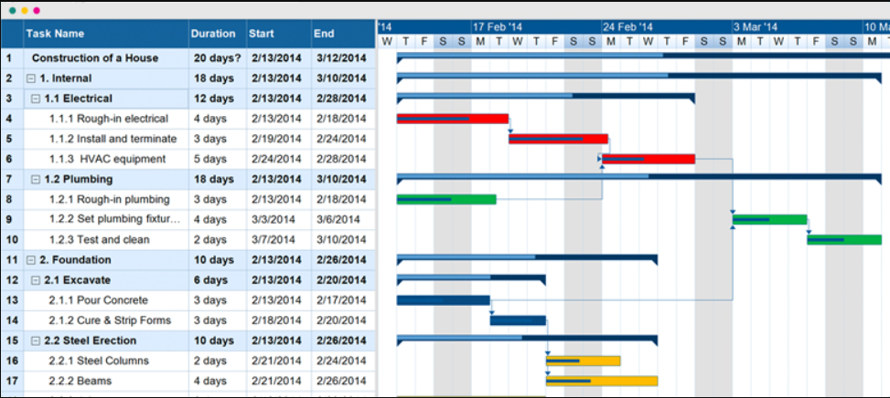

# Reading: Gantt Chart/Project Scheduling and Tracking

**Gantt Charts** are bar charts showing the start and finish dates of the different tasks that comprise a project. These charts can help in scheduling, managing, and monitoring specific tasks and resources in a project. The horizontal bars of different lengths represent the project timeline, which can include task sequences, duration, and the start and end dates for each task and is widely used in project management.

---

## Use of Gantt Charts

Construction managers, facility managers, and civil engineers use Gantt charts to plan and schedule engineering and 
construction projects. They are used to track the progress of the project and to ensure that the project is completed on time. Gantt charts are also used to allocate resources and to identify potential problems that may arise during the project. They are an essential tool for managers and engineers to ensure that a project is completed on time and within budget. They are used on nearly all projects. 

This figure is from project management software and shows a Gantt chart for a construction project. The chart shows 
the start and finish dates of the different tasks that comprise the project. The horizontal bars of different lengths represent the project timeline, which can include task sequences, duration, and the start and end dates for each task. You can use the information in this chart to associate resources, staff, costs, and other important information with tasks and perform critical path analysis to identify the most critical tasks in the project.

While there is dedicated software for creating Gantt charts, you can also create them in Excel. This is a useful skill to have as it can be used to create simple Gantt charts for small projects. This is also a good comprehensive exercise to use some of the skills we have learned in Excel. 

!!!Note
      CFM students will later take a semester long class that teaches you the specifics of scheduling and go more in-depth so this will be a helpful head-start on the concepts talked about in scheduling.

---

## Gantt Chart Tutorial Video

Please watch the following video as part of your assignment. This video is for educational use and to help you create Gantt charts for your own projects. The video will give you a good overview of what we will be doing in class. Please watch the entire video before continuing. Don't worry about remembering all the details - we will go over them in class. The objective of this video is to give you a general idea of how we will be creating our Gantt chart and how they work.

  <a href="https://www.youtube.com/watch?v=un8j6QqpYa0" target="_blank">
    📺 Watch on YouTube
  </a>

---

## Gantt Chart Creation in Excel

We will learn to create Gantt charts in Excel. This involves several distinct steps

* Identify the start date of each task
* Identify the duration or end of each task. One of these can be calculated from the other.
* Create a "calendar" sheet to draw the task lines
* Use conditional formatting to color the Gantt chart
* Use the SPARKLINE function to draw the "percent complete" on Gantt chart

---

## Formulas Used in Gantt Chart Creation

Our in-class exercise will involve creating a Gantt chart in Excel. To prepare for that exercise, we will introduce 
some of the functions that will be used in the exercise. If you want more information or are confused on any of the 
functions, click on the title of the function, and it will take you to a website with a more in-depth explanation.

### [WEEKDAY()](https://support.microsoft.com/en-us/office/weekday-function-60e44483-2ed1-439f-8bd0-e404c190949a){:target="_blank"}
This formula returns a number representing the day of the week of the day provided. 

**Syntax**

      WEEKDAY(serial_number,[return_type])

  * serial_number - A sequential number that represents the date of the day you are trying to find. Dates should be entered by using the DATE function, or as results of other formulas or functions.
  * return_type - [OPTIONAL - 1 by default] - A number that determines the type of return value. You can look at the documentation for WEEKDAY() to see the different return types. The default is 1, which means that the week starts on Sunday and ends on Saturday. If you want the week to start on Monday, you can use 2 as the return type.

**Usage** 

We will use this to convert a date into a number representing the day of the week. We will do some math so that the week always starts on a Monday.

### [TEXT()](https://support.microsoft.com/en-us/office/text-function-20d5ac4d-7b94-49fd-bb38-93d29371225c){:target="_blank"}
This formula converts a number into text according to a specified format.

**Syntax**

      TEXT(Value you want to format, "Format code you want to apply")

  * number - the number, date, or time that needs formatted
  * format - the pattern by which to format the number, must be enclosed in quotation marks. You can look up the different format codes in the documentation for TEXT().

**Usage**

We will use TEXT() to convert the number returned by WEEKDAY() into a text representation of the day of the week. So 
a "3" becomes "Mon" for a week that starts on Saturday which is the default in Excel.

### [LEFT()](https://support.microsoft.com/en-us/office/left-function-9203d2d2-7960-479b-84c6-1ea52b99640c){:target="_blank"}
LEFT returns the first character or characters in a text string, based on the number of characters you specify.

**Syntax**

      LEFT(text, [num_chars])

  * text -  The text string that contains the characters you want to extract.
  * num_chars - [OPTIONAL - 1 by default] - Specifies the number of characters you want LEFT to extract. Num_chars 
    must be greater than or equal to zero. If num_chars is greater than the length of text, LEFT returns all the text.

**Usage**

We will use Left() to extract the first letter of the day of the week. This will be used to format the Gantt chart  
using only single letters for the days of the week.

# Pre-Class Quiz Challenge
 First, make a copy of the starter sheet here: [(Starter-Workbook)-Pre-Gantt-Chart.xlsx](%28Starter-Workbook%29-Pre-Gantt-Chart.xlsx)

This exercise will help you practice the functions we will use in class to create a Gantt chart in Excel.

1. Use the =TODAY() formula in cell B2 to input today’s date.
2. Use the =WEEKDAY() formula in cell B3 to return the weekday today’s date falls on. Use the value in B2 as your argument.
3. Use the =TEXT() formula in cell B4 to return the weekday today’s date falls in the “DDD” format. Use the value in B3 as your argument.
4. Use the =LEFT() formula in cell B5 to return the first letter of the weekday today’s date falls on. Use the value in B4 as your argument.
5. In cell B9, copy the same formula above but modify it to reference B8 instead of B6.

   _Hint: if you did this step correctly, you will get an error when you enter the formula._

6. Explain what each of these functions is doing in the C column under formula explanation.
   
Friendly reminder that if you can’t figure any of these steps that’s okay! This assignment is so you have some exposure to these formulas, and we will clarify confusion in class. You are also more than welcome to come to TA office hours or message a TA for help!

---

## Turning in/Rubric

**_REMINDER_** - For this class, **you will only turn in the links to your Excel files**. You will get a 0 for this assignment if you turn in an Excel file or a link that is not shareable. 

1. On the top right, click the share button --> share --> settings
2. Click "anyone" at the top, then underneath "More settings", change "can view" to "can edit". Then click apply. 
3. Copy the link, then turn it into Learning Suite in the feedback box for that assignment.

**Rubric:**

|                      Item                      | Points Possible |
|:----------------------------------------------:|:---------------:|
| 
**Total**
 |        5        |

---

The following is not a part of the rubric, but specifies how you can lose points. For example: if you fail to share your link correctly.

| **Reasons for Points Lost** |    **Amount**     |  
|:---------------------------:|:-----------------:|
|   Link shared incorrectly   |       -10%        | 