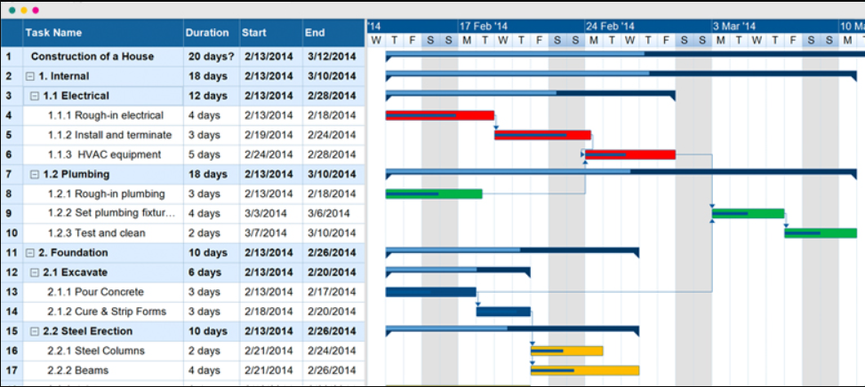

# Reading: Gantt Charts and Project Scheduling

A **Gantt chart** displays project tasks along a timeline. Each horizontal bar shows when a task is planned to start, when it is planned to finish, and how tasks overlap.

Gantt charts help engineers and managers communicate scheduled dates and reported progress and identify sequencing problems. The chart does not guarantee that a project will finish on time. Its usefulness depends on accurate task, duration, dependency, and progress data.



## What a Basic Gantt Chart Contains

A basic Gantt chart uses:

- **Tasks:** the activities required to complete the project.
- **Phases:** groups of related tasks.
- **Start dates:** when each task is planned to begin.
- **Durations or end dates:** how long each task lasts or when it finishes.
- **Dependencies:** relationships in which one task depends on another.
- **Assignments:** the person or role responsible for each task.
- **Progress:** the portion of each task that has been completed.

Tasks may occur sequentially or in parallel. A milestone is a zero-duration event that marks an important deadline or decision.

## Why Build the Chart in Excel?

Dedicated scheduling software is appropriate for projects that require resource leveling, automatic dependency calculations, critical-path analysis, or frequent schedule updates. Excel is useful for smaller schedules and for learning the spreadsheet model behind a Gantt chart.

In this topic, you will separate the workbook into three connected parts:

1. **Inputs:** task names, assignments, start dates, work-day durations, and progress.
2. **Calculations:** task end dates, phase summaries, and displayed timeline dates.
3. **Outputs:** task bars, phase bars, progress bars, weekends, and the current-day marker.

Changing an input should update the related calculations and output. This input-calculation-output structure will also be used in later engineering spreadsheet models.

!!! note "Scope of this exercise"
    The workbook will record dependencies as text, but it will not calculate a dependency network, resource capacity, costs, or critical path. Those functions normally require a more complete scheduling model or project-management software.

!!! note "For CFM students"
    Later courses address scheduling methods in more detail. This exercise introduces the spreadsheet structure and date calculations used in simple schedules.

## Tutorial Video

Watch [Make a Gantt Chart in Excel](https://www.youtube.com/watch?v=un8j6QqpYa0){:target="_blank"}. The video is an example, not the specification for the assignments. The instructions below use some different formulas and formatting choices.

As you watch, identify the task table, timeline dates, formulas, and conditional-formatting rules. You do not need to reproduce every feature shown in the video.

## Excel Dates and Display Formats

Excel stores a date as a serial number. A date format changes how that number is displayed; it does not convert the date into text.

For example, if `B2` contains a date:

- `=WEEKDAY(B2,2)` returns a number from 1 for Monday through 7 for Sunday.
- `=TEXT(B2,"ddd")` returns a text abbreviation such as `Mon`.
- `=LEFT(TEXT(B2,"ddd"),1)` returns the first letter of that abbreviation.

Use the original date for calculations. Use `TEXT` only when text is needed for a label.

## Functions Used in This Topic

| Function | What it does | Use in the Gantt chart |
|:---------|:-------------|:-----------------------|
| `TODAY()` | Returns the current date | Marks the current day |
| `WEEKDAY(date,return_type)` | Converts a date to a weekday number | Aligns the timeline to Monday and identifies weekends |
| `TEXT(value,"format")` | Converts a value to formatted text | Creates weekday labels |
| `LEFT(text,num_chars)` | Returns characters from the left side of text | Shortens weekday labels |
| `WORKDAY(start,days)` | Moves by workdays and excludes weekends | Calculates task end dates |
| `IF`, `OR`, and `AND` | Test one or more conditions | Leaves unused rows blank and controls formatting |
| `AVERAGE`, `MIN`, and `MAX` | Summarize a range | Calculate unweighted phase progress and phase dates |

Excel function names are not case-sensitive.

### Work-day End Dates

When the task start date is Monday through Friday, it counts as the first workday. Therefore, a one-workday task that starts Monday also ends Monday. A typical task formula is:

```excel
=IF(OR(D8="",F8=""),"",WORKDAY(D8,F8-1))
```

In plain language: if the start date or duration is blank, display a blank. Otherwise, calculate the end date after counting the start date as day 1.

Enter task start dates on workdays. `WORKDAY` excludes Saturdays and Sundays, but it does not correct a weekend date already entered as the start. A future scheduling model could also provide a holiday range as its optional third argument.

### Named Cells and a Dynamic Timeline

During class, you will name the project-start cell `project_start` and the display-week cell `display_week`. The names make this formula easier to interpret:

```excel
=project_start-WEEKDAY(project_start,3)+(display_week-1)*7
```

The formula moves from the project start date back to Monday of that week, then moves forward seven days for each additional display week. A named reference describes the purpose of an input; a cell reference still identifies its physical location.

## Conditional Formatting and Mixed References

Conditional formatting evaluates a formula for each cell in its **Applies to** range. The formula is written as though it applies to the upper-left cell of that range.

For a timeline beginning in column H with dates in row 5:

- `H$5` changes columns as Excel evaluates the timeline but always reads row 5.
- `$D7`, `$E7`, and `$F7` remain in their assigned columns but change rows.

These mixed references allow one rule to evaluate every task against every displayed date.

The class exercise will build separate rules for:

- task bars,
- phase-summary bars,
- the current day, and
- weekends.

Separate rules are easier to inspect and debug. Rule order matters when several rules format the same cell.

## Pre-Class Quiz Challenge

Download [(Starter-Workbook)-Pre-Gantt-Chart.xlsx](%28Starter-Workbook%29-Pre-Gantt-Chart.xlsx), save a copy in your CCE 270 folder, and complete the following work.

1. Replace the heading in `B1` with `FORMULA RESULT`.
2. In `B2`, enter `=TODAY()`.
3. In `B3`, enter `=WEEKDAY(B2,2)`.
4. In `B4`, enter `=TEXT(B2,"ddd")`.
5. In `B5`, enter `=LEFT(B4,1)`.
6. In `C2:C5`, explain in plain language what each formula does and what value or text it returns.

!!! note "Why B4 refers to B2"
    `B2` contains the date. `B3` contains only a weekday number, so it is useful for tests and date arithmetic but should not be formatted as though it were the original date.

### Check Your Work

- `B2` displays today's date.
- `B3` is an integer from 1 through 7, with Monday represented by 1.
- `B4` is a three-letter weekday abbreviation.
- `B5` is one letter.

## Shortcuts Used in This Topic

| Action | Windows | Mac |
|:-------|:--------|:----|
| Save | `Ctrl+S` | `Command+S` |
| Copy and paste | `Ctrl+C`, `Ctrl+V` | `Command+C`, `Command+V` |
| Open Format Cells | `Ctrl+1` | `Command+1` |

## Turning In

Upload the completed `.xlsx` file directly to Learning Suite.

1. Save and close the workbook.
2. Upload the file to the correct assignment.
3. Reopen or preview the uploaded file and confirm that it contains your completed work.

**Rubric:**

| Item | Points Possible |
|:-----|:---------------:|
| Four formulas return the requested results | 2 |
| Formula explanations are accurate and complete | 1 |
| **Total** | **3** |

The following deductions are separate from the rubric.

| Reason for Points Lost | Amount |
|:-----------------------|:------:|
| File uploaded incorrectly | -10% |
