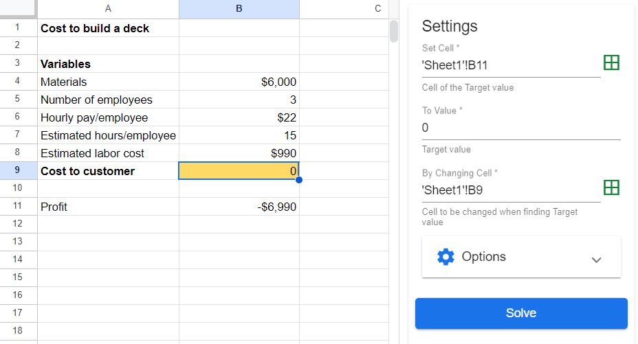

# Goal Seek

**Goal Seek** is an add-on plugin for Google Sheets. It is a powerful tool that utilizes an algorithm that plugs in different calculations to find a solution for an unknown variable using a known end-goal value. A great example of this is often found in sales when trying to determine how many units need to be sold to break even or meet a certain quota.

## Installing Goal Seek

Installing Goal Seek is fairly simple. Go to the top ribbon and find **Extensions > Add-ons > Get add-ons** and a window for Google's Workshop Marketplace should pop up. Once the window opens, type into the search bar **"Goal Seek"**. The first option for Google's Goal Seek should appear like the picture down below. 

After clicking on it, a page should open up with a blue button that says **"Install"**. 

Press the install button and another tab will open up regarding which Google account you want to use. Select which account you prefer to use. Google will ask permission to utilize this account with two separate pop-ups; click **"Continue"** and then **"Allow"**. 

Goal seek should now be installed and ready to use!

## Using Goal Seek

To use Goal Seek, you will find it on the top ribbon, **Extensions > Add-ons > Goal Seek > Open**

Goal seek takes three steps to use after your sheet is setup:

- **Set Cell**
- **To Value**
- **By Changing Cell**

## Example Problem 
Let's use the example of a contractor wanting to find what he would have to charge to make a profit of **$1250**, by building his friend a 12' x 12' deck. Given the cost of materials ($6000) and the $22/hr of pay for each employee, we can calculate the project cost. Using goal seek, we can allow the computer to do the rest of the work for us.

First, select the cell you want to set our ba by 1) selecting the cell (B11) and 2) clicking the **Set Cell** grid icon on the goal seek tab

Then, set the **To Value** to whatever value you are trying to find. In our case, this number would be 1250.

Finally, select the cell that would need to change to evaluate the final part of the question. In this instance, this would be cell B9.

When all three inputs are filled on the Goal Seek tab, the Solve button will light up blue. If you press the button, the computer should start jumping between values trying to find the solution to what gets a profit of $1250.

In this example, our solution is $8240.000057, or **$8240**!

## How does this work?

Each attempt by the computer tries to get closer and closer by guessing a number.

**Attempt 1**

**Attempt 2**

**Attempt 3**

**Attempt 4 and onwards**

