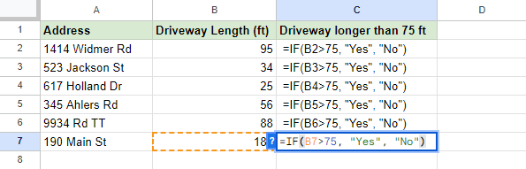
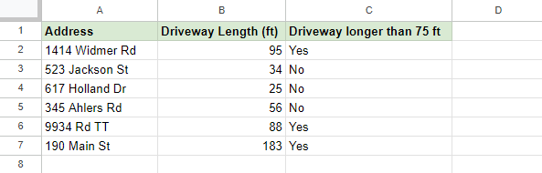

# IF Statements

**IF Statements** are a function within Google Sheets that can compare two values and determine if it is true or false. This type of two-outcome expression in programming is known as a boolean.

## Syntax

The syntax for an IF statement is as follows:

```=IF(logical_expression, value_if_true, value_if_false)```

An IF statement has three arguments:

- **logical_expression**: This is what is known as the conditional statement. This function can compare whether a number is greater than (**>**), less than (**<**), or if a number or text is equal to (**=**) in the given condition
- **value_if_true**: This is a placeholder for what will be returned if the given condition is found to be true.
- **value_if_false**: This is a placeholder for what will be returned if the given condition is found to be false.

## Example Problem - IF Statement

Let's look at a simple example of an IF statement using strings. Here are a few fictional locations that have different types of material their driveways are made out of. Using an IF statement, we can quickly differentiate for specifically a concrete driveway.


We can write a single statement in cell C2 and drag it down and watch it populate with either a "Yes" or a "No", all depending on the conditional statement we gave the function.


One more example is using a number. Using the length of a driveway, we can find which of the driveways are longer than the given distance of 75 ft.



Again, we can see that we can quickly populate the rest of the table by dragging the corner of the cell down.



---

# IFS Statements

**IFS Statements** are an even more powerful version of an IF statement that can allow for multiple conditional statements to take place within one function. This type of function allows for easy categorization by testing a given number or string against one found in a table

## Syntax

The syntax for an IFS statement is as follows:

```=IFS(logical_expression1, value_if_true1, [logical_expression2, value_if_true2], [logical_expression3, ...)```

An IFS statement only technically requires two arguments, both of which are nearly the same as the IF statement. However, there can be an infinite amount of logical expressions within one IFS statement.

**Note**: More than one condition can be true so the function will always return the value for the first condition that is found true.

## Example Problem - IFS Statement

Using the same premise as the IF statement, we can utilize the table we used before. This time around, we will categorize the different lengths of driveways into three tiers: short, medium, and long.


**Note**: The third condition ```<=50``` includes ```=``` so that 50 is included in "less than or **equal** to 50

Dragging them down, we can see the final result. Now each driveway is nicely categorized by its length.


## Pre-Class Quiz Challenge
