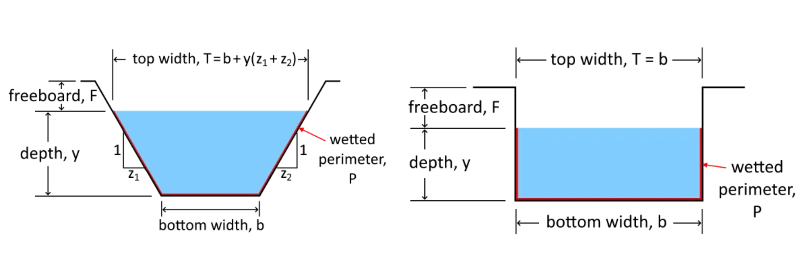

#  HW: Introduction to Python and Variables

**Problem/Program:** Building an Open Channel Flow Calculator

**Purpose:** To use your knowledge of different variables to calculate the flow in an open channel. You will create different types of variables and then use them in equations.

**Challenge:** While working on this assignment, look through the code that was already written and try to see if you understand it. We will be teaching you about this later on. 

## Manning's Equation

Manning's equation is used to calculate the flow of water through an open channel. The equation is as follows:

$$
Q = \frac{u}{n}A(R_h^{2/3})(S_o^{1/2})
$$

Where: 
>>- $Q$ is the flow rate in cubic feet per second 
  - $u$ is units coefficient (1.49 for English units and 1 for metric units) 
  - $n$ is the Manning's roughness coefficient based on the material of the channel 
  - $R_h$ is the hydraulic radius of the channel 
  - $S_o$ is the slope of the channel

The hydraulic radius is calculated as follows:

$$
R_h = \frac{A}{P_w}
$$

Where: 
>>- $A$ is the cross-sectional area of the flow  
  - $P_w$ is the wetted perimeter in feet

The wetted perimeter is the length of the channel in the channel cross section that is in contact with the water.

For this problem, we will be considering rectangular and trapezoidal channels as shown here:

{width=1000px}

Based on this information, the area ($A$) and wetted perimeter ($P_w$) can be calculated as follows:

| Channel Type |           Area ($A$)           |           Wetted Perimeter ($P_w$)            |
|:------------:|:------------------------------:|:---------------------------------------------:|
|  Rectangular |              $by$              |                    $b+2y$                     |
|  Trapezoidal | $\left(\dfrac{b+T}{2}\right)y$ | $b+2\sqrt{\left(\dfrac{T-b}{2}\right)^2+y^2}$ |

Where: 
>>- $b$ is the bottom width of the channel in feet 
  - $T$ is the top width of the channel in feet 
  - $y$ is the water depth in feet

## Instructions

**Step 1.**  Make a copy of the starter sheet here:
  

**Step 2.** Rename it something like “[your name] HW - Introduction to Python and Variables”

---

Don’t be too overwhelmed by the code. These instructions will clearly indicate where to put different steps from here on out.

---

**Step 3.** Use input statements to get the following information from the user. Store the inputs in the appropriate 
variables.

| Variable name |                     Description/Options                     | Variable Type |
|:-------------:|:-----------------------------------------------------------:|:-------------:|
|     units     |                      english or metric                      |    string     |
|   material    | asphalt, concrete, clean earth, weedy earth, natural stream |    string     |
|       b       |                        bottom width                         |     float     |
|       T       |                          top width                          |     float     |
|      So       |                            slope                            |     float     |
|       y       |                         water depth                         |     float     |

**Step 4.** Run the cell to process the inputs and define the dependent variables: u, shape, and n. You do not need to write any code for this step.

**Step 5.** Write an equation to calculate the cross-sectional area of the flow (A) based on the shape of the channel. Store the result in the variable A.

**Step 6.** Write an equation to calculate the wetted perimeter (P_w) based on the shape of the channel. Store the 
result in the variable P.

**Step 7.** Write an equation to calculate the hydraulic radius (R_h), the flow rate (Q), and the flow velocity (V). 
Use the equations as shown above. Note that V = Q/A. Store 
the result in the 
variables Rh, Q, and V.

**Step 8.** Print the results using the code provided.

## Test Your Code

Try out your code to make sure it is working correctly. When running your code, use the following inputs:

| Variable name |   Input   |
|:-------------:|:---------:|
|     units     |  english  |
|   materials   | concrete  |
|       b       |    20     |
|       T       |    20     |
|      S_o      |   0.002   |
|       y       |     6     |

It should output something like this:
> Flow rate =  1608.38  cubic feet per second  
> Average velocity =  13.403  feet per second  
> u=  1.49  n=  0.012  A=  120.0  P=  32.0  Rh=  3.75  Q=  1608.380422171807  V=  13.403170184765058

## Turning in/Rubric
Turn sharing, editing on. Then turn in the link to learning suite in the feedback box

**Rubric:**

|                                           Item                                            | Points Possible |
|:-----------------------------------------------------------------------------------------:|:---------------:|
| Input statements are made correctly, stored in the correct variable with the correct type |       15        |
|          Equations are typed in correctly and are stored in the correct variable          |       15        |
|                      
**Total**
                       |       30        |
