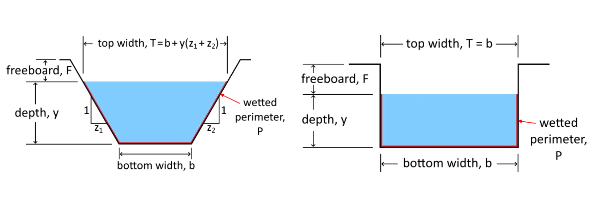

#  HW: Introduction to Python, Variables, and Lists

**Purpose:** This assignment aims to introduce you to Python, variables, and lists. You will create a simple open channel flow calculator using Python and learn how to use variables effectively. 

---

## Getting Started

First,open the starter sheet here: <a href="https://colab.research.google.com/github/byu-cce270/content/blob/main/docs/unit2/00_intro_python_variables_lists/(Starter_Workbook)_HW_Introduction_to_Python_Variables_Lists.ipynb" target="_blank"></a>

Rename it something like “(Your-Name)-HW_Introduction_to_Python_Variables_Lists.ipynb”.

---

## Part 1 - Building an Open Channel Flow Calculator (Introduction to Python and Variables)

In this part you will use your knowledge of different variables to calculate the flow in an open channel. You will create different types of variables and then use them in equations.

**Challenge:** While working on this assignment, look through the code that was already written and try to see if you understand it. We will be teaching you about this later on. 

---

### Manning's Equation

Manning's equation is used to calculate the flow of water through an open channel. The equation is as follows:

>>$Q = \dfrac{u}{n}A(R_h^{2/3})(S_o^{1/2})$

Where:<br>
>>$Q$ = the flow rate in cubic feet per second (or cubic meters per second) <br>
  $u$ = units coefficient (1.49 for English units and 1 for metric units)<br>
  $n$ = the Manning's roughness coefficient based on the material of the channel<br>
  $R_h$ = the hydraulic radius of the channel<br>
  $S_o$ = the slope of the channel

The hydraulic radius is calculated as follows:

>>$R_h = \dfrac{A}{P_w}$

Where:<br>
>>$A$ = the cross-sectional area of the flow <br>
$P_w$ = the wetted perimeter in feet

The wetted perimeter is the length of the channel in the channel cross-section that is in contact with the water.

For this problem, we will be considering rectangular and trapezoidal channels as shown here:

{width=1000px}

Based on this information, the area ($A$) and wetted perimeter ($P_w$) can be calculated as follows:

| Channel Type |           Area ($A$)           |           Wetted Perimeter ($P_w$)            |
|:------------:|:------------------------------:|:---------------------------------------------:|
|  Rectangular |              $by$              |                    $b+2y$                     |
|  Trapezoidal | $\left(\dfrac{b+T}{2}\right)y$ | $b+2\sqrt{\left(\dfrac{T-b}{2}\right)^2+y^2}$ |

Where:<br>
>>$b$ = the bottom width of the channel in feet<br>
  $T$ = the top width of the channel in feet<br>
  $y$ = the water depth in feet

---

### Instructions

!!!Reminder
    Don’t be too overwhelmed by the code. These instructions will clearly indicate where to put different steps from here on out.

1. Create the following variables. Add comments explaining the options for each variable or what the variable is.

| Variable name |                     Description/Options                     | Variable Type | Starting Value |
|:-------------:|:-----------------------------------------------------------:|:-------------:|:--------------:|
|     units     |                      english or metric                      |    string     |    english     |
|   material    | asphalt, concrete, clean earth, weedy earth, natural stream |    string     |    concrete    |
|       b       |                        bottom width                         |     float     |       20       |
|       T       |                          top width                          |     float     |       20       |
|      So       |                            slope                            |     float     |     0.002      |
|       y       |                         water depth                         |     float     |       6        |

2. Run the cell to store the variables in the notebook. You do not need to write any code for this step.

3. Run the code block call "Variable Processing" to set the values of the variables based on the inputs you provided. This code block will set the values of the variables `u` and `n` based on the `units` and `material` variables. There are two options to use. You can use either "Option Block 1" or "Option Block 2". Look at the code and try to understand what it is doing. We will go over this later in this unit.

4. Write an equation to calculate the cross-sectional area of the flow (A) based on the shape of the channel. Store the result in the variable A.

5. Write an equation to calculate the wetted perimeter (P_w) based on the shape of the channel. Store the 
result in the variable P.

6. Write an equation to calculate the hydraulic radius (R_h), the flow rate (Q), and the flow velocity (V). 
Use the equations as shown above. Note that V = Q/A. Store 
the result in the 
variables Rh, Q, and V.

7. Print the results using the code provided.

---

### Test Your Code

Try out your code to make sure it is working correctly. When running your code, use the following inputs (you can change these values to test different scenarios):

| Variable name |   Input   |
|:-------------:|:---------:|
|     units     |  english  |
|   materials   | concrete  |
|       b       |    20     |
|       T       |    20     |
|      So       |   0.002   |
|       y       |     6     |

It should output something like this:

```python
      Flow rate =  1608.38  cubic feet per second
      Average velocity =  13.403  feet per second
      u=  1.49  n=  0.012  A=  120.0  P=  32.0  Rh=  3.75  Q=  1608.380422171807  V=  13.403170184765058
```
---

## Part 2 - Creating and manipulating lists

**Purpose:** Learn how to create and manipulate lists to call certain information from them.

1. Go to the part of the notebook that says "Part 2 - Creating and manipulating lists" and create a new code block.

2. In the new code block, create four new lists with names: task_names, task_durations, material_names, and material_quantities.

3. In the task_names list, add at least 7 activities that would take place during the construction of building. (Ex. Foundation, Framing, Landscaping, etc.)

4. In the task_durations list, add the associated durations of each activity in days. 

5. In the material_names lists, add at least 4 materials you would need for the construction of this building.

6. In the material_quantities list, add the associated unit quantities you would need for each material to complete the construction of your building.

7. Print out each list with a description of what the list represents.

8. Using the project duration list, sum and print the total duration of the project.

9. Add a new task titled "Final Inspection" to the task_names list with an associated duration of 1 day in the task_durations list.

10. Remove a task from the task_names list with its associated duration in the task_durations list.

11. Print the new updated lists and new total duration of the project.

12. Update one of the quantities in the material_quantities list.

13. Add a new material like Drywall or Windows to the material_names list and add the associated quantity of that material needed in the material_quantities list.

14. Print the updated material_names and material_quantities list.

15. Write code to find and print the duration of the longest task, and the name of the task.

16. Write code to find and print the duration of the shortest task, and the name of the task.

17. Write code to find and print the average duration of the tasks.

18. Add comments to separate and explain each section of your code.

---

## Turning in/Rubric

**_REMINDER_** - For this class, **you will only turn in the links to your colab notebooks**. You will get a 0 for this assignment if you turn in a python file or a link that is not correct, wrong assignment, or does not give editor permission.

**Rubric:**

|                                                  Item                                                   | Points Possible |
|:-------------------------------------------------------------------------------------------------------:|:---------------:|
|  Part 1 - At least one input statements is made and all other variables are made with the correct type  |        6        |
|            Part 1 - Equations are typed in correctly and are stored in the correct variable             |       10        |
|                          Part 2 - 4 new lists are created and named correctly                           |        4        |
|                     Part 2 - Required items are added to the 4 lists as instructed                      |        5        |
|                          Part 2 - Total project duration is summed and printed                          |        2        |
|               Part 2 - Lists are all printed with list descriptions included in comments                |        3        |
|     Part 2 - New task titled "Final Inspection" with associated duration is added to correct lists      |        2        |
| Part 2 - A task is removed from the task_names list and its duration is removed from the durations list |        2        |
|                   Part 2 - New updated lists with total project duration are printed                    |        2        |
|            Part 2 - A new material and new material quantity are added to the correct lists             |        2        |
|             Part 2 - Duration and name of the longest task are correctly found and printed              |        2        |
|             Part 2 - Duration and name of the shortest task are correctly found and printed             |        2        |
|                    Part 2 - Average duration of tasks is found and printed correctly                    |        2        |
|              Part 2 - Code is organized and comments are used to explain and separate code              |        2        |
|                             <div style="text-align: right">**Total**</div>                              |       46        |

---

The following is not a part of the rubric, but specifies how you can lose points. For example: if you do not explain your code when using AI to help you create it or fail to share your link correctly.

|                       **Reasons for Points Lost**                       |    **Amount**     |  
|:-----------------------------------------------------------------------:|:-----------------:|
|                         Link shared incorrectly                         |       -10%        |
|                        Turned in late (per week)                        | -10% (up to -50%) |
| No comments explaining where AI is used and what its provided code does |       -10%        |

