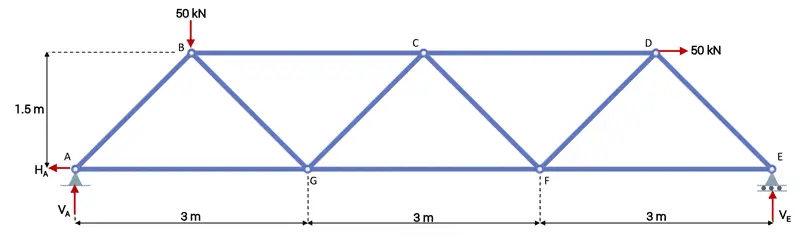

# HW: IF Statements

**Purpose:** This assignment aims to test your ability to use IF, ELIF, and ELSE statements to analyze inputs and lists to determine a desired result. It also provides practice using IF statements with for loops and lists.

---

## Getting Started

Create a copy of the starter sheet here: 

Rename it something like "(Your_Name)_HW_If_Statements.ipynb".

---

## Part 1 - Truss Determinacy Solver

**Objective**: Create code that can solve the determinacy of any given truss when given the correct inputs. Determinacy is a Statics principle that helps us know whether we can solve the forces in a given system using statics equations.

Here is an example of a truss. The blue lines are the members, the joints are the white circles where the members meet, and the red arrows are the reaction forces.:

_(image from [www.engineeringskills.com](https://www.engineeringskills.com/posts/truss-analysis-using-method-of-joints-and-sections))_

For this example, a student has given you a list of trusses he needs to solve for in his statics class. Because of your charitable heart, and your superb coding skills, you have agreed to help him.

1. Navigate to the "Part 1 - Truss Determinacy Solver" section. In the first code block, create 3 different input statements using colab forms 
   to ask the user for the following:
    - The number of joints in the truss. (Must be an integer)
    - The number of members in the truss. (Must be an integer)
    - The number of reaction forces acting on the truss. (Must be an integer)
   
2. Write IF, ELIF, and ElSE statements on the same code block for the following 
   scenarios. Divide the section using a comment. 

  | Equation                                                | Result                   |
   |---------------------------------------------------------|--------------------------|
   | # of members + # of reaction forces = 2 * (# of joints) | Statically determinate   |
   | # of members + # of reaction forces > 2 * (# of joints) | Statically Indeterminate |
   | # of members + # of reaction forces < 2 * (# of joints) | Unstable                 |

3. Finally write a print statement to print the result in the same code block. Divide this code using comments. For example, if my truss had more joints than reaction forces + my members, then the code would print "truss is statically unstable"

4. Test your code with the following scenarios:
   
   | Scenario # | Joints | Members | Reaction Forces | Result                   |
   |------------|--------|---------|-----------------|--------------------------|
   | 1          | 3      | 3       | 3               | Statically determinate   |
   | 2          | 4      | 6       | 3               | Statically indeterminate |
   | 3          | 8      | 9       | 4               | Unstable                 |

---

## Part 2 - Material Order Counter

**Objective**:  You are helping a company count the orders of materials it has. They have given you the list and want you to count it.

1. Navigate to the "Part 2 - Material Order Counter" section. Below the "Total_order" list, create a for loop that will go through each order in the given "orders " list. Divide this code using comments.

2. In the next line, create a for loop that will read each item in the "Total_order" list. 

3. Now, create a 3rd loop that loops through the totals if the material from the "order" list is equal to the item in the "Total_order" list, then add 1 to the item total.
    - EX: If steel is in the "order" list and "total_orders" list, then the value for steel in the "total_orders" list should increase by 1 for each occurrence of steel. This should be the same for wood and brick.
   
4. Write a loop to print each of the final values for wood, brick, steel, glass, and concrete. Divide this code using comments. Here are the final values that you should get:
    - 14 orders of wood
    - 10 orders of brick
    - 8 orders of steel
    - 12 orders of glass
    - 6 orders of concrete

---

## Turning in/Rubric

**_REMINDER_** - For this class, **you will only turn in the links to your colab notebooks**. You will get a 0 for this assignment if you turn in a python file or a link that is not correct, wrong assignment, or does not give editor permission.

**Rubric:**

|                 If Statements                  | Points Possible |
|:----------------------------------------------:|:---------------:|
|     Part 1 - Correct value for scenario 1      |        5        |
|     Part 1 - Correct value for scenario 2      |        5        |
|     Part 1 - Correct value for scenario 3      |        5        |
|      Comments explaining code for Part 1       |        3        |
|        Part 2 - Correct value for wood         |        3        |
|        Part 2 - Correct value for steel        |        3        |
|        Part 2- Correct value for brick         |        3        |
|        Part 2 - Correct value for glass        |        3        |
|       Part 2- Correct value for concrete       |        3        |
|      Comments explaining code for Part 2       |        3        |
| 
**Total**
 |       36        |

---

The following is not a part of the rubric, but specifies how you can lose points. For example: if you do not explain your code when using AI to help you create it or fail to share your link correctly.

|                       **Reasons for Points Lost**                       |    **Amount**     |  
|:-----------------------------------------------------------------------:|:-----------------:|
|                         Link shared incorrectly                         |       -10%        |
|                        Turned in late (per week)                        | -10% (up to -50%) |
| No comments explaining where AI is used and what its provided code does |       -50%        |

