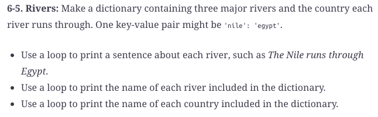

#  Reading: Dictionaries

---

# Pre Class Reading Assignment

On the O'Reilly's website read Chapter 6 in _Python Crash Course, 3rd Edition_  and Chapter 7, the section on "How 
the input() Function Works" and "Introducing while Loops." Don't bother with the other sections in Chapter 7.

 Here is a direct link to the readings: 
[PCC Chapter 6: Dictionaries](https://learning.oreilly.com/library/view/python-crash-course/9781098156664/c06.xhtml){:target="_blank"} 
[PCC Chapter 7: User Input and While Loops](https://learning.oreilly.com/library/view/python-crash-course/9781098156664/c07.xhtml){:target="_blank"}

Remember that you will have to sign in to you free account that you created earlier.

## Things to Look Out For in Dictionaries
- Dictionaries use braces {} as opposed to lists which use square brackets []
- Keys and values are separated by colons, and key-value pairs are separated by commas
- A dictionary's keys cannot be lists, but its values can be

## Things to Look out For in Input/While Loops
- How do you format a prompt question if it doesnt fit on its initial line. 
- int?

---

# Pre-Class Quiz Challenge
In a Colab notebook, complete Problem 6-5 found in chapter 6 of the textbook. Submit a link to the completed problem in your Pre-Class Quiz.

