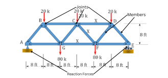

# HW: IF Statements
---
**Purpose:** 
- Learn how to use IF, ELIF, and ELSE statements to analyze inputs and lists to determine a desired result.
- Practice using if statements with for loops and lists.

---
## Part 1

**Objective**: Create a code that can solve the determinacy of any given truss when given the correct inputs. Determinacy is a Statics principle that helps us know whether or not we can solve the forces in a given system using statics equations.

Here is an example of a truss labeled with the joints, reaction forces, and members:

For this example, a student has given you a list of trusses he needs to solve for in his statics class. Because of your charitable heart, and your superb coding skills, you have agreed to help him.

### Steps
1. Open this Colab notebook and title it with your name: 
2. Go to the "Part 1 - Truss Determinacy Solver" code block
3. Starting in line 2, create 3 different input statements to ask the user for the following:
  - The number of joints in the truss. (Must be an integer)
  - The number of members in the truss. (Must be be an integer)
  - The number of reaction forces acting on the truss. (Must be an integer)
4. Write IF, ELIF, and ElSE statements on the next line under the "Write If statements here" line for the following scenarios. 

  | Equation      | Result                                |
   |----------|--------------------------------------|
   | # of members + # of reaction forces = 2 * (# of joints) | Statically determinate |
   | # of members + # of reaction forces > 2 * (# of joints) | Statically Indeterminate |
   | # of members + # of reaction forces < 2 * (# of joints) | Unstable |

5. Write an else statement that will print "Invalid input" for any input that does not fit the table above.
6. Have your code print the result. For example, if my truss had more joints than reaction forces + my members, then my code would print "truss is statically unstable"
7. Test your code with the following scenarios:
8. Scenario #1
   - Joints = 3
   - Members = 3
   - Reaction forces = 3
   - Result = "Statically determinate"
10. Scenario #2
   - Joints = 4 
   - Members = 6
   - Reaction forces = 3
   - Result = "Statically indeterminate"
11. Scenario #3
    - Joints = 8
    - Members = 9
    - Reaction forces = 4
    - Result = "Unstable"

##Part 2

**Objective**:  You are helping a company count the orders of materials it has. They have given you the list and want you to count it.

###Steps
1. Under the line "main for loop", create a for loop that will go through each material in the given "order" list.
2. In the next line, create a for loop that will read each item in the "Total_order" list.
3. Now, compare if the material from the "order" list is equal to the item in the "Total_order" list, then add 1 to the item.
- EX: If steel is in the "order" list and "total_orders" list, then the value for steel in the "total_orders" list should increase by 1 for each occurrence of steel. This should be the same for wood and brick.
4. Print each of the final values for wood, brick, and steel. Here are the final values that you should get:
  - 14 orders of wood
  - 10 orders of brick
  - 8 orders of steel

---

**Turn sharing and editing on. Turn in the link to Learning Suite in the feedback box**

---

**Rubric:**

|                                               If Statements                                                     | Points Possible |
|:-------------------------------------------------------------------------------------------------------:|:---------------:|
|                         4 new lists are created and named correctly                                     |        4        |
|                          Required items are added to the 4 lists as instructed                          |        5        |
|                          Total project duration is summed and printed                                   |        2        |
|                    Lists are all printed with list descriptions included in comments                    |        3        |
|         New task titled "Final Inspection" with associated duration is added to correct lists           |        2        |
|       A task is removed from the task_names list and its duration is removed from the durations list    |        2        |
|                       New updated lists with total project duration are printed                         |        2        |
|                 A new material and new material quantity are added to the correct lists                 |        2        |
|                  Duration and name of the longest task are correctly found and printed                  |        2        |
|                 Duration and name of the shortest task are correctly found and printed                  |        2        |
|                        Average duration of tasks is found and printed correctly                         |        2        |
|                  Code is organized and comments are used to explain and separate code                   |        2        |
|                             
**Total**
                              |       30        |
