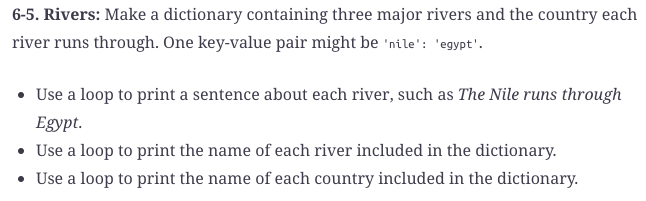

#  Reading: Dictionaries

---

# Pre Class Reading Assignment

On the O'Reilly's website read chapter 6 in _Python Crash Course, 3rd Edition_. 
 Here is a direct link to the readings: [PCC Chapter 6: Dictionaries](https://learning.oreilly.com/library/view/python-crash-course/9781098156664/c06.xhtml){:target="_blank"}.

Remember that you will have to sign in to you free account that you created earlier.

## Things to Look Out For
- Dictionaries use braces {} as opposed to lists which use square brackets []
- Keys and values are separated by colons, and key-value pairs are separated by commas
- A dictionary's keys cannot be lists, but its values can be

---

# Pre-Class Quiz Challenge
In a Colab notebook, complete Problem 6-5 found in chapter 6 of the textbook. Submit a link to the completed problem in your Pre-Class Quiz. 

