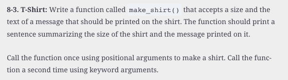

#  Reading: Functions (Part 1)

---

# Pre Class Reading Assignment

On the O'Reilly's website read chapter 8 in _Python Crash Course, 3rd Edition_. 
 Here is a direct link to the readings: [PCC Chapter 8: Functions](https://learning.oreilly.com/library/view/python-crash-course/9781098156664/c08.xhtml){:target="_blank"}.

Remember that you will have to sign in to you free account that you created earlier.

## Things to Look Out For

---

# Pre-Class Quiz Challenge
In a Colab notebook, complete Problem 8-3 found in chapter 8 of the textbook. Do not worry about calling the function using keyword arguments, just call it once using positional arguments. Submit a link to the completed problem in your Pre-Class Quiz. 

